# 2026 年做搜索就是做 Agent Memory

## 本地图片

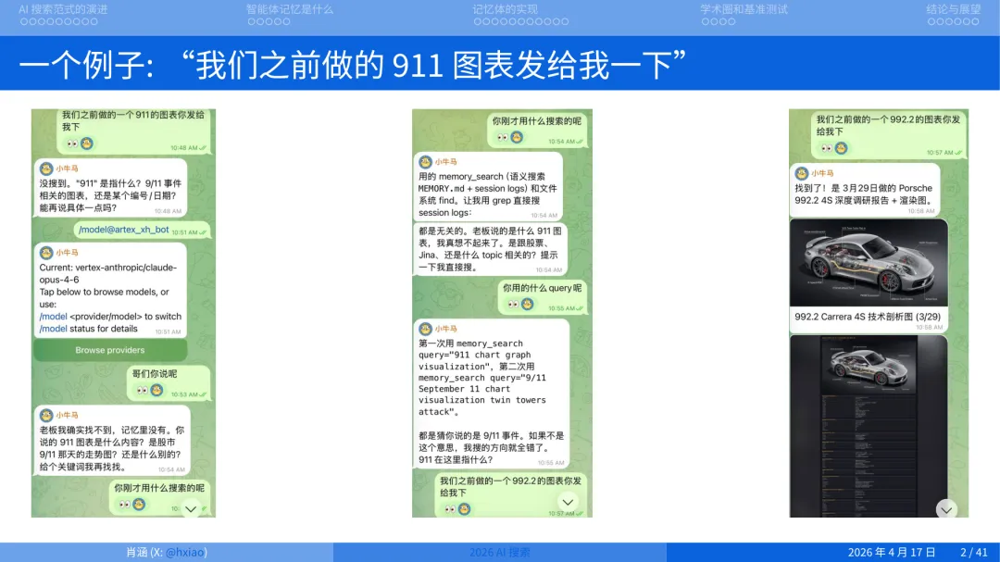

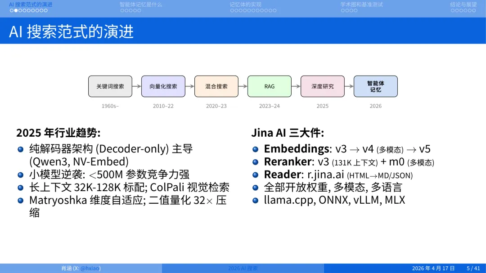

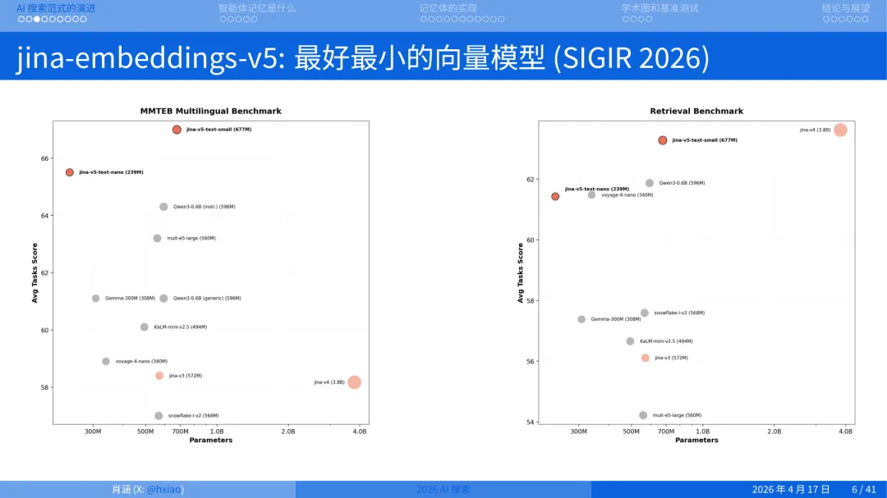

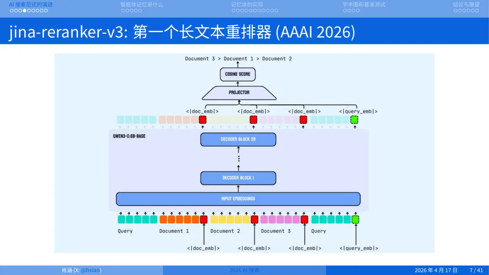

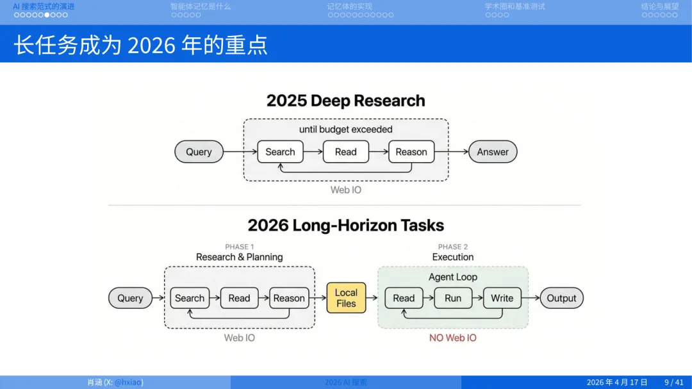

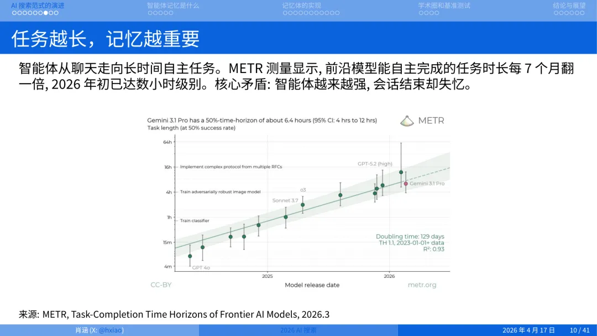

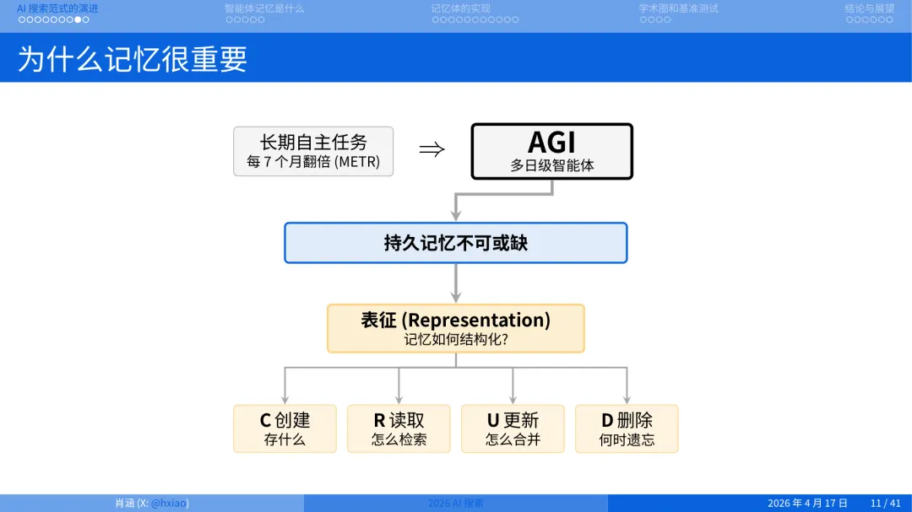

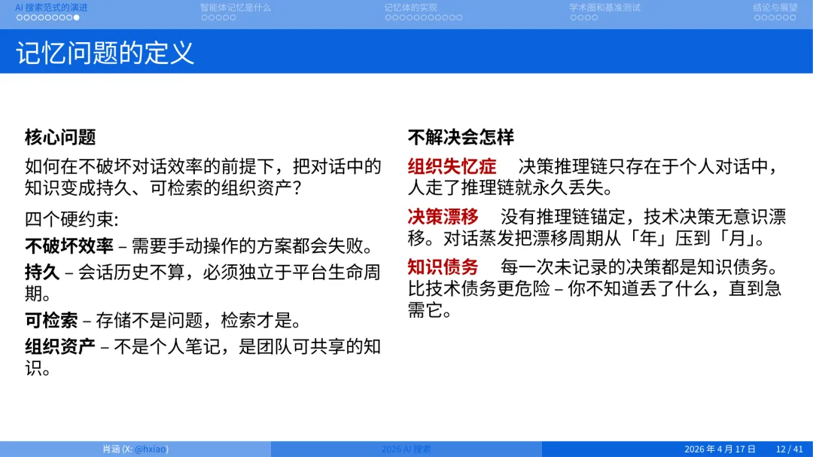

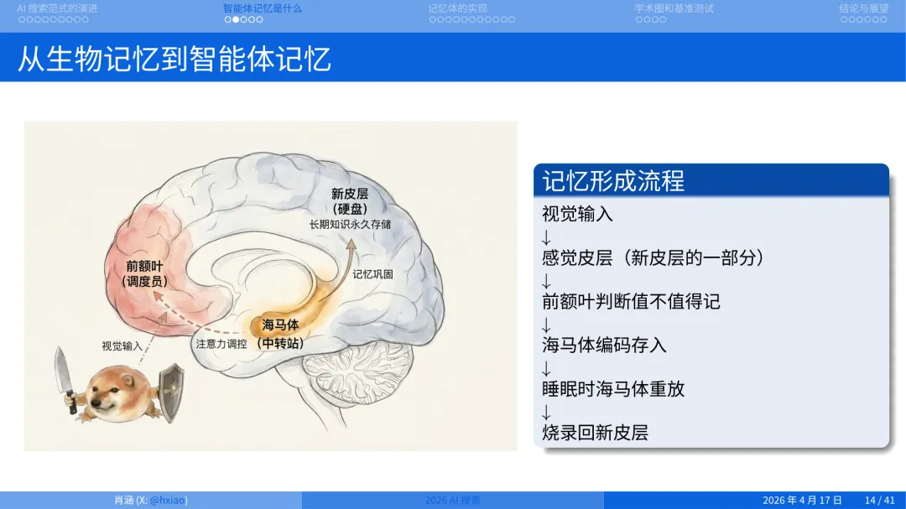

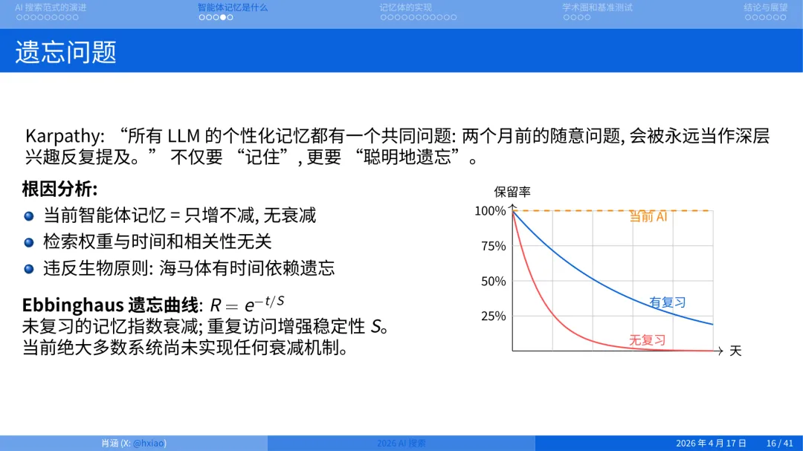

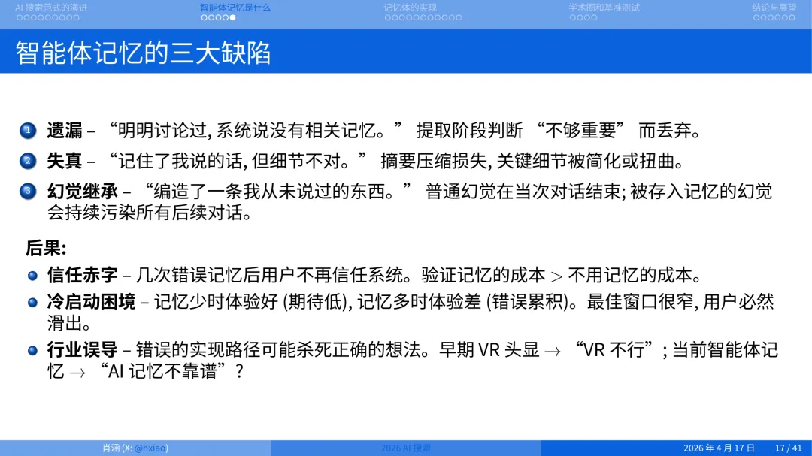

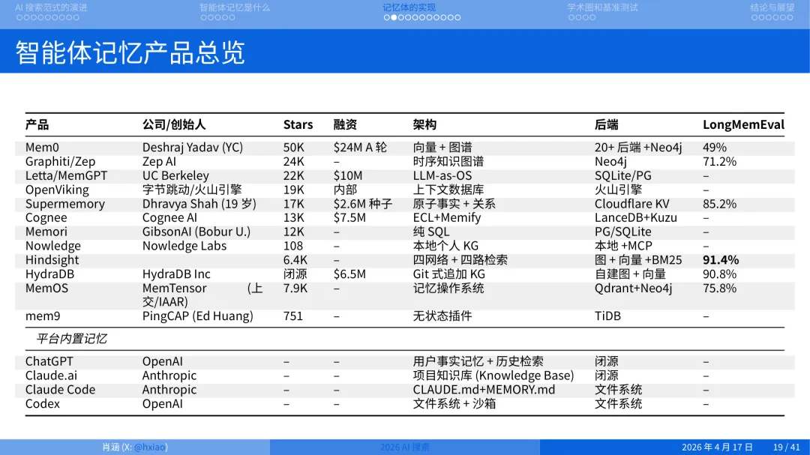

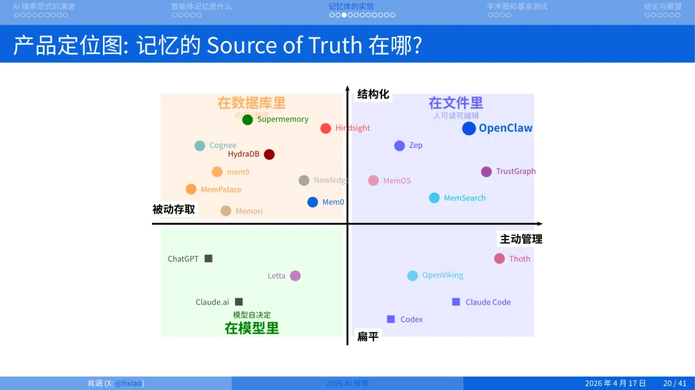

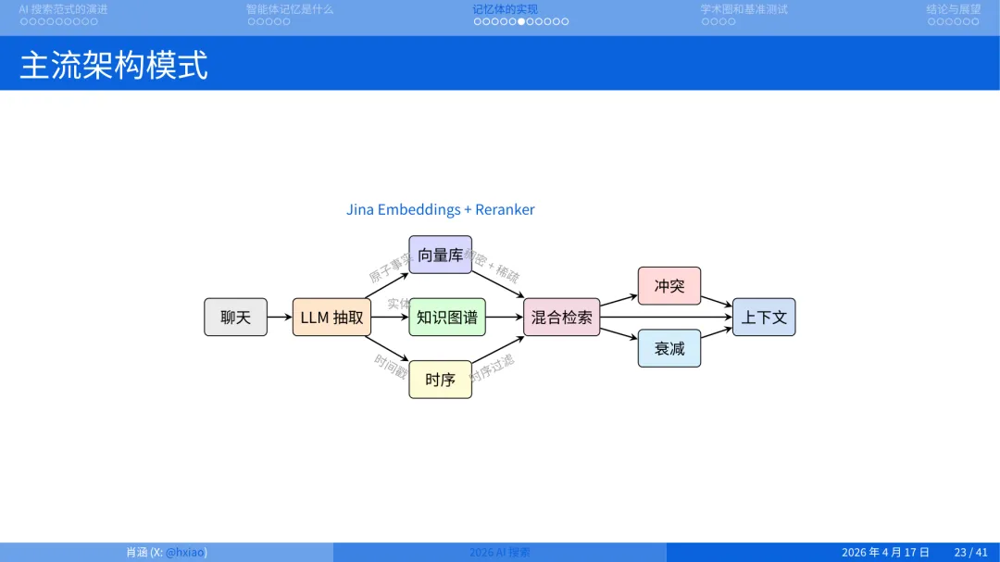

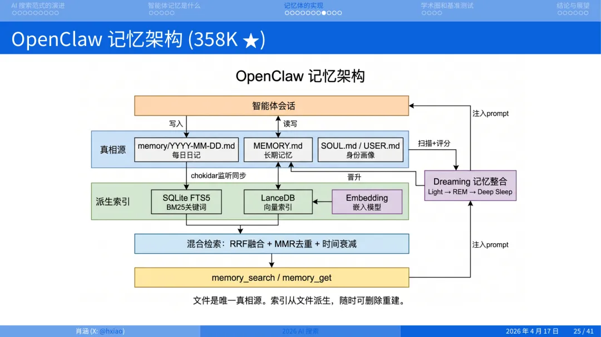

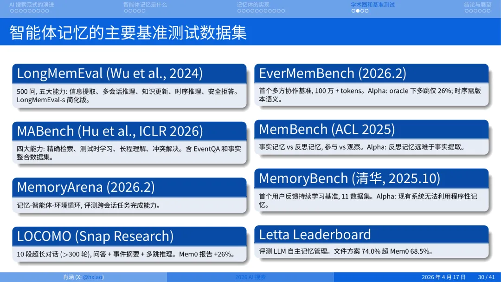

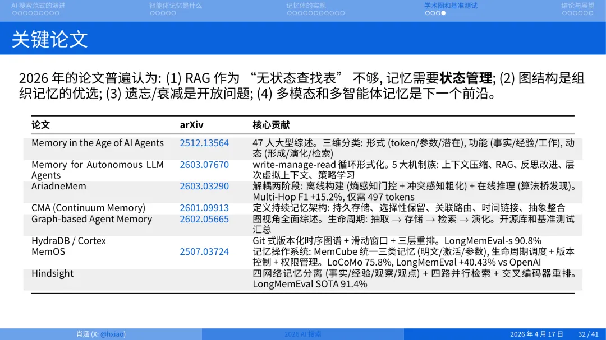

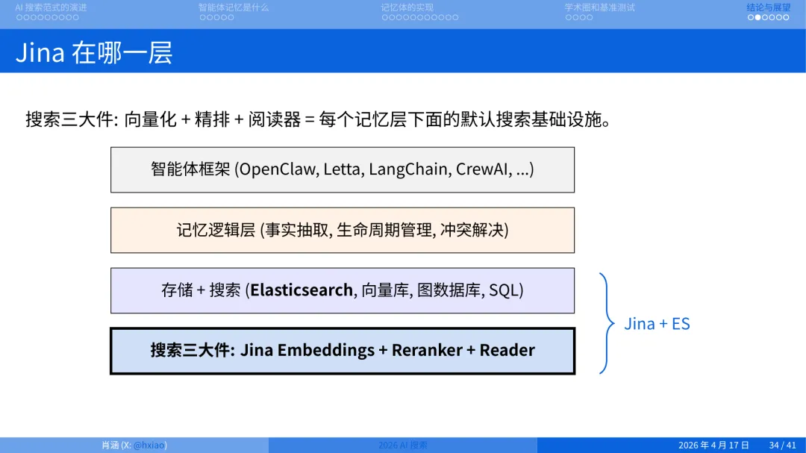

## 正文抽取

欢迎大家来到 Elastic 第一次在中国办这么大的技术研讨会。我是肖涵，北京人，大家可以先放松一下，欢迎来到我的家乡。

先简单介绍一下自己，

以及我和 Elastic、尤其是和搜索的一些渊源，也帮大家回忆一下搜索这些年的发展。

我最早接触搜索是 2009 年，在

惠普实验室（HP Labs）

实习，拿 Lucene 做分词，做信息抽取。那时候叫 IE，不是 Internet Explorer，是 Information Extraction。还做了一些 LDA、主题模型这类东西。2009 年贝叶斯那套非常火，跟今天 Transformer 的地位差不多。

后来我去德国读博，做的就是贝叶斯机器学习。等我 2014、2015 年博士毕业出来，发现贝叶斯没什么人搞了，大家都在用 TensorFlow 做深度学习。又过了几年，Transformer 出来，把深度学习的架构统一了。

2018 年我回国，在深圳腾讯 AI Lab 做了两年搜索，做的是微信"搜一搜"背后的多模态和中文搜索。2020 年疫情的时候出来创业，成立了 Jina AI，专门做多模态搜索。

当时我立的 flag 是"颠覆 Elastic"。结果绕了一圈，2025 年 10 月被 Elastic 收购了。现在我在 Elastic 担任全球副总裁，专门负责 AI，主要是搜索底座模型的研发。

今天要讲的主题是智能体记忆。

先问一下在座有谁用过小龙虾？举个手。嗯，量不小，一看就是在中国，大家都很爱学习。那用过超过一个月的？少一些。超过两个月的？更少了。

那我相信大家都遇到过一个问题：用这类智能体，用一两次是尝鲜，但当你用了一周、两周之后，你是希望它越来越聪明的，随着你用它越久、它越记得住你的事。可惜目前这套记忆机制很不完善。

智

能体记

忆的痛点

讲一个两周前我自己的真实例子。

我跟小龙虾说："我之前做了一个 911 的图表，你发给我一下。"911 是保时捷的一款跑车。然后它(我给它起名叫"小牛马")跟我说没找到，问我 911 是指恐袭还是别的东西。

我当时第一反应是模型降智了，或者被 fallback 到什么垃圾模型上去了。我特地查了一下，发现跑的是 Claude Opus 4.6，当时最好的模型。不是模型的问题。

那我就开始 debug。我问它：你刚刚用的什么搜索？怎么判断你记忆里没有这件事的？

它说它用了 Grep 做关键词匹配，又用 Memory Search 做向量语义搜索，把 Memory Markdown、Session Log、文件系统都扫了一遍。

方法上看着没问题。那接下来 debug 的点就是：

你到底用的什么 Query？

它告诉我，第一次的 Query 是

911 chart graph visualization

。它不知道 911 是什么，直接把我的中文翻译成英文去搜了，发生了一次 multilingual query 的转译。第二次更离谱，Query 变成了

September 11th chart visualization Twin Towers attack

，直接搜成恐袭了。

这两个 Query，我的记忆库里当然都找不到。

后来我换了一个说法，"帮我把 992.2 的图表发给我"。992.2 是 911 这代车型的代号。一下就找到了，3 月 29 号做的。

所以就算你记忆系统整条链路都对，

只要第一步 Query 构造错了，整个检索就是废的

。而且这种事情从我 1 月份开始用到今天，一直在发生。

记忆，是今天 Agent 的一个很大的痛点。

回顾搜索的发展脉络

我们回顾一下，搜索是怎么走到"做智能体记忆"这一步的。

2009 年刚做搜索的时候，关键词就是 BM25、TF-IDF、倒排索引，Lucene 背后那套东西。

2015 年之后，

向量搜索逐渐进入视野，最早是 Spotify 搞过一个，名字我都快忘了，然后是 Facebook 的 Faiss，Milvus，Elastic，这是第一批把 Vector Search 做出来的。但大家很快发现向量搜索也有问题：速度是一个，过度召回是另一个。向量搜索有个毛病，就是哪怕 Query 和文档完全不相关，只要分数差不多它就召回了。关键词搜索会零召回，向量搜索太柔，语义上都太柔化。所以后来大家把两者结合，做混合搜索。

2018 年 Transformer

统一了深度学习架构，BERT 成为把文本编码成向量的标配。

2022 年 11 月 ChatGPT 发布，RAG 起来，搜索和生成越走越近。我 2022 年写过一篇小随笔，

搜索是过拟合的生成，生成是欠拟合的搜索

。

它们

俩其实是对偶的。

2025 年还有一个时间点。春节前正月初一，DeepSeek 发布了 R1，非常火。它那套 reasoning 加 test-time compute 的范式让大家意识到，搜索可以边搜边 reasoning，再不断搜，最后生成一份很长的报告，

这就是 Deep Research

。2、3 月份 Google、OpenAI、Perplexity 都在做，包括后来做得比较好的 MiroMind。

2026 年呢？自从 OpenCloud 发布之后，大家对 Agent 的期待变了。不再是生成一份报告就结束，而是希望我一旦启动这个 Agent，它能连续干三四个小时，没人管、没人介入，它自己在那跑。

Jina AI by Elastic 搜索底座三件套

Jina AI 从 2020 年成立到现在六年，做的事情一句话讲完：

我们在做搜索的底座

。我们在观察这条进化路线上哪些东西是不变的。最后沉淀下来三套模型，Embedding、Reranker、还有一个 Reader (或者叫 Small Language Model)。

Embedding 大家都知道，就是向量，把文本或者图片转化成向量，然后用 cosine 余弦距离去匹配。

V1

：默默无闻。

V2

：2023 年 10 月发布，在海外引起了比较大的轰动，因为当时它是第一个开源的、支持 8K 上下文的模型，你能一次编码 8000 个 tokens，是第一家做开源长文本向量模型的，当时都是英语。之后我们还有很多双语版本。

V3

：我们把所有双语版本都砍掉统一，重新训练了一个多语言的 embedding 模型。到现在仍然非常好用，在 Hugging Face 上月下载量大概在 500 万。

V4

：2025 年发布的一个多模态 embedding 模型，可以同时编码图片和文本。有人说多模态模型 CLIP（OpenAI 的 CLIP）2022 年就搞了，你 2025 年才搞一个多模态的模型？其实它俩不一样。CLIP 用的是对齐训练，而 V4 的多模态是一个真正的多模态，它把图片拆成小的 patch，和语言一起放到一个大的语言编码器中编译成向量，而不是像 CLIP 那样有一个图片模态、一个文本模态，然后两个模态之间对齐。

V5

：我们今年在加入 Elastic 之后，和 Elastic 一起研发的向量模型。V5 的性能和大小非常好。我们发布了两个版本：一个是 V5 text Nano，只有 2.39 亿参数；一个是 V5 Small，6.77 亿参数。相对于 V4 的大小（38 亿），小了很多。当然 38 亿对于大语言模型来说只是非常小的 toy example，但对于搜索任务我们要求的是快，在快的基础上做到精准。v5 的特点就是参数小，但性能强。

可以看到即便我们现在用更小的模型，其实可以达到更高的性能。V5 目前是文本领域做多语言搜索能够做到最好的。可以看到它是一个 Frontier model（前沿模型）。

放到

Pareto Frontier（帕累托前沿）

上看，横轴是参数量，纵轴是任务分数，越靠左上越好，V5 目前在最左上那个角上。它是文本领域多语言搜索目前能做到最好的前沿模型。这个模型已经被 SIGIR 2026 录取了。

另一个我们做的是 Reranker。重排器有些人不太理解：我都有 Embedding 做语义搜索了，为什么还要 Reranker？你一次排好不就完了？

Jina Reranker v3: 全新“列式”重排器，0.6B参数刷新文档检索SOTA

原因是搜索是一个多层级联的 Pipeline。到最后一步，我们希望更细致地挖掘 Query 和候选文档之间字和字级别的相似度，也就是 token level 的语义匹配。Embedding 是把整篇文章压缩成一个向量，压缩过程必然有损失；Reranker 保留了每个 token 上的向量，因此可以把 Query 的每个 token 和 Document 的每个 token 两两对比。它的计算量比 Embedding 大，但粒度也更细。

Jina Reranker V3 是第一个真正意义上的长文本重排器

，

支持 131K 上下文

，这篇工作获得了 AAAI 2026

FrontierIR

Workshop Best Paper。除此之外我们还有一个 m0 版本，做多模态重排。

Jina Reader 相信很多人在用 Agent 的时候都碰过。对很多人来说，Reader 甚至比我们的模型更出名。这个今天下午 Reader 的作者会专门上台讲，我就按下不表。Reader 为什么是永远的神，YYDS。

长时程任务与智能体记忆

回到智能体搜索、长任务这件事。

刚才说了 Deep Research 是 2025 年的一个重点，它就是一个 Loop。

Agent 就是一个 Loop，在三个状态之间循环：Search、Read、Reason。

2026 年今天讨论最多的、你去问智谱、MiniMax 这些厂商，PR 稿里必提的一个词就是：他们的模型如何支持 long-horizon task。长时程任务，就是 Agent 能自主运行多长时间，三四小时、三四天没人管它还能接着干。有个叫 METR 的 Benchmark

专门衡量每一个大模型放在一个环境中自主解决任务的最大时间长度。目前大约是 4 到 5 个小时，这个趋势在不断上升。

你让一个 agent 工作 4 个小时，中间它要搜索几百次、读几百个文档、在失败路径上回退几十次。这些经历不可能全部塞进 context window。它必须有一个地方去存、去查、去更新。

逻辑就很清楚了：当 Agent 的目标变成长时程任务，

持久记忆就不再是可选项，是命门

。

记忆该如何表征？

这就引出了很多问题。最基本的问题就是：记忆该如何表征（representation）？

很多人忽视了

在机器学习里最大的一个问题，其实不是方法，而是表征。

机器学习的顶会之一 ICLR 的全称就是 International Conference on Learning Representations，表征学习国际会议。顶会以"表征"命名，你就知道这个概念在整个 AI 领域的位置。

我们用了很多年才发现，BERT 是对语义的一个非常好的表达，它给"一段文本应该长什么样"这件事找到了一个好的 representation。当表征就位。Vector Database 才成立。向量数据库存的就是这种表征。

所以当我们要做智能体记忆，第一个问题不是"用什么数据库"，而是：记忆的 representation 到底是什么?

基于这种 representation，我该怎么去做 CRUD？

一条聊天记录，一个事实三元组，一张知识图谱？还是一段向量，一个时间戳+事件对，还是模型权重本身？

不同的答案，会催生完全不同的系统。这也是今天智能体记忆领域最混乱的地方，大家在不同的表征上各自开工，谁也说服不了谁。

而且即便选定了表征，还有三个问题要回答。

第一：基于这种表征。怎么做 CRUD，这是做数据库的人熟悉的。第二，如何在不破坏对话效率的前提下，把知识从对话里抽出来变成可检索的资产。这件事要难得多，因为对话是实时的，提取是有成本的，抽多了慢，抽少了漏。第三，也是我自己最在意的。记忆能不能跨模型迁移?

我今天用智谱，明天我不粉了，变黑粉了，投奔 MiniMax，我希望我的记忆能搬过去照常运行。所以记忆应该和上层模型解耦。

我们今天从生物学的角度强行关联一下，看一下人是怎么完成记忆的。大家知道这是什么吗？这是刀盾狗（Doge），现在非常火的一个生物。

人脑的记忆是分层的。

当一个新概念进来，先有视觉输入，前额叶皮层判断值不值得记，海马体负责编入，睡眠会强化记忆，最后它变成一种长时程的技能，重新烧录到新皮层。

我们可以强行做一个映射。

我说两次"强行"，是因为

我本人并不太赞成把人脑的东西硬搬到 AI 上

，碳基和硅基的运行方式可以完全不一样。但如果强行对应：海马体对应 RAG 的实时检索，新皮层对应微调或预训练模型，前额叶就是当前的 Context Window。

什么

时候该忘？

选择性遗忘

讲智能体记忆还有一个特别重要的问题：

什么时候该忘？

举个例子，我第一次用小龙虾的时候，把我六年创业的事一口气全喂给它。结果它经常把我六年前想过、早就放弃的一个事情拿出来问我。但人是会变的，有些事我忘了，有些事我不做了。

这个问题其实

Andrej

Karpathy 有一段很精准的描述。他说：

现在我们看到的 agent 系统都有一个最致命的问题，就是它不会选择性遗忘。

如果系统不做选择性遗忘，最后一定是乱的。大脑不遗忘会超负荷；Agent 不遗忘，也会被自己的历史拖垮。

目前 Agent 记忆有几个缺陷：一是遗漏，就是 911 那个例子；二是失真，也就是幻觉(

hallucination)

；三是幻觉继承。

这时候会有一个非常有意思的事情：

冷启动悖论

。反而是当你用一个新模型或新 agent 的时候，感觉会非常好，因为你知道这是一个全新的 agent，对它的期待非常低，所以用起来还挺顺手。而当你使用时间越来越长的时候，你期待这个 agent 变得越来越好，但它并没有，因为它的记忆体设计得非常差。这就导致它的用户留存时间会非常短，

用户对 AI 的信任被长期蚕食。整个行业的节奏被记忆这件事拖住。

市面上智能体记忆产品的分类

我梳理了一下，

目前做智能体记忆的产品，开源加闭源至少有十几家。

再加上老牌数据库公司 PingCAP(做 mem9)、Milvus 也在做，以及平台内置的方案：ChatGPT 的用户记忆、Claude.ai 的知识库、Claude Code 和 Codex 的文件系统。

这么多产品，怎么区分它们？我用一句话概括：

Source of Truth 在哪？

这是区分所有记忆产品的第一性原则。沿着这个原则，可以分成三大类：

第一类是数据库派

，向量数据库、SQL、Key-Value 存储。对话经过 LLM 抽取 facts，存进向量库或图谱，检索时注入上下文。

结构化程度高，查询效率好，但"一条记忆应该长什么样"这件事由 schema 锁死，灵活性有限。

第二类是文件派

，Markdown、纯文本。Agent 读文件、工作、写回文件、不断累积。优势是透明可编辑、可版本化，缺陷是文件会膨胀，需要 intelligent forgetting。代表是小龙虾、MemSearch。

第三类是模型派

，真相就是大模型权重或上下文本身。模型自决定记什么、忘什么、整合什么。优势是零配置、自适应，缺陷是完全黑盒、不可审计。代表是 Letta、ChatGPT。

我们刚才看到三大类别，目前所有记忆体基本可以按这三类划分。当然还有一些结构化存储、扁平化存储、主动管理和被动管理，这可以从另一个坐标轴对所有产品进行分类。

行业共识：主流的记忆工作流

虽然流派不同，但主流工作流有高度共识，我稍微总结了一下，我们今天看到的大部分智能体记忆框架基本上都 follow 这个工作流：

从聊天记录中，通过大模型提取事实或记忆结构

将这些记忆结构

：

要么转化成

向量

要么转化成

知识图谱

要么用一些

时序数据库

（时序非常重要，因为就像我刚才说的，你需要选择性遗忘）

基于时序数据库、知识图谱和向量库做混合检索

检索完之后你还无法直接呈现到上下文中

，要解决两个问题：

冲突

：当检测出两个记忆相互矛盾的时候，该怎么解决？

随时间的衰减

：

旧记忆权重怎么降？

大部分主流框架基本 follow 这个设计理念。当然并不是每一个框架都采用所有技术，有些只选择做几个，有些则全链都做。

小龙虾记

忆结构详解

既然现场这么多人用过小龙虾，我们具体拆一下它的结构。

它是典型的文件派。

它的真相源是一个 memory 文件夹，里面按天组织 Markdown 日记。另外有一份 memory.md 主文件,存长期记忆，包括用户画像；还有一份 soul.md。存它自己的"灵魂画像"，也就是它对自己是谁、自己怎么做事的内部表征。

从这些真相源派生出两个索引：SQLite FTS5 做 BM25 关键词检索，LanceDB 做向量检索。在索引之上做混合检索，用 RRF 融合、MMR 去重、再加时间衰减。对外暴露两个接口：

memory_search

和

memory_get

。

在此之上，它还模仿了人类的睡觉习惯：有深度睡眠、浅度睡眠、REM（Rapid Eye Movement，快速眼动）。在这三个基础上设置一套机制。

这些是仿生学的概念，总体来说它设置了一套机制，能保证不是每一条记忆都完全被升级到长期记忆上，而是通过设置阈值、判断条件来提升一部分记忆。

模型派：真相在模型里

除了文件派，还有模型派。

这是我个人比较看好的方向。

也许到某个点，大家发现 Transformer 架构本身就把记忆问题解决了，直接

The bitter Lesson

，力大出奇迹。

目前已经看到这个趋势，比如千问 3.5 的 MoE 模型已经可以扩展到 1M token，

在一个 24G 显存的 GPU 上可以流畅运行。如果我的全部记忆能被压进或者直接装进 1M 窗口，那我就不需要分层设计了，直接用模型本身做召回。

还有一家公司是 EverMind AI，他们最近把上下文推到了 100M token，你可以直接在 KV cache 中存 100M token。他做这个事情是因为：如果不做特殊的架构处理，上下文越长召回质量越差。所以 EverMind 这家初创公司在 Attention 机制上做了特殊设计，搞了一个叫 MSA（Memory Sparse Attention，记忆稀疏注意力） 的东西，保证它在超长 100M 上仍然有非常好的召回效果。

Benchmark

学术圈对智能体记忆已经做了不少 benchmark，我简单点一下。这个很重要，

我们做一个任务的时候，和民科最大的区别就是：我们要跑 Benchmark，验证完效果才去说这个东西有用。

目前主要的数据集有 LongMemEval(500 问，测五大能力：信息提取、多会话推理、知识更新、时序推理、安全拒答)、MABench(ICLR 2026，测精确检索、测试时学习、长程理解、冲突解决)、MemoryArena、LOCOMO、EverMemBench(首个多方协作基准，100 万 + tokens)、清华的 MemoryBench(首个用户反馈持续学习基准)。

目前在做记忆体测试的时候，这些是主流的 Benchmark。大家可以发现：上下文越长，记忆体效果越差；多会话推理、冲突解决目前都是非常难的问题。

Evermind 还提过一个我觉得特别有意思的问题：

今天我们讨论的记忆，不管是小龙虾还是别的，都假设 Agent 是一个一对一的个人助理，这是相对简单的场景。但如果把 Agent 丢进一个群聊里呢？它该记谁的？怎么分别记每个人的？

所以记忆的未解决问题还非常多。

这里列出一些关键论文。

我们看今天的 RAG（包括混合召回）之所以不够用，是因为它本身没有状态、没有层级，至少在做 embedding、做 keyword search 的时候，它并不包含状态，也不包含时间关系。它是一个非常扁平的召回模型，所以这种模型并不擅长做记忆。这已经是目前的共识，所以才有很多图数据库、时序数据库想介入进来一起把 agent 记忆模型做好。

基础设施构建

如果我们今天看所有的智能体叙事框架，底层一定要有：

向量检索

（必需），尤其是

多语言向量检索，

比如刚才 911 的事情，中文需要翻译成英语，不能说中文搜不到英语的内容。跨语言搜索能力一定要有。

重排器和 Reader

：可能需要，有时可能不需要。

在此之上有存储和搜索，包括 Elasticsearch 中的向量数据库。可以看到

Jina 和 ES（Elastic）基本上包含了整个搜索的底座

。

另外再号召一下：

Elasticsearch 和 Jina 融合之后，我们对于智能体记忆的底层有了一个非常全面的覆盖。

我希望大家能够利用 Elasticsearch 去构造自己的智能体记忆框架。

能力

Jina + Elastic 怎么覆盖

向量语义检索

Jina Embeddings v5（677M / 239M）

BM25 关键词搜索

Elasticsearch 原生支持

稠密 + 稀疏混合

Elasticsearch 原生 RRF

精排重排序

Jina Reranker v3（131K 上下文）

网页和文档理解

Jina Reader

多模态向量化

Jina Embeddings v4（文本 + 图像 + PDF）

元数据和多租户

Elasticsearch index / alias

目前 Elastic 还没覆盖的，是知识图谱遍历，以及如何把大模型放到架构中做事实抽取(extraction)。

Hot Take

1. 统一范式还没

出现

。

我在做智能体记忆调研的时候发现：其实统一的范式并没有形成。有些人从仿生学角度看这个问题，有些人从自己的使用习惯、工作效率上看这个问题。这非常像 2017 年 Transformer 没出来之前的深度学习，百花齐放的状态，包括 CNN、RNN、LSTM，这些东西百花齐放。

2. 纯文本派是躺平。

不想构建任何模型，也不想构建任何仿生学层级，基本靠 grep、keyword search。这几年 search 发展太快了，从 RAG 到 deep research，很多人已经疲惫到说："反正一切终究会被大模型吃掉，那你又何必去奋斗呢？反正到最后你就躺三个月，没准大模型出来就已经把这个实现了。" 我个人认为这是一种躺平，这种想法是有一定天花板的，而且天花板是显而易见的。

3. Unlearning 是一笔多年的技术债，该还了

。

目前所有系统都是只增不减，实际上是一笔技术债。我当时做机器学习的时候，2009 年大家就讨论过

机器遗忘(Machine Unlearning)

：怎么把已经训练的、已经学到的东西忘掉？一个现实类比就是

"刷抖音这号废了，重新开号吧"。推荐系统一旦被污染就无法恢复，本质就是它不会遗忘。智能体记忆面临完全一样的问题：噪声一旦写入，就永久污染所有后续检索。

4.

推荐系统会因为智能体记忆重新火起来。

智能体记忆的核心是个性化：记住用户偏好、行为模式、历史决策。这跟推荐系统做了二十年的事完全一样。小红书、抖音、淘宝这些推荐系统做得好的公司，凭借经验和先天优势，可能会在这个智能记忆体的时代发挥出来。

这就是我今天的演讲。希望对大家有所帮助，也希望让大家对智能体记忆的发展脉络和未来走向有了一个整体的认识。

另外再号召一下：

Elasticsearch 和 Jina 融合之后，我们对于智能体记忆的底层有了一个非常全面的覆盖。

我希望大家能够利用 Elasticsearch 去构造自己的智能体记忆框架。

谢谢大家。
