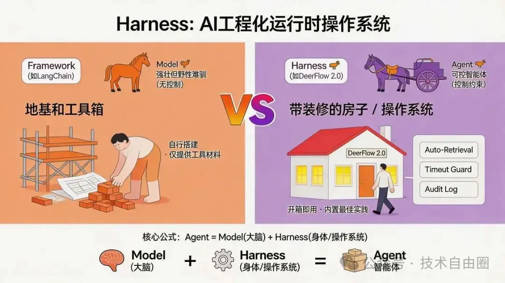
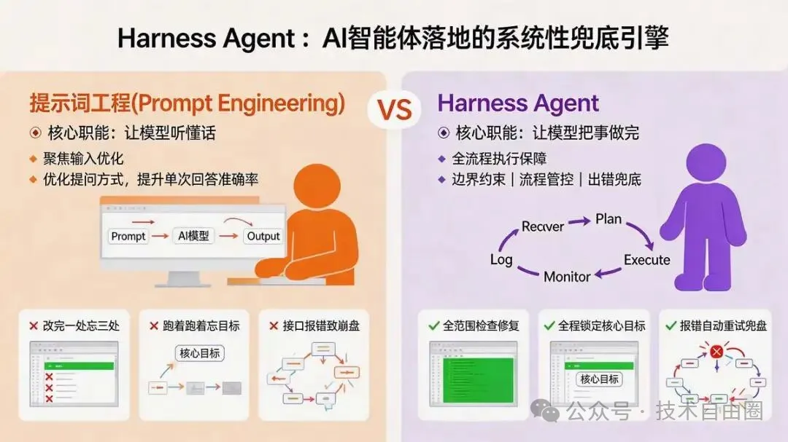
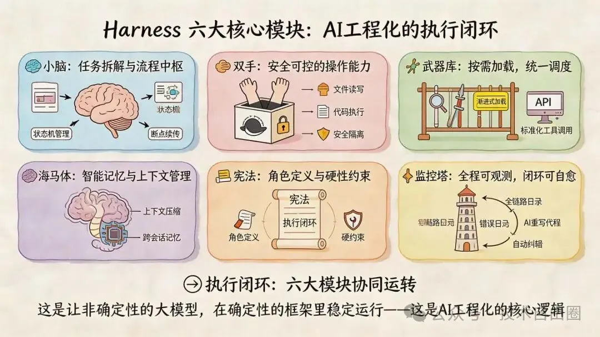
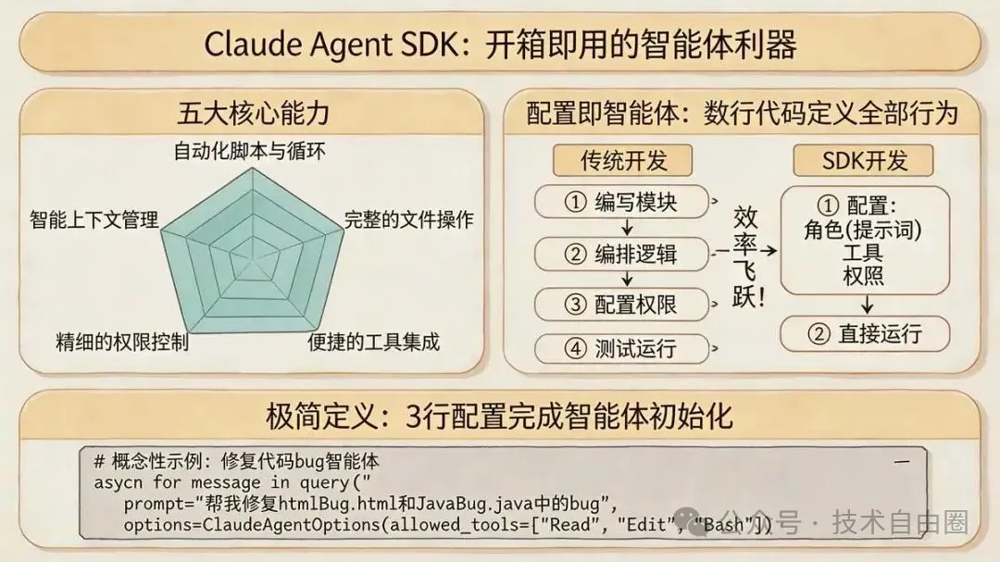
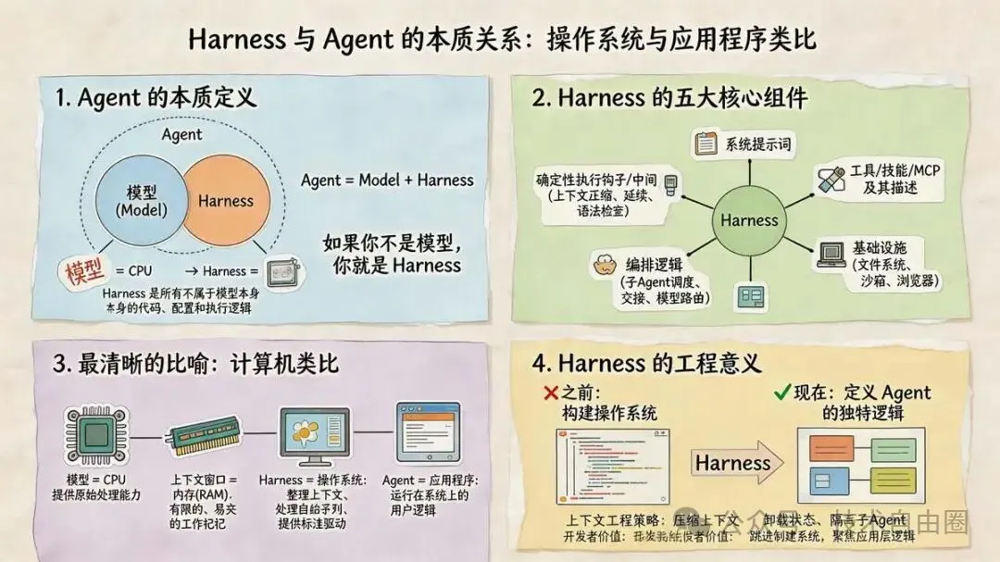
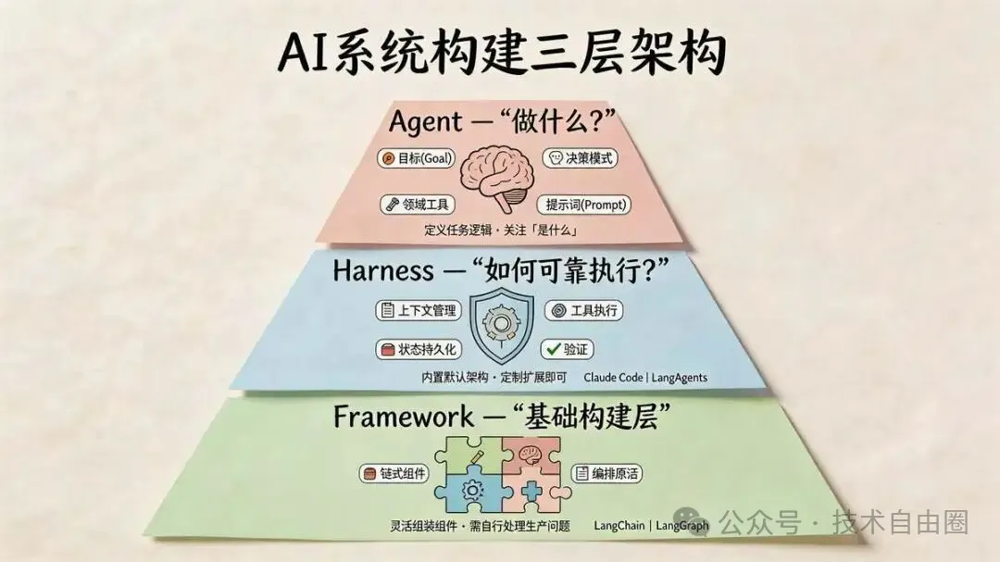
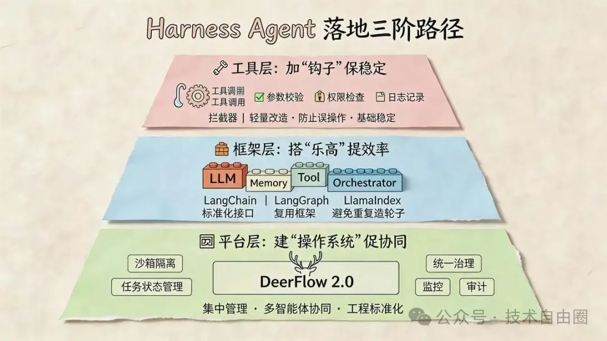
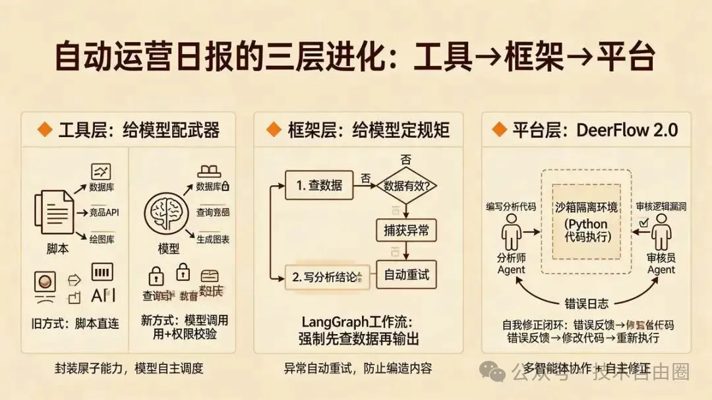

45岁老架构师尼恩 *2026年4月12日 11:14*

## 尼恩说在前面

在45岁老架构师尼恩的 **读者交流群** （50+人）里，最近不少小伙伴拿到了阿里、滴滴、极兔、有赞、希音、百度、字节、网易、美团这些一线大厂的面试入场券，恭喜各位！

前两天就有个小伙伴面腾讯

问到 **“ 听说过Harness Agent 吗？你们怎么实现 Harness Agent 的？ ”** 的场景题 ，小伙伴没有一点概念，导致面试挂了。

小伙伴 没有看过系统化的 答案， **回答也不全面** ，so， 面试官不满意 ， 面试挂了。

小伙伴找尼恩复盘， 求助尼恩。

通过这个 文章， 这里 尼恩给大家做一下 系统化、体系化的梳理，使得大家可以充分展示一下大家雄厚的 “技术肌肉”， **让面试官爱到 “不能自已、口水直流”** 。

同时，也一并把这个题目以及参考答案，收入咱们的 《 [尼恩Java面试宝典PDF](https://mp.weixin.qq.com/s?__biz=MzkxNzIyMTM1NQ==&mid=2247497474&idx=1&sn=54a7b194a72162e9f13695443eabe186&scene=21#wechat_redirect) 》V176版本，供后面的小伙伴参考，提升大家的 3高 架构、设计、开发水平。

> 最新《尼恩 架构笔记》《尼恩高并发三部曲》《尼恩Java面试宝典》的PDF，请关注本公众号【技术自由圈】获取，后台回复：领电子书

## Harness Agent ： AI工程 “新王者框架 “ 来了！

AI圈的 新概念 新技术 的 迭代速度 ， 比翻书还快。

前脚LangChain/Langgraph 的热度还没散，后脚Harness Agent 如火如荼。

一个 字节开源的Harness Agent 平台， 狂飙54k+Star，霸榜GitHub。

54k+Star！Harness Agent 爆火！ AI工程 “王者框架 “ 来了！

AI圈 开始 流传起一句话： **Agents aren't hard; the Harness is hard。（做智能体不难，难的是做好Harness。）**

有人说 Harness 是AI智能体的“外挂系统”，有人称Harness 为大模型的“工业化工作台”，到底什么是Harness Agent？

那么 Harness 到底是什么？ 尼恩来给大家抽丝剥茧。

## 一句话讲透：Harness Agent到底是什么？

一句话讲透：Harness Agent到底是什么？

“Harness” 原意 马匹的“马具”。

Harness ， 顾名思义，就是 智能体的“马具”与“控制塔”

“马具” 这个概念精准地隐喻了新一代AI工程化的核心：我们需要的不是一匹无法控制的野马（原始大模型），而是一套完整的缰绳、鞍具、车轮与导航系统，将其转变为能安全、准确抵达目的地的“智能马车”。

从技术视角看，Harness架构是指智能体中除核心大模型之外的所有组件的总和。它是一个系统性的工程框架，旨在约束、引导和增强大模型的能力，使其能稳定、可靠地完成现实任务。这套框架通常包含以下关键模块：

## Harness 的“官方”定义

Harness 的核心公式简单到一眼就能记住：Agent = Model + Harness。

- Model是大模型本身，负责理解、推理、生成，是AI的“大脑”；
- 而Harness Agent是包裹在模型外围的运行时控制系统，负责调度、约束、恢复、审计，是让大脑稳定干活的“工作台+指挥中心”。

Harness 的“官方”定义

在 AI 工程化领域，Harness 被定义为： **包裹在 AI 模型周围的基础设施，专门用于管理长期任务和复杂执行的运行时控制系统。**

如果说大模型（LLM）是 AI 的“大脑”，那么 Harness 就是它的“身体”和“神经系统”。

**核心隐喻：马具（Harness）**

- **模型（Model）** 是一匹强壮但野性难驯的骏马（提供动力和智力）。
- **Harness** 是缰绳、鞍具和车轮（提供方向、约束和承载力）。

核心公式： **Agent = Model (大脑) + Harness (身体/操作系统)**

**Harness 与 Framework（框架）的区别**

- **Framework (如 LangChain)** ：是地基和工具箱，给你材料让你自己盖房。
- **Harness (如 DeerFlow 2.0)** ：是 **“带装修的房子”** 或 **“操作系统”** 。它内置了最佳实践，开箱即用（Batteries Included），比框架更有“主见”（Opinionated），不仅提供工具，还帮你做好了决策逻辑。

## 为什么Harness Agent 是AI落地的刚需？

为什么Harness Agent 是AI落地的刚需？

做过AI智能体落地的团队，大概率都遇过这样的尴尬：模型能力明明达标，调参、写提示词的功夫下了不少，但真实场景里一跑就掉链子。

- 让它修个bug，改完一处忘三处；
- 让它执行长任务，跑着跑着就忘了核心目标；
- 让它调用工具，一个接口报错就导致整个任务崩盘……

问题根本不在模型够不够聪明，而在模型太“自由”——没有边界、没有流程、没有出错兜底机制。

就像招了个能力超强的员工，却没给流程、没配检查机制、没做反馈闭环，最后结果必然一地鸡毛。

这就是Harness Agent的核心价值：Prompt Engineering解决“让模型听懂话”，Harness Agent解决“让模型把事做完”。

- Prompt Engineering 关注输入，琢磨怎么问能让模型一次答对；
- Harness Agent 关注整个执行环境，模型答错了怎么办、上下文乱了怎么恢复、子任务怎么调度，全靠这套系统兜底。

2025年是智能体的元年，而2026年，注定是Harness Agent的元年。

## Harness 包括的六大核心模块

Harness 包括的六大核心模块

根据 DeerFlow 2.0 等代表性项目的架构， 一个完整的Harness Agent，由六大核心组件构成，缺一个都算不上真正的工程化.

一个完整的 Harness 系统通常包含以下 **6 大核心模块** 。

这些模块共同构成了 AI 的“执行闭环”：

#### 1\. 规划与编排引擎 (Planning & Orchestration)

这是 Harness 的“小脑”，负责任务的拆解和流程控制。

**功能** ：将模糊的复杂目标（如“写一个网站”）拆解为有序的子步骤。

关键能力：

- **任务拆解** ：自动将大任务分解为子任务。
- **状态机管理** ：基于 LangGraph 等技术，管理任务的状态流转（如：规划 -> 执行 -> 检查 -> 修正）。
- **断点续传** ：通过 Checkpoint 机制，确保任务中断后能从断点恢复，而不是重头再来。

#### 2\. 沙箱执行环境 (Sandbox / Execution Environment)

这是 Harness 的“双手”，让 AI 真正拥有操作计算机的能力，而不仅仅是聊天。

**功能** ：提供隔离的、安全的代码执行和文件操作空间。

关键能力：

- **文件读写** ：AI 可以创建、修改、保存文件（如 `/mnt/workspace/` ）。
- **代码执行** ：在 Docker 或本地容器中运行 Python/Bash 命令。
- **安全隔离** ：限制网络访问、CPU/内存配额，防止 AI 误操作破坏宿主机系统。

#### 3\. 技能与工具系统 (Skills & Tools)

这是 Harness 的“武器库”，定义了 AI 能做什么。

**功能** ：标准化地封装外部 API、库和操作流程。

关键能力：

- **渐进式加载** ：像 DeerFlow 的 `Skills` 系统，只有在任务需要时才加载相关技能（如“视频生成”技能），避免塞爆上下文窗口。
- **标准化工具调用** ：统一封装搜索、代码解释器、API 调用等接口，处理参数校验和异常。

#### 4\. 记忆与上下文工程 (Memory & Context Engineering)

这是 Harness 的“海马体”，解决模型“记性差”和“上下文溢出”的问题。

**功能** ：管理短期工作记忆和长期知识库。

关键能力：

- **上下文压缩** ：自动对过长的对话历史进行摘要（Summarization），保留核心信息。
- **跨会话记忆** ：持久化存储用户偏好、项目背景，让 AI 在下次启动时仍能“记得”之前的设定。

#### 5\. 系统提示词与角色准则 (System Prompts & Guardrails)

这是 Harness 的“宪法”，定义 AI 的行为边界。

**功能** ：通过预设的 Prompt 模板和硬编码规则，约束 AI 的行为。

关键能力：

- **角色定义** ：明确 AI 是“资深程序员”还是“严谨的分析师”。
- **硬约束** ：例如“禁止使用 `rm -rf` 命令”、“必须先用搜索工具验证事实再回答”。这些规则通常通过 Hook 机制强制执行，不依赖模型的自觉性。

#### 6\. 可观测性与反馈闭环 (Observability & Feedback Loop)

这是 Harness 的“监控塔”，让黑盒的 AI 执行过程变得透明。

**功能** ：全链路记录 AI 的思考、工具调用和结果。

关键能力：

- **全链路日志** ：记录每一步的输入输出。
- **自动纠错** ：当工具调用失败或代码报错时，Harness 会捕获错误信息并自动反馈给 AI，要求其修正（例如：代码运行报错 -> 把错误日志喂回给 AI -> AI 重写代码）。

这六大组件，本质上是让非确定性的大模型，在确定性的框架里稳定运行——这是AI工程化的核心逻辑。

## Harness 的标杆案例

### 案例 1 Claude Code：把Harness刻进执行框架

Claude Code是Harness Agent的典型实现，它不是单纯给一个模型，而是一套完整的执行环境。收到复杂任务后，它不会直接动手，而是按固定框架执行：

**(1) 探索代码库：理清项目结构、依赖关系，像工程师接需求前的“读代码”；**

**(2) 制定执行计划：拆任务、标步骤、明依赖，相当于写技术方案；**

**(3) 逐步执行并检查：完成一步验证一步，发现问题即时调整，对应代码评审和自测；**

**(4) 全局检查：全步骤完成后做回归测试，排查遗漏和边界问题。**

这套流程不是写在提示词里，而是Harness内置的，就连高风险操作的人工确认，也是框架的“钩子”拦截实现，而非模型的“自觉”。

核心就是：把“信任模型”变成“信任框架”，模型可以犯错，框架能兜住。

### 案例 2 字节DeerFlow 2.0：开源Harness的标杆

字节开源的DeerFlow 2.0，上线不到一个月斩获54.7K Star，成为国内Harness Agent的标杆方案，核心亮点有三个：

**(1) 子代理 沙箱隔离：每个子智能体在独立沙箱运行，文件、网络、资源全隔离，一个出错不影响其他；**

**(2) 结构化任务状态：用清晰数据结构替代对话历史，模型只读关键信息，告别上下文过载；**

**(3) 可插拔工具链：工具调用封装成标准接口，新增工具不用改框架，按规范实现即可，灵活性拉满。**

它把做智能体从“调模型、写代码”，升级成了“配置Harness”，让开发者不用再操心调度、恢复、隔离等底层问题，大幅降低AI工程化门槛。

### 案例 3 工程师的角色，正在被Harness Agent 重构

Harness Agent的出现，不仅解决了AI落地的痛点，更带来了工程师工作重心的根本转变。

- 过去做开发，是直接告诉计算机每一步该怎么做：写具体业务逻辑、处理边界异常、手动调试修复问题；
- 现在做AI智能体，是设计一套环境，让模型在环境里自己完成任务：设计执行框架和约束条件、配置工具接口和权限边界、定义状态流转和恢复机制、搭建可观测和审计系统。

OpenAI内部已有团队用智能体写了百万行代码，人类工程师从“写代码的人”，变成了“设计系统的人”；

Anthropic则用“角色分离”做校验——一个智能体写代码，一个智能体评审，互相独立，避免自我评估的盲区。

这些都是Harness Engineering的核心思路：不靠单个模型搞定所有事，而是设计一套系统，让多个智能体协作、互相校验，最终产出可靠结果。

## Claude Agent SDK：开箱即用的智能体构建利器

Claude Agent SDK：开箱即用的智能体构建利器

理解了Harness的理念后，如何快速将其付诸实践？

Claude公司推出的Agent SDK，实现了与claude code一样的能构建自主读取文件、运行命令、搜索网页、编辑代码等的AI智能体，正是这样一套践行Harness理念的通用开发工具包。

它让开发者能够以编程的方式，像搭积木一样快速构建功能强大的智能体。

> 尼恩提示：原文1w字以上， 超过平台限制， 此处省略 1000字，具体请参考 免费pdf。
> 
> 完整版本，请参考 尼恩 免费百度网盘 免费pdf

## 通过案例 总结一下 Harness 与 Agent 的关系？

看了 三个案例之后， 总结一下 Harness 与 Agent 的关系：

- **Harness 是操作系统** ：负责整理上下文、处理"启动"序列（提示词、钩子），并提供标准驱动（工具调用）
- **Agent 是应用程序** ：运行在操作系统之上的具体用户逻辑

Harness 与 Agent 的关系？

Agent （应用程序） = Model （模型 ）+ Harness （操作系统）。

如果你不是模型，你就是 Harness。

Harness 是所有不属于模型本身的代码、配置和执行逻辑。

一个裸模型不是 Agent，但当 Harness 给它提供状态、工具执行、反馈循环和可执行约束之后，它就变成了一个 Agent。

Harness 类似操作系统，他包括，系统提示词、工具/技能/MCP及其描述、基础设施（文件系统、沙箱、浏览器）、编排逻辑（子 Agent 调度、交接、模型路由）、以及用于确定性执行的钩子/中间件（上下文压缩、延续、语法检查）。

### 最清晰的比喻：计算机类比

我们可以把它理解为：

- **Model 模型是 CPU** ：提供原始处理能力
- **上下文窗口是内存（RAM）** ：有限的、易失的工作记忆
- **Harness 是操作系统** ：负责整理上下文、处理"启动"序列（提示词、钩子），并提供标准驱动（工具调用）
- **Agent 是应用程序** ：运行在操作系统之上的具体用户逻辑

Harness 实现"上下文工程"策略——通过压缩减少上下文、将状态卸载到存储、或将任务隔离到子 Agent 中。

对开发者而言，这意味着你可以跳过构建操作系统，直接聚焦在应用层，即定义 Agent 的独特逻辑。

## Harness 、 Framework 、Agent 的三层区别

Harness vs Framework vs Agent 的三层区别

- **Framework** （如LangChain、LangGraph）是基础层，提供构建块：链式组件、工具调用、记忆、编排原语。框架基本不在乎你怎么组装这些原语，这意味着灵活性，但同时意味着你要自己解决所有生产环境问题。
- **Harness** 建立在 Framework 之上，或者完全替代它，提供一个有主观立场的基础设施层。像Claude Code或LangChain DeepAgents这样的 Harness，内置了上下文管理、工具执行、状态持久化和验证的默认架构。你不需要从零组装，只需定制和扩展 Harness 提供的能力。
- **Agent** 运行在 Harness 之上，是定义"做什么"的具体逻辑：目标、决策模式、领域工具和提示词。Agent 关注"是什么"，而 Harness 处理可靠执行的"怎么做"。

## LangChain 是不是 Harness Agent？

> 尼恩提示：原文1w字以上， 超过平台限制， 此处省略 1000字，具体请参考 免费pdf。
> 
> 完整版本，请参考 尼恩 免费百度网盘 免费pdf

## LangGraph 是不是 Harness Agent？

> 尼恩提示：原文1w字以上， 超过平台限制， 此处省略 1000字，具体请参考 免费pdf。
> 
> 完整版本，请参考 尼恩 免费百度网盘 免费pdf

## 字节 DeerFlow 源码的模块 与 Harness 架构 的模块 印证关系

> 尼恩提示：原文1w字以上， 超过平台限制， 此处省略 1000字，具体请参考 免费pdf。
> 
> 完整版本，请参考 尼恩 免费百度网盘 免费pdf

## DeerFlow 源码 怎么使用的 Langchain 、Langgraph？

> 尼恩提示：原文1w字以上， 超过平台限制， 此处省略 1000字，具体请参考 免费pdf。
> 
> 完整版本，请参考 尼恩 免费百度网盘 免费pdf

## Harness 落地指南：团队怎么做Harness Agent？

Harness 落地指南：团队怎么做Harness Agent？

**Harness 落地指南：团队分三层推进的正确姿势**

如果想在团队落地 Harness Agent，切忌追求一步到位。建议从轻到重，分三层阶梯式推进。这不仅是性价比最高的路径，也是大厂验证过的工程化落地经验。

#### 1\. 第一步：工具层——给智能体加“钩子”

**核心目标：** 解决“一着不慎，满盘皆输”的稳定性问题。 **实施策略：** 不需要引入复杂的架构，只需在工具调用的外围做文章。在工具调用前后增加拦截器（Interceptor），实施最基础的参数校验、权限检查和日志记录。 **落地价值：** 这是最轻量级的改造，成本极低，却能有效防止 AI 调用工具时产生毁灭性操作（如误删数据库），是让 AI 从“玩具”变“可用”的第一步。

#### 2\. 第二步：框架层——复用现成的“乐高积木”

**核心目标：** 解决“轮子重复造”的效率问题。 **实施策略：** 此时我们不追求开箱即用的成品，而是引入底层的 **开发框架** 。利用 LangChain、LangGraph 或 LlamaIndex 等开源库，作为构建智能体的“脚手架”。 **落地价值：** 这些框架提供了连接模型、记忆和工具的标准化接口（即“乐高积木块”）。团队可以基于这些基础材料，根据业务需求灵活拼装出特定的 Agent 流程，而无需从零开始处理 HTTP 请求和 Token 管理。

#### 3\. 第三步：平台层——搭建或引入智能体“操作系统”

**核心目标：** 解决“多智能体协同”与“工程标准化”的管理问题。 **实施策略：** 当团队内部涌现出大量智能体需求时，就需要一个统一的 **运行时平台** 。这才是 **DeerFlow 2.0** 真正发挥作用的地方。它不是一个底层框架，而是一个 **开箱即用的平台级解决方案** （Batteries Included）。 **落地价值：**

- **DeerFlow 作为标杆：** 它提供了完整的“马具”系统，包括子 Agent 的沙箱隔离、结构化任务状态管理、以及可插拔的工具链。
- **统一治理：** 在这一层，团队不再关注代码细节，而是通过平台集中管理所有智能体的配置、调度、监控和审计，实现全团队 AI 工程化的标准化。

## Harness 真实落地案例：自动运营日报的进化史

Harness 真实落地案例：自动运营日报的进化史

**场景：** 生成一份深度运营分析报告（不仅仅是拉数据，还要分析原因）。

**阶段一：工具层（给模型配武器）**

**动作：** 封装“查询数据库”、“查询竞品数据”、“画图”等工具，并加上权限校验。

**区别：** 以前是脚本直接调，现在是 **把工具交给模型** ，让模型决定什么时候调。

**阶段二：框架层（给模型定规矩）**

**动作：** 引入 LangGraph 或类似框架，定义“分析工作流”。

**Harness 的作用：** 设定规则——“你必须先查数据，再写结论，不能瞎编”。如果模型第一步查错了，框架负责捕获异常并让它重试。

**阶段三：平台层（DeerFlow 的核心价值——沙箱与多智能体）**

**动作：** 接入 DeerFlow 2.0 平台。

真正的 Harness 威力：- **沙箱隔离：** 平台启动一个独立的沙箱环境，让模型在里面写 Python 代码分析数据（而不是人去写脚本）。- **多智能体协作：** DeerFlow 自动调度一个“数据分析师 Agent”写代码，再调度一个“审核员 Agent”检查报告有没有逻辑漏洞。- **自我修正：** 如果“分析师”写的代码报错，Harness 自动把错误日志喂回去，让它自己修，直到跑通为止。

## 为啥学习ai要学python 原生 AI而不是 Java 套壳 AI？

很多 小伙伴在问尼恩： 学习 AI 是学Java AI 还是 Python AI？

咱们 从 Harness（马具） 的角度，来回答这个问题。

### 1\. AI 核心战场转移：从“模型”到“Harness（马具）”

上面看到一个核心公式： **Agent = Model（大脑） + Harness（马具/操作系统）** 。

**现状** ：单纯调用模型 API（即“套壳”）已经无法解决复杂问题。现在的核心竞争力在于构建 **Harness** ——即包裹在模型外围的 **规划引擎、沙箱环境、记忆系统、工具调用和反馈闭环** 。

**Python原生 AI 的优势：**

- **原生生态统治** ：构建 Harness 所需的核心组件（如 LangChain、LangGraph、DeerFlow）全是 **Python 原生** 的。
- **直接操控** ：Python 允许你直接操作模型的“神经系统”（如 PyTorch、TensorFlow），直接进行向量检索、数据处理和模型微调。

**Java 套壳 AI 的劣势：**

- **隔靴搔痒** ：Java 在 AI 领域通常只能做“套壳”（Wrapper），即通过 REST API 远程调用 Python 服务。
- **缺乏底层能力** ：Java 难以深入参与 Harness 的核心构建（如动态的上下文压缩、复杂的非确定性工作流编排），正如文章比喻：“用挖掘机雕花，不是不行，是太不合适”。

### 2\. 工程化框架的“降维打击”

文章重点提到了 **DeerFlow 2.0** 和 **LangGraph** ，这些是现代 AI 工程化的基石。

**Python原生 AI 是“操作系统”构建者：**

- 像 DeerFlow 这样的 Harness 平台，其底层完全依赖 Python 生态（LangChain 做工具封装，LangGraph 做状态机编排）。
- 学习 Python，你是在学习如何 **设计和构建这个“操作系统”** ，如何定义智能体的思考流程和纠错机制。

**Java套壳 AI只是“应用程序”使用者：**

- 如果坚持用 Java，你只能作为客户端去调用这些已经构建好的 Python 服务。
- 在 AI 快速迭代的今天， **“套壳”应用（Wrapper）的护城河极低** ，毛利率被上游模型厂商挤压，且无法享受到底层技术（如思维链、自我修正）带来的红利。

### ️ 3. 开发效率与“全栈”能力的差异

AI 开发需要极快的试错速度和全链路能力，Python 在这方面具有压倒性优势。

| **维度** | **Python (原生 AI 开发)** | **Java (套壳/集成开发)** |
| --- | --- | --- |
| **核心定位** | **构建者** ：构建 Harness 系统、定义智能体逻辑 | **调用者** ：封装 API、做企业级后台管理 |
| **工具生态** | **丰富且原生** ：LangChain, LlamaIndex, FastAPI, Pydantic | **匮乏且滞后** ：LangChain4j 贡献者极少，生态更新慢 |
| **开发体验** | **胶水语言** ：能轻松串联数据处理、模型推理和 API 服务 | **重型语言** ：代码冗长，不适合快速验证非确定性的 AI 逻辑 |
| **落地场景** | **核心业务** ：智能体大脑、RAG 架构、自动化工作流 | **边缘业务** ：传统的 CRUD 系统对接 AI 接口 |

### 4\. 商业价值与职业前景

学习 和使用 套壳 Java AI 是 关联到技术选型 的 **方向性 错误 + 战略性错误** 。

在学习 和使用 ，一定建议大家使用 python 原生 AI， 三个核心原因。

- **拒绝“快速过时”** ：简单的 Java 套壳（如简单的 ChatGPT 网页版）面临 模式 快速过时、范式 快速过时 的风险 ，AI 新模式、AI新范式都来自于Python原生 AI 。
- **拥抱“真工程”** ：真正的价值在于 **Harness Engineering** （如 DeerFlow 实现的自动规划、代码执行、自我修正）。这需要深入理解 AI 的底层逻辑（Prompt Engineering、Context Window 管理），而这些技能的培养和实践环境几乎完全绑定在 Python 上。
- **职业护城河** ：掌握 Python 意味着你掌握了 **AI 全栈开发** 的能力（从数据处理到模型部署），而仅掌握 Java 可能会让你被局限在“传统后端集成”的边缘角色。

尼恩团队为大家 打造的 [《](https://mp.weixin.qq.com/s?__biz=MzIxMzYwODY3OQ==&mid=2247487151&idx=1&sn=523cf1bf1f79d87559c763a49d387ab2&scene=21#wechat_redirect) **[AI全栈架构](https://mp.weixin.qq.com/s?__biz=MzIxMzYwODY3OQ==&mid=2247487151&idx=1&sn=523cf1bf1f79d87559c763a49d387ab2&scene=21#wechat_redirect)** [：0算法 微数学，从0到1一步登天 精通 深度学习 + 机器学习+ 大模型微调 + 上层 AI Agent 架构与实操 + 3人硅基研发团队架构 》](https://mp.weixin.qq.com/s?__biz=MzIxMzYwODY3OQ==&mid=2247487151&idx=1&sn=523cf1bf1f79d87559c763a49d387ab2&scene=21#wechat_redirect),已经有 20多章视频， 核心就是 python 原生 AI。

**总结： 为什么要学原生 Python AI？**

因为 AI 的下半场是 **Harness（工程化）** 的战争。

- **Python** 是制造“马具”（Harness）、打造“智能体操作系统”的 **原生工具** 。
- **Java** 目前更多只能做“骑马的人”（调用者）或“马厩管理员”（外围系统）

## 说在最后：有问题找45岁老架构取经

尼恩提示： 要拿到 高薪offer， 或者 要进大厂，必须来点 **高大上、体系化、深度化** 的答案， 整点技术狠活儿。

只要按照上面的 尼恩团队梳理的 方案去作答， 你的答案不是 100分，而是 120分。 面试官一定是 心满意足， 五体投地。

按照尼恩的梳理，进行 深度回答，可以充分展示一下大家雄厚的 “技术肌肉”， **让面试官爱到 “不能自已、口水直流”** ，然后实现”offer直提”。

在面试之前，建议大家系统化的刷一波 5000页《 [尼恩Java面试宝典PDF](https://mp.weixin.qq.com/s?__biz=MzkxNzIyMTM1NQ==&mid=2247497474&idx=1&sn=54a7b194a72162e9f13695443eabe186&scene=21#wechat_redirect) 》，里边有大量的大厂真题、面试难题、架构难题。

很多小伙伴刷完后， 吊打面试官， 大厂横着走。

在刷题过程中，如果有啥问题，大家可以来 找 40岁老架构师尼恩交流。

另外，如果没有面试机会， 可以找尼恩来改简历、做帮扶。前段时间， **[空窗2年 成为 架构师， 32岁小伙逆天改命， 同学都惊呆了](https://mp.weixin.qq.com/s?__biz=MzIxMzYwODY3OQ==&mid=2247486483&idx=1&sn=bb13a0fca3d7f1e0420029f353565ad6&scene=21#wechat_redirect) 。**

狠狠卷，实现 “offer自由” 很容易的， 前段时间一个武汉的跟着尼恩卷了2年的小伙伴， 在极度严寒/痛苦被裁的环境下， offer拿到手软， 实现真正的 “offer自由” 。

## 持续 学习 尼恩 “ Java 架构 +Python原生 AI 架构 ”， 不怕裁员，不用焦虑、 没有中年危机

[会 AI的程序员，工资暴涨50%！](https://mp.weixin.qq.com/s?__biz=MzIxMzYwODY3OQ==&mid=2247486827&idx=1&sn=db3f268c6752ddb074a98c7b13a84011&scene=21#wechat_redirect)

[逆袭 100万 P8。37岁 空窗6个月，靠 Java+AI双栖架构， 2个月上岸 100w年薪到手，职业重生+逆天改命！](https://mp.weixin.qq.com/s?__biz=MzIxMzYwODY3OQ==&mid=2247487170&idx=1&sn=239470e9b38c511261839c9d6bb39f5e&scene=21#wechat_redirect)

[一飞冲天， 逆 首席： 37 岁 借力 Java+AI 逆袭 首席架构 ， 年薪80W+太香了](https://mp.weixin.qq.com/s?__biz=MzIxMzYwODY3OQ==&mid=2247487126&idx=1&sn=9016db06543f328a42cd37eadfceffee&scene=21#wechat_redirect)

[31岁 /专科 升架构成功， 收10个offer 变 offer 皇帝 ！！ 下一步，直冲100W](https://mp.weixin.qq.com/s?__biz=MzIxMzYwODY3OQ==&mid=2247487047&idx=1&sn=0397145548d8c1e76ee900c7e5920f4d&scene=21#wechat_redirect)

[奇迹: 一年 涨2倍， 年薪 60W 梦想实现 。 接下来，开启 40岁之前的 年薪 200W 梦想](https://mp.weixin.qq.com/s?__biz=MzIxMzYwODY3OQ==&mid=2247487014&idx=1&sn=5d1359a7adc7c9e46e6374597bb03138&scene=21#wechat_redirect)

[28岁/6年/被裁1年，收 3 大厂offer ， 成 大厂 皇后 。2本学历 51W 年薪，惊天 逆涨，涨薪2倍](https://mp.weixin.qq.com/s?__biz=MzIxMzYwODY3OQ==&mid=2247486987&idx=1&sn=ff977f450dd242446f228d3a6585e258&scene=21#wechat_redirect) ，大厂皇后

[涨薪传奇： 18k->38K, 单月暴20K，32岁小伙伴 2个月时间年薪 翻1.5倍 ，一步登天+逆天改命](https://mp.weixin.qq.com/s?__biz=MzIxMzYwODY3OQ==&mid=2247486960&idx=1&sn=f57253a448694c32e834207381c42284&scene=21#wechat_redirect)

[低学历 传奇：29岁6年专套本，受够了外包，狠卷3个月逆袭大厂 涨 1倍， 逆天改命](https://mp.weixin.qq.com/s?__biz=MzIxMzYwODY3OQ==&mid=2247486945&idx=1&sn=f6ff6231ccf3585624161c2ef1f50fdf&scene=21#wechat_redirect)

[极速上岸： 被裁 后， 8天 拿下 京东，狠涨 一倍 年薪48W， 小伙伴 就是 做对了一件事](https://mp.weixin.qq.com/s?__biz=MzIxMzYwODY3OQ==&mid=2247486913&idx=1&sn=edd6774e9d17c39327e8dcb95fdd68d9&scene=21#wechat_redirect)

[外包+二本 进 美团： 26岁小2本 一步登天， 进了顶奢大厂（ 美团） ， 太爽了](https://mp.weixin.qq.com/s?__biz=MzIxMzYwODY3OQ==&mid=2247486904&idx=1&sn=e7c878f99ed101ebfbd1d80ec0e07401&scene=21#wechat_redirect)

[超牛的Java+Al 双栖架构： 34岁无路可走，一个月翻盘，拿 3个架构offer，靠 Java+Al 逆天改命！！！](https://mp.weixin.qq.com/s?__biz=MzIxMzYwODY3OQ==&mid=2247486848&idx=1&sn=ff43d058271b0801f84aba3f3d957855&scene=21#wechat_redirect)

java+AI 逆袭2： [：3年 程序媛 被裁， 25W-》40W 上岸， 逆涨60%。 Java+AI 太神了， 架构小白 2个月逆天改命](https://mp.weixin.qq.com/s?__biz=MzIxMzYwODY3OQ==&mid=2247486858&idx=1&sn=9cd122c18d166433b43d0952d3a7a7a8&scene=21#wechat_redirect)

[Java+AI逆袭3 ： 36岁/失业7个月/彻底绝望 。狠卷 3个月 Java+AI ，终于逆风翻盘，顺利 上岸](https://mp.weixin.qq.com/s?__biz=MzIxMzYwODY3OQ==&mid=2247486870&idx=1&sn=990a540a155cdb8254ebce6c75816882&scene=21#wechat_redirect)

[Java+AI逆袭 ： 闲了一年，41岁/失业12个月/彻底绝望 。狠卷 2个月 Java+AI ，终于逆风翻盘](https://mp.weixin.qq.com/s?__biz=MzIxMzYwODY3OQ==&mid=2247486880&idx=1&sn=a37033157c766ac5ae7c9195fe776693&scene=21#wechat_redirect)

[Java+AI逆袭5：1个月大涨2.5W，37岁 脱坑外包， 入了正编，GO+AI 要逆天了](https://mp.weixin.qq.com/s?__biz=MzIxMzYwODY3OQ==&mid=2247486885&idx=1&sn=4e26fbb093f45d437dedf14ea9b9e6c5&scene=21#wechat_redirect)

**职业救助站**

实现职业转型，极速上岸

关注 **职业救助站** 公众号，获取每天职业干货  
助您实现 **职业转型、职业升级、极速上岸**  
\---------------------------------

**技术自由圈**

实现架构转型，再无中年危机

关注 **技术自由圈** 公众号，获取每天技术千货  
一起成为牛逼的 **未来超级架构师**

**几十篇架构笔记、5000页面试宝典、20个技术圣经  
请加尼恩个人微信 免费拿走**

**暗号，请在 公众号后台 发送消息：领电子书**

如有收获，请点击底部的"在看"和"赞"，谢谢

继续滑动看下一个

技术自由圈

向上滑动看下一个

<iframe src="chrome-extension://eigdjhmgnaaeaonimdklocfekkaanfme/side-panel.html?context=iframe"></iframe>