45岁老架构师尼恩 *2026年4月21日 09:58*

## 尼恩说在前面

在45岁老架构师尼恩的 **读者交流群** （50+人）里，最近不少小伙伴拿到了阿里、滴滴、极兔、有赞、希音、百度、字节、网易、美团这些一线大厂的面试入场券，恭喜各位！

前两天就有个小伙伴面腾讯， 问到 **“ 听说过Harness Agent 吗？你们怎么实现 Harness Agent 的？ ”** 的场景题 ，小伙伴没有一点概念，导致面试挂了。

小伙伴 没有看过系统化的 答案， **回答也不全面** ，so， 面试官不满意 ， 面试挂了。

小伙伴找尼恩复盘， 求助尼恩。

通过这个 文章， 这里 尼恩给大家做一下 系统化、体系化的梳理，写一个系列的文章组成 尼恩编著 《Harness 架构与源码 学习圣经》 深入剖析 Harness AI 平台级 架构的 架构思维与 核心源码，使得大家可以充分展示一下大家雄厚的 “技术肌肉”， **让面试官爱到 “不能自已、口水直流”** 。

同时，也一并把这个题目以及参考答案，收入咱们的 《 [尼恩Java面试宝典PDF](https://mp.weixin.qq.com/s?__biz=MzkxNzIyMTM1NQ==&mid=2247497474&idx=1&sn=54a7b194a72162e9f13695443eabe186&scene=21#wechat_redirect) 》V176版本，供后面的小伙伴参考，提升大家的 3高 架构、设计、开发水平。

> 最新《尼恩 架构笔记》《尼恩高并发三部曲》《尼恩Java面试宝典》的PDF，请关注本公众号【技术自由圈】获取，后台回复：领电子书

## 尼恩编著 《Harness 架构与源码 学习圣经》

**第一章： 什么是 Harness架构？2026年AI核心范式解析 ： Harness架构与Agent工程化**

具体文章： [54k+Star 爆火！AI 框架 新王者 Harness Agent 来了！尼恩 来一次Harness穿透式解读](https://mp.weixin.qq.com/s?__biz=MzkxNzIyMTM1NQ==&mid=2247506624&idx=1&sn=971fc1704672cfe09e6ecef35bd83ecd&scene=21#wechat_redirect)

**第二章： Harness架构 与 LangChain、LangGraph 三者联动 的底层逻辑**

具体文章： [Harness架构 与 LangChain、LangGraph 三者联动 的底层逻辑](https://mp.weixin.qq.com/s?__biz=MzkxNzIyMTM1NQ==&mid=2247506648&idx=1&sn=f5f76be83df2475b80f2917016e56dd8&scene=21#wechat_redirect)

**第三章： DeerFlow 源码架构解析： 14层Middleware 源码解析 ，又一个 “洋葱责任链模式” 架构思维 的 经典案例**

具体文章：本文

**第四章： 深度解析字节跳动DeerFlow 2.0：基于LangGraph的生产级Super Agent驾驭层实现**

具体文章： 尼恩还在写， 本周发布

**第五章：Harness架构 ： Lead Agent 与 Sub-Agent 配合机制与使用决策指南**

具体文章： 尼恩还在写， 本周发布

**第六章： 基于 PPAF 思维，完成 与 Harness 工程化的 Lead-Agent 和 Sub-Agent 深度拆解.**

具体文章： 尼恩还在写， 本周发布

**第六章：Harness架构 核心一：断点续跑机制 的 架构设计 与底层源码分析.**

具体文章： 尼恩还在写， 本周发布

**第七章：Harness架构 核心二： XXX**

具体文章： 尼恩还在写，后续发布

估计有 10章以上，具体请关注技术自由圈。

## DeerFlow 源码 14层Middleware 源码解析 ，又一个 “洋葱责任链模式” 架构思维 的 经典案例

## 一、LangChain Middleware架构与源码解析

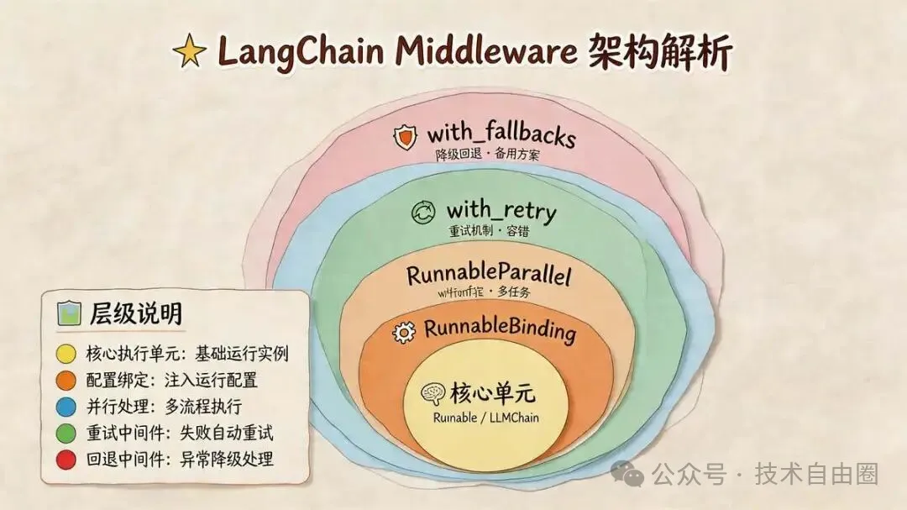

一、LangChain Middleware架构与源码解析

LangChain Middleware架构的核心是“Runnable包装器”模式——所有中间件本质上是接受一个老Runnable并返回一个新Runnable的函数/类，通过 `before` / `after` 钩子，在目标Runnable执行前后插入自定义逻辑。

这种架构整体遵循“纯洋葱模型”，与MyBatis的洋葱式责任链架构高度同源，二者均通过“层层嵌套包装”实现请求的双向穿透，而非传统链表式的顺序责任链。

MyBatis 的洋葱式责任链架构，请参见 尼恩的 深度架构文章：

[MyBatis圣经 3： 穿透 洋葱式chain“ 责任链模式+代理模式 “ 的 鬼斧神工 和 架构之美](https://mp.weixin.qq.com/s?__biz=MzkxNzIyMTM1NQ==&mid=2247506270&idx=1&sn=c8bdc9c6374d2f5e9251a1f994f584a6&scene=21#wechat_redirect)

LangChain Middleware架构整体遵循“洋葱模型”：请求从外层中间件逐层穿透，一直至核心Runnable，响应则从核心逐层回溯，每层中间件可独立处理请求/响应，且支持灵活组合。

这里需明确 ： **LangChain Middleware“洋葱模式责任链” 架构** 。LangChain Middleware与MyBatis一致，均采用“代理嵌套+反射传递”的洋葱式责任链，核心是通过层层包装实现请求与响应的双向处理，而非线性链表式的顺序传递。

## 1.1 LangChain Middleware核心定位

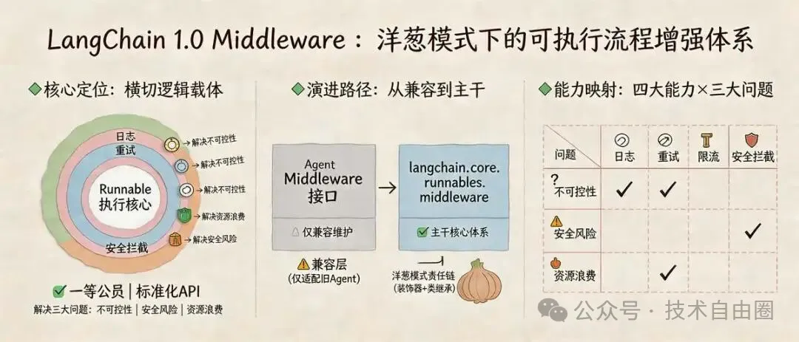

1.1 LangChain Middleware核心定位

LangChain 1.0正式引入Middleware（中间件）概念，将其定义为Runnable执行流程中的“横切逻辑载体”，与早期依赖RunnableLambda、回调函数的实现方式不同，LangChain 1.0版本的Middleware成为一等公民。

LangChain 1.0版本的Middleware，通过标准化的API实现日志、重试、限流、安全拦截等通用功能的复用，解决Agent执行过程中的不可控性、安全风险和资源浪费三大核心问题。

AgentMiddleware 接口是LangChain早期Agent中间件的兼容接口，而当前LangChain核心中间件体系，已迁移至 `langchain_core.runnables.middleware` 模块，形成了“洋葱模式责任链”（“装饰器+类继承”）的实现模式，支撑所有可执行组件（模型、Agent、链等）的流程拦截与增强。

## 1.2 LangChain Middleware “洋葱模式责任链” 架构核心设计

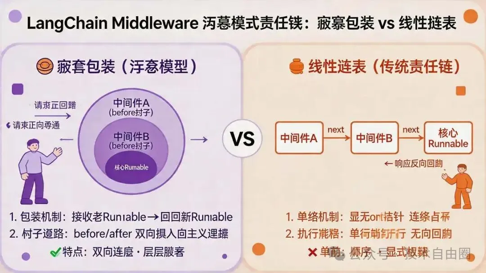

1.2 LangChain Middleware “洋葱模式责任链” 架构核心设计

洋葱模型的核心定义是“请求正向穿透、响应反向回溯”，每个中间件通过 **嵌套包装** 的方式形成层级结构，而 不是 通过显式next指针串联（顺序责任链 使用 next链表指针、 或者类似的数组 pos下标），这， 也是其与传统顺序责任链的核心区别。

LangChain Middleware的设计完全契合这一定义，其每个中间件都是Runnable的“ `before` / `after` 钩子”，核心Runnable是“最终处理节点”，中间件通过层层包裹实现逻辑织入，本质是责任链模式在Runnable执行流程中的具体化、精细化实现。

接下来，尼恩结合责任链模式的核心要素（抽象处理器、具体处理器、链的组装、请求传递），细致拆解LangChain Middleware洋葱责任链模式的对应实现，全程结合源码逻辑，明确每个责任链要素在LangChain中的具体体现，同时对比MyBatis洋葱责任链的共性与差异：

## 1.3. 洋葱模式 责任链模式核心要素 与LangChain Middleware的对应关系

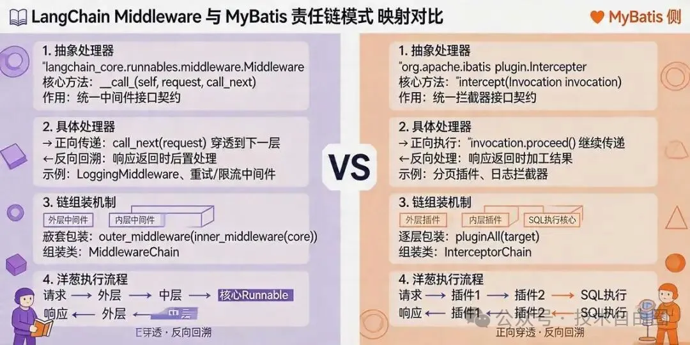

1.3. 洋葱模式 责任链模式核心要素 与LangChain Middleware的对应关系

责任链模式有4大核心要素，LangChain Middleware通过模块化设计，将每个要素落地为具体的源码组件，对应关系清晰，是责任链模式可扩展、可组合特性的核心支撑，同时与MyBatis的洋葱责任链实现高度呼应（括号内为MyBatis对应组件，便于对照理解）：

**(1) 抽象处理器（Abstract Handler）：对应LangChain中的 `langchain_core.runnables.middleware.Middleware` 抽象类（对应MyBatis的 `Interceptor` 接口），定义了所有中间件（具体处理器）的统一接口——必须实现 `__call__(self, request, call_next)` 方法。该方法是责任链中“处理请求”的核心接口，规定了每个中间件必须接收“请求（request）”和“下一个处理器的调用方法（call\_next）”，确保请求能在层级间传递，同时支持处理响应回溯，与MyBatis `Interceptor` 的 `intercept(Invocation invocation)` 方法异曲同工，均为责任链的统一入口。**

**(2) 具体处理器（Concrete Handler）：对应LangChain中所有具体的中间件实现，包括装饰器式中间件（如日志中间件）、类继承式中间件（如LoggingMiddleware），以及LangChain内置的重试、限流、摘要等中间件（对应MyBatis中实现 `Interceptor` 接口的具体插件）。每个具体中间件都实现了抽象处理器的 `__call__` 方法，负责处理特定的横切逻辑（如日志记录、token统计、安全拦截），同时通过 `call_next(request)` 将请求传递给下一层包装（MyBatis中通过 `invocation.proceed()` 实现），完成请求的正向穿透；响应返回时，再逐层回溯，由每个具体中间件处理响应（如修改响应内容、记录响应日志），形成“请求进、响应出”的双向处理链路。**

**(3) 链的组装（Chain Assembly）：对应LangChain中的 `MiddlewareChain` 类（对应MyBatis的 `InterceptorChain` 类），负责将多个具体中间件（具体处理器）按指定顺序组装成洋葱式层级结构，同时将层级的最内层指向核心Runnable（最终处理逻辑）。与传统顺序责任链“手动设置下一个处理器”不同，LangChain与MyBatis均通过“逐层包装”的方式组装链——LangChain中每个中间件嵌套包装下一个中间件，最终包装核心Runnable；MyBatis中通过 `InterceptorChain.pluginAll()` 方法，让每个插件依次包装目标对象，形成“外层中间件→内层中间件→核心Runnable”的嵌套结构，确保请求按组装顺序正向穿透、响应按反向顺序回溯。**

**(4) 请求传递（Request Delivery）：对应LangChain Middleware的“洋葱模型”执行流程（与MyBatis洋葱责任链执行流程完全一致），请求从最外层中间件开始，逐层通过 `call_next(request)` 传递，直到到达核心Runnable（最终处理节点）；核心Runnable执行完成后，生成响应，响应再从核心Runnable逐层回溯，经过每个具体中间件的处理（如响应日志、响应修改），最终返回给请求发起者。这种“正向请求、反向响应”的传递方式，是LangChain与MyBatis洋葱责任链模式的共同特色，也是洋葱模型与责任链模式的深度融合。**

## 二. LangChain Middleware 洋葱责任链模式的具体实现（结合源码）

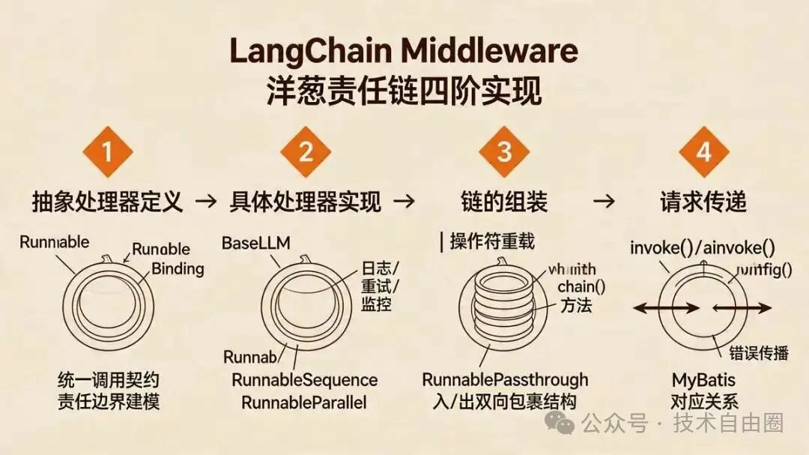

二. LangChain Middleware 洋葱责任链模式的具体实现（结合源码）

结合LangChain Middleware核心源码，从“抽象处理器定义→具体处理器实现→链的组装→请求传递”四个环节，细致拆解洋葱责任链模式的落地过程，明确每个环节的核心逻辑及与MyBatis洋葱责任链的对应关系：

## 2.1 抽象处理器（Middleware抽象类）：定义责任链统一接口

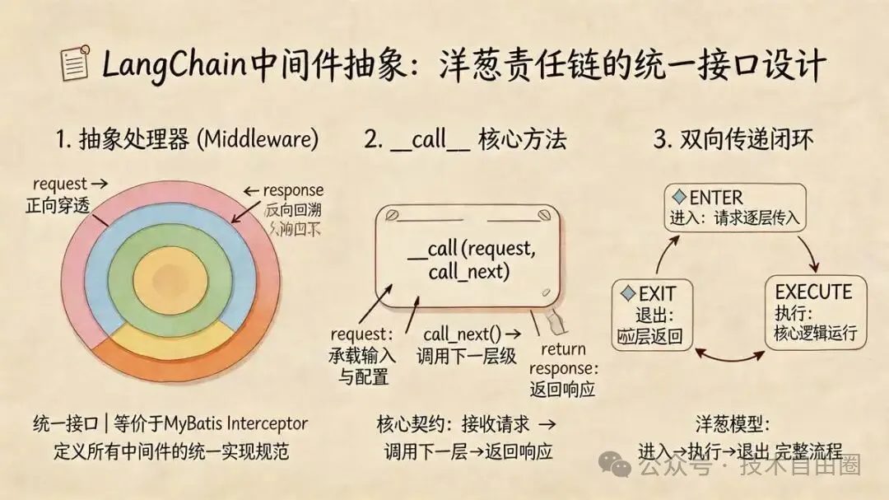

2.1 抽象处理器（Middleware抽象类）：定义责任链统一接口

LangChain通过 `Middleware` 抽象类，定义了洋葱责任链中所有具体处理器的统一规范，确保所有中间件都能融入嵌套层级，实现请求的统一传递，其作用等同于MyBatis的 `Interceptor` 接口，规定了中间件的核心实现规范。其核心源码（简化版）如下，重点关注 `__call__` 方法的定义——这是洋葱责任链处理器的核心接口：

```
from abc import ABC, abstractmethod
from langchain_core.runnables.middleware import Request
class Middleware(ABC):
    @abstractmethod
    async def call(self, request: Request, call_next):
        """
        洋葱责任链处理器的核心接口，每个具体中间件必须实现
        :param request: 请求对象，包含输入、配置等信息（责任链传递的请求数据）
        :param call_next: 调用下一层中间件/核心Runnable的方法（用于请求正向穿透）
        :return: 处理后的响应（支持响应反向回溯处理）
        """
        pass
```

源码解析（洋葱责任链视角）：该抽象类对应责任链模式的“抽象处理器”， `__call__` 方法是抽象处理方法，规定了每个具体中间件必须接收“请求”和“下一层调用方法”，确保请求能在洋葱层级间正向穿透；同时要求返回响应，支持响应回溯时的二次处理，这是洋葱责任链“双向传递”的基础，与MyBatis `Interceptor` 接口的 `intercept` 方法核心作用一致，均为定义中间件的统一执行规范。

## 2.2 具体处理器（具体中间件）：实现责任链的具体处理逻辑

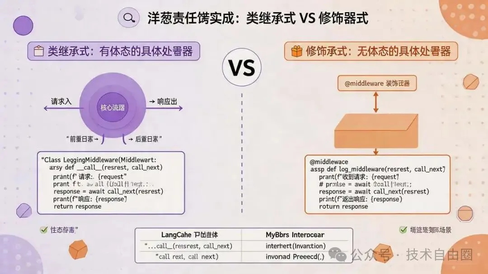

2.2 具体处理器（具体中间件）：实现责任链的具体处理逻辑

所有具体中间件（装饰器式、类继承式）都是“具体处理器”，实现抽象处理器的 `__call__` 方法，完成自身的横切逻辑处理，同时通过 `call_next(request)` 将请求传递给下一层，不中断洋葱层级的穿透，对应MyBatis中实现 `Interceptor` 接口的具体插件。

以下结合两种核心实现方式，拆解其洋葱责任链逻辑：

#### （1）类继承式中间件（复杂场景，如LoggingMiddleware）

对应洋葱责任链中“有状态的具体处理器”，适合需要维护状态（如重试次数、缓存数据）的场景，其作用等同于MyBatis中需要维护状态的插件（如重试插件），其源码及洋葱责任链解析如下：

```
from langchain_core.runnables.middleware import Middleware
class LoggingMiddleware(Middleware):
    async def call(self, request, call_next):
        # 1. 具体处理逻辑（洋葱正向穿透：请求执行前记录日志）
        print(f"请求开始：{request('input')}")
        # 2. 传递请求到下一层（洋葱层级穿透的核心：不中断链路）
        response = await call_next(request)
        # 3. 响应回溯处理（洋葱反向回溯：处理响应并返回上一层）
        print(f"请求结束：响应为{response}")
        return response
```

洋葱责任链视角解析：

- 该类继承 `Middleware` 抽象类，是洋葱责任链上的“具体处理器”，实现了抽象处理方法 `__call__` ，与MyBatis中插件实现 `Interceptor` 接口的 `intercept` 方法逻辑一致；
- 请求正向穿透时，先执行自身的处理逻辑（记录请求日志），再通过 `call_next(request)` 将请求传递给下一层中间件（或核心Runnable），不拦截请求（除非有特殊逻辑，如安全拦截中间件），对应MyBatis中插件执行前置逻辑后调用 `invocation.proceed()` ；
- 响应反向回溯时，先接收下一层返回的响应，再执行自身的响应处理逻辑（记录响应日志），然后将响应返回给上一层中间件，完成响应的逐层回溯，与MyBatis中插件在 `invocation.proceed()` 后执行后置逻辑并返回结果的流程完全一致。

#### （2）装饰器式中间件（基础场景，如log\_middleware）

对应洋葱责任链中“无状态的具体处理器”，通过 `@middleware` 装饰器快速实现，本质是对抽象处理器接口的简化实现，等同于MyBatis中无需维护状态、逻辑简单的插件（如简单日志插件），其源码及洋葱责任链解析如下：

```
from langchain_core.runnables.middleware import middleware
@middleware
async def log_middleware(request, call_next):
    # 具体处理逻辑：请求正向穿透前记录输入
    print(f"Input: {request('input')}")
    # 传递请求到下一层
    response = await call_next(request)
    # 响应反向回溯时记录输出
    print(f"Output: {response}")
    return response
```

洋葱责任链视角解析：

- `@middleware` 装饰器的核心作用，是将普通函数包装成 `Middleware` 抽象类的实现类，本质是“简化版的具体处理器”，无需手动继承抽象类，即可实现洋葱责任链处理器的核心逻辑，类似于MyBatis中通过简化方式实现 `Interceptor` 接口的插件；
- 其执行逻辑与类继承式中间件一致：请求正向穿透时处理请求、传递请求，响应反向回溯时处理响应、返回响应，完全符合洋葱责任链模式的具体处理器要求，与MyBatis插件的执行逻辑同源；
- 这种实现方式更简洁，适合简单的横切逻辑（如日志、耗时统计），是洋葱责任链模式“可扩展”特性的体现——快速新增具体处理器，无需修改原有层级结构，与MyBatis新增插件无需修改核心源码的设计理念一致。

## 2.3 洋葱链的组装（MiddlewareChain）：构建洋葱责任链的完整结构

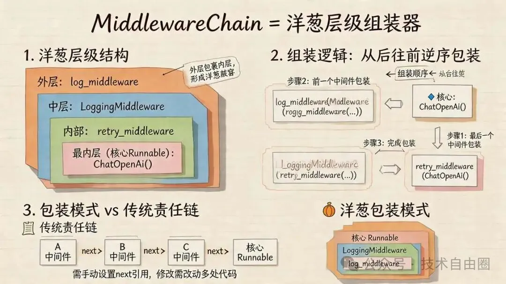

2.3 洋葱链的组装（MiddlewareChain）：构建洋葱责任链的完整结构

洋葱责任链模式的核心是“层级组装”，LangChain通过 `MiddlewareChain` 类，将多个具体中间件（具体处理器）按指定顺序组装成嵌套层级，同时将层级的最内层指向核心Runnable（最终处理节点），形成完整的洋葱结构，其作用等同于MyBatis的 `InterceptorChain` 类，负责插件的层级包装与顺序管理。

> *尼恩提示：原文3w字以上， 超过平台限制， 此处省略 1000字，具体请参考 免费pdf。*
> 
> *完整版本，请参考 尼恩 免费百度网盘 免费pdf ，点赞收藏本文后，找尼恩微信获取*

## 2.4 洋葱模型 责任链 如何 请求传递 ：责任链的执行流程

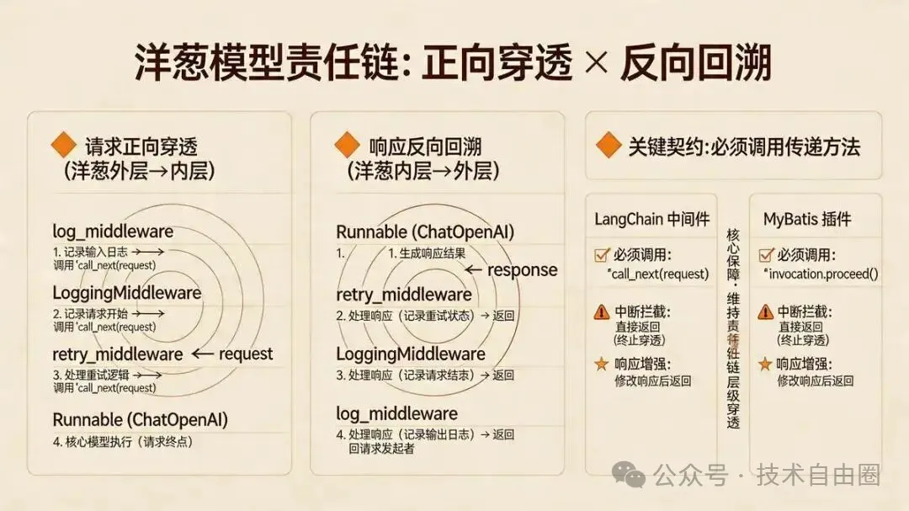

2.4 洋葱模型 责任链 如何 请求传递 ：责任链的执行流程

LangChain Middleware洋葱责任链的执行流程，完全等同于MyBatis洋葱责任链的执行流程，即“正向请求穿透、反向响应回溯”，结合上述组装的洋葱结构，其执行流程（洋葱责任链视角）如下，对应源码的实际执行逻辑，同时对比MyBatis的执行流程：

> *尼恩提示：原文3w字以上， 超过平台限制， 此处省略 1000字，具体请参考 免费pdf。*
> 
> *完整版本，请参考 尼恩 免费百度网盘 免费pdf ，点赞收藏本文后，找尼恩微信获取*

关键说明：洋葱责任链中，“请求传递”的核心是“不中断层级穿透”，LangChain中每个具体中间件都必须调用 `call_next(request)` （除非有特殊拦截逻辑，如安全拦截中间件判断请求非法，直接返回错误响应，中断层级穿透），这是洋葱责任链能正常执行的核心保障，与MyBatis中插件必须调用 `invocation.proceed()` 的要求一致；同时，响应回溯时，每个中间件都可修改响应内容，实现响应的增强或修正，体现了洋葱责任链模式的灵活性，与MyBatis插件可修改响应结果的特性一致。

## 2.5. 洋葱责任链模式在LangChain Middleware中的优势体现（对比MyBatis）

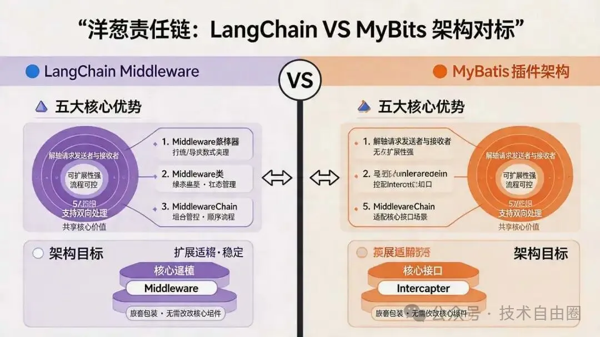

2.5. 洋葱责任链模式在LangChain Middleware中的优势体现（对比MyBatis）

其架构核心依赖三大组件，对应源码核心逻辑，同时对比MyBatis的对应组件，便于深度理解：

**(1) Middleware装饰器：核心是 `langchain_core.runnables.middleware.middleware` 装饰器，支持同步/异步函数，接收 `request` （包含输入、配置等）和 `call_next` （调用下一层中间件/核心Runnable）两个参数，是最简洁的中间件实现方式，对应MyBatis中无需复杂状态管理的简单插件实现。**

**(2) Middleware类：继承 `langchain_core.runnables.middleware.Middleware` 抽象类，实现 `__call__` 方法，适合复杂状态管理场景，可封装更灵活的拦截逻辑，对应MyBatis中需要维护状态、逻辑复杂的插件（如重试、分页插件）。**

**(3) MiddlewareChain：用于组合多个中间件，按顺序将中间件嵌套应用于同一个Runnable，解决多中间件的执行顺序管控问题，避免手动组合的冗余代码，对应MyBatis的 `InterceptorChain` 类，负责插件的层级包装与顺序管理。**

## 2.4 LangChain Middleware核心特性

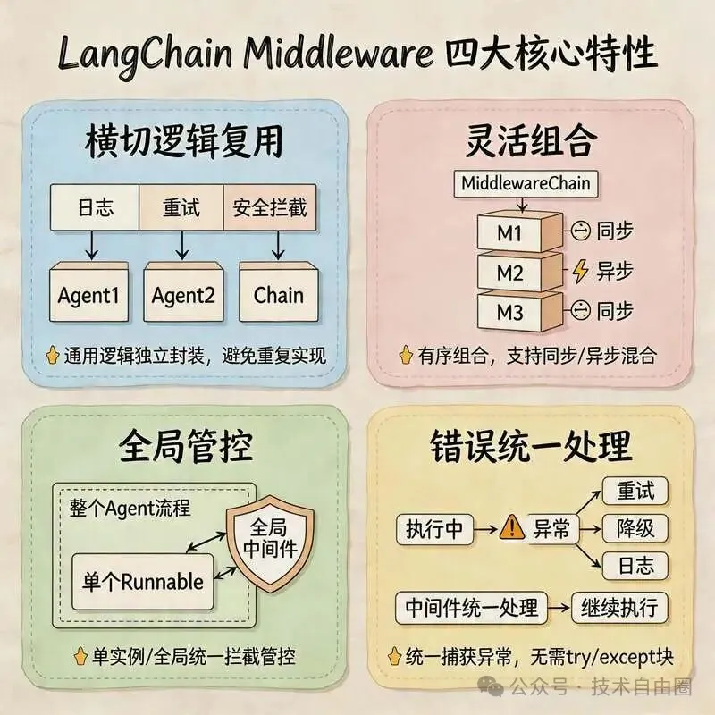

2.4 LangChain Middleware核心特性

LangChain Middleware的设计核心是“可组合、可扩展、类型安全”，其核心特性可总结为：

- 横切逻辑复用：将日志、重试、安全拦截等通用逻辑独立封装，避免在每个Agent/Chain中重复实现。
- 灵活组合：通过MiddlewareChain实现多中间件有序组合，支持同步/异步混合使用。
- 全局管控：可应用于单个Runnable，也可全局配置，实现对整个Agent流程的统一拦截。
- 错误统一处理：中间件可统一捕获执行过程中的异常，实现重试、降级等容错逻辑，无需在核心业务代码中编写try/except块。

## 三、DeerFlow最新源码解析：14层洋葱中间件层

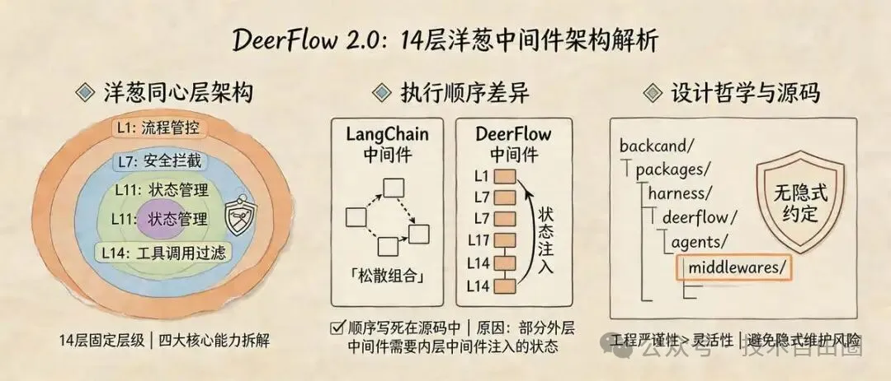

三、DeerFlow最新源码解析：14层洋葱中间件层

DeerFlow 2.0（最新版本）作为基于LangGraph和LangChain重构的超级Agent框架，其Middleware中间件层在LangChain中间件架构的基础上，进行了深度定制和扩展，采用严格有序的14层洋葱中间件设计，将流程管控、安全拦截、状态管理、工具调用过滤四大核心能力拆解为独立中间件，每个中间件仅负责一个“横切关注点”，通过固定的执行顺序保障流程有序性与系统稳定性，其核心源码集中在 `backend/packages/harness/deerflow/agents/middlewares/` 目录下。

与LangChain中间件的“松散组合”不同，DeerFlow的14层中间件执行顺序是写死在源码中的，顺序错误会直接导致功能异常。

为啥呢？ 因为DeerFlow 2.0 部分中间件存在依赖关系， 比如，部分外层中间件需要内层中间件注入的状态。

这种设计看似“僵硬”，实则避免了隐式约定带来的维护风险，体现了工程化设计的严谨性。

## 3.1 DeerFlow 14层洋葱中间件核心设计理念

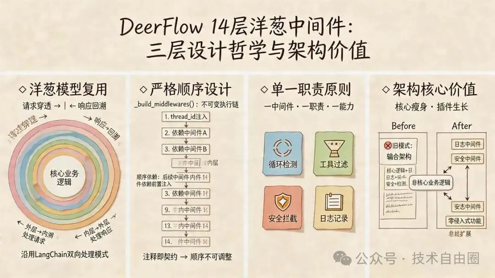

3.1 DeerFlow 14层洋葱中间件核心设计理念

DeerFlow中间件层的核心设计遵循“洋葱模型+严格顺序+单一职责”三大原则：

**(1) 洋葱模型复用：完全沿用LangChain中间件的“请求穿透、响应回溯”模式，14层中间件从外到内逐层处理请求，从内到外逐层处理响应，每层可独立拦截、修改请求/响应，或执行辅助逻辑。**

**(2) 严格顺序设计：14层中间件的执行顺序由 `_build_middlewares()` 函数固定，顺序依赖源于中间件的职责关联（如依赖thread\_id的中间件，必须在注入thread\_id的中间件之后执行），源码中通过注释明确标注顺序要求，避免顺序调整导致的bug。**

**(3) 单一职责原则：每个中间件仅负责一项核心任务，不跨领域处理逻辑，例如“循环检测”“工具过滤”“安全拦截”分别由独立中间件实现，便于维护和扩展，也符合LangChain中间件的设计思想。**

其核心价值的是：将Agent执行过程中的所有非核心业务逻辑（如日志、安全、状态管理）剥离到中间件层，让核心业务逻辑（任务调度、工具执行）更简洁，同时通过中间件的组合的实现“插件化”扩展，无需修改核心代码即可新增功能。

## 3.2 DeerFlow中间件层与LangChain中间件的关联与差异

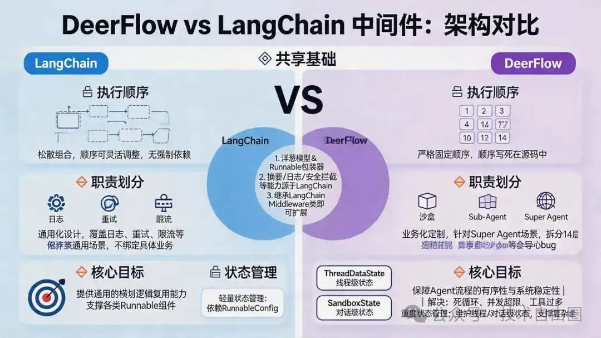

3.2 DeerFlow中间件层与LangChain中间件的关联与差异

### 3.2.1 关联点

- 核心模型复用：均采用“洋葱模型”和“Runnable包装器”设计，中间件通过 `call_next` 衔接下一层逻辑，保持流程连贯性。
- 核心能力对齐：DeerFlow的中间件能力（如摘要、日志、安全拦截）均源于LangChain中间件的设计理念，部分中间件（如SummarizationMiddleware）直接基于LangChain的实现进行适配。
- 可扩展性一致：均支持自定义中间件，DeerFlow可通过继承LangChain的Middleware类，快速新增自定义中间件，复用LangChain的核心API。

### 3.2.2 核心差异

| **对比维度** | **LangChain Middleware** | **DeerFlow 14层中间件** |
| --- | --- | --- |
| 执行顺序 | 松散组合，顺序可灵活调整，无强制依赖 | 严格固定顺序，顺序写死在源码中，依赖关系明确，顺序错误会导致bug |
| 职责划分 | 通用化设计，覆盖日志、重试、限流等通用场景，不绑定具体业务 | 业务化定制，针对Super Agent场景，拆分14层细粒度职责，绑定沙盒、Sub-Agent等DeerFlow核心功能 |
| 核心目标 | 提供通用的横切逻辑复用能力，支撑各类Runnable组件 | 保障Agent流程的有序性与系统稳定性，解决Super Agent场景中的具体问题（如死循环、并发超限、工具过多） |
| 状态管理 | 轻量状态管理，主要依赖RunnableConfig传递配置 | 重度状态管理，通过ThreadDataState、SandboxState等维护线程级、对话级状态，支撑复杂场景 |

## 3.4 DeerFlow中间件层的核心价值（结合源码实践）

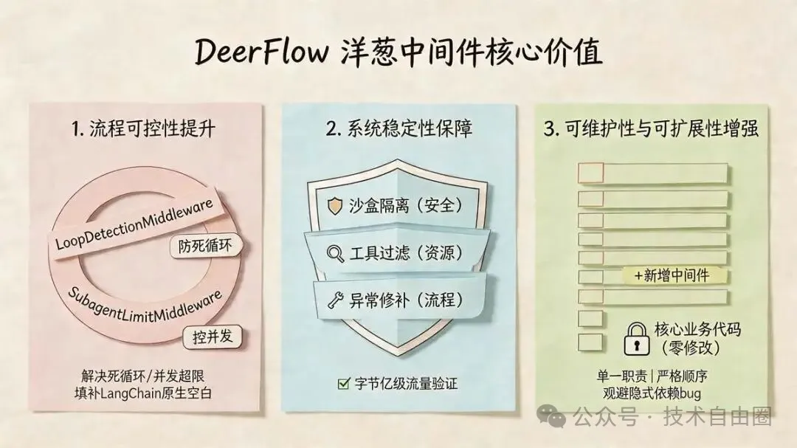

3.4 DeerFlow中间件层的核心价值（结合源码实践）

从DeerFlow最新源码来看，14层洋葱中间件层是其核心竞争力之一，其价值主要体现在三个方面：

**(1) 流程可控性提升：通过LoopDetectionMiddleware、SubagentLimitMiddleware等，解决了Agent执行过程中的死循环、并发超限等痛点，确保流程按预期推进，这也是LangChain原生中间件未充分覆盖的场景。**

**(2) 系统稳定性保障：沙盒隔离、工具过滤、异常修补等中间件，从安全、资源、流程三个维度构建防护，避免因工具调用不当、代码执行风险、状态异常导致的系统崩溃，已通过字节内部亿级流量验证。**

**(3) 可维护性与可扩展性增强：单一职责的中间件设计，让源码结构更清晰，新增功能（如新增安全拦截规则）可通过新增中间件实现，无需修改核心业务代码；严格的顺序设计，降低了维护成本，避免隐式依赖导致的bug。**

## 四：DeerFlow 14层洋葱中间件详细解析 + 深度解析

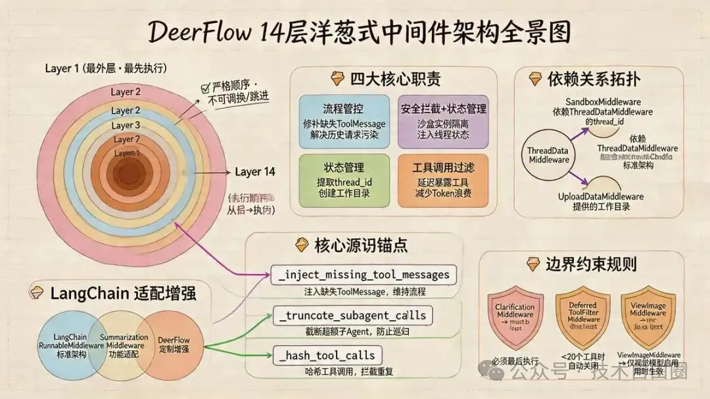

四：DeerFlow 14层洋葱中间件详细解析 + 深度解析

DeerFlow最新源码中，14层中间件按“从外到内”的执行顺序排列，每层中间件的职责、源码核心逻辑如下（结合GitHub最新源码及官方解析），其中加粗部分为核心职责，对应流程管控、安全拦截、状态管理、工具调用过滤四大能力：

| **层级** | **中间件名称（源码类名）** | **核心职责（结合源码）** | **源码核心逻辑摘要** |
| --- | --- | --- | --- |
| 1 | DanglingToolCallMiddleware | **流程管控** ：修补缺失的ToolMessage，解决LangChain历史请求污染问题，避免因用户中断等原因导致的工具调用状态异常 | 拦截Agent的AIMessage，检查是否存在未响应的tool\_calls，若存在则注入占位ToolMessage，确保流程不中断，源码核心是 `_inject_missing_tool_messages` 方法。 |
| 2 | SandboxMiddleware | **安全拦截+状态管理** ：为当前线程获取/创建沙盒实例，注入沙盒状态到ThreadState，提供代码执行的安全隔离环境 | 通过 `sandbox_provider` 获取沙盒实例，将沙盒ID写入SandboxState，确保每个线程的代码执行在独立沙盒中，避免安全风险，依赖ThreadDataMiddleware注入的thread\_id。 |
| 3 | ThreadDataMiddleware | **状态管理** ：提取thread\_id，创建线程隔离的工作目录（workspace、uploads、outputs），为后续中间件提供基础状态 | 从请求中提取thread\_id，初始化ThreadDataState，写入工作目录路径，是依赖thread\_id的中间件（如SandboxMiddleware、UploadsMiddleware）的基础。 |
| 4 | UploadsMiddleware | **状态管理** ：处理文件上传，将新上传的文件注入对话上下文，同步更新线程隔离目录中的文件 | 对比上传文件状态与磁盘目录差异，将新文件列表以结构化文本形式追加到HumanMessage中，确保文件信息能被Agent识别，依赖ThreadDataMiddleware提供的工作目录。 |
| 5 | SummarizationMiddleware | **流程管控** ：上下文接近token上限时，自动触发摘要压缩，避免token超限导致的执行失败，优化上下文管理 | 监控对话上下文的token数量，达到阈值时调用模型生成摘要，替换原始上下文，保留核心信息，可选配置摘要模型、token阈值等参数，与LangChain的SummarizationMiddleware功能一致但做了适配。 |
| 6 | TodoMiddleware | **流程管控** ：plan模式下提供write\_todos工具，跟踪多步骤任务，确保复杂任务的流程有序推进 | 在plan模式下注入write\_todos工具，记录任务步骤，同步更新任务状态，便于Agent跟踪多步骤任务的执行进度，可选启用（默认关闭）。 |
| 7 | TokenUsageMiddleware | **状态管理** ：统计Agent执行过程中的token使用量，记录模型调用的token消耗，用于成本管控和监控 | 拦截模型调用请求/响应，统计输入/输出token数量，写入TokenUsageState，支持多模型token统计，为成本管控提供数据支撑，核心是 `_update_token_usage` 方法。 |
| 8 | TitleMiddleware | **状态管理** ：首次对话后自动生成对话标题，同步更新对话状态，提升对话可识别性 | 监听首次HumanMessage与AIMessage的交互，调用模型生成对话标题，写入ConversationState，避免手动设置标题的繁琐操作。 |
| 9 | MemoryMiddleware | **状态管理** ：将对话内容入队，异步更新结构化记忆，支撑Agent的长期记忆能力 | 收集对话历史（HumanMessage、AIMessage、ToolMessage），入队后异步写入记忆存储，过滤无效消息，确保记忆的准确性和时效性，核心是 `_queue_memory_update` 方法。 |
| 10 | ViewImageMiddleware | **状态管理** ：针对视觉模型，将图片数据注入对话上下文，支撑图文交互场景 | 检测对话中的图片信息，将图片数据（如base64编码）转换为模型可识别的格式，注入上下文，仅在视觉模型启用时生效，是条件性中间件。 |
| 11 | DeferredToolFilterMiddleware | **工具调用过滤** ：工具数量过多时延迟暴露工具，配合tool\_search工具实现按需检索，避免token浪费和工具选择准确率下降 | 核心是“工具检索增强”，Agent启动时不暴露所有工具，仅提供tool\_search工具，LLM需先检索工具再调用；工具数量<20个时自动关闭该功能，自适应不同场景，本质是将RAG思路应用于工具层。 |
| 12 | SubagentLimitMiddleware | **流程管控+安全拦截** ：控制Sub-Agent的并发数量，截断超上限的task()调用，避免服务器资源耗尽 | 限制单次响应中task()工具的最大并发数（默认3个），若LLM调用的Sub-Agent数量超出上限，自动截断超出部分，同时禁止Sub-Agent获取task()工具，防止递归派生孙Agent，核心是 `_truncate_subagent_calls` 方法。 |
| 13 | LoopDetectionMiddleware | **流程管控** ：通过滑动窗口Hash检测重复工具调用，避免Agent陷入死循环，保障流程有序推进 | 对每次工具调用集合进行归一化（保留name+args并排序），计算Hash值，跟踪最近20次调用记录；连续3次重复注入警告，连续5次重复强制剥离所有tool\_calls，逼LLM输出最终答案，核心是 `_hash_tool_calls` 方法。 |
| 14 | ClarificationMiddleware | **流程管控** ：拦截ask\_clarification工具调用，中断执行并引导用户澄清需求，必须作为最后一层（避免拦截后续中间件逻辑） | 监听tool\_calls中的ask\_clarification请求，一旦检测到则通过 `command(go_to=end)` 中断执行，提示用户补充需求，源码中明确标注“must be last”，确保不会拦截其他中间件的核心逻辑。 |

接下来， 将严格按照中间件 **执行优先级+功能分类** ，从 **源码结构、核心方法、执行逻辑、依赖关系、边界场景** 五个核心维度，逐一对14个中间件进行可落地的源码级解析。

解析全程贴合LangChain RunnableMiddleware标准架构，还原中间件真实实现逻辑，明确各组件的作用、交互关系及底层原理，助力开发者理解Agent中间件链路的完整运行机制。

## 4.0、DeerFlow 14个 中间件总执行顺序（真实运行链路）

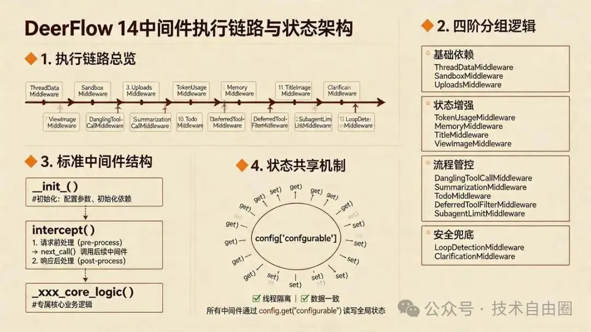

4.0、DeerFlow 14个 中间件总执行顺序（真实运行链路）

本次解析的14个中间件，均遵循LangChain RunnableMiddleware标准接口，所有中间件的核心结构保持统一，便于扩展和维护。

同时，所有中间件共享线程状态（ThreadState），统一通过 `config.get("configurable")` 方法读写全局状态，确保线程安全和数据一致性。

中间件的执行顺序严格遵循“基础依赖→状态增强→流程管控→安全兜底”的逻辑，不可颠倒，具体链路（从上到下，依次执行）如下：

**ThreadDataMiddleware → SandboxMiddleware → UploadsMiddleware → TokenUsageMiddleware → MemoryMiddleware → TitleMiddleware → ViewImageMiddleware → DanglingToolCallMiddleware → SummarizationMiddleware → TodoMiddleware → DeferredToolFilterMiddleware → SubagentLimitMiddleware → LoopDetectionMiddleware → ClarificationMiddleware**

### 4.0.1 中间件标准结构

所有中间件均继承自BaseMiddleware，核心包含初始化方法、拦截方法及专属核心逻辑方法，标准代码模板如下：

```
class XXXMiddleware(BaseMiddleware):
    # 初始化方法：用于配置参数、定义状态依赖、初始化工具/存储等
    def init(self, ...):
        pass
    # 核心拦截方法：中间件的核心入口，负责请求前/响应后处理，串联后续中间件
    def intercept(
        self,
        runnable: Runnable,  # 当前执行的可运行实例（Agent/工具/其他中间件）
        config: RunnableConfig,  # 全局配置，用于传递线程状态、参数等
        *,
        next_call: NextCallable  # 调用下一个中间件/原始逻辑的回调函数
    ) -> Any:
        # 1. 请求前处理（pre-process）：如参数校验、状态注入、工具准备等
        # 2. 调用下一个中间件/原始逻辑，获取响应结果
        response = next_call(runnable, config)
        # 3. 响应后处理（post-process）：如结果统计、状态更新、异常处理等
        return response
    # 工具/消息专用拦截方法（Agent中间件独有）：处理特定业务逻辑（如工具调用、消息过滤）
    def _xxx_core_logic(self, ...):
        pass
```

### 4.0.2 状态共享机制

所有中间件的状态均存储在 `config["configurable"]` 中，包括线程信息、沙盒状态、Token统计、对话记忆等。这种设计确保了所有中间件能共享同一套全局状态，避免数据冗余，同时实现线程隔离，保证多线程场景下的安全性。

## 4.1 ThreadDataMiddleware（基础状态根中间件）中间件源码级解析

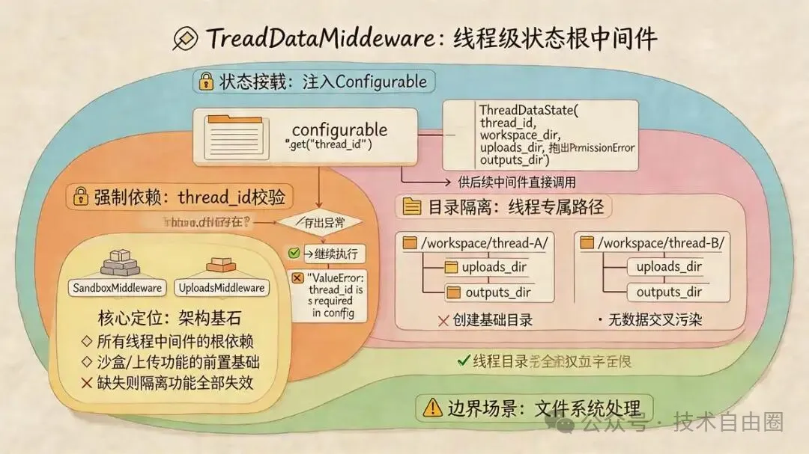

4.1 ThreadDataMiddleware（基础状态根中间件）中间件源码级解析

#### 核心定位

**状态管理·根依赖** ：所有需要 `thread_id` 、文件目录的中间件（如SandboxMiddleware、UploadsMiddleware）的基础前置中间件，是整个中间件链路的“基石”——无此中间件，文件上传、沙盒隔离、线程级状态管理等功能全部失效。

> *尼恩提示：原文3w字以上， 超过平台限制， 此处省略 1000字，具体请参考 免费pdf。*
> 
> *完整版本，请参考 尼恩 免费百度网盘 免费pdf ，点赞收藏本文后，找尼恩微信获取*

## 4.2 SandboxMiddleware（安全沙盒中间件）

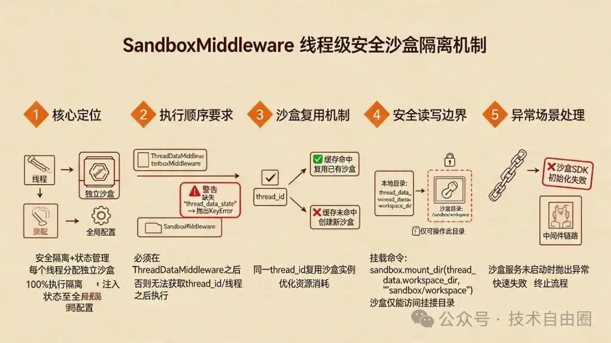

4.2 SandboxMiddleware（安全沙盒中间件）

#### 核心定位

**安全拦截+状态管理** ：为每个线程分配独立的沙盒实例，实现代码执行的100%隔离，防止不同线程的代码执行相互干扰，同时注入沙盒状态到全局配置，供后续工具调用使用。

> *尼恩提示：原文3w字以上， 超过平台限制， 此处省略 1000字，具体请参考 免费pdf。*
> 
> *完整版本，请参考 尼恩 免费百度网盘 免费pdf ，点赞收藏本文后，找尼恩微信获取*

## 4.3 UploadsMiddleware（上传文件中间件）

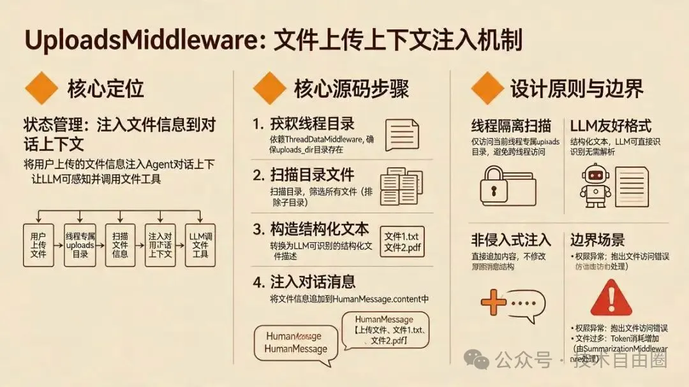

4.3 UploadsMiddleware（上传文件中间件）

#### 核心定位

**状态管理** ：处理用户上传的文件，扫描线程专属上传目录，将新上传的文件信息注入Agent对话上下文，让LLM（大语言模型）能够“看见”上传的文件，支撑文件相关的工具调用（如读取文件、解析文件）。

> *尼恩提示：原文3w字以上， 超过平台限制， 此处省略 1000字，具体请参考 免费pdf。*
> 
> *完整版本，请参考 尼恩 免费百度网盘 免费pdf ，点赞收藏本文后，找尼恩微信获取*

## 4.4 TokenUsageMiddleware（Token统计中间件）

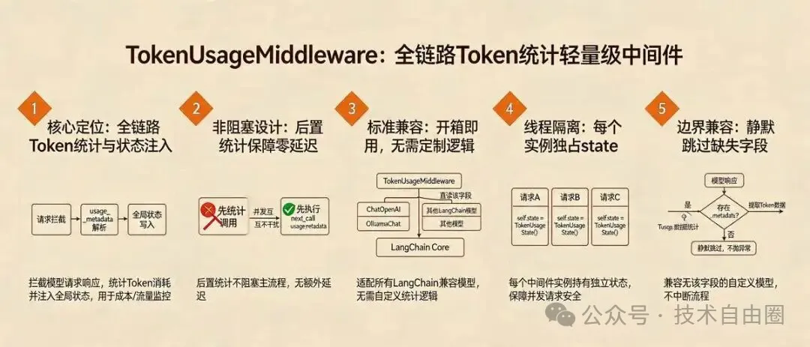

4.4 TokenUsageMiddleware（Token统计中间件）

#### 核心定位

**状态管理** ：全链路拦截模型调用请求和响应，精准统计模型执行过程中的输入Token（prompt\_tokens）、输出Token（completion\_tokens）及总Token消耗，将统计结果注入全局状态，用于成本管控、流量监控和性能优化。

> *尼恩提示：原文3w字以上， 超过平台限制， 此处省略 1000字，具体请参考 免费pdf。*
> 
> *完整版本，请参考 尼恩 免费百度网盘 免费pdf ，点赞收藏本文后，找尼恩微信获取*

## 3.5 MemoryMiddleware（长期记忆中间件）

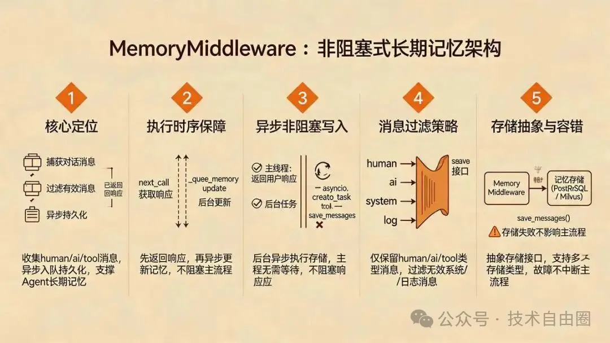

3.5 MemoryMiddleware（长期记忆中间件）

#### 核心定位

**状态管理** ：收集对话过程中的有效消息（用户消息、AI消息、工具消息），异步入队并持久化到记忆存储（数据库/向量库），支撑Agent的长期记忆能力，让Agent能够记住历史对话内容，实现连贯的多轮交互。

> *尼恩提示：原文3w字以上， 超过平台限制， 此处省略 1000字，具体请参考 免费pdf。*
> 
> *完整版本，请参考 尼恩 免费百度网盘 免费pdf ，点赞收藏本文后，找尼恩微信获取*

## 4.6 TitleMiddleware（对话标题中间件）

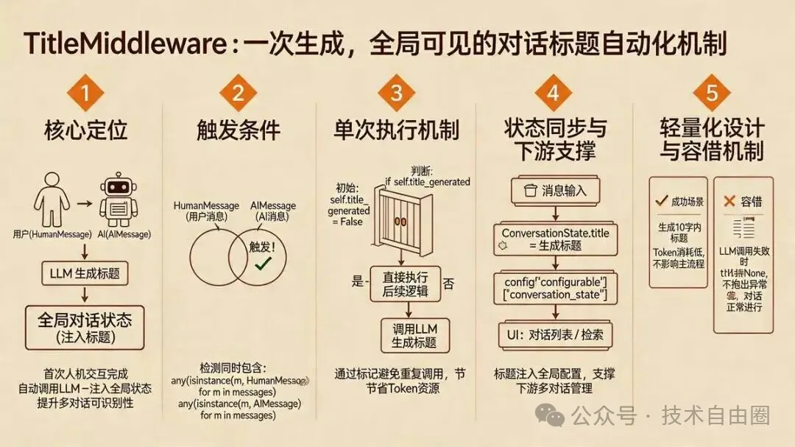

4.6 TitleMiddleware（对话标题中间件）

#### 核心定位

**状态管理** ：在首次人机交互完成后，自动调用LLM生成对话标题，将标题注入全局对话状态，提升对话的可识别性，避免手动设置标题的繁琐操作（适用于多对话管理场景）。

> *尼恩提示：原文3w字以上， 超过平台限制， 此处省略 1000字，具体请参考 免费pdf。*
> 
> *完整版本，请参考 尼恩 免费百度网盘 免费pdf ，点赞收藏本文后，找尼恩微信获取*

## 4.7 ViewImageMiddleware（视觉模型中间件）

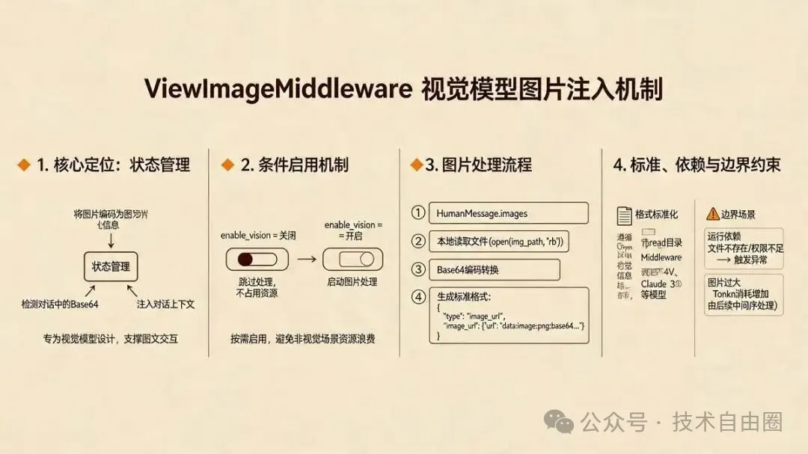

4.7 ViewImageMiddleware（视觉模型中间件）

#### 核心定位

**状态管理** ：专门用于视觉模型场景，检测对话中的图片信息，将图片数据（如本地图片路径）转换为模型可识别的格式（Base64编码），注入对话上下文，支撑图文交互场景（如图片识别、图文问答）。

> *尼恩提示：原文3w字以上， 超过平台限制， 此处省略 1000字，具体请参考 免费pdf。*
> 
> *完整版本，请参考 尼恩 免费百度网盘 免费pdf ，点赞收藏本文后，找尼恩微信获取*

## 4.8 DanglingToolCallMiddleware（悬空工具修复中间件）

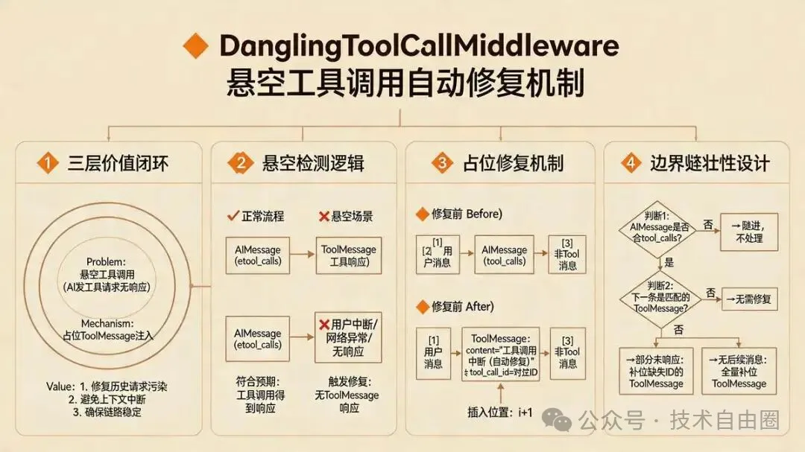

4.8 DanglingToolCallMiddleware（悬空工具修复中间件）

#### 核心定位

**流程管控** ：修复因用户中断、网络异常等原因导致的“悬空工具调用”（即AI发送了工具调用请求，但未收到工具响应），解决LangChain历史请求污染问题，避免工具调用状态异常，确保中间件链路不中断。

> *尼恩提示：原文3w字以上， 超过平台限制， 此处省略 1000字，具体请参考 免费pdf。*
> 
> *完整版本，请参考 尼恩 免费百度网盘 免费pdf ，点赞收藏本文后，找尼恩微信获取*

## 4.9 SummarizationMiddleware（上下文压缩中间件）

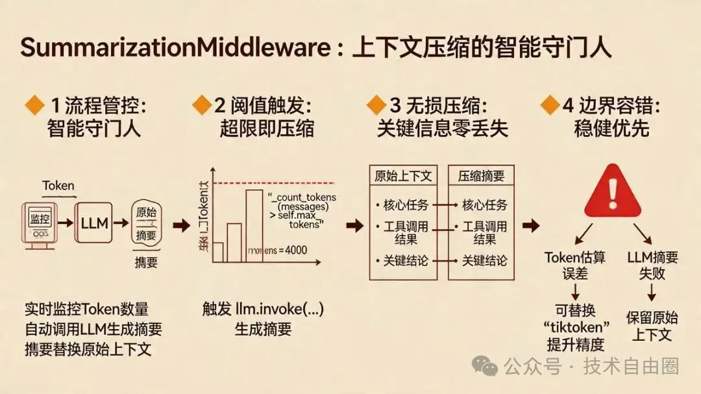

4.9 SummarizationMiddleware（上下文压缩中间件）

#### 核心定位

**流程管控** ：实时监控对话上下文的Token数量，当Token数量接近设定上限时，自动调用LLM生成对话摘要，用摘要替换原始上下文，保留核心信息，避免Token超限导致的模型调用失败，优化长对话的上下文管理。

> *尼恩提示：原文3w字以上， 超过平台限制， 此处省略 1000字，具体请参考 免费pdf。*
> 
> *完整版本，请参考 尼恩 免费百度网盘 免费pdf ，点赞收藏本文后，找尼恩微信获取*

## 4.10 TodoMiddleware（任务跟踪中间件）

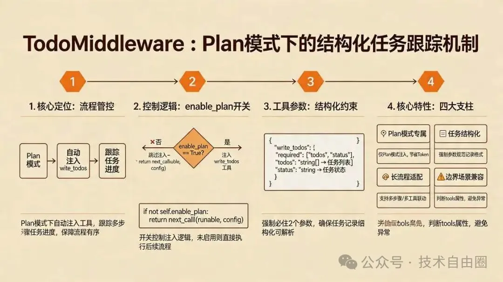

4.10 TodoMiddleware（任务跟踪中间件）

#### 核心定位

**流程管控** ：在Plan模式（多步骤任务模式）下，自动注入 `write_todos` 工具，让LLM能够记录多步骤任务的执行步骤，跟踪任务进度，确保复杂任务（如多工具联动、多步骤分析）的流程有序推进。

> *尼恩提示：原文3w字以上， 超过平台限制， 此处省略 1000字，具体请参考 免费pdf。*
> 
> *完整版本，请参考 尼恩 免费百度网盘 免费pdf ，点赞收藏本文后，找尼恩微信获取*

## 4.12 SubagentLimitMiddleware（子Agent限流中间件）

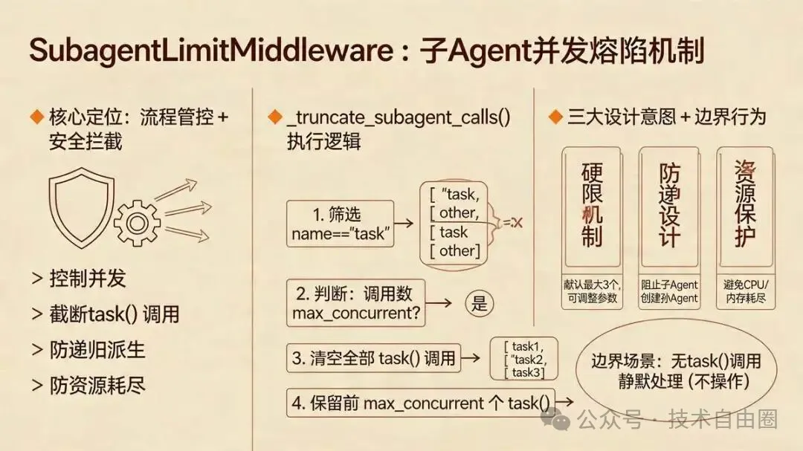

4.12 SubagentLimitMiddleware（子Agent限流中间件）

#### 核心定位

**流程管控+安全拦截** ：控制Sub-Agent（子Agent）的并发数量，截断超出上限的 `task()` 工具调用（ `task()` 用于创建子Agent），避免子Agent递归派生（如子Agent创建孙Agent），防止服务器资源被耗尽。

> *尼恩提示：原文3w字以上， 超过平台限制， 此处省略 1000字，具体请参考 免费pdf。*
> 
> *完整版本，请参考 尼恩 免费百度网盘 免费pdf ，点赞收藏本文后，找尼恩微信获取*

## 4.13 LoopDetectionMiddleware（死循环检测中间件）

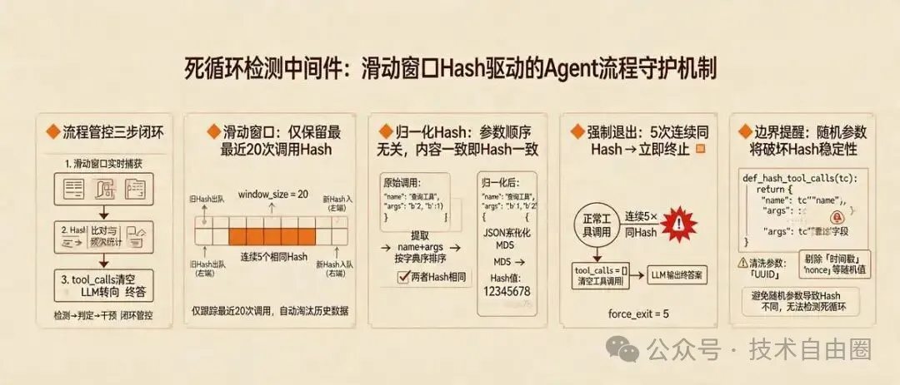

4.13 LoopDetectionMiddleware（死循环检测中间件）

#### 核心定位

**流程管控** ：通过滑动窗口Hash算法，检测Agent是否陷入重复工具调用的死循环（如反复调用同一工具、传递相同参数），当检测到死循环时，强制剥离工具调用，逼LLM输出最终答案，保障中间件链路有序推进。

> *尼恩提示：原文3w字以上， 超过平台限制， 此处省略 1000字，具体请参考 免费pdf。*
> 
> *完整版本，请参考 尼恩 免费百度网盘 免费pdf ，点赞收藏本文后，找尼恩微信获取*

## 4.14 ClarificationMiddleware（需求澄清中间件·最后一层）

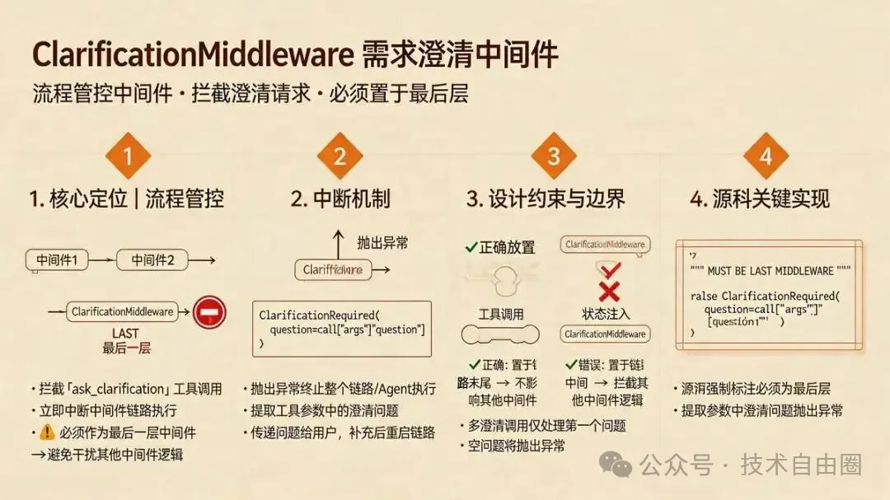

4.14 ClarificationMiddleware（需求澄清中间件·最后一层）

#### 核心定位

**流程管控** ：专门拦截 `ask_clarification` 工具调用（用于请求用户澄清模糊需求），一旦检测到该工具调用，立即中断中间件链路执行，引导用户补充需求。 **必须作为最后一层中间件** ，避免拦截其他中间件的核心逻辑。

> *尼恩提示：原文3w字以上， 超过平台限制， 此处省略 1000字，具体请参考 免费pdf。*
> 
> *完整版本，请参考 尼恩 免费百度网盘 免费pdf ，点赞收藏本文后，找尼恩微信获取*

## 五、整体架构总结

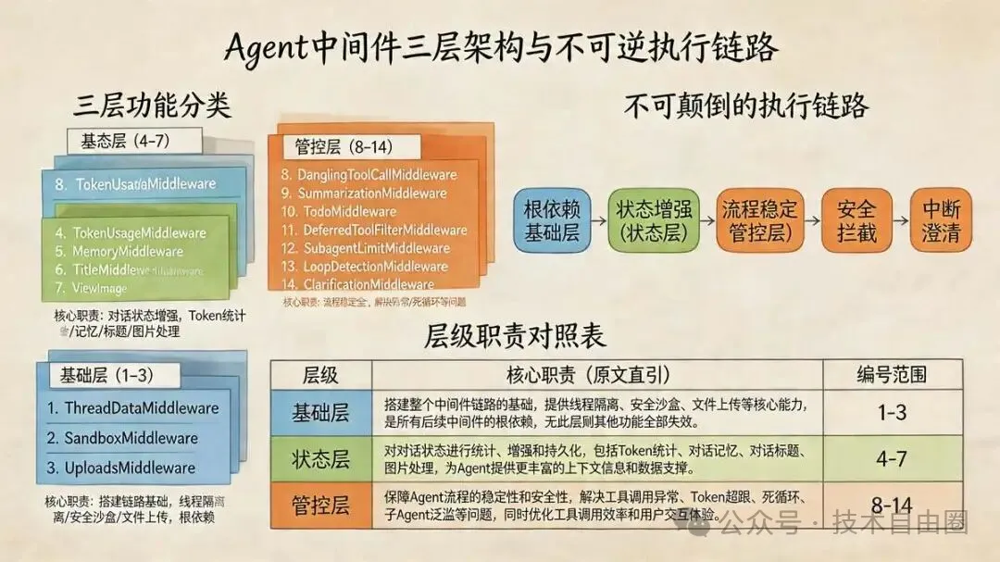

14个中间件按功能可分为三大层，执行链路严格遵循“基础依赖→状态增强→流程管控”的逻辑，各层职责清晰、依赖明确，共同保障Agent的稳定、高效运行。

> *尼恩提示：原文3w字以上， 超过平台限制， 此处省略 1000字，具体请参考 免费pdf。*
> 
> *完整版本，请参考 尼恩 免费百度网盘 免费pdf ，点赞收藏本文后，找尼恩微信获取*

## 六、DeerFlow Middleware架构 总结

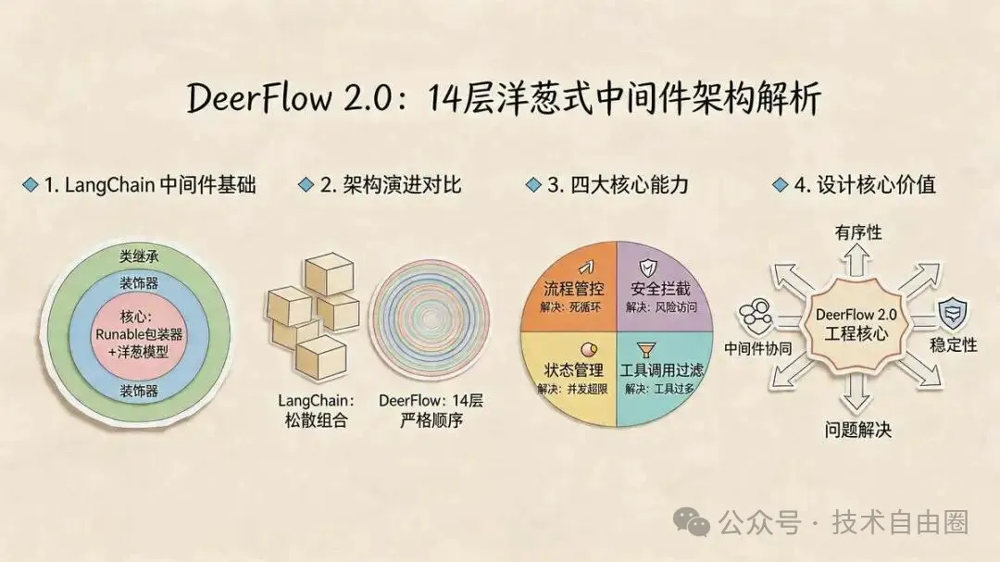

六、DeerFlow Middleware架构 总结

LangChain Middleware架构以“Runnable包装器”和“洋葱模型”为核心，提供了通用、可组合的横切逻辑复用能力，通过装饰器和类继承两种方式，支撑各类Agent/Chain的流程拦截与增强，其核心源码的设计理念为DeerFlow中间件层提供了基础支撑。

DeerFlow最新源码中的14层洋葱中间件，是在LangChain中间件架构基础上的深度定制与扩展，打破了LangChain中间件“松散组合”的模式，以严格的顺序设计、细粒度的职责划分，将流程管控、安全拦截、状态管理、工具调用过滤四大核心能力落地，每个中间件各司其职、相互配合，既解决了Super Agent场景中的实际工程问题（如死循环、并发超限、工具过多），又保障了系统的有序性与稳定性，是DeerFlow 2.0工程化设计的核心体现。

## 说在最后：有问题找45岁老架构取经

尼恩提示： 要拿到 高薪offer， 或者 要进大厂，必须来点 **高大上、体系化、深度化** 的答案， 整点技术狠活儿。

只要按照上面的 尼恩团队梳理的 方案去作答， 你的答案不是 100分，而是 120分。 面试官一定是 心满意足， 五体投地。

按照尼恩的梳理，进行 深度回答，可以充分展示一下大家雄厚的 “技术肌肉”， **让面试官爱到 “不能自已、口水直流”** ，然后实现”offer直提”。

在面试之前，建议大家系统化的刷一波 5000页《 [尼恩Java面试宝典PDF](https://mp.weixin.qq.com/s?__biz=MzkxNzIyMTM1NQ==&mid=2247497474&idx=1&sn=54a7b194a72162e9f13695443eabe186&scene=21#wechat_redirect) 》，里边有大量的大厂真题、面试难题、架构难题。

很多小伙伴刷完后， 吊打面试官， 大厂横着走。

在刷题过程中，如果有啥问题，大家可以来 找 40岁老架构师尼恩交流。

另外，如果没有面试机会， 可以找尼恩来改简历、做帮扶。前段时间， **[空窗2年 成为 架构师， 32岁小伙逆天改命， 同学都惊呆了](https://mp.weixin.qq.com/s?__biz=MzIxMzYwODY3OQ==&mid=2247486483&idx=1&sn=bb13a0fca3d7f1e0420029f353565ad6&scene=21#wechat_redirect) 。**

狠狠卷，实现 “offer自由” 很容易的， 前段时间一个武汉的跟着尼恩卷了2年的小伙伴， 在极度严寒/痛苦被裁的环境下， offer拿到手软， 实现真正的 “offer自由” 。

## 下面的案例， 通过 尼恩 三高架构 +尼恩 AI架构 +尼恩 架构陪跑， 实现 P7 升级

[小伙赶在32岁 末班车，拿到 京东P7（60w）， 撬开P8（年薪100W）通道， 逆天改命了！！！](https://mp.weixin.qq.com/s?__biz=MzIxMzYwODY3OQ==&mid=2247487192&idx=1&sn=284141b9a55954d371207c667e3a2443&scene=21#wechat_redirect)

[逆袭 100万 P8。37岁 空窗6个月，靠 Java+AI双栖架构， 2个月上岸 100w年薪到手，职业重生+逆天改命！](https://mp.weixin.qq.com/s?__biz=MzIxMzYwODY3OQ==&mid=2247487170&idx=1&sn=239470e9b38c511261839c9d6bb39f5e&scene=21#wechat_redirect)

[一飞冲天， 逆 首席： 37 岁 借力 Java+AI 逆袭 首席架构 ， 年薪80W+太香了](https://mp.weixin.qq.com/s?__biz=MzIxMzYwODY3OQ==&mid=2247487126&idx=1&sn=9016db06543f328a42cd37eadfceffee&scene=21#wechat_redirect)

[31岁 /专科 升架构成功， 收10个offer 变 offer 皇帝 ！！ 下一步，直冲100W](https://mp.weixin.qq.com/s?__biz=MzIxMzYwODY3OQ==&mid=2247487047&idx=1&sn=0397145548d8c1e76ee900c7e5920f4d&scene=21#wechat_redirect)

[奇迹: 一年 涨2倍， 年薪 60W 梦想实现 。 接下来，开启 40岁之前的 年薪 200W 梦想](https://mp.weixin.qq.com/s?__biz=MzIxMzYwODY3OQ==&mid=2247487014&idx=1&sn=5d1359a7adc7c9e46e6374597bb03138&scene=21#wechat_redirect)

[28岁/6年/被裁1年，收 3 大厂offer ， 成 大厂 皇后 。2本学历 51W 年薪，惊天 逆涨，涨薪2倍](https://mp.weixin.qq.com/s?__biz=MzIxMzYwODY3OQ==&mid=2247486987&idx=1&sn=ff977f450dd242446f228d3a6585e258&scene=21#wechat_redirect) ，大厂皇后

[涨薪传奇： 18k->38K, 单月暴20K，32岁小伙伴 2个月时间年薪 翻1.5倍 ，一步登天+逆天改命](https://mp.weixin.qq.com/s?__biz=MzIxMzYwODY3OQ==&mid=2247486960&idx=1&sn=f57253a448694c32e834207381c42284&scene=21#wechat_redirect)

[低学历 传奇：29岁6年专套本，受够了外包，狠卷3个月逆袭大厂 涨 1倍， 逆天改命](https://mp.weixin.qq.com/s?__biz=MzIxMzYwODY3OQ==&mid=2247486945&idx=1&sn=f6ff6231ccf3585624161c2ef1f50fdf&scene=21#wechat_redirect)

[极速上岸： 被裁 后， 8天 拿下 京东，狠涨 一倍 年薪48W， 小伙伴 就是 做对了一件事](https://mp.weixin.qq.com/s?__biz=MzIxMzYwODY3OQ==&mid=2247486913&idx=1&sn=edd6774e9d17c39327e8dcb95fdd68d9&scene=21#wechat_redirect)

[外包+二本 进 美团： 26岁小2本 一步登天， 进了顶奢大厂（ 美团） ， 太爽了](https://mp.weixin.qq.com/s?__biz=MzIxMzYwODY3OQ==&mid=2247486904&idx=1&sn=e7c878f99ed101ebfbd1d80ec0e07401&scene=21#wechat_redirect)

[超牛的Java+Al 双栖架构： 34岁无路可走，一个月翻盘，拿 3个架构offer，靠 Java+Al 逆天改命！！！](https://mp.weixin.qq.com/s?__biz=MzIxMzYwODY3OQ==&mid=2247486848&idx=1&sn=ff43d058271b0801f84aba3f3d957855&scene=21#wechat_redirect)

java+AI 逆袭2： [：3年 程序媛 被裁， 25W-》40W 上岸， 逆涨60%。 Java+AI 太神了， 架构小白 2个月逆天改命](https://mp.weixin.qq.com/s?__biz=MzIxMzYwODY3OQ==&mid=2247486858&idx=1&sn=9cd122c18d166433b43d0952d3a7a7a8&scene=21#wechat_redirect)

[Java+AI逆袭3 ： 36岁/失业7个月/彻底绝望 。狠卷 3个月 Java+AI ，终于逆风翻盘，顺利 上岸](https://mp.weixin.qq.com/s?__biz=MzIxMzYwODY3OQ==&mid=2247486870&idx=1&sn=990a540a155cdb8254ebce6c75816882&scene=21#wechat_redirect)

[Java+AI逆袭 ： 闲了一年，41岁/失业12个月/彻底绝望 。狠卷 2个月 Java+AI ，终于逆风翻盘](https://mp.weixin.qq.com/s?__biz=MzIxMzYwODY3OQ==&mid=2247486880&idx=1&sn=a37033157c766ac5ae7c9195fe776693&scene=21#wechat_redirect)

[Java+AI逆袭5：1个月大涨2.5W，37岁 脱坑外包， 入了正编，GO+AI 要逆天了](https://mp.weixin.qq.com/s?__biz=MzIxMzYwODY3OQ==&mid=2247486885&idx=1&sn=4e26fbb093f45d437dedf14ea9b9e6c5&scene=21#wechat_redirect)

**职业救助站**

实现职业转型，极速上岸

关注 **职业救助站** 公众号，获取每天职业干货  
助您实现 **职业转型、职业升级、极速上岸**  
\---------------------------------

**技术自由圈**

实现架构转型，再无中年危机

关注 **技术自由圈** 公众号，获取每天技术千货  
一起成为牛逼的 **未来超级架构师**

**几十篇架构笔记、5000页面试宝典、20个技术圣经  
请加尼恩个人微信 免费拿走**

**暗号，请在 公众号后台 发送消息：领电子书**

如有收获，请点击底部的"在看"和"赞"，谢谢

继续滑动看下一个

技术自由圈

向上滑动看下一个

<iframe src="chrome-extension://eigdjhmgnaaeaonimdklocfekkaanfme/side-panel.html?context=iframe"></iframe>