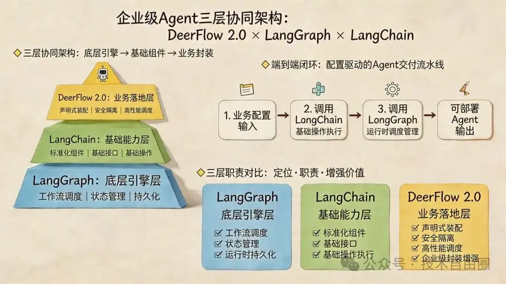
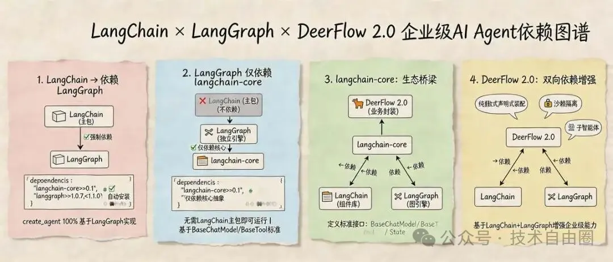
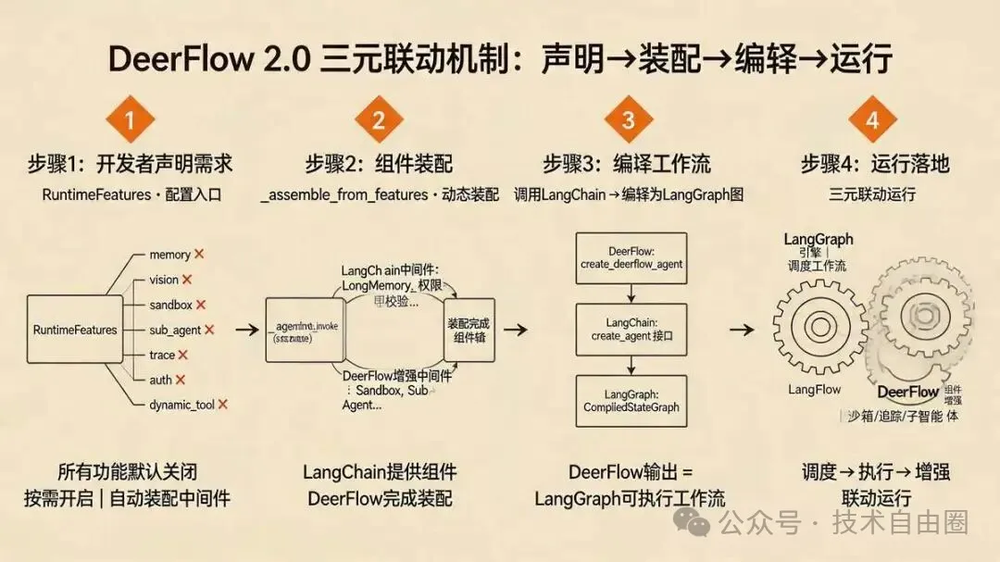
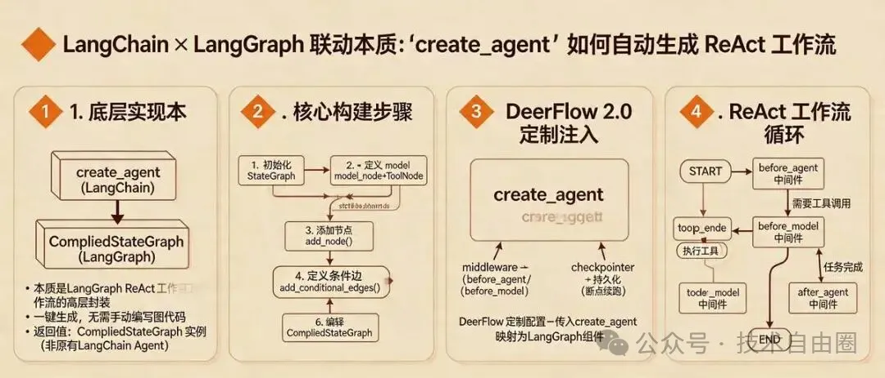
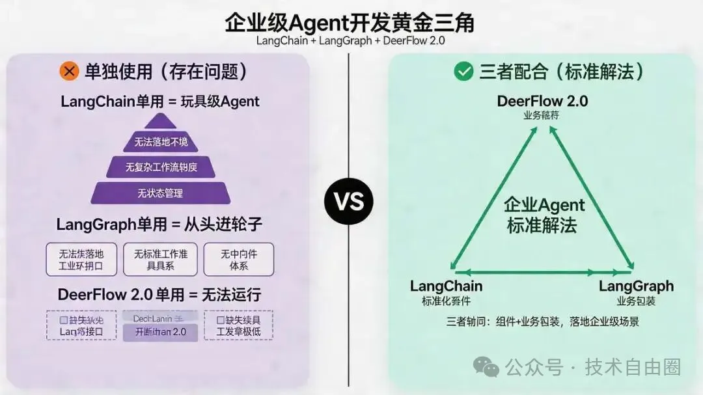
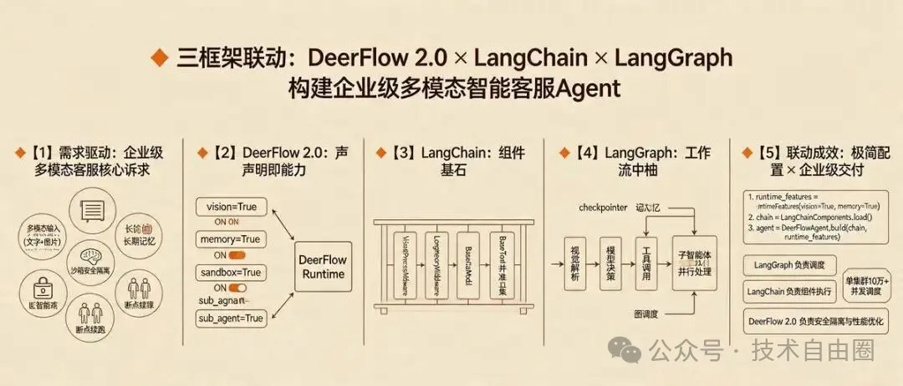
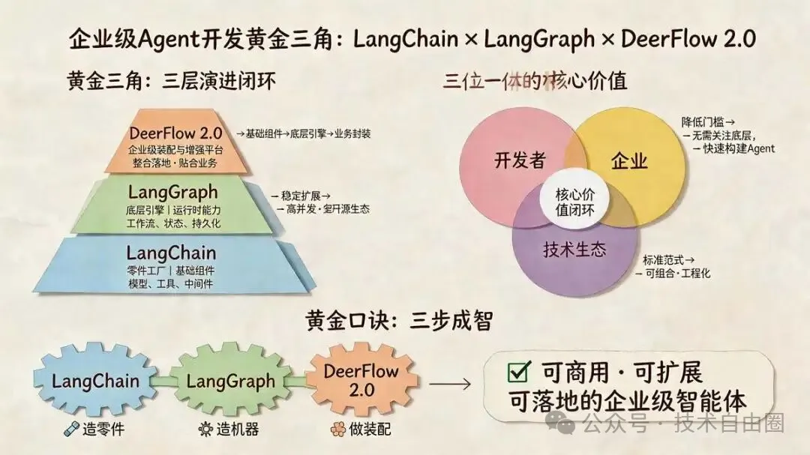

45岁老架构师尼恩 *2026年4月20日 09:55*

## 尼恩说在前面

在45岁老架构师尼恩的 **读者交流群** （50+人）里，最近不少小伙伴拿到了阿里、滴滴、极兔、有赞、希音、百度、字节、网易、美团这些一线大厂的面试入场券，恭喜各位！

前两天就有个小伙伴面腾讯， 问到 **“ 听说过Harness Agent 吗？你们怎么实现 Harness Agent 的？ ”** 的场景题 ，小伙伴没有一点概念，导致面试挂了。

小伙伴 没有看过系统化的 答案， **回答也不全面** ，so， 面试官不满意 ， 面试挂了。

小伙伴找尼恩复盘， 求助尼恩。

通过这个 文章， 这里 尼恩给大家做一下 系统化、体系化的梳理，写一个系列的文章组成 尼恩编著 《Harness 架构与源码 学习圣经》 深入剖析 Harness AI 平台级 架构的 架构思维与 核心源码，使得大家可以充分展示一下大家雄厚的 “技术肌肉”， **让面试官爱到 “不能自已、口水直流”** 。

同时，也一并把这个题目以及参考答案，收入咱们的 《 [尼恩Java面试宝典PDF](https://mp.weixin.qq.com/s?__biz=MzkxNzIyMTM1NQ==&mid=2247497474&idx=1&sn=54a7b194a72162e9f13695443eabe186&scene=21#wechat_redirect) 》V176版本，供后面的小伙伴参考，提升大家的 3高 架构、设计、开发水平。

> 最新《尼恩 架构笔记》《尼恩高并发三部曲》《尼恩Java面试宝典》的PDF，请关注本公众号【技术自由圈】获取，后台回复：领电子书

## 尼恩编著 《Harness 架构与源码 学习圣经》

**第一章： 什么是 Harness架构？2026年AI核心范式解析 ： Harness架构与Agent工程化**

具体文章： [54k+Star 爆火！AI 框架 新王者 Harness Agent 来了！尼恩 来一次Harness穿透式解读](https://mp.weixin.qq.com/s?__biz=MzkxNzIyMTM1NQ==&mid=2247506624&idx=1&sn=971fc1704672cfe09e6ecef35bd83ecd&scene=21#wechat_redirect)

**第二章： Harness架构 与 LangChain、LangGraph 三者联动 的底层逻辑**

具体文章：本文

**第三章： 深度解析字节跳动DeerFlow 2.0：基于LangGraph的生产级Super Agent驾驭层实现**

具体文章： 尼恩还在写， 本周发布

**第四章：Harness架构 ： Lead Agent 与 Sub-Agent 配合机制与使用决策指南**

具体文章： 尼恩还在写， 本周发布

**第五章： 基于 PPAF 思维，完成 与 Harness 工程化的 Lead-Agent 和 Sub-Agent 深度拆解.**

具体文章： 尼恩还在写， 本周发布

**第六章：Harness架构 核心一：断点续跑机制 的 架构设计 与底层源码分析.**

具体文章： 尼恩还在写， 本周发布

**第七章：Harness架构 核心二： XXX**

具体文章： 尼恩还在写，后续发布

估计有 10章以上，具体请关注技术自由圈。

## Harness架构 与 LangChain、LangGraph 三者联动 的底层逻辑

Harness架构 属于 企业级Super Agent。

典型的 开源框架，就是 DeerFlow 2.0。

结合 DeerFlow 2.0 ，开看看 Harness架构 、LangChain、LangGraph三者关系：三者联动 的底层逻辑。

在企业级Super Agent开发领域，DeerFlow 2.0、LangChain、LangGraph三者的联动的是当前大厂标准架构的核心体现。

作为字节跳动2026年2月开源、内部打磨3年的Super Agent框架，DeerFlow 2.0底层支撑了内部数千个Agent应用，单月斩获28K Star，其核心优势在于巧妙整合LangChain与LangGraph的能力，既规避了单一框架的局限性，又通过源码级定制，实现了企业级场景所需的稳定性、可扩展性与高性能。

本文将从核心定位、依赖关系、联动机制、源码佐证、实战场景五个维度，系统化拆解三者的关系，完整覆盖所有关键细节，同时补充三者联动的底层逻辑与落地价值，让开发者清晰理解“为什么三者必须配合”“如何配合”以及“DeerFlow 2.0在其中扮演的核心角色”。

## 一、核心定位：三者各司其职，构成企业级Agent完整架构

一、核心定位：三者各司其职，构成企业级Agent完整架构

DeerFlow 2.0、LangChain、LangGraph三者并非竞争关系，而是“底层引擎-基础组件-业务封装”的三层联动关系，各自承担不同角色，共同支撑企业级Agent的构建与落地。

尼恩先通过一句话明确三者核心定位，再逐一拆解细节：

- **LangChain** ：Agent的 **“组件集合/组件库/工具层”** ，负责提供标准化的基础组件与接口，是构建Agent的“基础能力层”；
- **LangGraph** ：Agent的 **“图编排引擎/ 流水线总装+ 运行时调度”** ，负责提供工作流调度、状态管理、持久化等工程化能力，是Agent能够稳定运行的“底层引擎层”；
- **DeerFlow 2.0** ：基于前两者的“企业级封装与增强框架”， 整合LangChain的组件与LangGraph的引擎，解决原生框架在企业级场景中的痛点，提供 声明式装配、安全隔离、高性能调度等增强能力，是“业务落地层”。

三者 关系 可概括为：

**DeerFlow 2.0 接收开发者的业务配置 → 调用LangChain的组件 完成基础操作 → 调用LangGraph的引擎完成运行时调度 → 输出可直接部署的企业级Agent** 。

## 二、依赖关系深度解析：谁依赖谁？为什么？

二、依赖关系深度解析：谁依赖谁？为什么？

理解三者关系的核心前提，是明确其官方依赖逻辑（基于LangChain v1.x、LangGraph ≥1.0、DeerFlow 2.0最新版本）。

很多开发者会混淆“LangChain与LangGraph的依赖关系”，甚至误以为两者是互相依赖，实则不然——核心结论先明确：

- **LangChain（主包）依赖LangGraph；**
- **LangGraph不依赖LangChain，仅依赖langchain-core；**
- **DeerFlow 2.0同时依赖LangChain、LangGraph，是两者的上层封装与增强** 。

> *尼恩提示：原文1w字以上， 超过平台限制， 此处省略 1000字，具体请参考 免费pdf。*
> 
> *完整版本，请参考 尼恩 免费百度网盘 免费pdf ，点赞收藏本文后，找尼恩微信获取*

### 2\. DeerFlow 2.0 与两者：双向依赖，深度整合

DeerFlow 2.0作为企业级框架，其核心能力完全建立在LangChain与LangGraph之上，同时对两者进行了源码级的定制与增强：

- 依赖LangChain：获取模型接口、工具标准、中间件基类（如 `AgentMiddleware` ）、 `create_agent` 接口等基础组件，作为Agent装配的“零件来源”；
- 依赖LangGraph：获取工作流调度、状态管理、断点续跑（ `checkpointer` ）、 `CompiledStateGraph` 编译等工程化能力，作为Agent运行的“底层引擎”；
- 增强两者：解决LangChain+LangGraph原生组合在企业级场景中的痛点（如配置繁琐、无安全隔离、调度性能不足等），提供纯函数式声明式装配、沙箱隔离、子智能体调度、链路追踪等增强功能。

## 三、逐模块拆解：三者如何联动？（结合DeerFlow 2.0源码）

三、逐模块拆解：三者如何联动？（结合DeerFlow 2.0源码）

结合DeerFlow 2.0的核心源码（如 `create_deerflow_agent` 、 `_assemble_from_features` 、 `RuntimeFeatures` 等），尼恩从“开发者配置→组件装配→引擎编译→运行落地”四个步骤，拆解三者的联动细节，这也是理解三者关系的关键——所有联动逻辑，都体现在DeerFlow 2.0的源码实现中。

> *尼恩提示：原文1w字以上， 超过平台限制， 此处省略 1000字，具体请参考 免费pdf。*
> 
> *完整版本，请参考 尼恩 免费百度网盘 免费pdf ，点赞收藏本文后，找尼恩微信获取*

## 四、关键细节补充：create\_agent的底层实现（LangChain与LangGraph的核心联动）

四、关键细节补充：create\_agent的底层实现（LangChain与LangGraph的核心联动）

很多开发者疑惑：DeerFlow 2.0调用的 `langchain.agents.create_agent` ，到底和LangGraph的 `StateGraph` 是什么关系？

这也是理解三者联动的核心细节—— `create_agent` 本质是LangChain对LangGraph的“高层封装”，是LangGraph标准ReAct工作流的“一键生成器”。

> *尼恩提示：原文1w字以上， 超过平台限制， 此处省略 1000字，具体请参考 免费pdf。*
> 
> *完整版本，请参考 尼恩 免费百度网盘 免费pdf ，点赞收藏本文后，找尼恩微信获取*

## 五、为什么三者必须配合？缺一不可

五、为什么三者必须配合？缺一不可

理解了三者的联动逻辑后，大家就能明白：为什么企业级Agent开发不能只用其中一个，必须三者配合——单一框架的局限性，只有通过三者联动才能解决。

### 1\. 只用LangChain：只能做“玩具级”Agent

LangChain的核心优势是“组件标准化”，但它本身不具备工程化运行能力，只用LangChain会面临以下问题：

- 无状态管理：无法实现多轮对话记忆，每次调用都是“全新会话”；
- 无断点续跑：Agent执行中断后，无法恢复之前的执行状态；
- 无复杂工作流调度：只能实现简单的线性执行，无法实现多分支、多循环、多智能体调度；
- 无法落地工业环境：缺乏稳定性、可监控性，只能用于demo开发，无法支撑企业级高并发场景。

### 2\. 只用LangGraph：需要“从头造轮子”

LangGraph的核心优势是“工程化运行”，但它不提供基础组件，只用LangGraph会面临以下问题：

- 无标准模型接口：需要手动定义模型调用逻辑，无法快速适配不同厂商的大模型；
- 无标准工具体系：需要手动定义工具接口，无法复用开源工具生态；
- 无中间件体系：需要手动实现权限校验、日志追踪等功能，开发成本极高；
- 开发效率极低：每次构建Agent，都需要手动编写图结构、节点逻辑、边路由，无法快速迭代。

### 3\. 只用DeerFlow 2.0：无底层支撑，无法运行

DeerFlow 2.0是“上层封装框架”，其所有能力都依赖LangChain的组件和LangGraph的引擎：

- 没有LangChain：DeerFlow 2.0的中间件、工具、模型接口都无法落地；
- 没有LangGraph：DeerFlow 2.0的工作流调度、状态持久化、断点续跑都无法实现；
- DeerFlow 2.0的核心价值，是“整合与增强”，而非“替代”——它解决的是LangChain+LangGraph原生组合在企业级场景中的痛点，让两者的配合更高效、更贴合业务需求。

### 4\. 三者配合：企业级Agent的标准解法

当前所有大厂的正式LLM Agent项目，都是“LangChain + LangGraph”的组合，而DeerFlow 2.0则是这种组合的“企业级增强版”，三者配合的核心价值：

- LangChain：提供“标准化零件”，确保组件可复用、可扩展；
- LangGraph：提供“底层引擎”，确保Agent可稳定、可控、可持久化运行；
- DeerFlow 2.0：提供“业务封装”，确保开发者可快速配置、快速落地，同时解决企业级场景的安全、性能、调度需求。

## 六、实战场景佐证：三者联动的真实价值

六、实战场景佐证：三者联动的真实价值

结合DeerFlow 2.0的企业级落地场景，尼恩用一个具体案例，看看三者如何联动解决实际问题——以“企业级多模态智能客服Agent”为例：

**(1) 需求：支持多模态输入（文字+图片）、长期记忆、沙箱安全隔离、子智能体并行处理、断点续跑；**

**(2) DeerFlow 2.0：开发者通过 `RuntimeFeatures` 声明需求（ `vision=True` 、 `memory=True` 、 `sandbox=True` 、 `sub_agent=True` ），无需手动编写任何中间件或图结构；**

**(3) LangChain：提供视觉处理中间件（ `VisionProcessMiddleware` ）、长期记忆中间件（ `LongMemoryMiddleware` ）、多模态模型接口（ `BaseChatModel` ）、客服工具集（符合 `BaseTool` 标准）；**

**(4) LangGraph：构建工作流（接收输入→视觉解析→模型决策→工具调用→子智能体并行处理→记忆持久化），通过 `checkpointer` 实现断点续跑，通过图调度实现子智能体并行执行；**

**(5) 联动效果：开发者仅需3行配置代码，即可完成企业级客服Agent的构建，运行时由LangGraph负责调度，LangChain负责组件执行，DeerFlow 2.0负责安全隔离与性能优化，支撑单集群10万+并发调度。**

## 七、核心总结：三者关系的本质与价值

七、核心总结：三者关系的本质与价值

### 1\. 关系本质（一句话概括）

**LangChain是“零件工厂”，提供Agent的基础组件；LangGraph是“底层引擎”，提供Agent的运行时能力；DeerFlow 2.0是“企业级装配与增强平台”，整合前两者的能力，解决企业级落地痛点，让Agent的构建更高效、更稳定、更贴合业务需求** 。

三者的联动，是“基础组件→底层引擎→业务封装”的完整闭环，也是当前企业级Agent开发的标准架构。

### 2\. 核心价值拆解

- 对开发者：降低开发门槛，无需关注底层实现，只需通过DeerFlow 2.0的声明式配置，即可快速构建企业级Agent；
- 对企业：确保Agent的稳定性、可扩展性、安全性，支撑高并发、多场景的落地需求，同时复用LangChain与LangGraph的开源生态，降低研发成本；
- 对技术生态：三者的联动，完美契合“可组合性”“工程化”的核心需求，为企业级Agent开发提供了可复用、可扩展的标准范式。

### 3\. 最简记忆口诀（便于快速掌握）

- LangChain：造零件（模型、工具、中间件）；
- LangGraph：造机器（工作流、状态、持久化）；
- DeerFlow 2.0：做装配（声明式配置、增强优化、落地交付）；
- 三者合一：可商用、可扩展、可落地的企业级智能体。

综上，DeerFlow 2.0、LangChain、LangGraph三者并非孤立存在，而是深度联动、各司其职的整体。

LangChain与LangGraph构成了Agent开发的“基础骨架”，而DeerFlow 2.0则为这个骨架注入了“企业级血液”，让其能够真正落地到生产环境，支撑多样化的业务需求——这也是DeerFlow 2.0能够在开源后快速获得认可的核心原因。

## 说在最后：有问题找45岁老架构取经

尼恩提示： 要拿到 高薪offer， 或者 要进大厂，必须来点 **高大上、体系化、深度化** 的答案， 整点技术狠活儿。

只要按照上面的 尼恩团队梳理的 方案去作答， 你的答案不是 100分，而是 120分。 面试官一定是 心满意足， 五体投地。

按照尼恩的梳理，进行 深度回答，可以充分展示一下大家雄厚的 “技术肌肉”， **让面试官爱到 “不能自已、口水直流”** ，然后实现”offer直提”。

在面试之前，建议大家系统化的刷一波 5000页《 [尼恩Java面试宝典PDF](https://mp.weixin.qq.com/s?__biz=MzkxNzIyMTM1NQ==&mid=2247497474&idx=1&sn=54a7b194a72162e9f13695443eabe186&scene=21#wechat_redirect) 》，里边有大量的大厂真题、面试难题、架构难题。

很多小伙伴刷完后， 吊打面试官， 大厂横着走。

在刷题过程中，如果有啥问题，大家可以来 找 40岁老架构师尼恩交流。

另外，如果没有面试机会， 可以找尼恩来改简历、做帮扶。前段时间， **[空窗2年 成为 架构师， 32岁小伙逆天改命， 同学都惊呆了](https://mp.weixin.qq.com/s?__biz=MzIxMzYwODY3OQ==&mid=2247486483&idx=1&sn=bb13a0fca3d7f1e0420029f353565ad6&scene=21#wechat_redirect) 。**

狠狠卷，实现 “offer自由” 很容易的， 前段时间一个武汉的跟着尼恩卷了2年的小伙伴， 在极度严寒/痛苦被裁的环境下， offer拿到手软， 实现真正的 “offer自由” 。

## 下面的案例， 通过 尼恩 三高架构 +尼恩 AI架构 +尼恩 架构陪跑， 实现 P7 升级

[小伙赶在32岁 末班车，拿到 京东P7（60w）， 撬开P8（年薪100W）通道， 逆天改命了！！！](https://mp.weixin.qq.com/s?__biz=MzIxMzYwODY3OQ==&mid=2247487192&idx=1&sn=284141b9a55954d371207c667e3a2443&scene=21#wechat_redirect)

[逆袭 100万 P8。37岁 空窗6个月，靠 Java+AI双栖架构， 2个月上岸 100w年薪到手，职业重生+逆天改命！](https://mp.weixin.qq.com/s?__biz=MzIxMzYwODY3OQ==&mid=2247487170&idx=1&sn=239470e9b38c511261839c9d6bb39f5e&scene=21#wechat_redirect)

[一飞冲天， 逆 首席： 37 岁 借力 Java+AI 逆袭 首席架构 ， 年薪80W+太香了](https://mp.weixin.qq.com/s?__biz=MzIxMzYwODY3OQ==&mid=2247487126&idx=1&sn=9016db06543f328a42cd37eadfceffee&scene=21#wechat_redirect)

[31岁 /专科 升架构成功， 收10个offer 变 offer 皇帝 ！！ 下一步，直冲100W](https://mp.weixin.qq.com/s?__biz=MzIxMzYwODY3OQ==&mid=2247487047&idx=1&sn=0397145548d8c1e76ee900c7e5920f4d&scene=21#wechat_redirect)

[奇迹: 一年 涨2倍， 年薪 60W 梦想实现 。 接下来，开启 40岁之前的 年薪 200W 梦想](https://mp.weixin.qq.com/s?__biz=MzIxMzYwODY3OQ==&mid=2247487014&idx=1&sn=5d1359a7adc7c9e46e6374597bb03138&scene=21#wechat_redirect)

[28岁/6年/被裁1年，收 3 大厂offer ， 成 大厂 皇后 。2本学历 51W 年薪，惊天 逆涨，涨薪2倍](https://mp.weixin.qq.com/s?__biz=MzIxMzYwODY3OQ==&mid=2247486987&idx=1&sn=ff977f450dd242446f228d3a6585e258&scene=21#wechat_redirect) ，大厂皇后

[涨薪传奇： 18k->38K, 单月暴20K，32岁小伙伴 2个月时间年薪 翻1.5倍 ，一步登天+逆天改命](https://mp.weixin.qq.com/s?__biz=MzIxMzYwODY3OQ==&mid=2247486960&idx=1&sn=f57253a448694c32e834207381c42284&scene=21#wechat_redirect)

[低学历 传奇：29岁6年专套本，受够了外包，狠卷3个月逆袭大厂 涨 1倍， 逆天改命](https://mp.weixin.qq.com/s?__biz=MzIxMzYwODY3OQ==&mid=2247486945&idx=1&sn=f6ff6231ccf3585624161c2ef1f50fdf&scene=21#wechat_redirect)

[极速上岸： 被裁 后， 8天 拿下 京东，狠涨 一倍 年薪48W， 小伙伴 就是 做对了一件事](https://mp.weixin.qq.com/s?__biz=MzIxMzYwODY3OQ==&mid=2247486913&idx=1&sn=edd6774e9d17c39327e8dcb95fdd68d9&scene=21#wechat_redirect)

[外包+二本 进 美团： 26岁小2本 一步登天， 进了顶奢大厂（ 美团） ， 太爽了](https://mp.weixin.qq.com/s?__biz=MzIxMzYwODY3OQ==&mid=2247486904&idx=1&sn=e7c878f99ed101ebfbd1d80ec0e07401&scene=21#wechat_redirect)

[超牛的Java+Al 双栖架构： 34岁无路可走，一个月翻盘，拿 3个架构offer，靠 Java+Al 逆天改命！！！](https://mp.weixin.qq.com/s?__biz=MzIxMzYwODY3OQ==&mid=2247486848&idx=1&sn=ff43d058271b0801f84aba3f3d957855&scene=21#wechat_redirect)

java+AI 逆袭2： [：3年 程序媛 被裁， 25W-》40W 上岸， 逆涨60%。 Java+AI 太神了， 架构小白 2个月逆天改命](https://mp.weixin.qq.com/s?__biz=MzIxMzYwODY3OQ==&mid=2247486858&idx=1&sn=9cd122c18d166433b43d0952d3a7a7a8&scene=21#wechat_redirect)

[Java+AI逆袭3 ： 36岁/失业7个月/彻底绝望 。狠卷 3个月 Java+AI ，终于逆风翻盘，顺利 上岸](https://mp.weixin.qq.com/s?__biz=MzIxMzYwODY3OQ==&mid=2247486870&idx=1&sn=990a540a155cdb8254ebce6c75816882&scene=21#wechat_redirect)

[Java+AI逆袭 ： 闲了一年，41岁/失业12个月/彻底绝望 。狠卷 2个月 Java+AI ，终于逆风翻盘](https://mp.weixin.qq.com/s?__biz=MzIxMzYwODY3OQ==&mid=2247486880&idx=1&sn=a37033157c766ac5ae7c9195fe776693&scene=21#wechat_redirect)

[Java+AI逆袭5：1个月大涨2.5W，37岁 脱坑外包， 入了正编，GO+AI 要逆天了](https://mp.weixin.qq.com/s?__biz=MzIxMzYwODY3OQ==&mid=2247486885&idx=1&sn=4e26fbb093f45d437dedf14ea9b9e6c5&scene=21#wechat_redirect)

**职业救助站**

实现职业转型，极速上岸

关注 **职业救助站** 公众号，获取每天职业干货  
助您实现 **职业转型、职业升级、极速上岸**  
\---------------------------------

**技术自由圈**

实现架构转型，再无中年危机

关注 **技术自由圈** 公众号，获取每天技术千货  
一起成为牛逼的 **未来超级架构师**

**几十篇架构笔记、5000页面试宝典、20个技术圣经  
请加尼恩个人微信 免费拿走**

**暗号，请在 公众号后台 发送消息：领电子书**

如有收获，请点击底部的"在看"和"赞"，谢谢

继续滑动看下一个

技术自由圈

向上滑动看下一个

<iframe src="chrome-extension://eigdjhmgnaaeaonimdklocfekkaanfme/side-panel.html?context=iframe"></iframe>