45岁老架构师尼恩 *2026年4月22日 10:15*

## 尼恩说在前面

在45岁老架构师尼恩的 **读者交流群** （50+人）里，最近不少小伙伴拿到了阿里、滴滴、极兔、有赞、希音、百度、字节、网易、美团这些一线大厂的面试入场券，恭喜各位！

前两天就有个小伙伴面腾讯， 问到 **“ 听说过Harness Agent 吗？你们怎么实现 Harness Agent 的？ ”** 的场景题 ，小伙伴没有一点概念，导致面试挂了。

小伙伴 没有看过系统化的 答案， **回答也不全面** ，so， 面试官不满意 ， 面试挂了。

小伙伴找尼恩复盘， 求助尼恩。

通过这个 文章， 这里 尼恩给大家做一下 系统化、体系化的梳理，写一个系列的文章组成 尼恩编著 《Harness 架构与源码 学习圣经》 深入剖析 Harness AI 平台级 架构的 架构思维与 核心源码，使得大家可以充分展示一下大家雄厚的 “技术肌肉”， **让面试官爱到 “不能自已、口水直流”** 。

同时，也一并把这个题目以及参考答案，收入咱们的 《 [尼恩Java面试宝典PDF](https://mp.weixin.qq.com/s?__biz=MzkxNzIyMTM1NQ==&mid=2247497474&idx=1&sn=54a7b194a72162e9f13695443eabe186&scene=21#wechat_redirect) 》V176版本，供后面的小伙伴参考，提升大家的 3高 架构、设计、开发水平。

## 尼恩编著 《Harness 架构与源码 学习圣经》

**第一章： 什么是 Harness架构？2026年AI核心范式解析 ： Harness架构与Agent工程化**

具体文章： [54k+Star 爆火！AI 框架 新王者 Harness Agent 来了！尼恩 来一次Harness穿透式解读](https://mp.weixin.qq.com/s?__biz=MzkxNzIyMTM1NQ==&mid=2247506624&idx=1&sn=971fc1704672cfe09e6ecef35bd83ecd&scene=21#wechat_redirect)

**第二章： Harness架构 与 LangChain、LangGraph 三者联动 的底层逻辑**

具体文章： [Harness架构 与 LangChain、LangGraph 三者联动 的底层逻辑](https://mp.weixin.qq.com/s?__biz=MzkxNzIyMTM1NQ==&mid=2247506648&idx=1&sn=f5f76be83df2475b80f2917016e56dd8&scene=21#wechat_redirect)

**第三章： DeerFlow 源码 14层Middleware 源码解析 ，又一个 “洋葱责任链模式” 架构思维 的 经典案例**

具体文章： [DeerFlow 架构：14层Middleware 架构深度解析 ，又一个 “洋葱责任链模式” 架构思维 的 经典案例](https://mp.weixin.qq.com/s?__biz=MzkxNzIyMTM1NQ==&mid=2247506655&idx=1&sn=aca3e53c02c1b8f079cac151ee3d2861&scene=21#wechat_redirect)

****第四章： 【Design Patterns 】LangChain 超底层 四大设计模式 ，架构师 的 必备 内功，毒打面试官****

**

**本文**

**

**第5章： 深度解析字节跳动DeerFlow 2.0：基于LangGraph的生产级Super Agent驾驭层实现**

具体文章： 尼恩还在写， 本周发布

**第6章：Harness架构 ： Lead Agent 与 Sub-Agent 配合机制与使用决策指南**

具体文章： 尼恩还在写， 本周发布

**第7章： 基于 PPAF 思维，完成 与 Harness 工程化的 Lead-Agent 和 Sub-Agent 深度拆解.**

具体文章： 尼恩还在写， 本周发布

**第8章：Harness架构 核心一：断点续跑机制 的 架构设计 与底层源码分析.**

具体文章： 尼恩还在写， 本周发布

**第9章：Harness架构 核心二： XXX**

具体文章： 尼恩还在写，后续发布

估计有 10章以上，具体请关注技术自由圈。

## LangChain 内核的四大设计模式：从原理到实战的系统化解析

LangChain 四大设计模式： 责任链、装饰器、命令、管道 。对架构师而言，掌握这四大模式， **不仅能深入理解 LangChain 的运作原理，更能将其运用到组件开发、链路构建、功能增强等实战场景，提升代码复用性与系统可维护性，同时夯实自身架构设计内功，实现从 “会用框架” 到 “懂架构、能定制” 的进阶** 。

LangChain 作为当前最流行的大语言模型（LLM）应用开发框架，其强大的灵活性、可扩展性和组合性，核心源于对经典设计模式的精妙运用。

不同于传统软件架构的模式套用，LangChain 围绕「Runnable 体系」，将责任链、装饰器、命令、管道四大模式深度融合，构建出「请求正向传递、响应反向回溯」的双向执行架构，支撑起从简单 Prompt 调用到复杂多智能体交互的全场景开发。

本文将从设计模式的核心定义出发，结合 LangChain 内核源码、架构逻辑和实战场景，系统化拆解四大设计模式的实现细节、作用机制以及相互之间的协同关系，帮助开发者从底层理解 LangChain 的运作原理，提升框架使用的深度和扩展性。

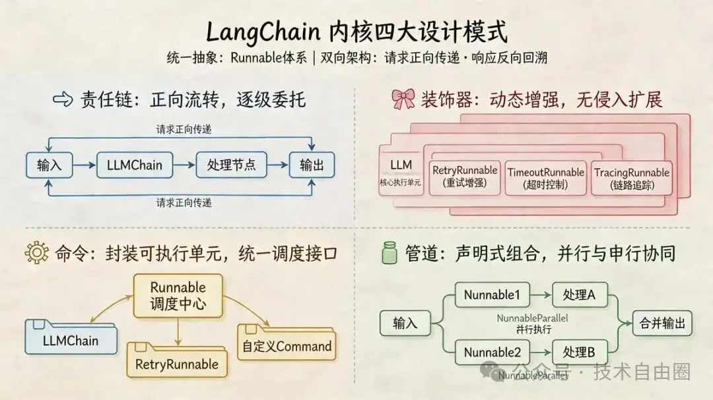

LangChain 内核的四大设计模式：从原理到实战的系统化解析

这四大模式并非孤立存在，而是相互协同，构建起 “请求正向传递、响应反向回溯” 的双向执行架构，是架构师理解 LangChain 内核、提升框架使用深度与架构设计能力的必备内功。

- 命令模式是四大模式的基础，以 Runnable 抽象接口为核心载体，定义了所有组件（Prompt、LLM、Parser 等）的统一执行契约 —— 所有可执行单元均实现 invoke 方法，封装具体请求，实现请求发送者与执行者的解耦。这一模式确保了不同类型组件可被统一调度、替换，为其他模式的协同提供了前提，是 LangChain 架构的 “统一执行标准”。
- 责任链模式是正向执行流的骨架，核心实现为 RunnableSequence 类。通过 | 运算符串联多个 Runnable 组件，将请求沿步骤链正向传递，前一步输出作为后一步输入，每个步骤仅关注自身职责，实现复杂流程的解耦与动态调整。无论是基础的 Prompt-LLM-Parser 链路，还是嵌套的树形责任链，均依赖此模式构建执行骨架，简化复杂任务的拆分与实现。
- 装饰器模式是功能增强与反向回溯的核心，落地为 LangChain Middleware 体系，与洋葱责任链架构协同工作 —— 洋葱模式定架构（层层嵌套、双向数据流），装饰器模式做实现（动态包装、非侵入扩展）。通过多层包装 Runnable 对象，在不修改原代码的前提下，添加日志、重试、缓存等增强逻辑，同时通过 after 钩子和异常传递，实现响应、状态的反向回溯，是 LangChain 中间件体系的核心实现手段，也是生产级应用必备的扩展方式。
- 管道模式规范了数据流的传递，以 LCEL（LangChain Expression Language）为载体，通过 RunnableSequence 的类型校验逻辑，确保每个组件的输出类型与下一个组件的输入类型匹配，实现 “前输出 = 后输入” 的单向流水线式数据流。该模式与责任链模式紧密结合，既保证了数据流的规范传递，又简化了复杂链路的组合构建，避免类型不匹配导致的异常。

四大模式的协同逻辑可概括为：命令模式定统一接口，责任链模式搭正向骨架，装饰器模式做反向增强，管道模式规数据流。四者相互嵌套，形成 “外层装饰器→中层装饰器→责任链（管道）” 的正向执行流，以及 “责任链→中层装饰器→外层装饰器” 的反向回溯流，共同构成 LangChain 灵活可扩展的内核架构。

## LangChain 内核的设计核心——Runnable 体系

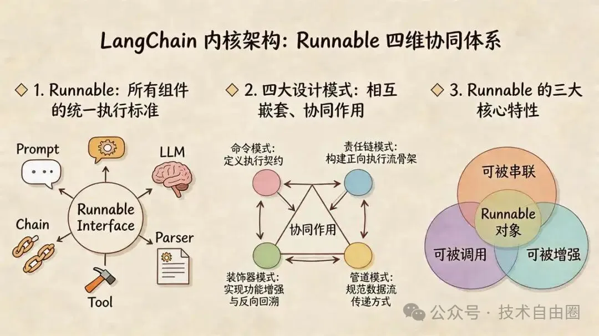

LangChain 内核的设计核心——Runnable 体系

LangChain 内核的所有功能，均围绕「Runnable 抽象接口」展开。Runnable 定义了所有组件（Prompt、LLM、Parser、Tool、Chain 等）的统一执行标准，是四大设计模式能够协同工作的基础。

其核心思想是：将所有可执行单元抽象为「可被调用、可被串联、可被增强」的 Runnable 对象，通过模式组合，实现复杂的执行流控制和功能扩展。

在 LangChain 中，四大设计模式并非孤立存在：命令模式定义了统一的执行契约，责任链模式构建了正向执行流骨架，装饰器模式实现了功能增强和反向回溯，管道模式规范了数据流的传递方式。四者相互嵌套、协同作用，共同构成了 LangChain 内核的核心架构。

## 一、责任链模式（Chain of Responsibility）：正向执行流的骨架

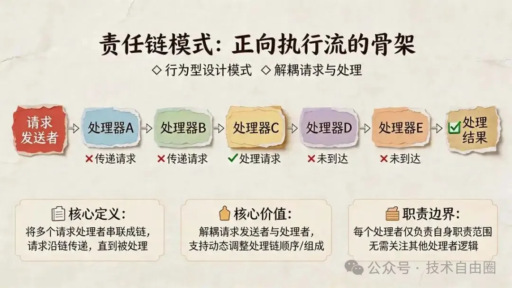

一、责任链模式（Chain of Responsibility）：正向执行流的骨架

### 1.1 模式定义与核心思想

责任链模式是一种行为型设计模式，其核心定义为：将多个请求处理者串联成一条链，请求沿着链依次传递，直到某个处理者能够处理该请求并返回结果；每个处理者只负责自己职责范围内的处理，无需关心链上其他处理者的逻辑，实现请求发送者与处理者的解耦。

该模式的核心价值在于「解耦请求与处理」，同时支持动态调整处理链的顺序和组成，让复杂的执行流程变得可配置、可扩展。

## 1.2 LangChain 内核中的实现：RunnableSequence

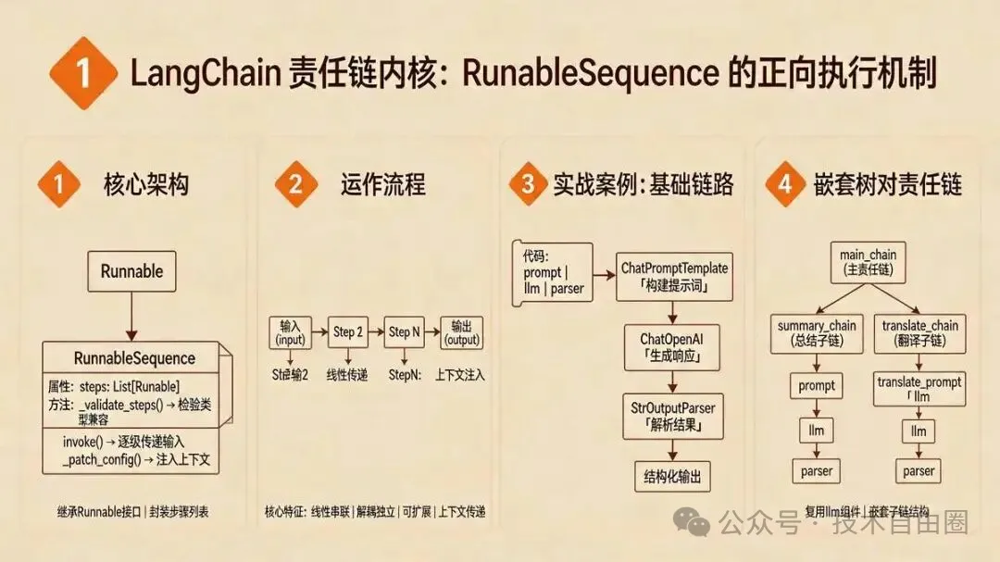

1.2 LangChain 内核中的实现：RunnableSequence

在 LangChain 中，责任链模式的核心载体是 `RunnableSequence` 类，对应前文提到的「双向责任链」中的「正向传递」部分。

所有通过 `|` 运算符串联的 Runnable 组件，最终都会被封装为 `RunnableSequence` 对象，实现请求的线性传递。

### 1.2.1 核心源码解析

LangChain 的 `RunnableSequence` 类继承自 `Runnable` 抽象接口，其核心逻辑是将多个 Runnable 步骤串联，实现输入的正向传递。

以下是简化后的核心源码（贴合 LangChain 实际实现逻辑）：

```
from abc import ABC, abstractmethod
from typing import Generic, TypeVar, Optional, List
Input = TypeVar("Input")
Output = TypeVar("Output")
# 基础 Runnable 抽象接口（命令模式核心）
class Runnable(Generic[Input, Output], ABC):
    @abstractmethod
    def invoke(self, input: Input, config: Optional[dict] = None) -> Output:
        raise NotImplementedError()
# 责任链模式核心：RunnableSequence
class RunnableSequence(Runnable[Input, Output]):
    def init(self, steps: List[Runnable]):
        self.steps = steps  # 责任链的处理步骤列表
        self.validate_steps()  # 校验步骤合法性（确保前一步输出匹配后一步输入）
    def _validate_steps(self) -> None:
        """校验步骤链的兼容性，确保前一步的输出类型匹配后一步的输入类型"""
        for i in range(len(self.steps) - 1):
            current_output_type = self.steps[i]._output_type
            next_input_type = self.steps[i+1]._input_type
            if not issubclass(current_output_type, next_input_type):
                raise ValueError(f"步骤 {i} 的输出类型 {current_output_type} 不匹配步骤 {i+1} 的输入类型 {next_input_type}")
    def invoke(self, input: Input, config: Optional[dict] = None) -> Output:
        """正向执行核心：将输入依次传递给每个步骤，前一步输出作为后一步输入"""
        value = input
        # 遍历所有步骤，正向传递输入
        for i, step in enumerate(self.steps):
            # 为每个步骤构造专属配置（传递全局上下文）
            step_config = self._patch_config(config, step_idx=i)
            # 调用当前步骤的 invoke 方法，传递输入和配置
            value = step.invoke(value, step_config)
        # 返回最终步骤的输出
        return value
    def _patch_config(self, config: Optional[dict], step_idx: int) -> dict:
        """为每个步骤修补配置，添加步骤索引、标签等信息，支持上下文传递"""
        config = config or {}
        return {
            **config,
            "step_idx": step_idx,
            "step_tag": f"step{step_idx}",
            "sequence_id": id(self)
        }
```

### 1.2.2 核心特征与运作流程

LangChain 中的责任链模式（RunnableSequence）具有以下核心特征，完全贴合责任链模式的设计思想：

- **线性串联** ：步骤按顺序排列，请求（输入）从第一个步骤开始，依次传递到最后一个步骤，形成 `input → step1 → step2 → ... → stepN → output` 的正向流。
- **解耦独立** ：每个步骤（Runnable）只关注自身的输入处理和输出返回，无需知道前一步的处理逻辑和后一步的用途，修改单个步骤不会影响整个链的运作。
- **可扩展性** ：通过 `|` 运算符可轻松添加、删除或调整步骤顺序，例如 `prompt | llm | parser` 可快速扩展为 `prompt | llm | parser | tool | formatter` 。
- **上下文传递** ：通过 `config` 参数，将全局上下文（如会话ID、日志标签、中间状态）传递给每个步骤，为后续反向回溯提供基础。

### 1.2.3 典型场景与实战案例

责任链模式是 LangChain 最基础、最常用的模式，几乎所有复杂的执行流都依赖于它。以下是两个典型实战场景：

#### 场景1：基础的 Prompt-LLM-Parser 链路

这是 LangChain 最基础的链路，通过责任链模式将 Prompt 构建、LLM 调用、结果解析三个步骤串联，实现从用户输入到结构化输出的正向传递：

```
from langchain_core.prompts import ChatPromptTemplate
from langchain_openai import ChatOpenAI
from langchain_core.output_parsers import StrOutputParser
# 1. 定义各个步骤（Runnable 实现类）
prompt = ChatPromptTemplate.from_messages([
    ("system", "你是一个专业的文本总结助手，总结内容需简洁明了，不超过50字。"),
    ("user", "{input}")
])
llm = ChatOpenAI(model="gpt-3.5-turbo")
parser = StrOutputParser()
# 2. 用责任链模式串联步骤（通过 | 运算符，底层封装为 RunnableSequence）
chain = prompt | llm | parser
# 3. 正向执行：输入依次传递给每个步骤
input_text = "LangChain 是一个用于构建大语言模型应用的框架，它提供了丰富的组件和工具，支持快速开发复杂的 LLM 应用，包括对话机器人、文本生成、知识问答等场景。"
result = chain.invoke({"input": input_text})
print(result)
# 输出：LangChain 是构建大语言模型应用的框架，提供丰富组件，支持对话、文本生成等场景。
```

#### 场景2：嵌套责任链（树形责任链）

LangChain 支持责任链的嵌套，即一个步骤本身就是一个责任链，形成树形结构，适用于复杂的多分支执行场景：

```
from langchain_core.runnables import RunnableSequence
# 子责任链1：文本总结链路
summary_chain = prompt | llm | parser
# 子责任链2：文本翻译链路（复用 llm 组件）
translate_prompt = ChatPromptTemplate.from_messages([
    ("system", "将以下文本翻译成英文，保持原意，简洁准确。"),
    ("user", "{input}")
])
translate_chain = translate_prompt | llm | parser
# 主责任链：先总结，再翻译总结结果
main_chain = RunnableSequence([summary_chain, translate_chain])
# 正向执行：输入 → 总结 → 翻译
result = main_chain.invoke({"input": input_text})
print(result)
# 输出：LangChain is a framework for building large language model applications, providing rich components and supporting scenarios such as dialogue and text generation.
```

## 1.3 责任链模式在 LangChain 中的价值

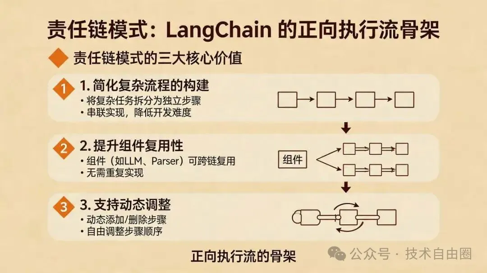

1.3 责任链模式在 LangChain 中的价值

责任链模式为 LangChain 提供了「正向执行流的骨架」，其核心价值在于：

- 简化复杂流程的构建：将复杂任务拆分为多个独立步骤，通过串联实现，降低开发难度。
- 提升组件复用性：每个步骤（如 LLM、Parser）可被多个责任链复用，无需重复实现。
- 支持动态调整：可根据业务需求，动态添加、删除或调整步骤顺序，灵活性极高。

## 二、 装饰器模式（Decorator）： 实现 LangChain Middleware 洋葱 责任链架构

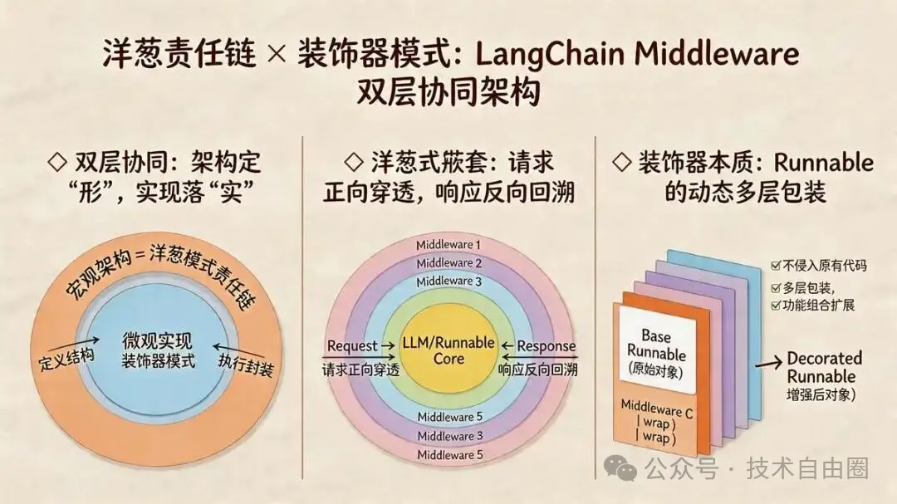

二、 装饰器模式（Decorator）： 实现 LangChain Middleware 洋葱 责任链架构

### 2.1 架构定位与设计思想：双层模式协同

LangChain Middleware 采用双层设计模式协同的工业级架构，并非单一设计模式的应用，而是“架构-实现”的完整协同体系：

- 宏观架构 = 洋葱模式责任链（定义数据流、层级结构、双向传递）
- 微观实现 = 装饰器模式（实现代码包装、功能增强、非侵入扩展）。

二者并非互斥关系，而是架构与实现的完整支撑关系，核心逻辑可概括为： **洋葱责任链定“形”，装饰器模式落“实”** 。

具体来说：

- 洋葱模式责任链：是架构设计规范，定义“请求正向穿透、响应反向回溯”的洋葱式嵌套结构，是整个中间件体系的顶层设计，决定了中间件系统的整体结构和数据流方向。
- 装饰器模式：是代码实现手段，通过动态包装 Runnable 对象，在不侵入原代码的前提下，实现层级嵌套与功能增强，是洋葱结构落地的核心技术方案，所有 LangChain Middleware 本质上都是 Runnable 装饰器。

其中，装饰器模式作为一种结构型设计模式，其核心定义为：动态地给一个对象添加一些额外的职责，而不改变其原有的类定义和接口。

该模式通过「包装」的方式，在不破坏原有对象功能的前提下，为其增加新的功能，且支持多层包装，形成嵌套结构，其核心价值在于「动态增强、不侵入原有代码」，同时支持多层增强，实现功能的组合扩展——这也是 LangChain 中间件（Runnable 包装器）的核心实现思路。

## 2.2 洋葱模式责任链：架构层定义（宏观）

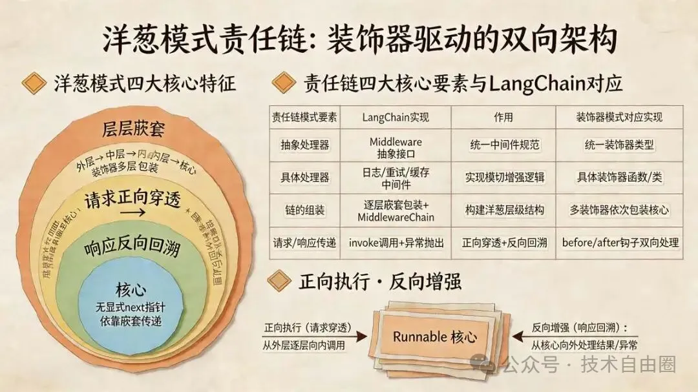

2.2 洋葱模式责任链：架构层定义（宏观）

### 2.2.1 架构核心定义

洋葱模式责任链是一种嵌套型双向责任链，与 MyBatis Interceptor、Spring AOP 同源设计，其核心特征的底层逻辑，正是装饰器模式多层包装能力的架构化体现，具体核心特征如下：

- 层层嵌套：中间件依次包裹核心 Runnable，形成“外层 → 中层 → 内层 → 核心”的洋葱结构，这一结构通过装饰器的多层嵌套包装得以实现。
- 请求正向穿透：调用从最外层进入，逐层向内传递，最终到达核心 Runnable，对应装饰器包装后，invoke 方法的正向调用流程。
- 响应反向回溯：结果从核心层向外返回，每层中间件可处理响应/异常，实现反向传递，对应装饰器中 after 钩子和异常向上抛出的逻辑。
- 无显式 next 指针：依靠嵌套包装实现传递，而非线性链表，这与装饰器“包装原对象、返回新对象”的核心逻辑高度契合，无需额外维护链表关系。

### 2.2.2 责任链四大核心要素与 LangChain 对应

责任链模式有四大核心要素，LangChain Middleware 通过模块化设计，将每个要素落地为具体的源码组件，而这些组件的实现，均依赖装饰器模式的包装特性，具体对应关系如下表所示：

| **责任链模式要素** | **LangChain 实现** | **作用** | **装饰器模式对应实现** |
| --- | --- | --- | --- |
| 抽象处理器 | Middleware 抽象接口 | 统一中间件规范，定义请求处理入口 | 定义装饰器的统一类型（接受 Runnable、返回 Runnable） |
| 具体处理器 | 日志、重试、缓存等中间件 | 实现横切增强逻辑 | 具体的装饰器函数/类（如 log\_middleware、retry\_middleware） |
| 链的组装 | 逐层嵌套包装 + MiddlewareChain | 构建洋葱层级结构 | 多个装饰器依次包装核心 Runnable，形成嵌套关系 |
| 请求/响应传递 | invoke 调用 + 异常向上抛出 | 正向穿透 + 反向回溯 | 装饰器中重写 invoke 方法，通过 before/after 钩子实现双向处理 |

该架构天然支撑双向数据流，是 LangChain 实现“正向执行、反向增强”的基础，而装饰器模式则为这一架构提供了可落地、可扩展的代码实现方案。

## 2.3 装饰器模式（Decorator）：实现定位 & 代码层实现（微观）

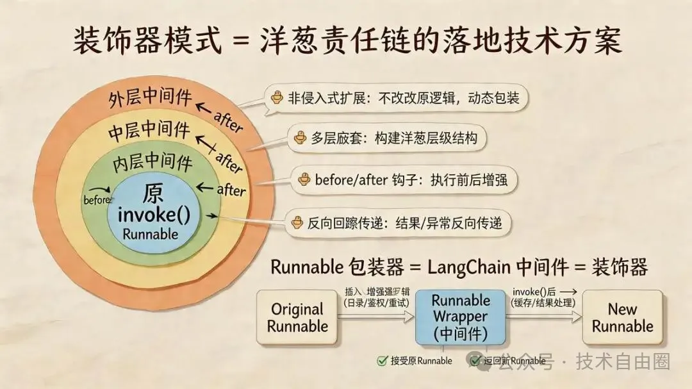

2.3 装饰器模式（Decorator）：实现定位 & 代码层实现（微观）

### 2.3.1 实现定位

装饰器模式是洋葱责任链的落地技术方案，其核心作用是通过动态包装 Runnable，创建新的 Runnable 实例，在原 invoke 执行前后插入增强逻辑，既满足洋葱责任链的层级嵌套要求，又实现了功能的非侵入式扩展，具体可实现以下核心能力：

- 非侵入式扩展：不修改核心 Runnable 的类定义和 invoke 方法，仅通过包装添加增强逻辑，原 Runnable 可独立使用。
- 多层嵌套（构建洋葱结构）：支持多个装饰器（中间件）层层包装，形成“外层中间件 → 中层中间件 → 原 Runnable”的嵌套结构，契合洋葱责任链的层级要求。
- before/after 钩子：在原 invoke 方法执行前后插入自定义逻辑，分别对应洋葱责任链的“正向穿透”和“反向回溯”。
- 反向回溯传递：通过 after 钩子和异常向上抛出，实现结果、状态、异常的反向传递，支撑洋葱责任链的双向数据流。

在 LangChain 中，装饰器模式的核心载体是「Runnable 包装器」（即中间件），对应洋葱责任链中“双向传递”的核心逻辑，所有中间件本质上都是一个装饰器：接受一个原 Runnable 对象，返回一个新的 Runnable 对象，在原对象的 invoke 方法执行前后，插入自定义增强逻辑（如日志、重试、缓存、鉴权等），完全遵循装饰器模式的设计思想，同时落地洋葱责任链的架构要求。

## 2.3.2 装饰器模式（Decorator）核心源码解析

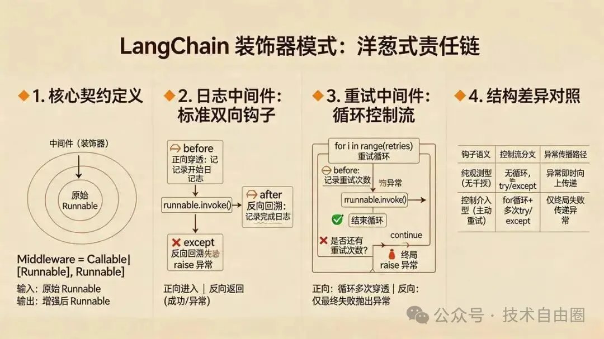

2.3.2 装饰器模式（Decorator）核心源码解析

LangChain 中的中间件（装饰器）通常以函数或类的形式实现，其核心逻辑是“包装原 Runnable，重写 invoke 方法，添加 before/after 钩子”，以下是简化后的中间件实现（贴合 LangChain 实际源码逻辑），同时体现洋葱责任链的正向穿透与反向回溯逻辑。

下面 是尼恩 写的一个简单的 洋葱责任链 案例：

```
from langchain_core.runnables import Runnable, RunnableLambda
from typing import Callable, Optional
# 定义中间件（装饰器）的类型：接受 Runnable，返回新的 Runnable（对应责任链抽象处理器）
Middleware = Callable[[Runnable], Runnable]
# 示例1：日志中间件（装饰器）—— 记录执行前后的日志，实现正向穿透与反向回溯
def log_middleware(name: str) -> Middleware:
    def wrap(runnable: Runnable) -> Runnable:
        """包装原 Runnable，添加日志增强逻辑，构建洋葱外层节点"""
        def new_invoke(input, config: Optional[dict] = None):
            # before 钩子：执行前记录日志（正向穿透，对应洋葱正向进入）
            print(f"【{name}】开始执行，输入：{input}")
            try:
                # 调用内层（下一层中间件/核心 Runnable），完成正向穿透
                result = runnable.invoke(input, config)
                # after 钩子：执行后记录日志（反向回溯，对应洋葱反向返回）
                print(f"【{name}】执行完成，输出：{result}")
                return result
            except Exception as e:
                # 异常处理钩子（反向回溯，将异常向上传递）
                print(f"【{name}】执行失败，异常：{str(e)}")
                raise  # 向上抛出异常，支持反向回溯，契合洋葱责任链异常传递逻辑
        # 将新的 invoke 方法封装为 RunnableLambda，返回新的 Runnable（装饰器核心）
        return RunnableLambda(new_invoke)
    return wrap
# 示例2：重试中间件（装饰器）—— 执行失败时重试，实现正向重试与异常回溯
def retry_middleware(retries: int = 3) -> Middleware:
    def wrap(runnable: Runnable) -> Runnable:
        """包装原 Runnable，添加重试增强逻辑，构建洋葱中层节点"""
        def new_invoke(input, config: Optional[dict] = None):
            for i in range(retries):
                try:
                    # before 钩子：记录重试次数（正向穿透）
                    if i > 0:
                        print(f"【重试】第 {i} 次重试执行")
                    # 调用内层（下一层中间件/核心 Runnable）
                    return runnable.invoke(input, config)
                except Exception as e:
                    # after 钩子：重试失败处理（反向回溯）
                    if i == retries - 1:
                        print(f"【重试】所有重试失败，异常：{str(e)}")
                        raise  # 最终异常向上抛出，完成反向回溯
                    continue
        return RunnableLambda(new_invoke)
    return wrap
```

> *尼恩提示：原文3w字以上， 超过平台限制， 此处省略 1000字，具体请参考 免费pdf。*
> 
> *完整版本，请参考 尼恩 免费百度网盘 免费pdf ，点赞收藏本文后，找尼恩获取*

## 2.3.3 LangChain 中的装饰器模式（中间件） 核心特征与运作流程

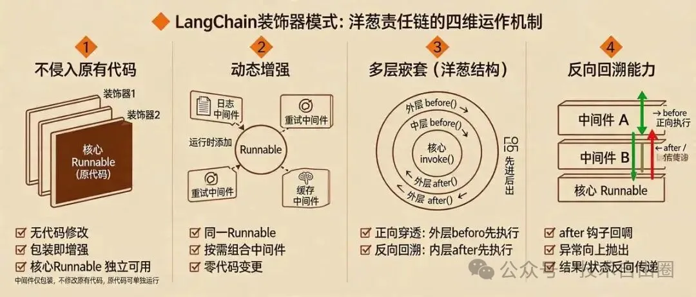

2.3.3 LangChain 中的装饰器模式（中间件） 核心特征与运作流程

LangChain 中的装饰器模式（中间件），既完全贴合装饰器模式的设计思想，又精准落地洋葱责任链的架构要求，其核心特征与运作流程高度协同，具体如下：

- 不侵入原有代码：中间件不修改原 Runnable 的类定义和 invoke 方法，仅通过包装的方式添加增强逻辑，原 Runnable 可独立使用，既符合装饰器模式的核心价值，也确保洋葱责任链的核心节点（核心 Runnable）不受干扰。
- 动态增强：可根据业务需求，为同一个 Runnable 动态添加不同的中间件（如同时添加日志、重试、缓存），无需修改代码，支撑洋葱责任链的灵活扩展。
- 多层嵌套（洋葱结构）：支持多个中间件层层包装，形成“外层中间件 → 中层中间件 → 原 Runnable”的嵌套结构，执行时遵循“先进后出”（FILO）的原则，即外层 before 先执行（正向穿透），内层 after 先执行（反向回溯），完全契合洋葱责任链的层级执行逻辑。
- 反向回溯能力：通过 after 钩子和异常向上抛出，实现结果、状态、异常的反向传递，这是 LangChain 洋葱责任链中“反向回溯”的核心实现方式，也是装饰器模式支撑架构落地的关键。

## 2.3.4 典型场景与实战案例

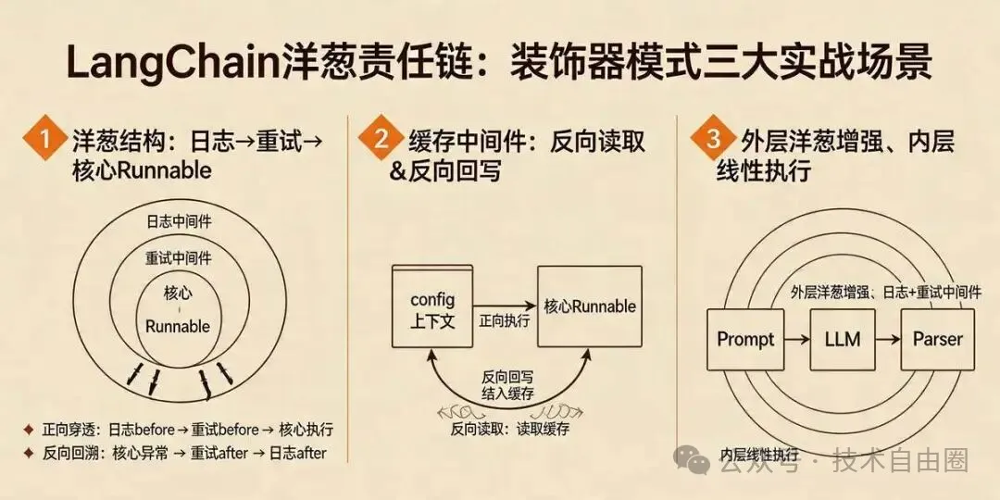

2.3.4 典型场景与实战案例

装饰器模式（中间件）是 LangChain 洋葱责任链架构落地的核心，以下是三个高频实战场景，既体现装饰器模式的功能增强能力，也完整呈现洋葱责任链“请求正向穿透、响应反向回溯”的运作流程：

> *尼恩提示：原文3w字以上， 超过平台限制， 此处省略 1000字，具体请参考 免费pdf。*
> 
> *完整版本，请参考 尼恩 免费百度网盘 免费pdf ，点赞收藏本文后，找尼恩获取*

## 2.4 架构+实现协同运行：洋葱执行流程（最关键）

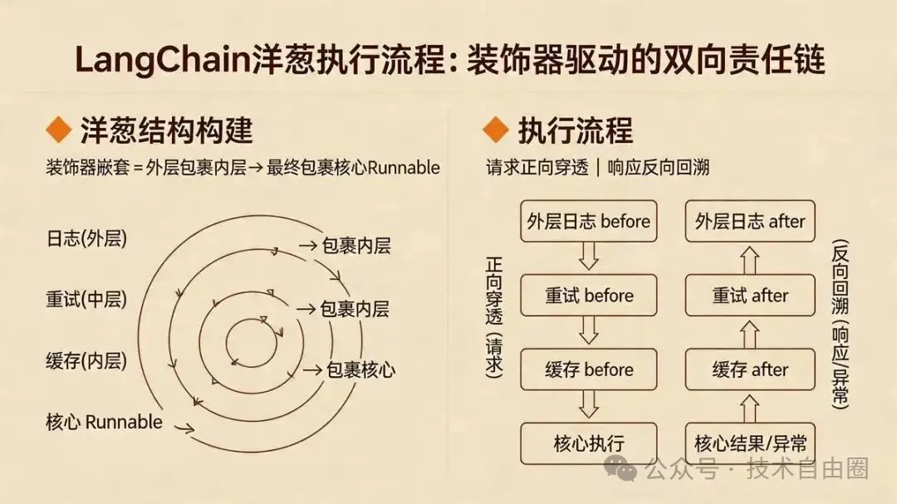

2.4 架构+实现协同运行：洋葱执行流程（最关键）

### 2.4.1 洋葱结构构建（装饰器嵌套）

LangChain 洋葱责任链的层级结构，完全通过装饰器的嵌套包装实现，核心逻辑是“外层装饰器包裹内层装饰器，最终包裹核心 Runnable”，构建过程简洁且可扩展.

代码示例如下：

```
# 核心 Runnable（洋葱最内层，责任链的最终处理节点）
def core_process(text):
    if len(text) < 10:
        raise Exception("输入过短")
    return text.upper()
core = RunnableLambda(core_process)
# 装饰器层层包装 = 构建洋葱责任链
# 洋葱结构：日志(外层) → 重试(中层) → 缓存(内层) → 核心(最内层)
chain = log_middleware("外层日志")(
    retry_middleware(2)(
        cache_middleware()(core)
    )
)
```

这种构建方式，既符合装饰器模式“动态包装、多层扩展”的特点，又精准落地了洋葱责任链“层层嵌套”的架构要求，无需额外的链管理逻辑，仅通过装饰器的嵌套调用即可完成洋葱结构的搭建。

### 2.4.2 执行流程（双向数据流）

基于装饰器实现的洋葱责任链，其执行流程完全遵循“请求正向穿透、响应反向回溯”的核心逻辑，结合上述多层包装的例子，完整执行流程如下：

- 正向穿透（请求）：外层日志 before → 重试 before → 缓存 before → 核心执行
- 反向回溯（响应/异常）：核心结果/异常 → 缓存 after（缓存回写/异常处理） → 重试 after（重试判断/异常处理） → 外层日志 after（日志记录/异常处理）

该流程完全符合洋葱模式责任链架构定义，所有环节均由装饰器模式代码落地，实现了架构设计与代码实现的高度统一。

## 2.5 架构与实现价值总结

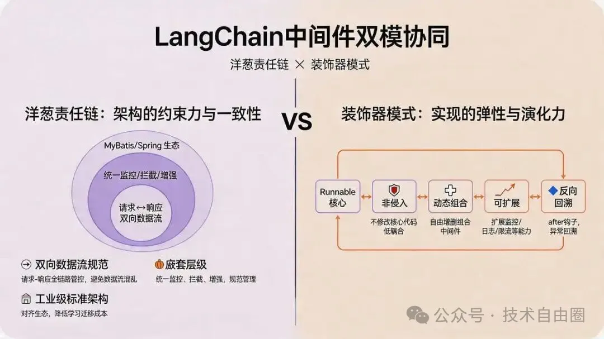

2.5 架构与实现价值总结

LangChain Middleware 的双层模式协同（洋葱责任链+装饰器模式），既保证了架构的工业级规范性，又实现了代码的可扩展性和可维护性，二者的价值互补，构成了 LangChain 中间件体系的核心竞争力。

### 2.5.1 洋葱责任链（架构）价值

- 定义双向数据流规范，支撑请求-响应全链路管控，明确中间件系统的整体结构和执行逻辑，避免数据流混乱。
- 形成嵌套层级，便于统一监控、拦截、增强，让中间件的管理更具规范性，契合工业级架构的设计要求。
- 工业级标准架构，与 MyBatis/Spring 生态对齐，降低开发者的学习成本和架构迁移成本。

### 2.5.2 装饰器模式（实现）价值

- 非侵入：不修改核心 Runnable 代码，保护核心业务逻辑的完整性，同时支持功能的灵活扩展，降低代码耦合度。
- 动态组合：可根据业务需求，自由增删、组合中间件，无需修改核心链路代码，提升开发效率和系统灵活性。
- 可扩展：横向扩展监控、日志、限流、缓存等横切能力，支撑洋葱责任链架构的功能延伸，满足不同业务场景的需求。
- 实现反向回溯：通过 after 钩子和异常传递，支撑洋葱责任链的双向数据流，让响应、状态、异常的回溯成为可能。

## 2.6 LangChain 最新版本的 AgentMiddleware 核心源码 精讲

**LangChain的源码一直在升级。**

前面为了 演示，是demo版本的 参考源码。

接下来，尼恩直接用 **最新版本的 、最新版本的 、最新版本的 LangChain AgentMiddleware 源码 来介绍。**

介绍过程中， 去掉重载、辅助工具类，只保留 **底层基类核心代码+高频实用装饰器** ，原汁原味保留官方泛型、生命周期钩子、异常逻辑、核心入参出参，搭配大白话逐段解析 LangGraph原生Agent，看完直接上手二次开发。

AgentMiddleware是LangChain+LangGraph生态里，Agent智能体 **非侵入式生命周期中间件基类** ，全程不改动Agent底层源码、不破坏原生执行链路，通过钩子拦截、包装接管，实现日志、重试、缓存、权限、动态提示、流控、故障降级所有增强逻辑。

整体分为两大核心模块： **泛型基类（继承定制）** + **语法糖装饰器（函数速用）** ，下方全是精简后可直接复制使用的核心源码，无冗余代码。

> *尼恩提示：原文3w字以上， 超过平台限制， 此处省略 1000字，具体请参考 免费pdf。*
> 
> *完整版本，请参考 尼恩 免费百度网盘 免费pdf ，点赞收藏本文后，找尼恩获取*

## 2.7 洋葱责任链+装饰器架构总结

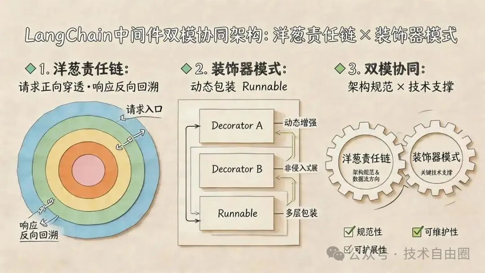

2.6 最终权威表述（可直接用于论文/文档）

LangChain Middleware 采用洋葱模式责任链作为顶层架构，实现“请求正向穿透、响应反向回溯”的双向嵌套结构；并以装饰器模式作为代码实现方案，通过动态包装 Runnable 完成层级构建与功能增强。

其中：

- 装饰器模式作为结构型设计模式，其“动态增强、非侵入式扩展、多层包装”的核心特性，为洋葱责任链的落地提供了关键技术支撑；
- 洋葱责任链则为装饰器模式的应用提供了架构规范和数据流方向，二者协同构成 LangChain 中间件的完整设计体系，既保证了架构的规范性，又实现了代码的可扩展性和可维护性。

## 三、命令模式（Command）：统一执行契约的基础

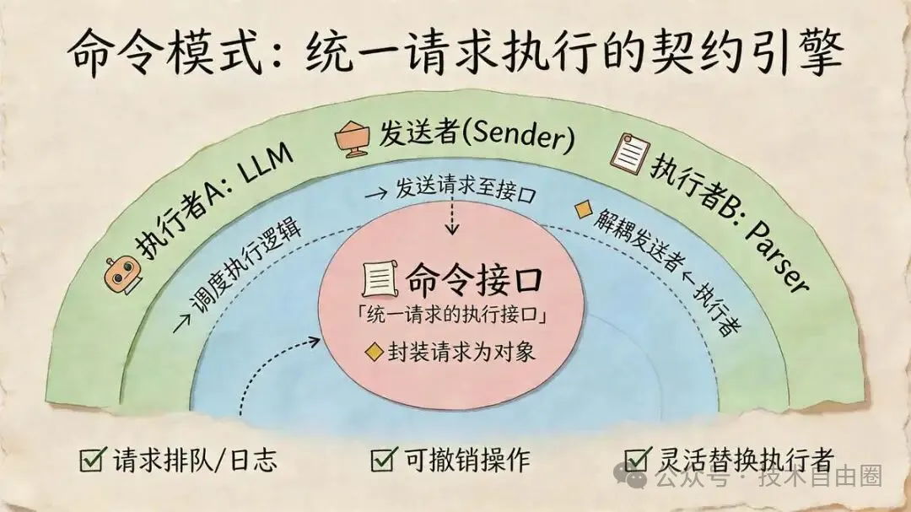

三、命令模式（Command）：统一执行契约的基础

### 3.1 模式定义与核心思想

命令模式是一种行为型设计模式，其核心定义为：将一个请求封装为一个对象，使你可以用不同的请求对客户进行参数化；对请求排队或记录请求日志，以及支持可撤销的操作。

该模式的核心价值在于「统一请求的执行接口」，将请求的发送者（如责任链）与请求的执行者（如 LLM、Parser）解耦，使得不同的执行者可以被统一调度、替换和扩展。

## 3.2 LangChain 内核中的实现：Runnable 抽象接口

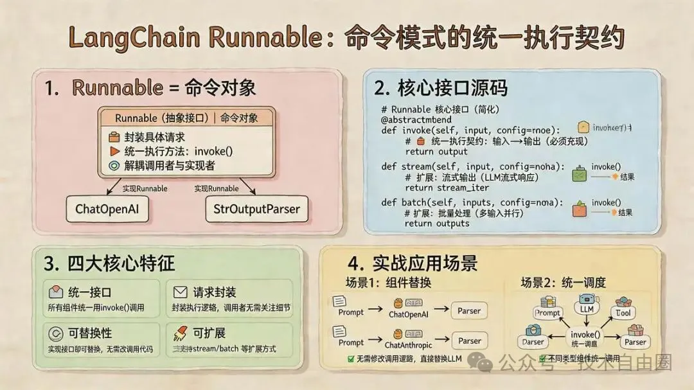

3.2 LangChain 内核中的实现：Runnable 抽象接口

在 LangChain 中，命令模式的核心载体是 `Runnable` 抽象接口——所有可执行组件（Prompt、LLM、Parser、Tool、Chain、中间件包装后的对象）都实现了该接口，统一通过 `invoke` 方法执行请求，这是整个 LangChain 架构的「统一执行契约」。

LangChain 中的 `Runnable` 接口，本质上就是命令模式中的「命令对象」：每个 `Runnable` 都封装了一个具体的请求（如构建 Prompt、调用 LLM、解析结果），而 `invoke` 方法就是命令的「执行方法」。

> *尼恩提示：原文3w字以上， 超过平台限制， 此处省略 1000字，具体请参考 免费pdf。*
> 
> *完整版本，请参考 尼恩 免费百度网盘 免费pdf ，点赞收藏本文后，找尼恩获取*

## 3.3 命令模式在 LangChain 中的价值

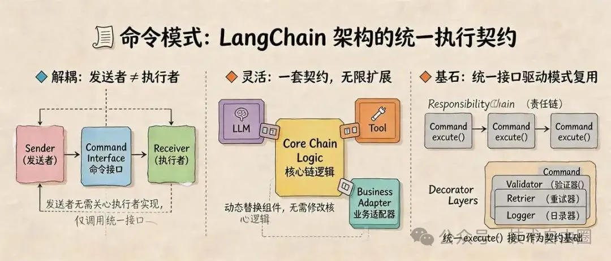

3.3 命令模式在 LangChain 中的价值

命令模式为 LangChain 提供了「统一执行契约」，其核心价值在于：

- 降低组件耦合：请求发送者与执行者解耦，发送者无需关心执行者的具体实现，只需调用统一接口。
- 提升架构灵活性：支持组件的动态替换和扩展，无需修改核心逻辑，适配不同的 LLM、工具和业务场景。
- 支撑模式组合：为责任链、装饰器模式提供基础——只有统一执行接口，才能实现步骤串联和功能包装。

## 四、管道模式（Pipeline Pattern）：数据流的规范传递

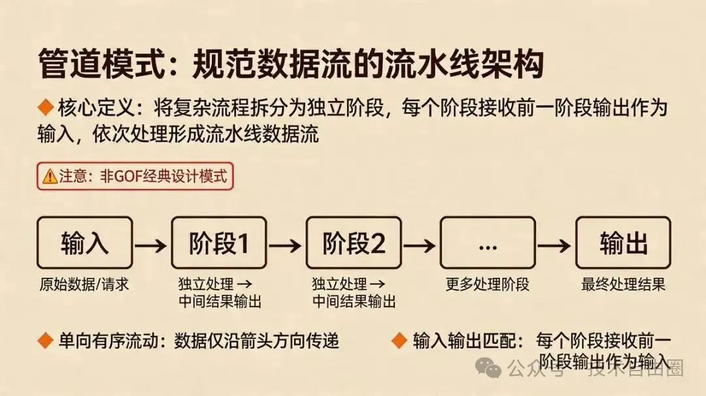

四、管道模式（Pipeline Pattern）：数据流的规范传递

### 4.1 模式定义与核心思想

管道模式是一种架构模式（非 GOF 经典设计模式），其核心定义为：将一个复杂的处理流程拆分为多个独立的处理阶段，每个阶段只负责接收前一个阶段的输出作为输入，进行特定处理后，将结果传递给下一个阶段，形成「输入 → 阶段1 → 阶段2 →... → 输出」的流水线式数据流。

该模式的核心价值在于「规范数据流传递」，确保每个阶段的输入输出匹配，实现数据的单向、有序流动，同时提升流程的可维护性和可扩展性。

## 4.2 LangChain 内核中的Pipeline Pattern实现：LCEL 流式执行

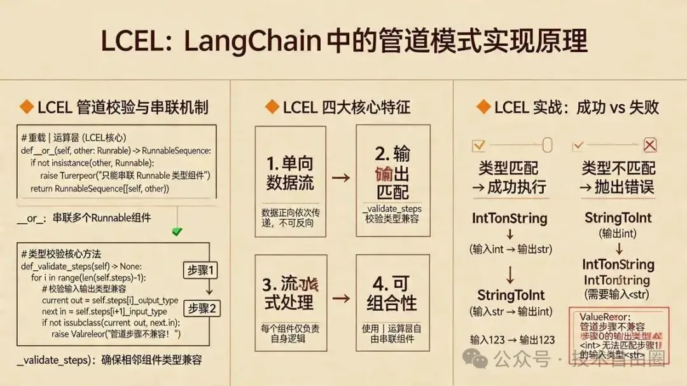

4.2 LangChain 内核中的Pipeline Pattern实现：LCEL 流式执行

在 LangChain 中，管道模式的核心载体是「LCEL（LangChain Expression Language）」，即通过 `|` 运算符串联多个 Runnable 组件，实现「前一个组件的输出 = 后一个组件的输入」的流水线式数据流。

管道模式与责任链模式紧密结合，责任链模式定义了执行流的骨架，管道模式规范了数据流的传递方式。

LangChain 的 LCEL 本质上就是管道模式的实现，其核心逻辑是「数据流的单向传递、输入输出的类型匹配」，这也是 LangChain 能够实现复杂链路串联的基础。

> *尼恩提示：原文3w字以上， 超过平台限制， 此处省略 1000字，具体请参考 免费pdf。*
> 
> *完整版本，请参考 尼恩 免费百度网盘 免费pdf ，点赞收藏本文后，找尼恩获取*

## 4.3 管道模式在 LangChain 中的价值

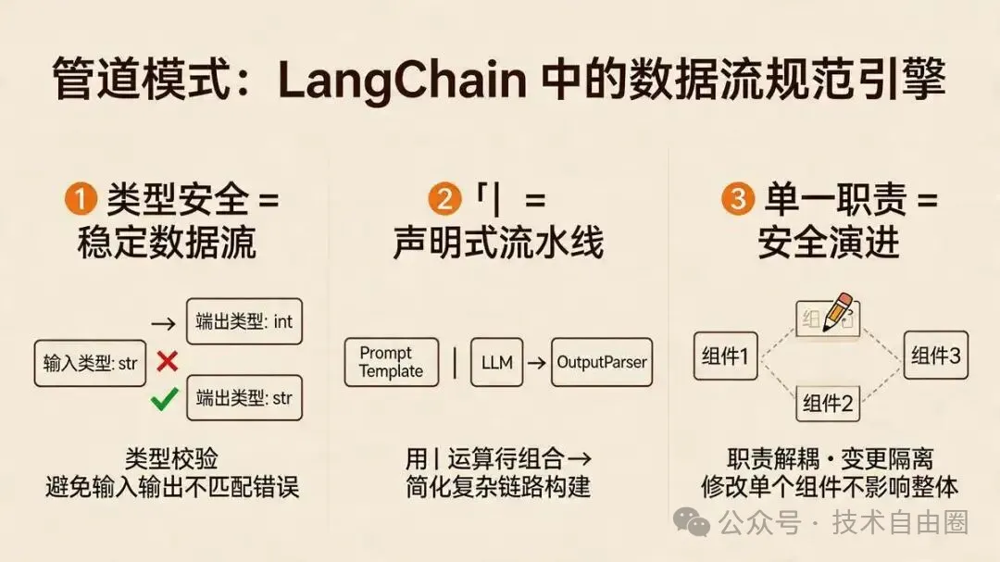

4.3 管道模式在 LangChain 中的价值

管道模式为 LangChain 提供了「规范的数据流传递方式」，其核心价值在于：

- 确保数据流规范：通过类型校验，避免因输入输出类型不匹配导致的错误，提升链路的稳定性。
- 简化复杂链路构建：通过 `|` 运算符，可快速组合多个组件，构建流水线式的处理流程，降低开发难度。
- 提升链路可维护性：每个组件只负责特定的数据流处理，修改单个组件不会影响整个管道的数据流传递。

## 五、四大设计模式的协同关系：构建 LangChain 双向架构

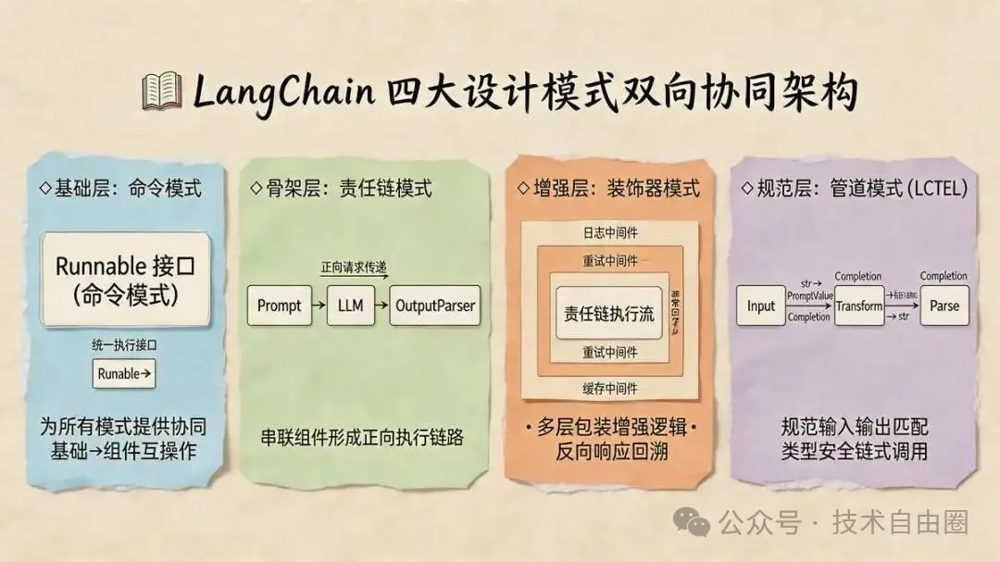

五、四大设计模式的协同关系：构建 LangChain 双向架构

LangChain 内核的四大设计模式并非孤立存在，而是相互嵌套、协同作用，共同构建出「请求正向传递、响应反向回溯」的双向执行架构。其协同关系可总结为以下几点：

### 5.1 核心协同逻辑

**(1) 命令模式（Runnable 接口）是基础：定义了所有组件的统一执行接口，为责任链、装饰器、管道模式提供了协同的前提——只有所有组件都实现统一接口，才能实现串联、包装和数据流传递。**

**(2) 责任链模式（RunnableSequence）是骨架：将多个 Runnable 组件串联成正向执行流，实现请求的正向传递，构成整个执行链路的骨架。**

**(3) 装饰器模式（中间件）是增强层：通过多层包装，为责任链（或单个组件）添加增强逻辑（日志、重试、缓存等），同时通过 after 钩子和异常传递，实现响应的反向回溯。**

**(4) 管道模式（LCEL）是规范：规范了责任链中数据流的传递方式，确保每个步骤的输入输出匹配，实现流水线式的正向数据流。**

## 5.2 四大设计模式的协同关系 整体架构示意图

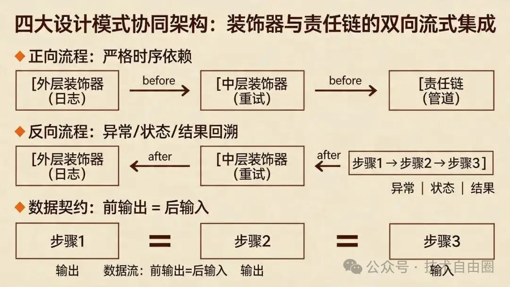

5.2 四大设计模式的协同关系 整体架构示意图

> *尼恩提示：原文3w字以上， 超过平台限制， 此处省略 1000字，具体请参考 免费pdf。*
> 
> *完整版本，请参考 尼恩 免费百度网盘 免费pdf ，点赞收藏本文后，找尼恩获取*

## 5.3 一句话总结协同关系

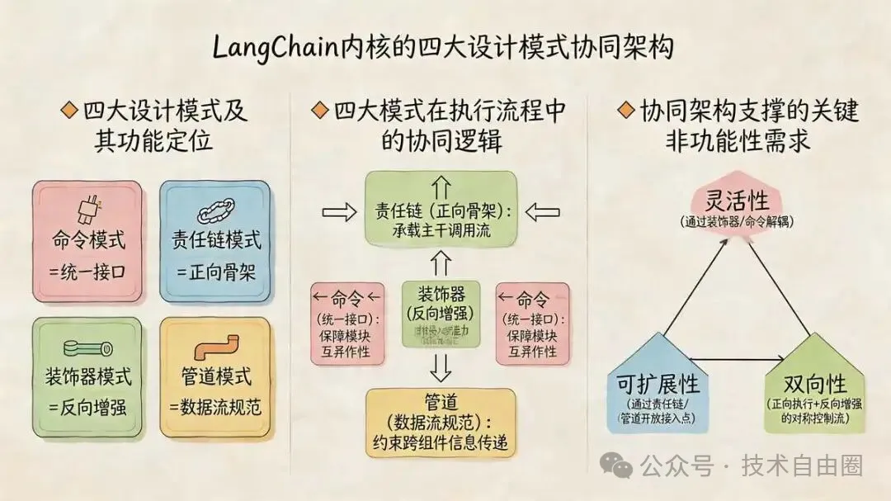

5.3 一句话总结协同关系

LangChain 内核 = 命令模式（统一接口）+ 责任链模式（正向骨架）+ 装饰器模式（反向增强）+ 管道模式（数据流规范），四者协同作用，构建出灵活、可扩展、双向的执行架构。

## 六、LangChain 四大设计模式的协同关系 总结与实战启示

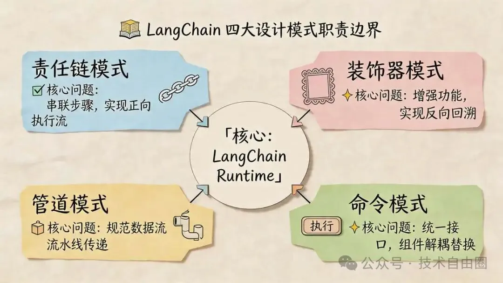

六、LangChain 四大设计模式的协同关系 总结与实战启示

### 6.1 核心总结

LangChain 的强大之处，不在于其封装的 LLM 调用、工具集成等表层功能，而在于其底层对经典设计模式的精妙运用。四大设计模式各司其职、协同工作，为 LangChain 提供了极高的灵活性、可扩展性和可维护性：

- 责任链模式：解决「如何串联步骤，实现正向执行流」的问题。
- 装饰器模式：解决「如何增强功能，实现反向回溯」的问题。
- 命令模式：解决「如何统一接口，实现组件解耦与替换」的问题。
- 管道模式：解决「如何规范数据流，实现流水线式传递」的问题。

## 6.2 LangChain 四大设计模式的协同关系 启示

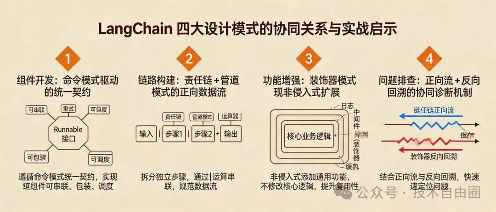

6.2 LangChain 四大设计模式的协同关系 启示

理解 LangChain 内核的四大设计模式，对开发者的实战开发具有重要启示：

**(1) 组件开发：自定义组件时，需严格实现 Runnable 接口，遵循命令模式的统一执行契约，确保组件可被串联、包装和调度。**

**(2) 链路构建：构建复杂链路时，利用责任链和管道模式，将任务拆分为独立步骤，通过 `|` 运算符串联，确保数据流规范。**

**(3) 功能增强：需要添加日志、重试、缓存等通用功能时，利用装饰器模式（中间件），避免侵入核心业务逻辑，提升代码复用性。**

**(4) 问题排查：遇到链路执行异常时，可结合装饰器的反向回溯（日志、异常传递）和责任链的正向流，快速定位问题所在。**

总之，LangChain 内核的四大设计模式，是其架构的灵魂所在。深入理解这些模式的实现细节和协同关系，不仅能帮助开发者更好地使用 LangChain 框架，更能提升自身的架构设计能力，将这些模式运用到其他软件开发场景中。

## 说在最后：有问题找45岁老架构取经

尼恩提示： 要拿到 高薪offer， 或者 要进大厂，必须来点 **高大上、体系化、深度化** 的答案， 整点技术狠活儿。

只要按照上面的 尼恩团队梳理的 方案去作答， 你的答案不是 100分，而是 120分。 面试官一定是 心满意足， 五体投地。

按照尼恩的梳理，进行 深度回答，可以充分展示一下大家雄厚的 “技术肌肉”， **让面试官爱到 “不能自已、口水直流”** ，然后实现”offer直提”。

在面试之前，建议大家系统化的刷一波 5000页《 [尼恩Java面试宝典PDF](https://mp.weixin.qq.com/s?__biz=MzkxNzIyMTM1NQ==&mid=2247497474&idx=1&sn=54a7b194a72162e9f13695443eabe186&scene=21#wechat_redirect) 》，里边有大量的大厂真题、面试难题、架构难题。

很多小伙伴刷完后， 吊打面试官， 大厂横着走。

在刷题过程中，如果有啥问题，大家可以来 找 40岁老架构师尼恩交流。

另外，如果没有面试机会， 可以找尼恩来改简历、做帮扶。前段时间， **[空窗2年 成为 架构师， 32岁小伙逆天改命， 同学都惊呆了](https://mp.weixin.qq.com/s?__biz=MzIxMzYwODY3OQ==&mid=2247486483&idx=1&sn=bb13a0fca3d7f1e0420029f353565ad6&scene=21#wechat_redirect) 。**

狠狠卷，实现 “offer自由” 很容易的， 前段时间一个武汉的跟着尼恩卷了2年的小伙伴， 在极度严寒/痛苦被裁的环境下， offer拿到手软， 实现真正的 “offer自由” 。

## 下面的案例， 通过 尼恩 三高架构 +尼恩 AI架构 +尼恩 架构陪跑， 实现 P7 升级

[小伙赶在32岁 末班车，拿到 京东P7（60w）， 撬开P8（年薪100W）通道， 逆天改命了！！！](https://mp.weixin.qq.com/s?__biz=MzIxMzYwODY3OQ==&mid=2247487192&idx=1&sn=284141b9a55954d371207c667e3a2443&scene=21#wechat_redirect)

[逆袭 100万 P8。37岁 空窗6个月，靠 Java+AI双栖架构， 2个月上岸 100w年薪到手，职业重生+逆天改命！](https://mp.weixin.qq.com/s?__biz=MzIxMzYwODY3OQ==&mid=2247487170&idx=1&sn=239470e9b38c511261839c9d6bb39f5e&scene=21#wechat_redirect)

[一飞冲天， 逆 首席： 37 岁 借力 Java+AI 逆袭 首席架构 ， 年薪80W+太香了](https://mp.weixin.qq.com/s?__biz=MzIxMzYwODY3OQ==&mid=2247487126&idx=1&sn=9016db06543f328a42cd37eadfceffee&scene=21#wechat_redirect)

[31岁 /专科 升架构成功， 收10个offer 变 offer 皇帝 ！！ 下一步，直冲100W](https://mp.weixin.qq.com/s?__biz=MzIxMzYwODY3OQ==&mid=2247487047&idx=1&sn=0397145548d8c1e76ee900c7e5920f4d&scene=21#wechat_redirect)

[奇迹: 一年 涨2倍， 年薪 60W 梦想实现 。 接下来，开启 40岁之前的 年薪 200W 梦想](https://mp.weixin.qq.com/s?__biz=MzIxMzYwODY3OQ==&mid=2247487014&idx=1&sn=5d1359a7adc7c9e46e6374597bb03138&scene=21#wechat_redirect)

[28岁/6年/被裁1年，收 3 大厂offer ， 成 大厂 皇后 。2本学历 51W 年薪，惊天 逆涨，涨薪2倍](https://mp.weixin.qq.com/s?__biz=MzIxMzYwODY3OQ==&mid=2247486987&idx=1&sn=ff977f450dd242446f228d3a6585e258&scene=21#wechat_redirect) ，大厂皇后

[涨薪传奇： 18k->38K, 单月暴20K，32岁小伙伴 2个月时间年薪 翻1.5倍 ，一步登天+逆天改命](https://mp.weixin.qq.com/s?__biz=MzIxMzYwODY3OQ==&mid=2247486960&idx=1&sn=f57253a448694c32e834207381c42284&scene=21#wechat_redirect)

[低学历 传奇：29岁6年专套本，受够了外包，狠卷3个月逆袭大厂 涨 1倍， 逆天改命](https://mp.weixin.qq.com/s?__biz=MzIxMzYwODY3OQ==&mid=2247486945&idx=1&sn=f6ff6231ccf3585624161c2ef1f50fdf&scene=21#wechat_redirect)

[极速上岸： 被裁 后， 8天 拿下 京东，狠涨 一倍 年薪48W， 小伙伴 就是 做对了一件事](https://mp.weixin.qq.com/s?__biz=MzIxMzYwODY3OQ==&mid=2247486913&idx=1&sn=edd6774e9d17c39327e8dcb95fdd68d9&scene=21#wechat_redirect)

[外包+二本 进 美团： 26岁小2本 一步登天， 进了顶奢大厂（ 美团） ， 太爽了](https://mp.weixin.qq.com/s?__biz=MzIxMzYwODY3OQ==&mid=2247486904&idx=1&sn=e7c878f99ed101ebfbd1d80ec0e07401&scene=21#wechat_redirect)

[超牛的Java+Al 双栖架构： 34岁无路可走，一个月翻盘，拿 3个架构offer，靠 Java+Al 逆天改命！！！](https://mp.weixin.qq.com/s?__biz=MzIxMzYwODY3OQ==&mid=2247486848&idx=1&sn=ff43d058271b0801f84aba3f3d957855&scene=21#wechat_redirect)

java+AI 逆袭2： [：3年 程序媛 被裁， 25W-》40W 上岸， 逆涨60%。 Java+AI 太神了， 架构小白 2个月逆天改命](https://mp.weixin.qq.com/s?__biz=MzIxMzYwODY3OQ==&mid=2247486858&idx=1&sn=9cd122c18d166433b43d0952d3a7a7a8&scene=21#wechat_redirect)

[Java+AI逆袭3 ： 36岁/失业7个月/彻底绝望 。狠卷 3个月 Java+AI ，终于逆风翻盘，顺利 上岸](https://mp.weixin.qq.com/s?__biz=MzIxMzYwODY3OQ==&mid=2247486870&idx=1&sn=990a540a155cdb8254ebce6c75816882&scene=21#wechat_redirect)

[Java+AI逆袭 ： 闲了一年，41岁/失业12个月/彻底绝望 。狠卷 2个月 Java+AI ，终于逆风翻盘](https://mp.weixin.qq.com/s?__biz=MzIxMzYwODY3OQ==&mid=2247486880&idx=1&sn=a37033157c766ac5ae7c9195fe776693&scene=21#wechat_redirect)

[Java+AI逆袭5：1个月大涨2.5W，37岁 脱坑外包， 入了正编，GO+AI 要逆天了](https://mp.weixin.qq.com/s?__biz=MzIxMzYwODY3OQ==&mid=2247486885&idx=1&sn=4e26fbb093f45d437dedf14ea9b9e6c5&scene=21#wechat_redirect)

**职业救助站**

实现职业转型，极速上岸

关注 **职业救助站** 公众号，获取每天职业干货  
助您实现 **职业转型、职业升级、极速上岸**  
\---------------------------------

**技术自由圈**

实现架构转型，再无中年危机

关注 **技术自由圈** 公众号，获取每天技术千货  
一起成为牛逼的 **未来超级架构师**

**几十篇架构笔记、5000页面试宝典、20个技术圣经  
请加尼恩个人微信 免费拿走**

**暗号，请在 公众号后台 发送消息：领电子书**

如有收获，请点击底部的"在看"和"赞"，谢谢

继续滑动看下一个

技术自由圈

向上滑动看下一个

<iframe src="chrome-extension://eigdjhmgnaaeaonimdklocfekkaanfme/side-panel.html?context=iframe"></iframe>