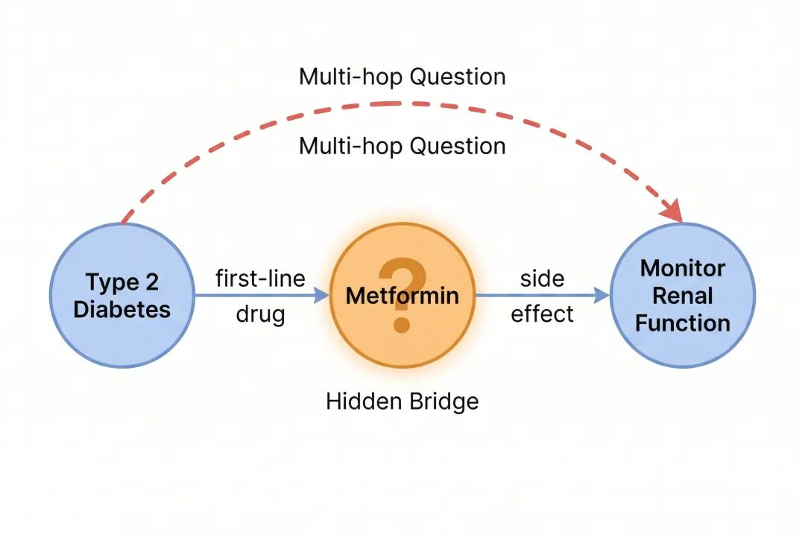
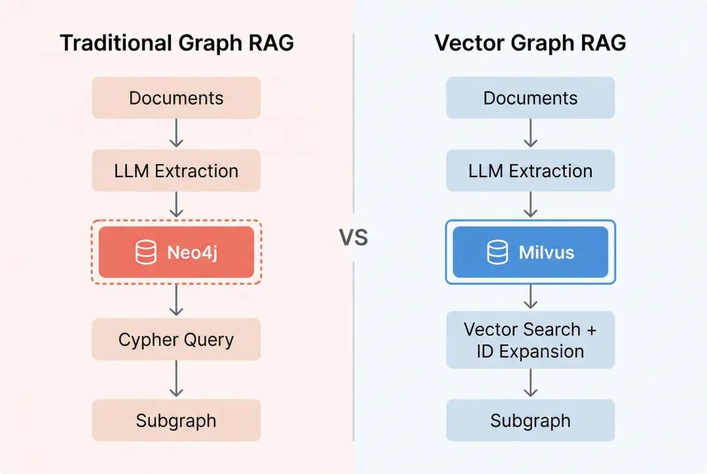
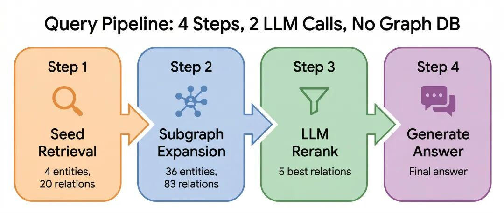
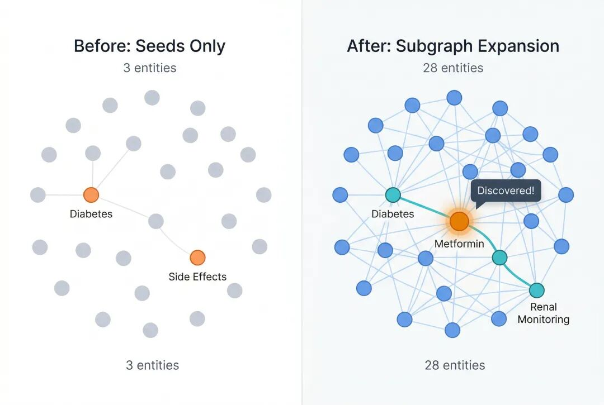
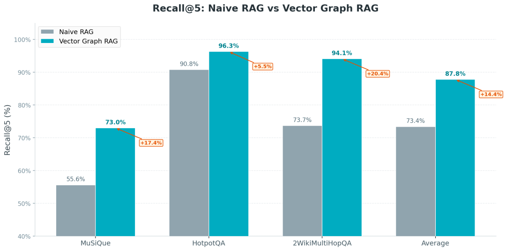
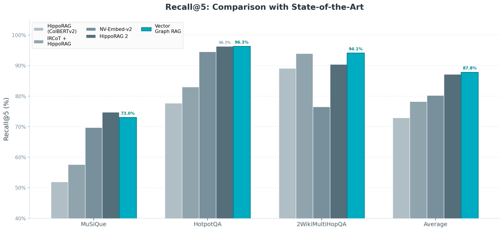
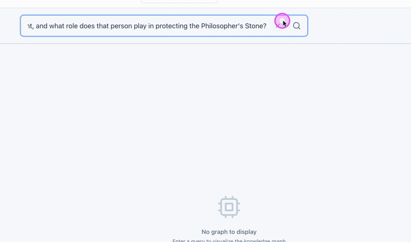
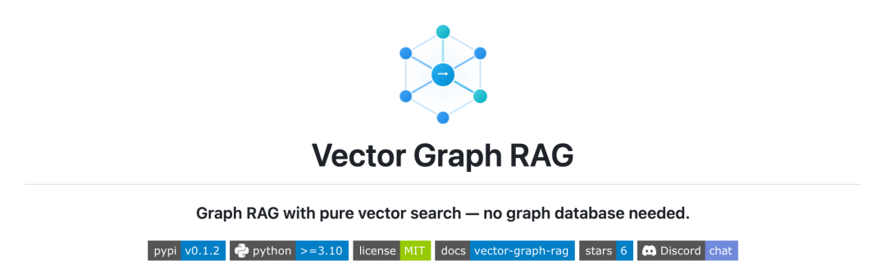

原创 张晨 *2026年4月22日 18:18*


做 RAG 多跳问答的朋友，应该没有人还没被图数据库PUA 过。

过去，想解决跨段落推理、多跳查询，业内标准答案永远是：知识图谱+ 图数据库。然后开发者需要提取三元组、部署 Neo4j/Neo4j、学 Cypher 查询语言、运维向量库 + 图库两套系统……不仅系统复杂度翻倍，运维成本、学习门槛也双双拉满。

那么有没有一种可以绕过图数据库，依然能解决多跳问题的方案呢？

实测显示，把实体、关系、段落全扔进 Milvus，用子图扩展代替图遍历，用一次 LLM 重排代替多轮 Agent 循环，三大多跳问答基准平均 Recall@5 可以达到87.8%，直接超过 HippoRAG 2，全程只需要一个 Milvus 向量数据库！

这就是我们最新开源的Vector Graph RAG，把图结构的多跳能力，完美融合进向量数据中。

## 01 如何解决RAG 的多跳困境？

普通 RAG 的套路大家都烂熟了：文档切块→向量化→向量检索→喂 LLM 生成答案。这种问题对付单跳简单问题，比如 “爱因斯坦哪年出生”“Milvus 支持哪些索引”，向量一搜就找到了。

但只要问题拐个弯、藏个隐含关系，普通 RAG 直接进入宕机状态。比如问个简单的医学问题：

> *「糖尿病的一线用药有哪些需要注意的副作用？」*

这个问题看起来不复杂，但要回答它，系统需要走两步：先知道糖尿病的一线用药是二甲双胍，再去查二甲双胍的副作用是需要监测肾功能。




Naive RAG 的向量搜索大概率只会暴力匹配 糖尿病、副作用相关的段落，但它没法自己找到二甲双胍这个关键中间环节。

这就是多跳推理的典型死穴：答案散在不同段落，要靠实体关系把它们串成一条链，而纯语义搜索抓不住实体间的隐藏关联。

通过知识图谱 + 图数据库的方式来解决这个问题，思路的确没错，但这需要额外部署一套图库、学新查询语言、运维双数据库、管 Schema、管扩缩容，成本太高了。

也是因此，在Vector Graph RAG中，我们试图在不引入图数据库的情况下，解决RAG 的多跳困境。

## 02 Vector Graph RAG核心思路：用向量数据库构建逻辑图结构

其实，知识图谱里的 “关系”，说到底就是一段文本。既然文本能转向量、能被 Milvus 检索，关系当然也可以！

比如 (二甲双胍, 是一线用药, 2型糖尿病) 这条关系，在图数据库里它是一条有向边。但换个角度看，它就是一句话，「二甲双胍是2型糖尿病的一线用药」，完全可以做 Embedding，存到 Milvus 里。



接下来的关键在于怎么把图的拓扑结构也保留下来。我们的做法是在 Milvus 里建三个 Collection，通过 ID 互相引用，形成一个逻辑上的图结构：

Entities 表——存储去重后的实体。每个实体有一个唯一 ID，文本被向量化用于语义搜索，同时记录了这个实体参与的所有关系 ID。

```bash
| id   | name         | embedding  | relation_ids     ||------|-------------|------------|------------------|| e01  | 二甲双胍     | [0.12, …]  | [r01, r02, r03]  || e02  | 2型糖尿病    | [0.34, …]  | [r01, r04]       || e03  | 肾功能       | [0.56, …]  | [r02]            |
```

Relations 表——存储三元组关系。每条关系记录了它的主语和宾语实体 ID，以及关联的原文段落 ID。关系的完整文本（如「二甲双胍是2型糖尿病的一线用药」）同样被向量化。

```bash
| id   | subject_id | object_id | text                          | embedding  | passage_ids ||------|-----------|-----------|-------------------------------|------------|-------------|| r01  | e01       | e02       | 二甲双胍是2型糖尿病的一线用药    | [0.78, …]  | [p01]       || r02  | e01       | e03       | 服用二甲双胍需要监测肾功能      | [0.91, …]  | [p02]       |
```

Passages 表——存储原始文档段落，记录了从中提取出的实体和关系 ID，用于最终答案生成时提供原文上下文。

三张表之间通过 ID 互相引用：实体知道自己参与了哪些关系，关系知道自己连接了哪些实体、来自哪个段落，段落知道自己包含哪些实体和关系。这个 ID 引用网络就是我们在 Milvus 上构建的具备图遍历能力的逻辑图结构。

在这套结构中，做图遍历的时候，就是做一连串的 ID 查询：拿到实体 e01 的 relation\_ids → 去 Relations 表查 r01、r02 → 拿到 r01 的 object\_id e02 → 又发现了新实体。每一步都是 Milvus 的元数据查询，完全不需要 Cypher 之类的图查询语言。

但可能有人会杠：这样是不是要多次查 Milvus？

确实，相比 Naive RAG 的一次向量搜索，子图扩展多了 2-3 次 Milvus 访问。但这些额外访问都是 ID 主键查询，2-3 跳加起来也就 20-30ms。RAG的整个查询流程的瓶颈在 LLM 调用（1-3 秒），多几十毫秒的 ID 查询在体感上完全没有影响。

（实际场景中的多跳查询很少超过 3 跳。即使是学术界公认最难的多跳问答数据集 MuSiQue，绝大多数问题也只需要 2-4 步推理。日常业务中遇到的复杂问题，2-3 跳基本就能定位到目标实体。这个范围，恰好是子图扩展 1-2 轮就能覆盖的。）

而图数据库虽然可以一条查询搞定多跳遍历，但代价是多维护一套系统。而且图数据库的向量搜索只是附加功能，hybrid search、多种 ANN 索引、灵活的向量过滤这些能力跟专用向量数据库没法比。如果同时需要图遍历和高质量语义检索，传统方案得两套系统一起上，不仅时间没有节约，还会增加系统维护成本。

## 03 Vector Graph RAG的四步检索流程

Vector Graph RAG的查询流程分四步：种子检索 → 子图扩展 → LLM 重排 → 生成答案。



还是用前面那个医疗知识库的问题来走一遍。

第一步：种子检索

系统先让 LLM 从问题里提取关键实体——「糖尿病」「副作用」「一线用药」——然后拿这些词去 Milvus 里做向量搜索，找到最相关的实体和关系。

这一轮下来，搜到了一批直接相关的实体和关系。但注意：二甲双胍此时还没出现。问题里没直接提它，向量搜索自然搜不到。

第二步：子图扩展——最关键的一步

这步是 Vector Graph RAG 真正区别于 Naive RAG 的地方。

从种子出发，系统顺着 Milvus 中的 ID 引用往外走一步：拿到种子实体的 ID，找到所有包含这些 ID 的关系；再从这些关系里提取出新的实体 ID，把它们也拉进子图。默认走一跳。

然后：二甲双胍出现了。

为什么？因为「糖尿病」的关系里有一条「二甲双胍是2型糖尿病的一线用药」。顺着这条边，二甲双胍被拉进了子图。二甲双胍进来之后，它自己的关系——「服用二甲双胍需要监测肾功能」——也跟着出来了。

就这样，两个本来分散在不同段落里的知识点，通过图结构的一跳扩展，自动连接到了一起。这是纯向量搜索做不到的事。



第三步：LLM 重排

扩展之后手里有了几十条候选关系，但里面大部分是噪音。来看看实际情况：

扩展后的候选关系池（示例）：

```makefile
r01: 二甲双胍是2型糖尿病的一线用药          ← 关键r02: 服用二甲双胍需要监测肾功能              ← 关键r03: 二甲双胍可能引起胃肠道不适              ← 关键r04: 2型糖尿病患者应定期做眼底检查           ✗ 噪音r05: 胰岛素注射部位需要轮换                  ✗ 噪音r06: 糖尿病与心血管疾病风险相关              ✗ 噪音r07: 二甲双胍禁用于严重肝功能不全患者        ✗ 噪音（禁忌症，不是副作用）r08: 糖化血红蛋白是糖尿病的监测指标          ✗ 噪音r09: 磺脲类药物是2型糖尿病的二线用药         ✗ 噪音（二线，不是一线）r10: 二甲双胍长期使用可能导致维生素B12缺乏   ← 关键...（还有更多）
```

系统把这些候选关系连同原始问题一起丢给 LLM，让它判断哪些跟「糖尿病一线用药的副作用」直接相关。一次调用，不迭代。

LLM 筛选后：

```js
✓ r01: 二甲双胍是2型糖尿病的一线用药          → 建立「一线用药 = 二甲双胍」的桥梁✓ r02: 服用二甲双胍需要监测肾功能              → 副作用：肾功能影响✓ r03: 二甲双胍可能引起胃肠道不适              → 副作用：胃肠道反应✓ r10: 二甲双胍长期使用可能导致维生素B12缺乏   → 副作用：营养缺乏
```

被选中的关系刚好覆盖了「糖尿病 → 二甲双胍 → 需要监测肾功能 / 胃肠道不适 / B12缺乏」这条完整的推理链。

第四步：生成答案

把选出来的关系对应的原文段落交给 LLM，生成最终答案。注意这里喂给 LLM 的是原文段落，不是关系本身——关系是精简过的三元组，信息密度不够，原文段落才有完整的上下文、数据和细节，LLM 需要这些才能生成准确、有依据的回答。

回头看整个过程：从几个种子实体出发，一跳扩展发现了大量新实体和关系，精选出最相关的几条，生成正确答案。全程没有图数据库参与，底层就是 Milvus 向量搜索加 ID 查询。

## 04 单次重排 vs 多轮迭代方案对比

针对多跳问题，很多高级 RAG 系统会用多轮迭代的方式做检索：LLM 检索一轮、推理一下，发现信息不够，再检索一轮，反复来回。IRCoT、Self-RAG、Agentic RAG 都是这个思路。

但迭代方式的问题很明显，慢且贵。IRCoT 每次查询要调 3-5 次 LLM，Agentic RAG 更夸张，Agent 自己决定什么时候停，可能调 10 次都不止，响应时间完全不可预测。

Vector Graph RAG的优势在于，向量搜索做语义匹配，子图扩展做结构覆盖，两者叠加之后，候选池的质量已经相当高了。LLM 只需要从这个高质量候选池里做一次筛选，不用反复来回。

其本质就是用更低成本、更可控时延的检索，替代多轮模型推理成本。这样一来，每次查询固定 只需要2 次 LLM 调用（一次重排、一次生成），延迟可预测，成本可控。生产环境下，能做到比迭代方案省 60% 的 API 成本、快 2-3 倍。

## 05 实验数据

我们在三个学术界常用的多跳问答基准上做了评测：MuSiQue（2-4 跳，最难）、HotpotQA（2 跳，最主流）、2WikiMultiHopQA（2 跳，跨文档推理）。指标用 Recall@5，就是看正确的支撑段落是否出现在检索结果的前 5 名里。

为了公平起见，我们用的三元组跟 HippoRAG 完全一样，直接拿他们仓库里预提取好的，不自己重新提取，这样只对比检索算法本身的差距。

对比 Naive RAG



平均 Recall@5 从 73.4% 提升到 87.8%，提升了 19.6 个百分点。

MuSiQue 提升最多（+31.4%），2WikiMultiHopQA 也涨了不少（+27.7%），前者是 3-4 跳的高难度多跳问题，后者需要跨文档推理，都是子图扩展发挥作用的地方。HotpotQA 上提升只有6.1%，不过 Naive RAG 在这个数据集上本来就有 90.8% 的基线了，天花板就在那里。

对比 SOTA 方法



跟 HippoRAG、IRCoT、NV-Embed-v2 这些方法放在一起比，Vector Graph RAG 拿到了最高的平均分 87.8%。在 HotpotQA 上和 HippoRAG 2 打平（都是 96.3%），在 2WikiMultiHopQA 上领先 3.7%（94.1% vs 90.4%），只在最难的 MuSiQue 上略逊 1.7%（73.0% vs 74.7%）。

而且别忘了前提条件的差异：我们只用了 2 次 LLM 调用，不需要图数据库，不需要 ColBERTv2。从性价比的角度看，这个结果相当有竞争力。

## 06 与其他方案的对比

简单聊聊几个有代表性的方案。

Microsoft GraphRAG是重量级选手。它用图数据库做存储，用 Leiden 聚类把知识图谱分成层次化的社区，做全局摘要查询（「这个语料库主要在讲什么？」）非常强。但代价也很明显：基础设施投入大，索引构建的 LLM 开销也不小。如果你只需要多跳问答而不需要全局摘要，那杀鸡用牛刀了。

HippoRAG的思路很有意思，它模拟人类海马体的记忆机制，用 ColBERTv2 做 token 级的细粒度匹配，再用 Personalized PageRank 在内存中的概念图上遍历。设计很优雅，学术贡献也大。但实际部署时，ColBERTv2 的基础设施不轻，整张图要全量加载到内存里，知识库一大就吃不消。我们用标准 Embedding + Milvus 按需加载子图，扩展性好得多。

IRCoT走的是让 LLM 自己想办法的路线，检索一轮，推理一下，觉得信息不够再搜一轮，反复迭代。对特别复杂的查询确实更灵活，但每次查询要调 3-5 次 LLM，成本和延迟都是硬伤。我们的思路正好反过来：一开始就给 LLM 足够好的候选，省得让它反复检索。

## 07 快速上手

说了这么多原理，实际用起来就几行代码的事：

```python
from vector_graph_rag import VectorGraphRAGrag = VectorGraphRAG()rag.add_texts([    "二甲双胍是2型糖尿病的一线用药。",    "服用二甲双胍的患者应定期监测肾功能。",])result = rag.query("糖尿病的一线用药有哪些副作用需要注意？")print(result.answer)
```

VectorGraphRAG() 不传参数的话，默认用 Milvus Lite，在本地创建一个.db 文件，跟 SQLite 一样，不需要启动任何服务。add\_texts() 自动调 LLM 提取三元组、向量化、存进去。query() 跑完整的四步检索流程。

想要正经部署？改个参数就行：本地文件换成 Milvus Server 地址，或者换成 Zilliz Cloud 的端点。代码其他部分不用动。

要导入 PDF、网页、DOCX 也很简单：

```python
from vector_graph_rag.loaders import DocumentImporter200
result = importer.import_sources([    "https://en.wikipedia.org/wiki/Metformin",    "/path/to/clinical-guidelines.pdf",])rag.add_documents(result.documents, extract_triplets=True)
```

另外，我们还做了个交互式前端，可以点击左边的步骤面板，图谱会实时切换到每一步的状态——橙色种子节点、蓝色扩展节点、绿色选中关系——帮你直观理解整个检索过程到底在干什么。



## 08 Vector Graph RAG适用场景

知识密集型文档。法律法规里法条之间互相引用，生物医药里药物-疾病-基因之间的复杂关联，金融领域里公司-人物-事件的关系链，技术文档里 API 和组件之间的依赖关系。这些文档的共同特点是实体关系密度高，图结构能帮检索引擎「看到」单个段落看不到的跨文档关联。

2 到 4 跳的多跳问题。一跳的问题 Naive RAG 就能搞定，5 跳以上的极端情况可能需要迭代方案，但中间这个 2-4 跳的区间正好是子图扩展的甜区，一跳扩展就能覆盖大部分推理链。

需要简单部署的场景。如果你的团队不想也没必要为了一个 RAG 功能去运维一套图数据库，Vector Graph RAG 的「一个 Milvus 搞定一切」方案就很合适。开发阶段用 Milvus Lite，连服务都不用启动；上线用 Zilliz Cloud，免运维。

对成本和延迟敏感的场景。每天几千上万次查询的系统，2 次 LLM 调用和 5 次的差距不是小数目。而且响应时间固定、可预测，不用担心 Agent 哪天抽风多跑几轮把 P99 拉到天上去。

## 展望

当前工作主要证明了：在专用向量库上复用图的拓扑信息，可以在不引入图数据库的前提下，把多跳检索做到第一梯队的水平。

但更长推理链上的扩展策略、更细粒度的实体匹配，以及可选的图级分析能力，仍是开放课题，我们会在后续版本中逐步迭代。

上手建议：先按文档跑通最小示例，再接入自己的全量语料。

开源地址：

- **GitHub**: github.com/zilliztech/vector-graph-rag
- **文档站**: zilliztech.github.io/vector-graph-rag


如果这个思路对你有用，欢迎在 GitHub 提 Issue、PR；也欢迎 Star 关注后续版本与文档。

```
作者介绍张晨Zilliz Algorithm Engineer
```
```
阅读推荐官宣：Zilliz Cloud&Milvus发布CLI工具与官方Skill，让AI Agent成为专业VDB运维与开发助手Harness的Managed Agents好在哪里？如何解决它的经验复用短板
```

[黄仁勋GTC演讲上，Milvus为什么能够站稳非结构化数据处理C位](https://mp.weixin.qq.com/s?__biz=MzUzMDI5OTA5NQ==&mid=2247512061&idx=1&sn=5dccc84dc607489dabef2fe442f5d1bc&scene=21#wechat_redirect)

[2026年，Embedding要怎么选？（实测Gemini 、jina、Qwen、BGE、OpenAI十大模型）](https://mp.weixin.qq.com/s?__biz=MzUzMDI5OTA5NQ==&mid=2247512144&idx=1&sn=2783fc78e14c7a792a748f2053ca3284&scene=21#wechat_redirect)

[用RAG的思路做agent知识管理，为什么跑不通](https://mp.weixin.qq.com/s?__biz=MzUzMDI5OTA5NQ==&mid=2247512278&idx=1&sn=35e48616e289e41b3ef8d941bd7591e4&scene=21#wechat_redirect)

 

RAG 与Agent · 目录

阅读原文

继续滑动看下一个

Zilliz

向上滑动看下一个

<iframe src="chrome-extension://eigdjhmgnaaeaonimdklocfekkaanfme/side-panel.html?context=iframe"></iframe>
