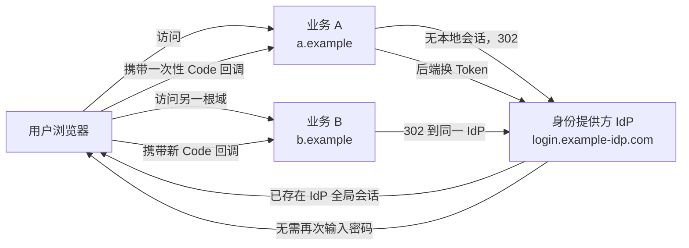
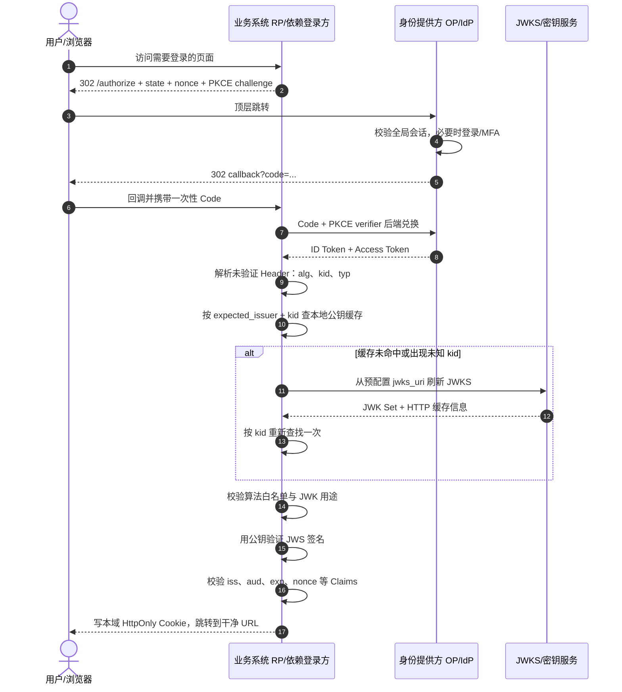
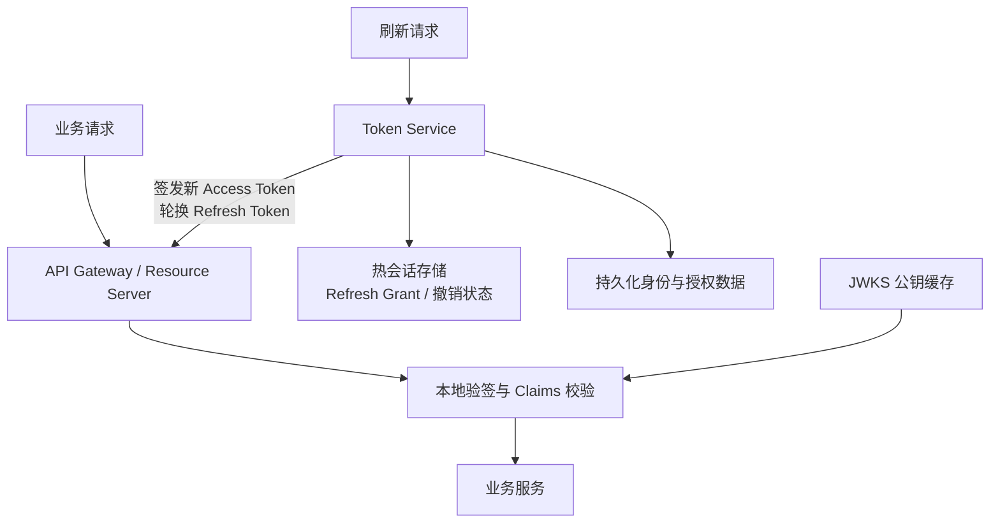
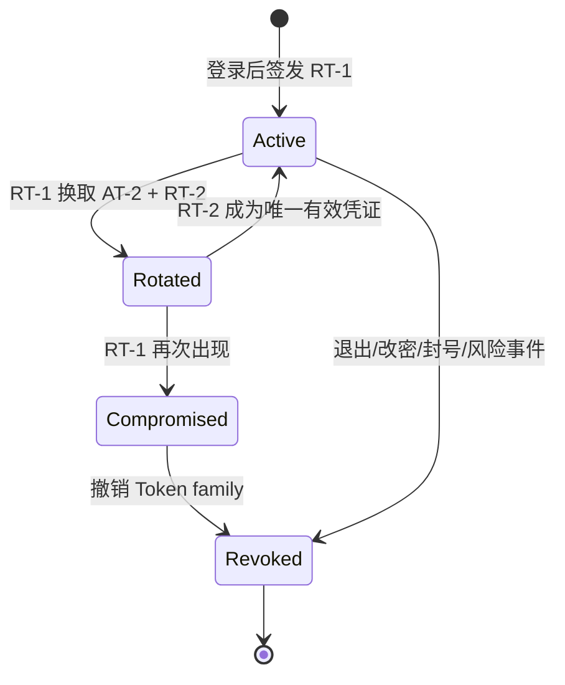
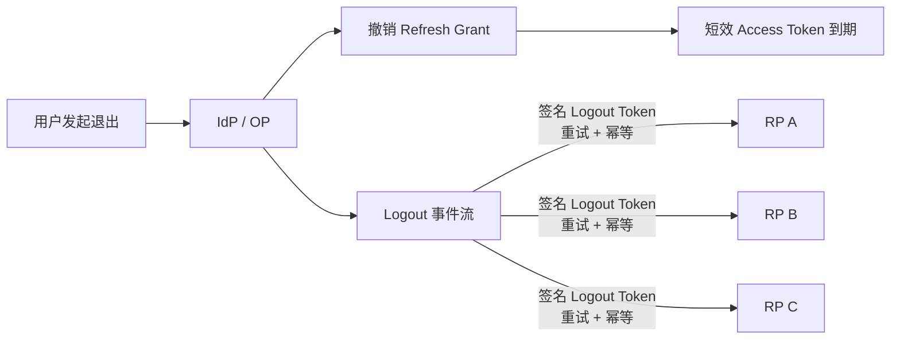

# 十亿用户 SSO 系统设计

> [!abstract] 一句话结论
> 跨一级域 SSO 的本质不是“共享 Cookie”，而是让各业务系统共同信任一个身份提供方（IdP）。用户在 IdP 完成一次认证，各业务系统再通过 OIDC 授权码流程建立自己的本地会话。

> [!warning] 先校准“十亿用户”
> 十亿注册账户不等于十亿并发在线。设计前必须明确 DAU、峰值并发、业务请求 QPS、登录/刷新 QPS、会话有效期、跨地域目标和一致性边界。本文讨论的是可扩展的架构形态，不代表仅凭“JWT + Redis”就能证明系统支撑十亿用户。

## 1. 先划清边界：Cookie 能解决什么

| 场景 | 浏览器能否共享 Cookie | 推荐做法 |
| --- | --- | --- |
| `video.qq.com` 与 `music.qq.com` | 可以在受控条件下设置 `Domain=.qq.com` | 共享父域 Cookie，或仍统一走身份中心 |
| `qq.com` 与 `jd.com` | 不可以 | 独立 IdP + OIDC/OAuth 协议跳转 |
| 第三方 iframe 静默登录 | 越来越不可靠 | 避免依赖第三方 Cookie，采用顶层重定向或受支持的联合身份机制 |

浏览器不会允许 `qq.com` 读取 `jd.com` 的 Cookie。跨一级域时，真正被共享的是**认证结果与信任关系**，而不是 Cookie 本身：

## 2. 协议选择：从 CAS 骨架到 OIDC

CAS 的 Service Ticket 有助于理解“浏览器跳转 + 后端验票”的骨架；新系统通常优先采用 **OpenID Connect（OIDC）Authorization Code Flow**：

- **OAuth 2.0** 解决“客户端能代表用户访问什么资源”。
- **OIDC** 在 OAuth 2.0 之上增加身份层，以 ID Token 表达“用户是谁”。
- **Authorization Code** 是短效、一次性的中间凭证，不应直接当登录态。
- 业务后端在 Token Endpoint 用 Code 换取 ID Token / Access Token，再创建本域会话。

![[raw/assets/weixin/sso-system/sso-flow.webp|900]]

*原文图：浏览器负责跳转，Code 通过后端通道兑换，身份凭证不在前端跳转链路中外泄。*

### 标准登录时序

> [!note] 术语旁注
> **RP** 是 Relying Party，可以直接理解成“依赖统一登录结果的业务系统”，例如后台管理系统、网盘、工单系统。图里的“用户访问 RP”就是用户打开一个需要登录的业务页面；RP 发现本地还没有登录态，于是把浏览器重定向到 IdP 登录。
>
> **IdP** 是 Identity Provider，也就是统一登录中心；在 OIDC 语境里常叫 **OP**（OpenID Provider）。它负责认证用户，并把“这个用户是谁”的结果签发给业务系统 RP。
>
> **HttpOnly Cookie** 是后端写给浏览器的本域会话 Cookie。浏览器后续请求 RP 时会自动带上它，但前端 JavaScript 不能通过 `document.cookie` 读取，所以它适合保存“本系统登录态”，不适合让前端直接拿长期 Token。
>
> 因此这里不是“前端用 Cookie 换 Token”，而是：前端访问 RP 时自动带 Cookie，RP 根据 Cookie 找到自己的本地会话；ID Token、Access Token、Refresh Token 的校验、续期和下游访问尽量留在后端完成。Cookie 仍要配 `HttpOnly`、`Secure`、`SameSite` 和 CSRF 防护，因为浏览器会自动携带它。

这里的 `kid -> JWKS -> 验签` 读图时抓住一句即可：`kid` 只是帮 RP 在可信 Issuer 的 JWKS 里找到候选公钥；真正允许登录，要等签名校验和 `iss/aud/exp/nonce` 等 Claims 校验全部通过。

> [!tip] 现代安全基线
> 按 [RFC 9700](https://www.rfc-editor.org/rfc/rfc9700.html)，公共客户端必须使用 PKCE，机密客户端也推荐使用；`state`、`nonce` 与 PKCE challenge 都应按交易生成并与当前浏览器会话绑定。

## 3. 十亿账户下的核心：把高频验证与低频状态分开

原文提出“用 JWT 把每次 Redis 查询变成本地验签”，方向是将压力从网络 I/O 转移到 CPU，但生产设计不应把它简化成“彻底无状态”。

### 两条数据路径

- **高频路径**：Access Token 短效，本地校验签名及 Claims，不为普通请求远程查会话。
- **低频路径**：Refresh Token 换新、主动撤销、风险控制、密码修改等操作访问有状态存储。
- **身份主数据**：账号、凭据、授权关系与审计记录应有持久化数据库，Redis 不是唯一事实来源。
- **密钥路径**：资源服务器缓存 JWKS 公钥；私钥留在受控签名服务或 KMS/HSM。

### JWT 与 opaque token 不是二选一信仰

| 方案 | 优点 | 代价 | 更适合 |
| --- | --- | --- | --- |
| 短效 JWT Access Token | 本地验签、跨服务扩展方便 | 难以即时撤销、Claims 可能过期、Token 较大 | 内部微服务、读多写少、允许短暂撤销窗口 |
| opaque Access Token | 容易集中撤销、暴露信息少 | introspection 带来网络依赖与缓存一致性问题 | 高风险业务、强会话控制 |
| BFF + opaque Session Cookie | Token 不暴露给浏览器、Web 安全边界清晰 | BFF 需要维护会话状态 | 传统 Web 与同集团业务 |

> [!important] JWT 通常是“签名”而不是“加密”
> JWS 形式的 JWT 内容可被客户端解码查看，签名只保证完整性与来源。敏感数据不应放入 Claims；验签时必须固定允许的算法，并校验 `iss`、`aud`、`exp` 等字段，参见 [RFC 8725](https://www.rfc-editor.org/rfc/rfc8725.html)。

## 4. Access + Refresh：性能与撤销的折中

![[raw/assets/weixin/sso-system/dual-token.webp|900]]

*原文图：Access Token 负责高频请求，Refresh Token 只在换发时访问状态存储。*

| 凭证 | 建议职责 | 常见时效 | 存储与保护 |
| --- | --- | --- | --- |
| Access Token | 调用资源服务 | 分钟级，按风险确定 | 内存或安全 Cookie；避免 Local Storage 暴露给 XSS |
| Refresh Token | 换取新 Access Token | 小时到天级，按设备/风险确定 | 服务端保存哈希或授权记录；客户端使用 HttpOnly、Secure Cookie |
| ID Token | 向客户端描述认证事件和用户身份 | 短效 | 只给 OIDC Client 使用，不能替代访问 API 的 Access Token |

Refresh Token 应采用**轮换与重放检测**：每次刷新都签发新的 Refresh Token，使旧 Token 失效；若旧 Token 再次出现，说明可能泄漏，应撤销整个 Token family 并要求重新认证。

### 不要机械背“Redis QPS 降 99%”

降幅取决于业务请求频率和 Access Token TTL：

$$
QPS_{\text{refresh}} \approx \frac{N_{\text{active sessions}}}{TTL_{\text{access}}}
$$

$$
\text{远程校验减少比例} \approx 1-\frac{QPS_{\text{refresh}}}{QPS_{\text{business requests}}}
$$

例如 1000 万活跃会话、Access Token 平均 5 分钟刷新一次，仅刷新平均值就约为 3.3 万 QPS，还要考虑登录峰值、失败重试与多设备。因此应给 TTL 加随机 jitter、限流、批量隔离故障，并按峰值而非平均值扩容。

## 5. “无状态”如何秒级踢人

短效 Access Token 只能把风险窗口限制在几分钟内，不能天然做到立即撤销。常见方案是组合使用：

1. **撤销 Refresh Grant**：阻止继续换新，是退出、改密和封号的基础动作。
2. **短 Access TTL**：把最坏暴露窗口限制在可接受范围。
3. **JTI 撤销名单**：记录少量被主动撤销的 Access Token，TTL 等于其剩余寿命。
4. **会话版本号 / 用户安全纪元**：批量吊销某用户或某租户此前签发的 Token。
5. **推送撤销事件**：向网关和资源服务的本地缓存广播，减少逐请求访问中心存储。
6. **高风险接口在线校验**：支付、改密等操作始终检查最新会话与风险状态。

> [!warning] 撤销名单不是“零成本无状态”
> 若要求每个请求立即感知 JTI 撤销名单，就必须查远程状态或依赖可靠的本地撤销缓存同步。设计时应明确是在一致性、可用性和撤销延迟之间选择，而不是声称同时获得三者。

## 6. 单点登出：目标是有界最终一致

公网、多业务、多设备场景下，很难保证所有 RP 同时清除本地会话。可实现的是“尽快同步 + 可重试 + 最终过期”：

推荐顺序：

1. IdP 立即撤销 Refresh Grant 和全局会话。
2. 使用 OIDC Back-Channel Logout 向访问过的 RP 并行发送签名 Logout Token。
3. RP 按 `sid` 或 `sub` 清除自己的服务端会话，接口必须幂等。
4. 失败任务进入重试和死信队列，并以可观测指标暴露。
5. 未收到通知的业务最终由短效 Access Token 到期兜底。
6. Front-Channel Logout 只能作为补充，不能把可靠性建立在 iframe 和第三方 Cookie 上。

OpenID Connect 的 [Back-Channel Logout 规范](https://openid.net/specs/openid-connect-backchannel-1_0.html) 明确使用 OP 到 RP 的直接后端通信，通常比依赖浏览器的前端登出更可靠，但仍要求 RP 的回调地址可达并正确维护会话映射。

## 7. 安全闭环

### 授权与回调

- 使用 Authorization Code Flow + PKCE（`S256`）。
- 精确匹配预注册的 Redirect URI，不允许开放重定向。
- 校验 `state`、`nonce`、Code 的一次性与短时效。
- Code 只通过后端 Token Endpoint 兑换，不进入日志或长期存储。
- 校验 ID Token 的签名、`iss`、`aud`、`exp`、`iat`、`nonce`。

### Cookie 与浏览器

- 优先使用 `HttpOnly`、`Secure`、最小 `Path`、Host-only Cookie。
- 能使用时采用 `__Host-` 前缀，避免宽泛的父域 Cookie。
- OIDC 顶层跳转通常不需要盲目设置 `SameSite=None`；只有确实需要跨站上下文时才使用，并同时设置 `Secure`。
- Cookie 鉴权接口仍要防 CSRF；HttpOnly 只能降低 XSS 窃取风险，不能自动阻止 CSRF。
- 不把 Access Token / Refresh Token 放进 URL。

### Token 与密钥

- 使用非对称签名，资源服务器只持有公钥。
- 通过 JWKS 发布多个带 `kid` 的公钥，轮换期间新旧密钥并行。
- 验证端固定允许算法集合，不能盲信 Token 自带的 `alg`。
- Access Token 限制 `aud`、scope 和权限，避免一个 Token 全网通用。
- 私钥放入 KMS/HSM，签名操作与普通业务服务隔离。

### Refresh Token

- 服务端保存哈希或授权记录，不保存可直接使用的明文。
- 每次刷新轮换，并检测旧 Token 重放。
- 按用户、设备、客户端和 Token family 建立撤销索引。
- 密码修改、退出、封号、设备丢失等安全事件触发撤销。
- 对刷新接口进行限流、设备风险评估和异常检测。

## 8. 高可用与容量设计

### 建议分层

| 层 | 关键设计 |
| --- | --- |
| Global Traffic | Anycast/GSLB、就近接入、区域故障切换、DDoS 防护 |
| IdP / Token Service | 无状态计算层、水平扩展、严格限流、灰度发布 |
| Session / Grant Store | 多分片、多副本、按用户或会话稳定路由、热点隔离 |
| Identity Database | 多副本、变更审计、敏感字段加密、灾备恢复 |
| Key Service | KMS/HSM、双密钥轮换、JWKS 缓存与主动刷新 |
| Event Plane | Logout/风险事件至少一次投递、幂等消费、重试与死信 |
| Observability | 登录成功率、P99 延迟、刷新失败率、重放告警、撤销传播延迟 |

### Redis 故障时怎么答

- 普通业务请求继续使用尚未过期的 Access Token，本地验签路径不受影响。
- 刷新与新登录进入受控降级：限流、短时间只读、区域切换或明确失败，而不是无限重试压垮存储。
- 不应在无法确认 Refresh Grant 状态时无条件签发新 Token。
- 恢复后通过事件日志和持久化授权记录重建热缓存。
- 布隆过滤器只能快速判断“可能存在/一定不存在”，不能替代会话真值与授权校验。

## 9. 面试答题模板

> [!example] 60 秒主干回答
> 先区分同父域和跨根域：同父域可受控共享 Cookie，跨根域受同源策略限制，必须引入独立 IdP，也就是统一登录中心。每个业务系统是 RP，可以理解成依赖登录结果的一方。用户访问需要登录的业务页面时，RP 把浏览器重定向到 IdP；IdP 登录成功后带一次性 Code 回到 RP，RP 再走后端通道换 ID Token，并建立自己的本地会话。规模上把高频访问与低频状态分开：短效 Access Token 本地验签，刷新授权、撤销状态和风险状态保留在分片存储；Refresh Token 轮换并检测重放。退出时先撤销刷新授权，再通过 Back-Channel Logout 通知各 RP，失败重试，短效 Access Token 到期兜底。最后补充 JWKS 密钥轮换、`iss/aud/exp` 校验、Cookie/CSRF 防护、刷新风暴 jitter 和可观测性。

> [!example] 安全验签补充
> Token 不会直接交给前端长期保存。浏览器只拿本域 `HttpOnly` Cookie，后端用它找到本地会话；ID Token、Access Token 和 Refresh Token 的校验、续期、下游调用尽量放在服务端完成。这样不是说后端绝对安全，而是减少 Token 暴露给 XSS、插件、日志和 URL 的机会。
>
> 验签这块我会强调顺序：先根据服务端可信配置确定 `expected_issuer` 和 `jwks_uri`，再从未验证 Header 里读 `kid`，按 `(expected_issuer, kid)` 查 JWKS 公钥缓存；缓存未命中时限频刷新一次，仍找不到就拒绝。`kid` 只是钥匙编号，不是信任来源。拿到候选公钥后，还要固定算法白名单、检查 JWK 用途，再校验 JWS 签名。验签通过只能证明 Token 没被篡改且签发方持有私钥，最后仍要检查 `iss`、`aud`、`exp`、`nonce`，全部通过后才建立会话。

### 面试官继续追问时

| 追问 | 回答抓手 |
| --- | --- |
| 为什么不能共享 Cookie？ | 一级域隔离；跨域共享的是 IdP 信任，不是 Cookie |
| 前端要用 Cookie 换 Token 吗？ | 不是；浏览器带 HttpOnly Cookie 访问 RP，RP 映射本地会话，Token 留在后端校验、续期和调用下游 |
| 为什么不全用 JWT？ | 撤销、Claims 新鲜度、Token 体积与密钥轮换；按风险选择 JWT、opaque 或 BFF |
| `kid` 能证明 Token 合法吗？ | 不能，`kid` 只是选钥提示；必须绑定 expected issuer 查 JWKS，避免跨 IdP 同名 key 混用 |
| 验签到底验证什么？ | 公钥验证 JWS 签名，证明 Header/Payload 未被改动且由对应私钥签发；之后还要校验 Claims |
| 如何踢人？ | 撤销 Refresh + 短 Access TTL + JTI/会话版本 + 高风险在线校验 |
| Redis 挂了怎么办？ | 普通请求本地验签；刷新受控降级；不在未知状态下盲目签发 |
| 如何同步退出？ | Back-Channel Logout + 幂等重试 + 事件流 + Token 到期兜底 |
| 如何防刷新风暴？ | TTL jitter、限流、预刷新随机化、容量按峰值估算 |
| 密钥如何轮换？ | 新旧非对称密钥并行；JWKS 先发布新 `kid`，旧 key 至少保留到旧 Token 全部过期 |

## 10. 原文中需要谨慎引用的结论

1. JWT 通常是签名 Token，不等于“加密 Token”。
2. “Redis QPS 降 99%”不是固定结论，必须结合业务 QPS 和 Access TTL 计算。
3. JTI 撤销名单要实现秒级生效，就会重新引入在线状态或撤销缓存同步。
4. `SameSite=None` 不是所有 SSO Cookie 的默认答案，且不能绕过第三方 Cookie 限制。
5. 冷存储可以保存授权历史，但过期或被撤销的 Refresh Token 不应为了“十亿用户”无限保留为在线会话。
6. SLO 不是只能“尽力通知”；OIDC 已定义 Front-Channel、Back-Channel 和 RP-Initiated Logout，但跨系统登出仍应按有界最终一致设计。

****## 相关页面

- [[wiki/backend/后端|后端]]
- [[wiki/backend/Redis|Redis]]
- [[wiki/backend/Java|Java]]
- [[wiki/foundations/计算机网络|计算机网络]]
- [[wiki/llm/Agent/Agent|Agent]]

## 来源与规范

- 原始文章：[[raw/weixin/腾讯三面挂了：如何设计一个支撑十亿用户的 SSO 系统？|腾讯三面挂了：如何设计一个支撑十亿用户的 SSO 系统？]]
- [OpenID Connect Core 1.0](https://openid.net/specs/openid-connect-core-1_0.html)
- [RFC 9700: Best Current Practice for OAuth 2.0 Security](https://www.rfc-editor.org/rfc/rfc9700.html)
- [RFC 8725: JSON Web Token Best Current Practices](https://www.rfc-editor.org/rfc/rfc8725.html)
- [OpenID Connect Back-Channel Logout 1.0](https://openid.net/specs/openid-connect-backchannel-1_0.html)
