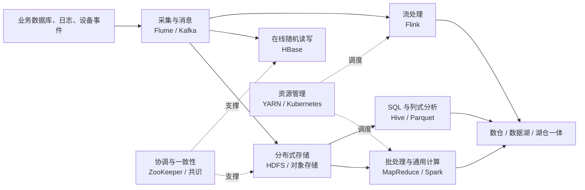

# 大数据理论与实践

> [!abstract] 一句话理解
> 大数据不是“数据量很大的单机程序”，而是一套假设机器、磁盘和网络都会失败的分布式方法：用水平扩展获得容量，用复制与重算获得容错，再按业务需求选择批处理、交互分析或流处理。

## 1. 从 4V 推导系统需求

| 特征 | 它带来的问题 | 系统设计倾向 |
| --- | --- | --- |
| Volume（规模） | 单机存不下、算不完 | 分片、并行、水平扩展、数据本地性 |
| Variety（多样） | 结构化、半结构化和非结构化数据并存 | 多格式接入、统一元数据、读时或写时建模 |
| Velocity（速度） | 数据持续产生，结果需要更快可见 | 高吞吐消息日志、增量计算、事件时间处理 |
| Value（价值） | 原始数据价值密度低 | ETL/ELT、聚合、特征提取、交互分析 |

这四个维度最终都落到同一组工程约束：**容量、吞吐、延迟、一致性、可用性、成本与治理**。组件名称会迭代，约束之间的取舍不会消失。

## 2. 一张图看懂大数据技术栈

可以把整套系统拆成六个相对独立的问题：谁来协调、数据放哪、任务在哪运行、如何计算、如何传递事件、如何治理分析数据。

## 3. 分布式底座：协调、存储与容错

### 3.1 协调服务只保存关键状态

ZooKeeper 的职责是保存少量但需要一致的协调元数据，例如选主、成员列表、配置、命名和分布式锁。它的核心抽象是：

- **Session**：用心跳和超时表达客户端是否仍然存活。
- **ZNode**：以持久、临时、顺序节点表达配置、成员和排队关系。
- **Watch**：一次性状态变更通知；可靠客户端必须重新读取状态并续订。
- **Quorum**：写入和选主经过多数派，利用任意两个多数派必有交集来避免脑裂。

它不是业务数据仓库。把大对象或高频业务写入塞进协调系统，会同时伤害吞吐和集群可用性。

### 3.2 HDFS 面向大文件与顺序吞吐

HDFS 把控制流和数据流分开：NameNode 管文件系统命名空间与块位置，DataNode 存实际 Block，客户端先查询位置再直接读写 DataNode。

- 大文件被切成 Block 并复制到不同节点；副本和机架感知用于容错。
- 写入通过 DataNode pipeline 复制，确认沿反方向返回。
- 计算尽量靠近数据，避免在网络中搬运海量输入。
- NameNode 需要在内存维护文件和块元数据，因此海量小文件是典型反模式。
- HDFS 优化高吞吐顺序 I/O，不适合低延迟随机更新。

HA 解决单个命名空间的可用性，Federation 解决单 NameNode 的元数据扩展瓶颈；两者不是同一概念。

### 3.3 HBase 补上随机读写

HBase 构建在 HDFS 之上，借鉴 Bigtable 的列族模型和 LSM-Tree，把随机写先落到 WAL 与 MemStore，再顺序刷成 HFile：

1. RowKey 决定排序与 Region 分布，设计不当会造成热点。
2. RegionServer 承担实际读写，HMaster 负责 Region 分配、负载均衡和 DDL，不在正常数据路径上。
3. 读取依次利用 BlockCache、MemStore、HFile，并通过 Bloom Filter 减少无效磁盘访问。
4. Compaction 合并 HFile；Major Compaction 还能清理过期和已删除数据，但会带来显著 I/O 压力。

因此 HDFS 与 HBase 并非替代关系：前者适合文件级批量扫描，后者适合按 RowKey 的在线随机访问。

## 4. 从 MapReduce 到 Spark：计算抽象的演进

### 4.1 MapReduce 把并行和容错标准化

MapReduce 的核心链路是 `InputSplit -> Map -> Shuffle -> Reduce -> Output`。Map 与 Reduce 是计算阶段，Shuffle 是连接二者的数据重分布过程。

- InputSplit 决定 MapTask 并行度，它是计算逻辑切片，不等同于 HDFS Block。
- Partitioner 保证同一个 key 进入同一个 Reducer。
- Shuffle 包含分区、排序、溢写、归并、网络拷贝与分组，通常是磁盘和网络瓶颈。
- Combiner 只适用于满足结合律和交换律的本地预聚合，不能改变业务语义。

MapReduce 以落盘换取简单可靠的失败重试，适合离线 ETL 和大规模批处理，但不适合交互查询或低延迟流计算。

### 4.2 YARN 把资源管理从计算框架中拆出

YARN 将 MRv1 的 JobTracker 拆成集群级 ResourceManager 与应用级 ApplicationMaster：

- ResourceManager 负责全局资源分配和调度。
- NodeManager 管理单机上的 Container 生命周期。
- 每个 ApplicationMaster 管自己的任务、重试和资源申请。
- Container 是 CPU、内存和运行环境的资源抽象，不是存储单元。

这种解耦让 MapReduce、Spark、Flink 等框架可以共享同一集群，也让 FIFO、Capacity、Fair 等调度策略独立演进。

### 4.3 Spark 用 DAG 与内存复用降低重复 I/O

Spark 的 RDD 是不可变、分区化、惰性求值的数据集。窄依赖可以在同一 Stage 中流水执行，宽依赖会触发 Shuffle 并形成 Stage 边界；丢失分区可通过 lineage 重算。

- 缓存让迭代算法和重复查询复用中间结果。
- DataFrame/Dataset 携带 Schema，使 Catalyst 能优化逻辑与物理计划。
- Spark SQL 适合结构化分析；传统 Spark Streaming 以微批获得高吞吐，但延迟和事件时间表达不如原生流处理直接。

“Spark 比 MapReduce 快”不是因为数据永不落盘，而是它减少了不必要的阶段落盘，并允许 DAG 优化、流水线和中间结果复用。

## 5. SQL、列式存储与分析建模

Hive 用 HiveQL 把分析逻辑编译成分布式执行任务：表、列和分区等元数据放在 Metastore，实际数据留在 HDFS 或对象存储中。

| 机制 | 物理含义 | 主要收益 |
| --- | --- | --- |
| 分区 | 按字段拆成目录 | 分区裁剪，减少扫描范围 |
| 分桶 | 按哈希拆成固定数量文件 | Join、抽样和数据分布优化 |
| Parquet/ORC | 列式组织与编码 | 只读所需列、更高压缩比、统计量下推 |
| 外部表 | Hive 只管理元数据 | 多引擎共享数据，删表不删底层文件 |

分区字段通常是低基数、高频过滤维度；分桶字段通常是高基数的连接或抽样键。过度分区会制造小文件和元数据压力，不能把“目录更多”等同于“查询一定更快”。

## 6. Kafka 与 Flink：从搬运事件到计算事件

### 6.1 Kafka 是可重放的分区日志

Kafka 的 Topic 被拆为多个 Partition；Partition 是有序、只追加的日志，Offset 标识其中的位置。

- 顺序只在 **Partition 内**成立。需要同一订单严格有序时，应以 OrderID 作为 key 路由到同一 Partition。
- 同一 Consumer Group 内，一个 Partition 同时只分配给一个 Consumer，因此组内最大有效并行度受 Partition 数量限制。
- 高吞吐来自顺序写、批处理、页缓存和零拷贝等组合，而不是单一技巧。
- At-least-once 会产生重复，业务侧仍需幂等；事务与幂等 Producer 能建立 Kafka 范围内的 Exactly-once 链路，但外部副作用仍要单独设计。

### 6.2 Flink 处理时间、状态和迟到数据

Flink 把批处理视为有界流，把持续输入视为无界流。它比“逐条调用函数”多解决三个问题：

- **事件时间**：按事件发生时间而不是机器处理时间计算。
- **Watermark 与窗口**：估计事件时间进度，对乱序和迟到数据设定明确边界。
- **状态与 Checkpoint**：算子状态与输入位置一致保存，失败后恢复并继续处理。

滚动、滑动和会话窗口定义数据如何分组；背压把下游处理不过来的信号向上游传播。正确性取决于 source、state、sink 和 checkpoint 的整体语义，不能只看某个算子的 API。

## 7. 从数仓到数据湖，再到湖仓一体

### 7.1 三种架构解决不同矛盾

| 架构 | Schema | 优势 | 主要风险 |
| --- | --- | --- | --- |
| 数据仓库 | Schema-on-Write | 指标稳定、SQL 体验和治理成熟 | 接入慢，原始与非结构化数据受限 |
| 数据湖 | Schema-on-Read | 低成本保存多类型原始数据，探索灵活 | 元数据、质量和权限缺失时会变成“数据沼泽” |
| 湖仓一体 | 文件 + Table Format 元数据 | 在开放存储上补事务、版本、演进和多引擎访问 | 元数据治理、并发提交与小文件管理仍需工程投入 |

传统离线数仓常用 `ODS -> DWD -> DWS -> ADS` 分层：ODS 贴近来源，DWD 统一明细，DWS 沉淀公共汇总，ADS 面向具体应用。分层的价值是稳定语义与复用，不是机械地复制四份数据。

Iceberg、Delta Lake、Hudi 等 Table Format 在数据文件之上增加快照、清单、Schema 演进、分区演进和事务提交等元数据能力，使对象存储上的数据更接近可治理的表。湖仓一体不是把“湖”和“仓”两个目录放在一起，而是统一开放存储与可靠表语义。

## 8. 选型先看工作负载

| 需求 | 首先考虑 | 不应忽略的边界 |
| --- | --- | --- |
| PB 级大文件归档、批量扫描 | HDFS / 对象存储 | 小文件、NameNode/元数据压力、顺序访问模型 |
| 海量稀疏数据随机读写 | HBase | RowKey 热点、Compaction、列族数量 |
| T+1 ETL 与大规模聚合 | MapReduce / Spark | Shuffle、倾斜、中间结果复用 |
| SQL 分析与列裁剪 | Hive + Parquet/ORC | 分区粒度、小文件、Metastore 治理 |
| 高吞吐事件缓冲与回放 | Kafka | Partition 数、key 设计、重复消费与保留策略 |
| 低延迟有状态流计算 | Flink | 事件时间、Watermark、Checkpoint、Sink 语义 |
| 多团队共享开放分析数据 | Lakehouse Table Format | Catalog、权限、并发提交、快照与 GC |

一个可靠的选型顺序是：先写清数据规模、读写模式、延迟目标、正确性语义、保留周期和团队运维能力，再映射组件；不要从“技术流行度”反推需求。

## 9. 学习与排障主线

1. 先掌握 [[wiki/foundations/计算机网络|网络]]、磁盘 I/O、进程与容器等单机基础。
2. 再理解分片、复制、故障检测、选主、重试、幂等与一致性模型。
3. 沿 `HDFS -> MapReduce -> YARN -> Spark` 理解批处理体系。
4. 沿 `Kafka -> Flink` 理解事件日志、时间、状态和流式正确性。
5. 沿 `Hive/Parquet -> 数仓 -> 数据湖 -> Table Format` 理解分析与治理。
6. 最后用一个端到端项目验证：采集、存储、计算、服务、监控、容错和成本是否形成闭环。

遇到性能问题时，先定位瓶颈属于 **CPU、内存、磁盘、网络、Shuffle、数据倾斜、元数据还是下游背压**；遇到正确性问题时，先画清 **数据边界、状态边界、重试边界与提交边界**。

## 原始资料入口

- [[raw/Big-Data-Theory-and-Practice/README|课程总目录与经典论文索引]]
- [[raw/Big-Data-Theory-and-Practice/courses/复习/大数据理论与实践Ⅰ-章节复习提纲|章节复习提纲]]
- [[raw/Big-Data-Theory-and-Practice/courses/chapter01/参考资料/大数据历史|大数据生态演进]]
- [[raw/Big-Data-Theory-and-Practice/courses/chapter03/参考资料/HDFS|HDFS 原理与设计]]
- [[raw/Big-Data-Theory-and-Practice/courses/chapter05/map-reduce|MapReduce 完整指南]]
- [[raw/Big-Data-Theory-and-Practice/courses/chapter07/Apache Spark 设计与实现|Spark 设计与实现]]
- [[raw/Big-Data-Theory-and-Practice/courses/chapter10/Kafka 设计与实现|Kafka 设计与实现]]
- [[raw/Big-Data-Theory-and-Practice/courses/chapter11/Flink 设计与实现|Flink 设计与实现]]
- [[raw/Big-Data-Theory-and-Practice/courses/chapter12/从数据仓库到数据湖|从数据仓库到湖仓一体]]

## 相关页面

- [[wiki/backend/消息队列|消息队列]]
- [[wiki/backend/Redis|Redis]]
- [[wiki/llm/RAG/RAG|RAG]]
