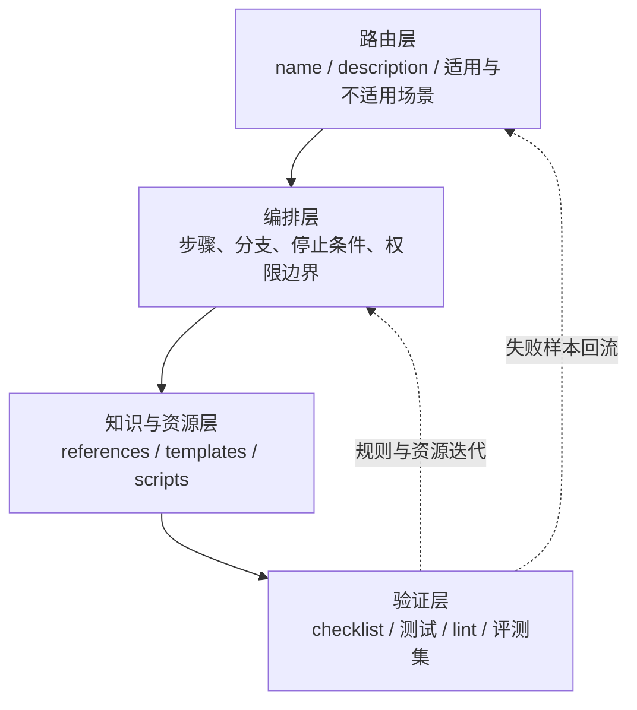
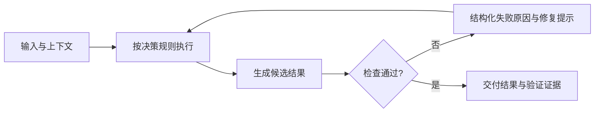

# Agent Skill 设计与质量保障

> [!abstract] 核心结论
> Skill 不是一段更长的 Prompt，也不只是一个工具别名。它是围绕一类任务组织起来的、可被 Agent 发现和调用的专家能力包：既包含触发边界和决策规则，也包含工作流、参考资料、模板、脚本与验证闭环。质量目标不是“某次演示效果好”，而是在不同输入、新会话和边界条件下仍能稳定完成任务。

## 1. Skill、Prompt 与 Tool 的边界

| 概念 | 主要职责 | 典型内容 | 主要质量问题 |
| --- | --- | --- | --- |
| Prompt | 表达当前任务或一次性约束 | 用户目标、临时上下文、输出要求 | 是否说清当前请求 |
| Skill | 沉淀一类任务的专家做法 | 触发条件、决策树、反模式、工作流、资源导航、验证 | 是否能稳定复用并正确触发 |
| Tool | 执行确定性动作 | API、文件操作、搜索、命令、数据库调用 | 参数、权限、错误处理与幂等性 |

三者通常协同工作：Prompt 提供本次目标，Skill 决定“这类任务应该怎样做”，Tool 负责真正读写外部世界。MCP 等协议解决的是 Agent 与工具或资源的连接标准，不替代 Skill 中的业务判断。

## 2. 先判断任务是否值得 Skill 化

不要把所有常用提示词都包装成 Skill。适合沉淀的任务通常同时具备以下特征：

| 维度 | 判断问题 | 强信号 |
| --- | --- | --- |
| 复用频率 | 是否会在不同对象上反复出现？ | 每个需求、发版、事故或 PR 都会执行 |
| 任务复杂度 | 是否包含多个阶段、分支或依赖？ | 单句指令无法完整描述 |
| 专家判断 | 熟手和新手的结果差距是否明显？ | 需要风险判断、边界识别或优先级取舍 |
| 质量敏感度 | 错误结果是否会带来明显成本？ | 涉及权限、资金、生产环境或质量门禁 |
| 稳定性需求 | 是否要求输出结构和执行方式一致？ | 需要审计、比较、自动化消费或批量执行 |

可以把它理解为一个筛选条件，而不是机械公式：

```text
Skill 候选 ≈ 高频复用 × 足够复杂 × 包含专家判断 × 对稳定性有要求
```

如果任务低频、简单、一次性，直接使用 Prompt 往往更便宜；如果只是提供一个确定性操作，则更可能应该实现为 Tool。

## 3. 高质量 Skill 的四层结构



### 路由层：让 Agent 在正确时机调用

`name` 和 `description` 是运行时路由信号，不是装饰。描述至少应说明：

- 这个 Skill 解决什么任务；
- 用户可能提供哪些输入；
- 哪些请求应该触发；
- 哪些相似请求不应触发。

例如，测试用例 Skill 可以声明“用于根据 PRD、接口文档或业务需求生成结构化测试用例”，同时明确“不适用于简单概念解释、单句润色或无需测试设计的请求”。

触发质量应同时关注：

- **召回率**：该触发时是否成功触发；
- **精确率**：触发后是否确实适用，避免简单问题误入重流程。

### 编排层：把专家判断写成分支

流程清单只回答“依次做什么”，专家决策还要回答：

- 什么情况下走方案 A 或 B；
- 什么信息缺失时必须询问或降级；
- 什么风险出现时必须停止；
- 哪些动作只能建议，不能直接执行；
- 什么证据满足后才能结束。

以测试用例生成为例：

```text
若需求信息完整：
  主流程 -> 异常流程 -> 边界/权限/一致性/幂等 -> 优先级与自动化建议

若需求信息不完整：
  标记缺失项 -> 禁止编造规则 -> 仅输出可确认的草稿

若涉及资金、权限、删除或审批：
  提高风险等级 -> 增加审计、回滚、重复提交和异常中断检查
```

### 知识与资源层：渐进披露，而不是堆满主文件

成熟 Skill 通常采用分层目录：

```text
example-skill/
├── SKILL.md               # 路由、核心流程、资源导航
├── references/            # 详细规则、领域知识、反模式
├── templates/             # 稳定的输入/输出骨架
└── scripts/               # 可重复的提取、转换、校验动作
```

`SKILL.md` 应保持短而高信号，只放执行时始终需要的信息；领域细节按需加载，模板负责结构稳定，脚本承接确定性动作。这样可以减少上下文占用，也方便分别维护规则与实现。仓库内的 [[skills/obsidian-wiki-maintainer/SKILL|obsidian-wiki-maintainer]] 就采用了主说明、模板和脚本分层。

> [!warning] 低价值指令
> “你是专业、严谨、负责的助手”一类通用要求通常不能提供任务特有的信息。有限上下文应优先留给触发边界、专家判断、禁止行为、质量标准与验证方法。

### 验证层：让成功条件可观测

验证不应只写“检查结果是否正确”。应尽量把完成条件转换为可检查证据：

- 必填字段和格式由 Schema 或脚本校验；
- Markdown、JSON、YAML、代码分别运行对应 parser、lint 或测试；
- 外部写操作检查返回状态和目标对象；
- 高风险动作验证影响范围和回滚路径；
- 无法自动判断的质量维度使用明确 checklist 或评审量表。

![[raw/assets/weixin/skill-quality/body-01.png|420]]

## 4. 按风险决定 Agent 自由度

Skill 不应统一采用“完全照步骤执行”或“完全自由分析”。自由度取决于任务风险与可验证性。

| 任务类型 | 合适自由度 | 约束重点 |
| --- | --- | --- |
| 解释、调研、方案比较 | 较高 | 分析维度、证据、不确定性、结论依据 |
| 内容整理、代码 Review | 中等 | 输入范围、覆盖清单、输出结构、不得臆测 |
| 代码批量修改、迁移 | 较低 | 变更范围、测试、失败停止、可恢复性 |
| 发布、删除、权限、生产数据 | 极低 | 明确授权、精确目标、预检、回滚、审计 |

高风险任务的 Skill 至少要定义：

1. 执行前如何解析准确目标；
2. 哪些步骤需要显式授权；
3. 允许修改的范围；
4. 验证失败时的停止条件；
5. 如何恢复或回滚；
6. 最终交付哪些证据。

分析类任务则不必把结论写死，但应要求从固定维度展开、标注不确定项，并让建议可执行、可验证。

## 5. 反模式是能力边界的一部分

大模型倾向于为了“完成”而补全信息，因此 Skill 要明确禁止行为：

- 不把来源不明的信息当作事实；
- 不为追求完整而编造业务规则；
- 不跳过验证直接宣布成功；
- 不在未解析目标时执行高风险修改；
- 不用大量无优先级内容伪装覆盖全面；
- 不把不可执行、不可测量的套话当作建议；
- 不在主文件重复模型本已具备的通用知识。

好的反模式不是泛泛说“不要犯错”，而是源自真实失败样本，并附带替代动作。例如：当业务规则缺失时，先列出缺失项，再基于现有证据生成可确认草稿。

## 6. 验证闭环



脚本应尽量满足以下性质：

| 性质 | 作用 |
| --- | --- |
| 结构化输出 | Agent 能可靠解析状态、错误位置和建议动作 |
| 明确退出状态 | 工作流能判断继续、修复或停止 |
| 幂等 | 重试不会制造重复或破坏状态 |
| 可定位错误 | 失败信息指向具体字段、文件或检查项 |
| 安全降级 | 非关键检查失败时可给出受限结果，而不是掩盖问题 |

模型自检适合语义覆盖和表达质量；parser、Schema、lint、测试更适合确定性判断。两者应组合使用，而不是互相替代。

## 7. 用评测集证明质量

一次演示无法证明 Skill 有效。更可靠的迭代流程是：

1. **建立基线**：在不加载 Skill 的新会话中执行真实任务，记录遗漏、幻觉、格式错误、违规动作与成本。
2. **提取规则**：把重复失败转成决策条件、反模式、模板或校验脚本。
3. **隔离测试**：在新会话中仅加载目标 Skill，避免旧上下文掩盖问题。
4. **比较结果**：对比基线与 Skill 版本，不只看主观观感。
5. **回归评测**：每次修改后重跑典型、边界和对抗样本。

建议分别度量路由与执行：

| 维度 | 可选指标 |
| --- | --- |
| 路由 | 触发精确率、触发召回率、误触发率 |
| 任务质量 | 成功率、覆盖率、事实错误率、人工修改量 |
| 规则遵守 | 禁止行为次数、越权动作数、停止条件命中率 |
| 结构有效性 | Schema/格式通过率、测试或 lint 通过率 |
| 稳定性 | 多次运行方差、跨输入和跨会话通过率 |
| 效率 | Token、延迟、工具调用数、单次任务成本 |

> [!important]
> 评测集要包含失败样本，而不只是“黄金路径”。登录、支付、权限、搜索、文件上传等不同场景分别暴露异常流、幂等、越权、分页和安全边界问题。

## 8. 从失败样本持续演进

| 观察到的问题 | 优先改进位置 |
| --- | --- |
| 应触发却没触发 | `name` / `description` / 正例表达 |
| 简单请求误触发 | 不适用场景 / 负例 / 路由边界 |
| 经常漏关键步骤 | 主工作流 / checklist / 停止条件 |
| 喜欢编造规则 | 反模式 / 缺失信息分支 |
| 输出结构不稳定 | template / Schema |
| 结果无法验证 | script / test / lint / 验收证据 |
| 高风险操作过于激进 | 权限门槛 / 预检 / 回滚 / 人工确认 |
| 上下文成本过高 | 拆分 references，删除通用知识和重复示例 |

Skill 应像代码和测试一样版本化维护。每次线上失败都先判断问题属于路由、决策、资源、执行还是验证，再修正对应层，而不是无差别地继续加长 Prompt。

## 9. 设计检查表

### 创建前

- [ ] 任务确实高频、复杂或包含专家判断
- [ ] 已区分 Skill、一次性 Prompt 与确定性 Tool
- [ ] 有真实失败样本或明确的质量缺口

### 编写时

- [ ] 描述包含适用与不适用场景
- [ ] 关键判断写成分支，而不是只列线性步骤
- [ ] 缺失信息、高风险动作和失败情况有明确出口
- [ ] 反模式具体，并给出正确替代动作
- [ ] 主文件只保留高信号内容，细节按需分层
- [ ] 稳定结构使用模板，确定性动作使用脚本

### 交付前

- [ ] 新会话中的触发与不触发样本都通过
- [ ] 正常、边界、失败和对抗样本均已覆盖
- [ ] 自动验证与人工质量检查都有明确结果
- [ ] 输出包含证据、限制和可执行的下一步
- [ ] 迭代后未明显增加延迟、Token 或误触发成本

## 10. 面试回答框架

> [!example] 两分钟回答
> 我把 Skill 看作可复用、可验证的专家能力包，而不是 Prompt 模板。首先判断任务是否高频、复杂、包含专家决策并对稳定性有要求；然后把真实失败样本提炼成触发条件、决策分支和反模式。主文件只保留核心工作流与资源导航，详细规则、模板和确定性校验分别放进 references、templates 与 scripts。高风险任务降低自由度，加入授权、预检、停止和回滚条件；分析任务保留推理空间，但约束证据和输出标准。最后用独立新会话和固定评测集同时验证路由准确性、任务成功率、规则遵守、格式有效性、稳定性与成本，并把新的失败样本持续回流到 Skill 中。

## 相关页面

- [[wiki/llm/Agent/Agent|Agent]]
- [[wiki/llm/Agent/Harness/Harness Engineering：AI Agent 工程实践指南|Harness Engineering：AI Agent 工程实践指南]]
- [[wiki/llm/Agent/Memory/Agent Memory|Agent Memory]]
- [[skills/obsidian-wiki-maintainer/SKILL|obsidian-wiki-maintainer]]
