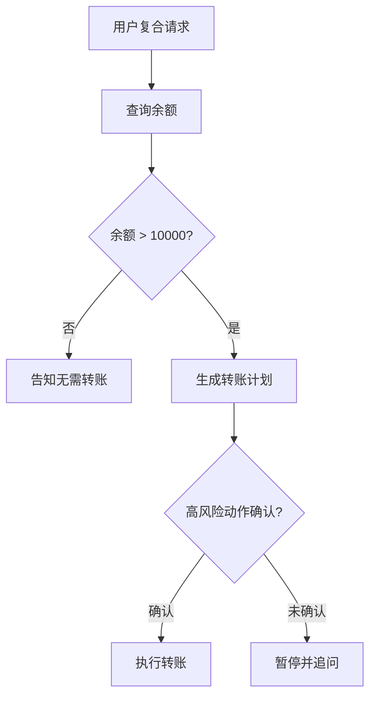
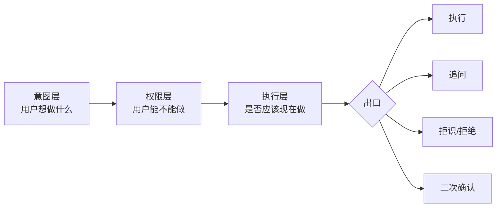

# Agent 业务理解与意图识别

> [!summary]
> 两篇原文共同强调：别把 Agent 理解业务简化成“写一个好 Prompt”或“每次都调用大模型”。Prompt 只是表达层；生产系统还要定义业务意图、边界案例、状态流转、权限约束、执行出口和评估指标，并让不同难度的请求走不同成本的识别链路。

![[raw/assets/weixin/agent-business-understanding/intent-evolution.webp|820]]

## 1. 先问业务问题，再选技术路线

意图识别的技术选择不是从模型开始，而是从业务复杂度开始。可以先问四个问题：

| 问题 | 影响的技术选择 |
| --- | --- |
| 意图数量有多少？ | 少量稳定意图可用规则或轻量分类器；大量意图需要召回和分层判断 |
| 标签是否经常变化？ | 频繁变化更适合 LLM、意图 RAG、少样本示例和在线更新 |
| 标注数据是否充足？ | 数据充足可训练分类器或深度模型；冷启动可用 Embedding、原型网络和 LLM |
| 需要理解多少轮上下文？ | 单轮可做分类；多轮要维护结构化状态和任务进度 |

> [!important]
> 面试时不要说“我会直接写 Prompt 让模型判断意图”。更稳的说法是：先把业务意图体系和状态机建清楚，再决定哪些流量走规则、哪些走分类器、哪些交给 LLM 或 RAG。

## 2. 意图识别的演进阶梯


### 规则与分类器：先接住确定请求

规则适合“退款”“取消订单”“修改地址”等高频、确定、风险敏感的请求。它的优势是便宜、可解释、产品和运营能直接维护；边界是口语表达、意图组合和规则冲突会快速增加。

轻量分类器适合标签稳定且有标注数据的场景，例如客服分流、工单归类、FAQ 路由。它的风险是线上新表达、促销活动、新政策会让历史决策边界漂移，所以要看混淆矩阵和线上误判样本。

### Embedding 与 LLM：处理冷启动和长尾表达

Embedding 更适合召回候选，而不是直接拍板。原因是语言相似不等于业务动作相同，例如“怎么取消订单”和“为什么订单被取消”很相似，但后续流程完全不同。

LLM 适合口语、省略、情绪表达、标签频繁变化和少样本冷启动。它能直接输出意图、槽位、置信度和是否追问，但当意图数量变多时，不能把所有定义都塞进一个 Prompt。

## 3. 意图 RAG：先缩小范围，再判断

![[raw/assets/weixin/agent-business-understanding/intent-rag-two-stage.webp|760]]

两阶段架构更稳：

1. **召回层**：用当前请求召回最相关的意图定义、边界案例、混淆反例和业务前置条件。
2. **判断层**：让 LLM 只在三到五个候选里做最终判断，并输出槽位、置信度和下一步动作。

这样可以把“几十个意图里选一个”的问题，变成“少量候选精判”的问题。Prompt 更短，边界更集中，错误也更容易定位。

评估时要拆开看：

| 层次 | 关键指标 | 典型问题 |
| --- | --- | --- |
| 召回层 | Recall@K | 目标意图没进候选，后面的 LLM 很难补救 |
| 判断层 | 准确率、混淆矩阵、拒识率 | 候选已召回但选错，多半是边界定义或案例质量问题 |
| 槽位层 | 字段级 F1 | 意图对了，但参数抽错或漏抽 |

意图库不只放标准定义，还要放口语表达、相邻意图、混淆反例、业务前置条件和历史误判。LLM 生成的同义句可以补长尾，但线上真实请求仍然是最重要的更新来源。

## 4. 多轮对话判断的是状态，不是一句话

![[raw/assets/weixin/agent-business-understanding/dialogue-state-update.webp|760]]

用户说“换成明天吧”，单看这一句不知道是改机票、酒店还是日程。多轮 Agent 应把历史对话整理成结构化状态，再用最新输入做状态更新。

```json
{
  "active_intent": "modify_flight",
  "intent_transition": "continue",
  "slot_updates": {
    "departure_date": "明天"
  },
  "missing_slots": [],
  "next_action": "confirm_change"
}
```

状态更新要判断四件事：

- 当前意图是在延续、切换、取消还是完成。
- 用户修改了哪些槽位。
- 还缺哪些必要参数。
- 下一步应该执行、追问、拒识还是确认。

这能减少“旧意图残留”。例如用户前面在改签机票，后面突然说“顺便查一下酒店”，系统应识别为任务切换或并行任务，而不是继续把所有输入都套进改签流程。

## 5. 复杂 Agent 要输出任务结构

当用户说“查一下余额，超过一万就转五千到储蓄卡”，单标签分类已经不够。这里包含余额查询、条件判断、转账动作和高风险确认。

更合适的输出是执行图：



到了这一层，意图识别已经扩展成语义解析、任务拆解和规划。模型不只是判断“用户想做什么”，还要知道动作顺序、参数依赖和哪些步骤必须确认。

## 6. 生产架构：三层漏斗处理不同难度流量

![[raw/assets/weixin/agent-business-understanding/cascade-agent-intent.webp|760]]

成熟系统通常不是单模型包打天下，而是级联架构。工程上可以先收敛为一个三层漏斗，再在第二层内部组合分类器、Embedding 和意图 RAG：

![[raw/assets/weixin/agent-business-understanding/intent-funnel-routing.png|760]]

| 漏斗层 | 处理对象 | 典型手段 | 升级条件 |
| --- | --- | --- | --- |
| 规则快速拦截 | 高频、固定、低歧义或安全敏感指令 | 关键词、正则、状态机、白名单 | 未命中、规则冲突或上下文不足 |
| 上下文小模型 | 稳定标签下的常规多轮请求 | 轻量分类器、Embedding 召回、对话状态 | 置信不足、候选接近、越界或缺少关键槽位 |
| 大模型工具兜底 | 长尾、模糊、跨域和复合请求 | LLM、意图 RAG、函数调用、MCP | 追问、拒识、人工或进入受控执行 |

```python
def route(user_message, dialogue_state):
    rule_result = match_rule(user_message, dialogue_state)
    if rule_result.is_unambiguous:
        return rule_result

    intent, confidence = small_model(user_message, dialogue_state)
    if confidence >= calibrated_threshold(intent):
        return dispatch(intent)

    return llm_with_tools(user_message, dialogue_state)
```

这里的 `confidence` 不能直接把模型输出的最大概率当成可靠度。阈值应按意图风险、校准集和线上成本分别设置；转账、删除等高风险意图应使用更严格的接受条件，低风险查询可以更积极地在小模型层结束。

![[raw/assets/weixin/agent-business-understanding/intent-funnel-comparison.png|760]]

三层漏斗是部署骨架，不等于系统内部只能有三个组件。完整实现仍可按下面的职责拆分：

| 层次 | 适合处理 | 失败时去向 |
| --- | --- | --- |
| 规则 | 确定性命令、安全拦截、强约束流程 | 进入分类器或拒绝 |
| 轻量分类器 | 稳定高频意图、低成本分流 | 进入 Embedding 召回 |
| Embedding | 候选意图召回、少样本扩展 | 交给 LLM 精判 |
| LLM | 模糊表达、长尾意图、多轮状态更新 | 追问、拒识或人工 |
| RAG | 动态业务定义、边界案例、历史误判 | 更新意图库 |
| 规划器 | 多任务、条件依赖、高风险流程 | 确认后执行 |

这种分层的好处是成本可控、可解释、可回滚。简单请求走短链路，复杂请求再升级到强模型；每层都能单独监控和替换。

### 阈值决定准确率、延迟与成本的交换

第二层阈值是漏斗的核心控制点：

| 设置 | 直接结果 | 主要风险 |
| --- | --- | --- |
| 阈值过高 | 更多请求升级到大模型 | 延迟与调用成本上升，第三层可能被流量打满 |
| 阈值过低 | 更多请求由小模型直接处理 | 错误接受增加，复杂请求可能被误路由且难以补救 |

不要把“第二层承接九成流量”当成固定目标。合理占比取决于意图分布、风险等级、模型能力和服务预算，应通过离线校准与线上灰度共同确定。至少分层监控：

- 各层命中率、升级率、拒识率和人工转接率。
- 每层准确率、误接受率与误拒绝率。
- P50 / P95 / P99 延迟、单请求成本和第三层并发。
- 按意图与风险等级拆分的阈值表现，避免总平均掩盖高风险错误。

## 7. 理解、授权、执行要分开

原文最适合面试展开的一点是：意图层只回答“用户想做什么”，不等于系统可以立刻执行。



查询天气可以直接执行；删除数据、转账、发送外部消息通常需要身份校验、权限检查或二次确认。一个完整的意图系统至少要有四类出口：

- **执行**：条件充分、权限通过、风险低。
- **追问**：缺少关键槽位或业务前置条件。
- **拒识/拒绝**：置信不足、越权或命中安全策略。
- **确认**：高风险动作需要用户显式确认。

## 8. 评估不要只看 Accuracy

| 场景 | 更合适的指标 |
| --- | --- |
| 类别不均衡 | Macro-F1、每类召回 |
| 相邻意图易混淆 | 混淆矩阵、边界案例集 |
| Embedding 候选召回 | Recall@K、候选覆盖率 |
| 槽位抽取 | 字段级 Precision / Recall / F1 |
| 多轮对话 | 意图切换准确率、状态更新准确率 |
| 生产系统 | 拒识率、追问率、工具成功率、任务完成率、延迟、单次成本 |

> [!tip]
> 线上复盘时，把错误标成“召回错、判断错、槽位错、状态错、权限错、执行错”。比只看总准确率更容易推动系统迭代。

## 面试答题模板

> [!example] 60 秒回答
> 我不会一上来只写 Prompt，也不会让所有请求都走大模型。首先要把业务意图体系梳理清楚：有哪些意图、边界怎么定义、需要哪些槽位、哪些动作高风险、缺信息时怎么追问。生产上用三层漏斗：规则接住确定高频和安全拦截；轻量分类器结合对话状态处理常规请求，必要时先用 Embedding/RAG 召回候选；只有低置信、长尾或复合请求才升级到 LLM 与工具调用。阈值按意图风险和校准结果设置，并监控各层命中率、误接受率、延迟与成本。多轮场景维护 active intent、slot updates、missing slots 和 next action；最后把理解、权限和执行拆开，输出执行、追问、拒识和确认四类出口。

### 面试官追问

| 追问 | 回答抓手 |
| --- | --- |
| 为什么不直接 Prompt？ | Prompt 只表达规则，业务边界、状态、权限和评估体系不清楚时，模型会把理解成功误当执行成功 |
| 意图很多怎么办？ | 先用 Embedding/RAG 召回候选，再让 LLM 在少量候选里判断 |
| 多轮对话怎么处理？ | 把识别目标改成状态更新，判断延续、切换、取消、完成和槽位修改 |
| 为什么要规则层？ | 规则适合确定、高频、风险敏感请求，便宜、可解释、易运营配置 |
| 小模型阈值怎么设？ | 在校准集上按意图和风险分层选阈值，再用线上灰度观察误接受、升级率、P95 延迟和单次成本 |
| 阈值过高或过低会怎样？ | 过高会把流量与成本压到大模型层；过低会增加错误接受和误路由 |
| 怎么评估？ | 分层评估：召回看 Recall@K，判断看混淆矩阵，槽位看字段 F1，多轮看状态更新和任务完成率 |

## 相关页面

- [[wiki/llm/Agent/Agent|Agent]]
- [[wiki/llm/RAG/RAG|RAG]]
- [[wiki/llm/RAG/RAG 系统评估指标|RAG 系统评估指标]]
- [[wiki/llm/Agent/Memory/Agent Memory|Agent Memory]]
