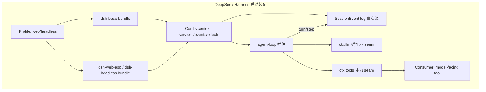

# DeepSeek Harness vs Pi 技术对比

> [!abstract] 核心结论
> 两者都是 TypeScript / MIT / ESM 的开源 agent 运行时，但代表两个相反方向：
> - **DeepSeek Harness（`dsh`）** 走「**一切皆插件**」的装配路线，用 Cordis 插件框架把模型适配、工具、会话日志、agent 循环都做成可替换、可叠加、可回滚的配置层，目标是生产级、可组合、可移植的 agent 产品底座。
> - **pi** 走「**极小内核 + 自我扩展**」的代码优先路线，默认只有 `Read`/`Write`/`Edit`/`Bash` 四个工具和很短的系统提示词，靠 TypeScript 扩展、技能、树状会话让 agent 自己长出新能力，目标是稳定、克制、可被 agent 自己演进的 coding agent。
>
> 一句话：**dsh 把扩展点做成配置 seam，pi 把扩展点做成代码热重载。**

## 对比速查表

| 维度 | DeepSeek Harness（dsh） | earendil-works/pi |
|---|---|---|
| 定位 | 通用 agent harness（Web + Headless + CLI），产品级底座 | 极简 terminal coding agent + agent toolkit 组件族 |
| 上手命令 | `npx @deepseek-ai/dsh web`（默认 `127.0.0.1:3080`） | `npm i -g @earendil-works/pi-coding-agent && pi` |
| 默认形态 | Web UI 为主，附带 headless 一次性运行 | 终端 TUI 为主，附带 RPC / JSON 流 / SDK |
| 核心范式 | 插件 + 配置组合（Cordis：service / typed event / 可逆 effect） | 小内核 + 代码扩展（TypeScript 扩展热重载） |
| 默认模型 | DeepSeek（`DEEPSEEK_API_KEY`），适配器 seam 可换任意 | 多 provider（订阅 + API key + 本地 llama.cpp），单会话可混 provider |
| 默认工具 | 工具是 `ctx.tools` 注册的能力，数量由 bundle 决定 | 仅 `Read`/`Write`/`Edit`/`Bash` 四个 |
| 扩展单元 | Cordis 插件（package）+ bundle + profile + `cordis.patch.yml` | TypeScript 扩展（`~/.pi/agent/extensions/`、`.pi/extensions/`）+ 技能 |
| 扩展加载 | 启动时按层组合配置树，`--dump-config` 查看实际装配 | 扩展 `/reload` 热重载，agent 可自写自测 |
| 会话模型 | append-only `SessionEvent` 日志为唯一事实源，turn/step 生命周期 | 树状会话，分支做 side quest 后回主线并保留摘要 |
| 多 agent | `subagent` 能力 seam（Service Definition + providers + Consumers） | SDK 可起 sub-agent；`/control` 轻量 delegation 示例 |
| 沙箱 | `ctx.sandbox`、E2B POC、原生 `node-addon-landlock-run`、subprocess 沙箱 | 项目信任 + 容器化（Gondolin / Docker / OpenShell）沙箱边界 |
| 技术栈 | TypeScript / ESM monorepo（pnpm workspace，~50 包）+ Python/Node SDK + 原生 addon | TypeScript / ESM monorepo（pi-ai / pi-agent-core / pi-coding-agent / pi-tui / pi-client / pi-protocol 等） |
| 协议集成 | MCP（`packages/mcp`）、ACP（`packages/acp`）、JSON-RPC SDK、hooks 桥接 Claude Code/Codex | MCP 非内核一等公民，倾向 CLI/TS 绑定；RPC（stdin/stdout JSONL）、JSON 事件流、SDK |
| 文档 | 双语文档（`docs/*.md` + `.zh.md` + i18n yaml）+ VitePress 站 + 生成式 catalog + postmortem | `docs/` + `examples/` + `CHANGELOG.md`，以代码示例为骨架 |
| 质量工程 | strict TS、per-file 100% 覆盖门、keyless snapshot、knip/publint、hygiene、defensive-patterns 文档 | vitest、npm shrinkwrap、容器化测试边界 |
| 成熟度 | 开发者预览（"会有破坏性变更"），2026-08-13 创建，~11.3k★ | 稳定迭代（v0.84.1），2025-08-09 创建，~89k★ |
| 许可证 | MIT | MIT |
| 仓库 | `deepseek-ai/deepseek-harness`（master） | `earendil-works/pi`（main） |

> [!note] 数据口径
> 仓库元数据（star / fork / 创建时间 / 默认分支）取自 GitHub API 读取时点；pi 版本号取自本地安装的 `@earendil-works/pi-coding-agent@0.84.1` 的 `package.json`。dsh 处于开发者预览，字段随后续发布可能变动。

## 1. 项目定位与用途

### DeepSeek Harness

`dsh` 自我定位是「开源 agent harness」，强调**一切皆插件**，由 Cordis（`cordiverse/cordis`，设计见论文 _A Programming Paradigm for Spatiotemporal Composability_）驱动（`README.md`）。它不是单点 CLI，而是一个可被组装成不同产品形态的底座：`web` profile 启动浏览器应用，`headless` profile 跑一次性任务，`cli` 提供命令行（`apps/{cli,web}`）。目标用户是希望在其上做产品级 agent、又能任意替换模型/工具/沙箱/审批策略的团队。

关键信号在 `AGENTS.md` 的预发布立场：*"foundation over blast radius"*——在没有外部消费者的阶段优先做对的地基而不是加兼容垫片，且明确"未来将出现破坏兼容性的变更"。

### pi

pi 自我定位是「minimal terminal coding harness」，目标是「核心保持小，通过 TypeScript 扩展、技能、prompt 模板、主题和 pi 包扩展」（`docs/index.md`）。它既是 CLI 工具，也是组件族：`pi-ai`（统一 LLM API）、`pi-agent-core`（agent loop / tool 执行 / session state）、`pi-coding-agent`（CLI + coding session）、`pi-tui`（终端 UI）、`pi-client`/`pi-protocol`、以及 `pi-mom`（Slack 等通道）、`pi-pods`（vLLM 部署）。目标用户是偏好「让 agent 自己写工具」、看重软件质量的开发者。

### 差异

dsh 的「harness」是**给做产品的人**的装配底座；pi 的「harness」是**给写代码的人**的极简运行时。dsh 假设你会去读 architecture 文档 selv 并按 seam 加包；pi 假设你会让 agent 当场写一个扩展、`/reload`、在分支里验证。

## 2. 架构与核心设计

### dsh：插件树 + 配置分层

dsh 的架构主线是「没有特权核心可改」：模型适配、工具注册表、会话日志、agent 循环本身都是插件，都能从配置替换（`docs/architecture.md`）。

- **Cordis 三件套**：插件向共享 context 贡献 *services*、*typed events*、*reversible effects*；注册是 effect，`register()` 返回 disposer，卸载时自动回滚（`AGENTS.md` "Registrations are effects"）。
- **Profile / Bundle / Patch 分层**：profile 是 Harness home 里的命名组合，列其叠加的 bundle、out-of-tree 插件和用户 `cordis.patch.yml`；bundle 是 Cordis 配置行 + 代码的可分发格式。`dsh-base` 是每个 profile 的首层（模型/工具/持久化/沙箱/审批/设置/凭据/遥测），`dsh-web-app` 加浏览器应用，`dsh-headless` 加无服务一次性 runner。叠加顺序：bundle 声明顺序 → profile patch → home patch → `--patch` overlay。`dsh --profile web --dump-config` 可看实际装配树，任何一行都能被 patch 替换。
- **Session 日志为事实源**：append-only `SessionEvent` 日志是模型上下文的唯一来源，`deriveMessages()` 从日志投影模型历史；"Model-visible means logged" 是运行时不变量，新增 model-visible 输入必须新增 session 事件（`docs/architecture.md` "Session log"）。
- **Turn / Step 生命周期**：step = 一次模型请求 + 其工具调用；turn = 0..n step。`turn/*`、`step/*`、`user/message`、`assistant/*`、`tool/*` 是持久事件，`agent/*` 是实时控制事件，`fs/*`、`tools/*`、`telemetry/*` 是能力事件。waterfall 监听者必须 `next()` 委托，`agent/turn-stopping` 串行无 `next()`（`docs/agent-lifecycle.md`，含完整 Mermaid sequence）。
- **能力 seam 三角色**：Service Definition / Service Provider / Consumer，缺一不构成 seam；新增能力要同时设计三角色。换一个 provider 能牵动整条产品线（filesystem + subprocess 共享一个执行世界，指向远程沙箱可连带迁移 Bash/PTY/LSP）。



### pi：极小内核 + 树状会话

pi 的内核刻意小（`docs/index.md`、已有 [[wiki/llm/Agent/Pi/Pi|Pi]] 笔记）：

- **默认四工具**：`Read`/`Write`/`Edit`/`Bash`，系统提示词很短，不把能力塞满上下文。
- **会话是树**：可从任意节点分支处理 side quest（修工具、试扩展、做 review），完成后回主线并保留分支摘要，避免修工具污染主任务上下文。
- **agent-core 抽象**：`pi-agent-core` 提供 agent loop、tool calling、state 管理；`pi-ai` 提供多模型 provider 抽象并支持单会话内多 provider 消息、低厂商锁定。
- **扩展是代码**：扩展是 TypeScript 模块，通过事件订阅、`registerTool()`、`registerCommand()`、`ctx.ui`（select/confirm/input/notify、自定义 TUI 组件）、`appendEntry()` 持久化状态等接入（`docs/extensions.md`）。
- **SDK / RPC / JSON 流**：`createAgentSession()`、`ModelRuntime`、`SessionManager`、`DefaultResourceLoader` 把 pi 嵌入 Node 应用；RPC 模式走 stdin/stdout JSONL；JSON 事件流模式输出结构化事件（`docs/sdk.md`、`docs/rpc.md`、`docs/json.md`）。

```mermaid
flowchart LR
  need[新能力需求] --> dec{现有工具能解决?}
  dec -->|Yes| use[Read/Write/Edit/Bash]
  dec -->|No| code[写 TS 扩展或 skill]
  code --> reload[/reload 热重载]
  reload --> test[在会话分支里验证]
  test --> ok{可用?}
  ok -->|No| code
  ok -->|Yes| reuse[后续轮次复用]
```

### 两者对比

- dsh 的架构在**配置层**做文章：换 provider/工具/沙箱=换配置行 + patch，不动循环。
- pi 的架构在**代码层**做文章：换能力=写扩展文件 + 热重载，不动核心。
- dsh 有非常正式的「事件域 + waterfall/serial 语义 + 不变量」工程契约；pi 更偏「事件钩子 + 自由组合」的实用派。

## 3. 功能特性

| 能力 | dsh | pi |
|---|---|---|
| 模型流式 | `ctx.llm` 消息与流词汇 + 适配器 seam，`llm/stream` 事件 | `pi-ai` 统一 LLM API，流式 delta 事件 |
| 工具执行 | `ctx.tools` 有序 pre / 并发 execute / 有序 post，按 executionMode 分类，barrier + 有界滚动池 | 默认四工具；扩展可注册任意工具，事件 `tool_call` 可拦截 |
| 上下文压缩 | `dsh-compaction` 能力 + basic provider，`agent/pre-step` 触发、可选 tool-result 裁剪与摘要 | 自定义 compaction 扩展（`summarize.ts` 示例）+ 分支摘要 |
| 规划 | `plan` 作为 logged state 的 plan mode | `/todos` 本地待办 + 可选 prompt 模板 |
| 子 agent | `subagent` 能力 seam（fresh child / delegated turn） | SDK 起 sub-agent；`/control` 轻量示例 |
| 持久终端 | `terminal` 能力 + `dsh-tool-terminal` | TUI 优先，`pi-tui` 组件库 |
| LSP | `lsp` 能力 seam | 无内置 LSP 一等能力 |
| 工作流/后台 | `workflow` + `jobs`（worker-thread provider + `job_*` 工具） | 扩展可加（file watchers、webhooks、CI triggers） |
| 凭据 | `credentials` 能力 seam（env/.env provider） | API key / OAuth（`docs/` 09-example / `docs/custom-provider.md`） |
| 自我修改 | `self-modification` 包：agent 检查/挂载自己的插件；`demo:cordis` | 核心主张：agent 自写扩展并 `/reload` |
| 审批/交互 | `interaction` + `guard`（loop-hygiene + tool-timeout）、approval policy | `ctx.ui.confirm` 拦截危险命令（如 `rm -rf`）扩展 |
| 会话标题 | `ctx.sessionTitle` 唯一 provider | 扩展可注册 |
| 分叉/恢复 | `ctx.sessions.fork(source, boundary?, childSessionId?)` | 会话树分支 + 分支摘要 |

## 4. 技术栈

- **共同点**：TypeScript、ESM（`"type": "module"`）、Node `>=22.19`（dsh 要求 `node ^22.19 || >=24`）、pnpm/npm、vitest、MIT。
- **dsh monorepo**：约 50 个 `@deepseek-ai/dsh-*` 包，分组在 `packages/<group>/<pkg>`；额外 `python/` SDK + 运行时、`native/`（`node-addon-landlock-run`）、`vendor/`（vendored Cordis，pin 上游 SHA）、VitePress `website/`；CI 用 `.gitlab-ci.yml`、lefthook、knip、jscpd、oxlint、tsdown。
- **pi mono**：`pi-ai` / `pi-agent-core` / `pi-coding-agent` / `pi-tui` / `pi-client` / `pi-protocol` / `pi-mom` / `pi-web-ui` / `pi-pods` 等；`pi-coding-agent` 依赖 `pi-agent-core`、`pi-ai`、`pi-client`、`pi-protocol`、`pi-tui`，运行时依赖含 `undici`、`jiti`、`typebox`、`yaml`、`cross-spawn`（`package.json`）。
- **构建**：dsh 用 `tsc` + `tsdown` 产物 + ESM-only 源启动（tsx hook，无 Node 原生 TS 模式）；pi 用 `tsgo` 构建 + 可选 `bun build --compile` 产出单文件二进制 `dist/pi`。

## 5. 扩展性：插件/扩展/技能机制

### dsh 的扩展：plugin + seam + bundle

- **插件即包**：每个能力是一个 `@deepseek-ai/dsh-*` 包，通过 `ctx.effect()` / `ctx.on()` 注册，`register()` 返回 disposer。
- **seam 三角色**：新增能力 = 新增 Service Definition + Provider + Consumer，三者作为一个 seam 完整存在，仅当角色独立演进时才拆包（`AGENTS.md` "A capability seam comprises..."）。
- **配置组合**：bundle 提供可分发、可被上层 patch 的配置行；profile 叠加多层 patch。`dsh --profile web --dump-config` 打印实际插件树，任一行可被 patch 替换或插入。
- **技能**：`skill` 包提供 skill provider registry + 本地实现 + catalog/loader 工具。
- **约束**："Plugins, not loop changes"——新行为走文档化扩展点，改 `agent-loop` 必须同步更新 `docs/architecture.md`。

### pi 的扩展：代码 + 热重载 + 技能

- **TypeScript 扩展**：放 `~/.pi/agent/extensions/`（全局）或 `.pi/extensions/`（项目）自动发现，`/reload` 热重载；能力涵盖自定义工具、事件拦截、`ctx.ui` 交互、自定义 TUI 组件、命令、会话持久化、自定义渲染（`docs/extensions.md`）。
- **技能（Agent Skills 标准）**：pi 实现 [agentskills.io](https://agentskills.io/specification) 标准，按需加载；可复用 Claude Code / Codex 的 skills 目录（`docs/skills.md`）。
- **Pi 包**：把扩展/技能/prompt 模板/主题打包分发。
- **自我扩展闭环**：agent 缺能力→写扩展→热重载→分支验证→复用，是 pi 的核心范式。

### 差异

dsh 的扩展是"声明式配置装配 + seam 契约"，强类型、强文档、可被 patch 叠加替换；pi 的扩展是"命令式代码 + 热重载"，灵活、agent 可自迭代。dsh 更适合需要被许多产品复用、要稳定演进的能力；pi 更适合"需要让 agent 当场长出新能力"的场景。

## 6. 集成能力（模型 / MCP / API / IDE）

| 集成面 | dsh | pi |
|---|---|---|
| 模型 provider | `ctx.llm` 适配器 seam，内置 DeepSeek；任意 provider 接适配器 | `pi-ai` 多 provider，订阅（`/login`）+ API key + 本地 llama.cpp；单会话多 provider |
| MCP | `packages/mcp` 一等能力 | 非内核一等，倾向 CLI/TS 绑定，但可经扩展接入 |
| ACP | `packages/acp`（automation-only ACP server） | 无 |
| 协议 | JSON-RPC SDK（SDK 包）+ Claude Code/Codex hooks 桥接 + wire-protocol 库 | RPC（stdin/stdout JSONL）+ JSON 事件流 + SDK |
| IDE / UI | Web UI（浏览器）+ CLI + ConversationNodeDefinition + keyed renderer | TUI（`pi-tui`）+ Web UI 组件（`pi-web-ui`）+ Slack 等（`pi-mom`） |
| 沙箱后端 | `ctx.sandbox`、E2B POC、`node-addon-landlock-run`、subprocess 适配 | 项目信任 + 容器化（Gondolin / Docker / OpenShell） |

## 7. 工作流与协作（任务 / issue / 多 agent）

- **dsh**：用 `plan` / `todo` / `goals` 作为 logged state 管理目标；`subagent` seam 支持多种 provider（fresh child agent 或 delegated turn）；`ctx.jobs` + `job_*` 工具做后台工作；`agent/*` 事件让多观察者在一个会话上协调队列、状态、请求、转向、错误。
- **pi**：树状会话把 side quest / review / 修工具隔离在分支；`/todos`、`/review`、`/files`、`/answer`、`/control` 等命令构成轻量协作面；`pi-mom` 把 pi 接到 Slack 等通道做多 agent / 多人协作；SDK 可起 sub-agent 做更重编排。

两者都不自带 issue 集成（区别于本项目所在的 Multica 运行时），需自行接 GitHub 等。

## 8. 文档与生态

- **dsh**：文档非常工程化——双语 `docs/*.md` + `.zh.md` + `*.i18n.yaml`，VitePress `website/` 投影，生成式 catalog（`tool-catalog.md` 展达 80KB、`config-catalog.md`、`module-graph.md`、`persistence-catalog.md`），`glossary.md`、`defensive-patterns.md`、`postmortem/`、`cookbook/`、`.agents/notes/` 机制强制每个非平凡改动写 Agent Note。README 简洁，AGENTS.md 详尽（15KB）。
- **pi**：文档以 `docs/` + `examples/` 为骨架，扩展示例库（`examples/extensions/` 含 `snake.ts`、`confirm-destructive.ts`、`custom-compaction.ts` 等十余个）和 SDK 进阶示例（`examples/sdk/01..10`）驱动；`CHANGELOG.md` 巨大；社区生态以 `packages.md` 的 pi 包分发为主。
- **活跃度**：pi 更早（2025-08 创建）、star 更多（~89k）；dsh 极新（2026-08-13 创建）但 24h 内已破万 star，开发者预览期。

## 9. 许可证与开源策略

| 项 | dsh | pi |
|---|---|---|
| 许可证 | MIT | MIT |
| 三方依赖披露 | `THIRD_PARTY_NOTICES.md`（15KB） | 依赖清单见 `package.json` / `npm-shrinkwrap.json` |
| 仓库治理 | `AGENTS.md` + `CLAUDE.md` 软链、lefthook、knip/publint、native GitHub stacks、unified label taxonomy | `AGENTS.md` 风格的 repo 治理较弱，靠 examples + tests |
| 兼容承诺 | 明确**不承诺**（preview、`SESSION_FORMAT_VERSION=0`、SQLite `SCHEMA_VERSION` 单调，回滚旧格式） | 靠 semver 版本号（`^0.84.1`） |
| 社区 | Discord + 企微 + GitHub Discussions + `dsh-plugin` topic | issues / PR + pi 包生态 |

## 10. 适用场景与选型建议

**选 dsh，如果你：**

- 要在它之上做**产品级 agent**，需要在不同部署间替换模型/工具/沙箱/审批策略；
- 认同「能力 = 可被 patch 替换的 seam」并愿意写 Service Definition/Provider/Consumer；
- 需要 Web + Headless + CLI 多形态共享同一底座；
- 能接受开发者预览期的破坏性变更，并投入做对的地基。

**选 pi，如果你：**

- 要一个**稳定克制的 coding agent**，默认操作就是读/写/编辑/跑命令；
- 希望让 **agent 自己写扩展、热重载、在分支里自验证**，而不是预先装配大插件树；
- 需要把它**嵌入**到 Node 应用 / 自定义 UI / Slack bot / 自定义 RPC，看重轻量 SDK 与组件族；
- 偏好 code-first / filesystem-first / bash-first，对"MCP 进内核"不执着。

**可以一起用或对照参考的点：**

- dsh 的 "Model-visible means logged" 与 pi 的「分支隔离上下文污染」都在解决同一件事：**让长会话保持可控、可重放、可纠错**，前者用持久事件日志，后者用会话树。
- dsh 的 capability seam 三角色 ↔ pi 的扩展 + 技能 + pi 包，可以互为设计参照：要做可被多个产品复用的稳定能力时借 dsh 的 seam 思路；要让 agent 当场自迭代时借 pi 的热重载闭环。

## 相关笔记

- [[wiki/llm/Agent/Agent|Agent]]
- [[wiki/llm/Agent/Pi/Pi|Pi]]
- [[wiki/llm/Agent/Pi/Pi SDK|Pi SDK]]
- [[wiki/llm/Agent/Pi/Pi 与 OpenClaw 集成架构|Pi 与 OpenClaw 集成架构]]
- [[wiki/llm/Agent/Harness/Harness 架构与源码：运行时、联动与模式|Harness 架构与源码：运行时、联动与模式]]
- [[wiki/llm/Agent/Harness/OpenHarness：开源智能体基础设施深入解析|OpenHarness：开源智能体基础设施深入解析]]
- [[wiki/llm/Agent/Harness/OpenClaw vs Claude Code vs Mem0 技术对比|OpenClaw vs Claude Code vs Mem0 技术对比]]

## 参考来源

- [deepseek-ai/deepseek-harness](https://github.com/deepseek-ai/deepseek-harness)（`README.md`、`README.zh.md`、`AGENTS.md`、`docs/architecture.md`、`docs/agent-lifecycle.md`、`docs/tool-catalog.md`、`packages/` 目录与各 `README.md`）
- [earendil-works/pi](https://github.com/earendil-works/pi) 与本地安装包 `@earendil-works/pi-coding-agent@0.84.1`（`package.json`、`docs/index.md`、`docs/extensions.md`、`docs/skills.md`、`docs/sdk.md`、`docs/rpc.md`、`docs/json.md`、`examples/extensions/`、`examples/sdk/`）