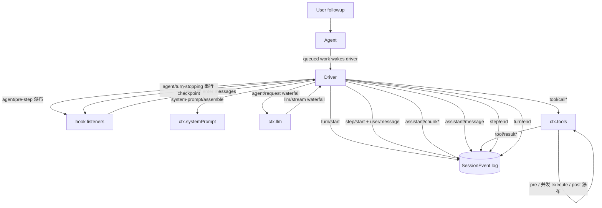

# DeepSeek Harness 介绍与开发使用指南

> [!abstract] 一句话
> **DeepSeek Harness（`dsh`）** 是 DeepSeek 开源的 TypeScript agent 运行时，跑在 [Cordis](https://github.com/cordiverse/cordis) 插件框架上，slogan **“Everything is a Plugin”**。它不是单个 CLI，而是一个「可被装配成不同产品形态的底座」——Web UI、Headless 一次性运行、CLI、ACP 自动化都能从同一套插件树组合出来。形态上类比：**dsh 之于 agent ≈ Spring Boot 之于微服务**（IoC 容器 + 插件式能力包 + 约定配置），详见 [[wiki/llm/Agent/DeepSeek Harness vs Pi 技术对比|dsh vs Pi 对比]]。

## 1. 是什么 / 给谁用

- **是什么**：一个 agent harness（运行时 + 框架）。模型适配、工具注册表、会话日志、agent 循环本身都是插件，都能从配置替换（`docs/architecture.md`）。没有特权核心可改，扩展方式是「在别的插件旁边挂一个插件」，注册即 effect，卸载自动回滚。
- **给谁用**：想在其上做**产品级 agent**、又要能任意替换模型 / 工具 / 沙箱 / 审批策略的团队；愿意读 architecture 文档、按 seam 写 Service Definition/Provider/Consumer 的开发者。
- **不给谁用**：想要一个开箱即用、稳定兼容的成品的用户——dsh 还是 *developer preview*，README 明确 **“THERE WILL BE COMPATIBILITY-BREAKING CHANGES”**，连 on-disk 格式都不承诺兼容（`SESSION_FORMAT_VERSION=0`、SQLite `SCHEMA_VERSION` 单调不回滚）。
- **状态与数据**：MIT 许可；仓库 `deepseek-ai/deepseek-harness`，2026-08-13 创建，默认分支 `master`，语言 TypeScript。截至抓取时 star 增长极快（首日破万）但仓库极年轻，字段随时变动。

## 2. 核心架构：Cordis 插件树 + 配置分层

### 2.1 Cordis 五要素（`docs/cordis-primer.md`）

dsh 的一切都建立在 Cordis 这五个概念上：

| 要素 | 含义 | 在 dsh 的体现 |
|---|---|---|
| **Plugin = Service** | 插件是一个实现 `Service` 的对象（函数带 `apply(ctx)`，或 `Service` 子类）， Cordis 把生命周期挂进 context | 每个 `@deepseek-ai/dsh-*` 包就是一个插件 |
| **Context = 服务仓库** | 服务通过稳定的 `ctx.<key>`（如 `ctx.tools`、`ctx.llm`、`ctx.sessions`）声明位置，别的插件按键查找而非导入实现 | 解耦 provider 与 consumer |
| **`inject` 声明依赖** | 插件在 `inject` 里点名依赖服务，加载顺序由服务就绪表达，不需手动 boot 序 | 免写启动编排 |
| **Typed Events** | 服务用 TS 声明合并声明事件名，再按 `emit` / `waterfall` / `parallel` / `serial` 分发 | `agent/*`、`fs/*`、`tools/*` 等扩展点 |
| **注册即可逆 effect** | prompt 段、工具 schema、适配器、provider、监听器都经 `ctx.effect()` / `ctx.on()` 安装，重载和卸载可预测回滚 | 热替换、`--dump-config` 装配树可回放 |

> [!info] 四种分发模式
> `emit`（观察，不 await）/ `waterfall`（around 中间件，有返回值，须 `next()` 委托）/ `parallel`（await 全体并行）/ `serial`（按序 await，有返回值，无 `next()`）。分发模式是事件**公共契约**的一部分，新事件用 `@mode` 标注，生成式 catalog 会校验声明与调用点一致。`agent/pre-step`、`agent/request`、`llm/stream`、三个 `tools/*` 是 waterfall；`agent/turn-stopping` 是 serial 且无 `next()`。

### 2.2 Profile / Bundle / Patch 三层装配（`docs/architecture.md`）

运行的 dsh = 启动时按层组合出的一棵插件树：

- **Profile**：Harness home 里的命名组合，列出它叠加的 bundle、out-of-tree 插件，并持有用户的 `cordis.patch.yml`。`web`、`headless` 是自带模板。
- **Bundle**：Cordis 配置行 + 它所挂代码的可分发格式；插入的任何东西都能被上层 patch。
- **Patch**：按 id 定位某一行，整行替换其 config，或插入新行。

叠加顺序（从空 entry list 开始）：**profile 列出的 bundle（按声明序）→ profile 的 `cordis.patch.yml` → home 级 `cordis.patch.yml` → `--patch` overlay**。

自带套件：
- [`dsh-base`](packages/bundle/base/README.md)：每个 profile 的首层——模型适配、工具、持久化、沙箱与审批策略、设置、凭据、遥测。
- [`dsh-web-app`](packages/bundle/web-app/README.md)：浏览器应用。
- [`dsh-headless`](packages/bundle/headless/README.md)：无服务的 one-shot runner。

看本机实际装配树：

```sh
dsh --profile web --dump-config
```

任何打印出来的一行都能被你自己的 patch 替换。

## 3. 核心包与能力 seam

`AGENTS.md` 的 `packages/` 布局（节选，见仓库 `AGENTS.md` 全表）：

| 分组 | 包 | 职责 / `ctx` key |
|---|---|---|
| core | `session` / `system-prompt` / `tools` / `agent` / `agent-loop` / `scope` | 产品 API 脊柱：append-only `SessionEvent` 日志、prompt 段+工具 schema 装配、scoped 工具注册表与守卫执行管线、`Agent` 接口与 `agent/*` 事件、默认 driver |
| llm | `llm` | 消息与流词汇 + 适配器 seam（`ctx.llm`），内置 DeepSeek provider |
| shell / subprocess / terminal | local / pwsh provider、subprocess 沙箱、持久终端 | `ctx.shell` / `ctx.subprocess` / `ctx.terminals` |
| fs / lsp / web | filesystem 能力 + 策略、language server、web search/fetch | `ctx.fs` / `ctx.lsp` / web tool consumer |
| skill / subagent / workflow | skill provider registry、子 agent 委派、后台 jobs | `skill/` / `subagent/` / `workflow/` + `job_*` 工具 |
| compaction / context / guard | 上下文压缩、请求上下文插件、loop-hygiene + tool-timeout | `compaction/` / `context/` / `guard/` |
| plan / todo / preset | plan mode 作 logged state、`todo_write` 工具、按 preset `cordis.yml` 组合 per-session agent | `plan/` / `todo/` / `preset/` |
| self-modification | agent 检查/挂载自己的插件（演示 `pnpm run demo:cordis`） | — |
| hooks | Claude Code/Codex hook 桥接 + wire 协议库 | — |
| session / identity / settings / credentials | 持久会话数据、匿名身份、用户设置、凭据引用 | — |
| acp / interaction / boot / sdk | automation-only ACP server、审批/交互/权限、app-bin 胶水、JSON-RPC 协议与 TS client | — |

> [!important] 能力 seam 三角色
> 一个 **seam** = **Service Definition**（声明接口）+ **Service Provider**（实现）+ **Consumer**（使用，常是模型可见工具）。三者缺一不构成 seam；新增能力要同时设计三角色（见 `docs/architecture.md` "Where new behavior goes" 表）。这是 provider 一次替换能牵动整条产品线的原因：filesystem + subprocess 共享一个执行世界，指向远程沙箱可连带迁移 Bash/PTY/LSP。

## 4. 事件域与 turn / step 生命周期

### 三个事件域（`docs/architecture.md` "Events"）

- **Session 事件**：持久事实，append 到日志并经 `session/event` 广播——需跨重载存活的事实用它。
- **Agent 事件**（`agent/*`）：携带 live `Agent`——inbox、step、status、request、validation、continuation；观察或拦截 work-in-flight 用它。
- **Capability 事件**：把策略与适配器挂到 seam（`fs/*`、`tools/*`、`telemetry/*`），无需导入 loop。

### Turn / Step（`docs/agent-lifecycle.md`，含完整 Mermaid 时序）

- **step** = 一次模型请求 + 其工具调用。
- **turn** = 0..n step；首个输入被 claim 前打开，不再欠任何东西时关闭。
- 关键不变量：**Model-visible means logged**——任何到达模型请求的事物必须能从日志重建；新增 model-visible 输入必须新增 session 事件（扩展 `SessionEventMap` 并从日志渲染）。`deriveMessages()` 从日志投影模型历史，`assistant/chunk` 原始保留以供 replay / UI 保真。
- `agent/pre-step` 决定模型看到什么：监听器可重写被 claim 的消息或直接 reject；被 reject 或首次 claim 重写为空的 turn 仍会以「花了 0 个 step」关掉一条 durable turn（日志记下这次尝试）。
- `dsh-compaction-basic` 用 `agent/pre-step` 在请求派生前感受压力，仅在关闭的失败 step 与失败 turn 之间做恢复，只有当剪裁/摘要推进 surface 替换代际时才开新一轮 retry turn。



> [!tip] SDK 使用者
> 需要 replayable transcript 数据就消费 `session/event`；`agent/*` 是 live 协调 API（队列/状态/prompt 拦截/请求构造/steering/continuation/error）。

## 5. 本地环境搭建（`docs/development.md`）

### 前置

- **Node.js** `^22.19` 或 `>=24`（CI 覆盖 22.19、24、26）。
- **pnpm** 经 Corepack 启用；仓库 pin `pnpm@11.7.0`，`pnpm --version` 不对就 `corepack enable`。
- **Git** ≥ 2.26（hook setup 要用 worktree-specific 配置扩展）。
- 可选：`DEEPSEEK_API_KEY`，跑 Web / headless / ACP demo 和 real-API e2e 要用。

### 首次安装

```sh
git clone https://github.com/deepseek-ai/deepseek-harness.git
cd deepseek-harness
pnpm install
pnpm run typecheck   # 完成 Host lib 阶段（含生成的 Typert 契约），先于 Client TS 检查
```

`pnpm install` 会装 Lefthook（worktree-local）和 `dsh-translation-pairing` Git merge driver（`scripts/install-lefthook.mjs`）。若缓存恢复导致 `postinstall` 被跳过，手动补：

```sh
node scripts/install-lefthook.mjs
```

把 checkout 移动到别处后，重新跑该 wrapper 重新生成所拥有路径。setup 完成的判据是 `pnpm run typecheck` 退出成功。

### 环境变量

```sh
DEEPSEEK_API_KEY=sk-...
DEEPSEEK_BASE_URL=https://...   # 可选，默认公网 API
```

放 repo 根的 gitignored `.env`，**不要提交真实凭据**。无 `DEEPSEEK_API_KEY` 时 real-API e2e 套件自跳过。

### 常用脚本（`AGENTS.md` "Commands"）

```sh
pnpm install            # pnpm workspaces
pnpm run clean           # 清构建产物与删除包的安全残留
pnpm run test           # vitest 单测
pnpm run test:coverage  # CI 覆盖门：packages/*/*/src 每文件 100%
pnpm run test:e2e       # 真 API 测试；无 DEEPSEEK_API_KEY 自跳过
pnpm run test:snapshot  # 无 key 的 ACP/headless 回放比对
pnpm run typecheck
pnpm run lint
pnpm run duplication    # 跨文件 TS clone 检测
pnpm run build          # tsc 出 lib/types，tsdown bundle 运行时
pnpm run hygiene        # knip + publint + workspace 约束 + NodeNext consumer 检查
pnpm run doc-sync       # 所有文档门
pnpm run website:build  # VitePress 构建（兼做死链检查）
pnpm dsh --profile headless "task"   # 从源码跑一次任务（需 DEEPSEEK_API_KEY）
pnpm run demo:cordis    # agent 自改运行时（需 key）
pnpm run demo:acp       # ACP 自动化 server（需 DEEPSEEK_API_KEY）
```

> [!note] 构建顺序
> 根构建按生成式依赖序：`tsc -b tsconfig.host.json` → `tsdown --env.DSH_BUILD_FACE host` → `tsc -b tsconfig.client.json` → `tsdown --env.DSH_BUILD_FACE client` → `pnpm run build:web`。Typert 仅在 Host tsdown 跑，seed 自 `tsconfig.host.json`，生成 Host 反射制品 + Host-for-Client Remote 投影；Client tsdown 不启 Typert。普通提交/push 不需要 build，除非所选检查消费 `lib/` 产物。

## 6. 跑起来

```sh
# 最快体验：不用 clone
npx @deepseek-ai/dsh web          # Web UI，默认 http://127.0.0.1:3080

# Headless 一次性任务
pnpm dsh --profile headless "把当前目录的 README 总结成 5 条"
```

从源码跑：

```sh
pnpm install && pnpm run build
pnpm dsh web
```

## 7. 写一个插件（最小心智模型）

dsh 的「新行为」都挂在文档化的扩展点上（`docs/architecture.md` "Where new behavior goes" 节选）：

| 目标 | 机制 |
|---|---|
| 加一个模型 provider | 在 `ctx.llm` 注册适配器 |
| 加一个模型可见能力 | 在 `ctx.tools` 注册；其 schema 自动进 prompt 装配 |
| 给某会话换能力集 | 组合一个 agent preset（service 行需带 `isolate` realm） |
| 加 shell 执行 | 注册 `ctx.shell` backend（local 经 `ctx.subprocess` 派生） |
| 加持久终端 | 注册 `ctx.terminals` backend + `dsh-tool-terminal` |
| 加人类命令 | `ctx.commands` 注册，不经 model turn 派发 |
| 加后台工作 | `ctx.jobs` 注册；`job_*` 工具收集/停止 |
| 加文件访问或策略 | `ctx.fs` provider 或监听 `fs/*` 事件 |
| 限制派生进程 | 用 `ctx.sandbox` backend；consumer 在 spawn 前裹 argv |
| 拦截请求/工具/turn | 用对应 `agent/*` 或 `tools/*` 事件；`agent/turn-stopping` 停 turn |
| 加模型可见上下文 | 调 `agent.inject()`，落在下一个被接纳的请求里 |

最小插件骨架（Cordis 五要素落地）：

```ts
import { Service, Context } from '@cordis/core'

// 1) Plugin = Service；apply(ctx) 挂生命周期
class MyTool extends Service {
  static inject = ['tools'] as const // 2) 声明依赖（替代手动 boot 序）

  apply(ctx: Context) {
    // 3) 注册即可逆 effect：卸载/重载自动回滚
    ctx.effect(() => {
      const dispose = ctx.tools.register(myToolSchema, async (call) => { /* ... */ })
      return () => dispose()
    })
  }
}

// 4) Typed Events：给你的能力声明事件名并按 mode 分发
declare module '@cordis/core' {
  interface Events {
    'my/calc': [number]
  }
}
```

> [!important] 不要改 loop
> 原则是 **"Plugins, not loop changes"**——新行为走文档化扩展点；改 `agent-loop` 必须同步更新 `docs/architecture.md`。

## 8. 调试与质量门

- **装配诊断**：`dsh --profile <name> --dump-config` 打印实际插件树，逐行可被 patch 替换。
- **类型**：Node 分 Host / Client 两个 aggregate 编程（`tsconfig.host.json` / `tsconfig.client.json`），因为两侧在同一 `Context` 键下声明合并了不同 services，塞进一个 `ts.Program` 会碰撞；模块解析不会触发碰撞。新包只注册进一个 aggregate（`api/remotes` 是唯一的 split，别复制）。
- **CI 覆盖门**：`packages/*/*/src` 每文件 100% 覆盖；`test:snapshot` 提供无 key 的 ACP/headless 回放比对；`test:e2e` 在有 key 时跑真 API。
- **hygiene**：`knip`（未用导出）+ `publint`（包入口对 `lib/*.js` 校验）+ workspace 约束 + NodeNext consumer 检查。`verify-node-next-types` 验证 `lib/` 声明对一个临时 NodeNext consumer。
- **vendor 守卫**：改 `vendor/*/src` 必须连同 `vendor/README.md` manifest 一起暂存。
- **i18n 配对 merge driver**：双语 `*.md` + `*.zh.md` + `*.i18n.yaml` 的配对契约；冲突时跑 `pnpm run resolve-translation-pairing-conflicts`。
- hook 仅做少量本地检查（staged pairing、oxlint 暂存档、`THIRD_PARTY_NOTICES.md` 重生、空白、vendor 守卫），`pre-push` 跑 `pnpm run typecheck`。想跑全套本地门用 `pnpm run check:all`（独立于 Git hooks，不是 agent 指令）。

## 9. 文档、生态与现状

- **文档非常工程化**：双语 `docs/*.md` + `.zh.md` + `*.i18n.yaml`；VitePress `website/`；生成式 catalog（`tool-catalog.md`、`config-catalog.md`、`module-graph.md`、`persistence-catalog.md`）；`glossary.md`、`defensive-patterns.md`、`postmortem/`、`cookbook/`、`.agents/notes/` 强制每个非平凡改动写 Agent Note。
- **生态**：插件仓库加 `dsh-plugin` topic 提升可发现性；Discord + GitHub Discussions + 企微。
- **贡献**：`CONTRIBUTING.md` 明确早期阶段**暂不接受外部 PR**，鼓励在 GitHub Discussions 反馈、写 plugin、写博客/教程、答题。官方表态「官方仓库的包并不天然比社区包更重要，把本仓库看作 idea / 官方 showcase / 灵感来源，不是命令」。
- **Python SDK / 运行时**：`python/` 目录提供 Python SDK 与 bundled runtime（见 `python/README.md`）。
- **原生 addon**：`native/` 提供 `@deepseek-ai/node-addon-landlock-run`（Linux 沙箱）。
- **现状提醒**：developer preview、无 tagged release、不承诺兼容。当 Spring Boot「研究」正合适，当 Spring Boot「用」太早。

## 10. 实战示例：从安装到运行到调试（完整 walkthrough）

跟着走一遍即可体验「clone → 配置凭据 → 构建 → 起 Web → 发 headless 任务 → 装一个插件进新 profile → 检查装配树 → 跑检查」。所有命令均对齐 `apps/cli/reference/README.md` 与 `docs/development.md` 的真实行为。

### 10.1 前置与凭据

```sh
node -v        # 需要 ^22.19 或 >=24
corepack enable
git clone https://github.com/deepseek-ai/deepseek-harness.git
cd deepseek-harness
```

凭据按解析顺序查找：**进程环境变量 → `$DSH_HOME/.credentials.yaml` → 调用目录的 `.env` → `$DSH_HOME/.env`**。managed 文档（`$DSH_HOME/.credentials.yaml`）不会物化进 `process.env`，两个 `.env` 是普通环境层。最快做法是放 repo 根的 `.env`（已被 gitignore）：

```sh
cat > .env <<'EOF'
DEEPSEEK_API_KEY=sk-...
# 可选：换给第三方兼容端点
DEEPSEEK_BASE_URL=https://...
# web_search 用，不用搜索可留空
DEEPSEEK_SEARCH_BASE_URL=https://...
EOF
```

> [!warning] 不要提交凭据
> 真实 key 永远放在 gitignored 的 `.env` 或 `$DSH_HOME/.credentials.yaml`；无 `DEEPSEEK_API_KEY` 时 real-API e2e 套件自跳过，但 Web/headless demo 不可用。

### 10.2 构建与起 Web

```sh
pnpm install
pnpm run typecheck     # 先跑 Host lib 阶段（含生成 Typert 契约），再 Client tsc
pnpm run build         # tsc 出 lib/types → tsdown bundle → 前端 build
pnpm dsh web           # 或：dsh --profile web
# 默认服务在 http://127.0.0.1:3080
```

几个可选：

```sh
pnpm dsh web --port 8080                    # 换端口
pnpm dsh web --trusted-host dev.local        # 加浏览器信任的 host（CLI 尚不支持 --host 0.0.0.0，会报 usage error）
pnpm dsh web --patch ./extra.cordis.yml      # 本次启动再叠一层 patch
pnpm dsh web --dump-config                   # 不启动，只打印装配树
pnpm dsh web --help                          # 打印 web app 自身的帮助（不 boot）
```

> [!note] dev 模式
> 客户端 HMR 接收器常驻，但默认闲置——要热重载前端须另开一个 `pnpm run dev:web` watcher 重建 client bundles，它才会被推到运行中的 Web。

### 10.3 Headless 一次性任务

```sh
pnpm dsh --profile headless "把当前目录的 README 总结成 5 条"
```

- `headless` profile 在首次使用时从模板自动初始化（`web` 同理）；其他 profile 必须用 `dsh plugin` 创建。
- 该命令创建一个全新持久 Agent、提交任务、等待静止、flush Session 后，从 durable 区间派生出最后一段非空 assistant 文本，输出到 stdout；`completed` 退出码 0，否则 1。
- shipped headless profile 不挂 ApiProxy / Host / HTTP server / Web runtime / 浏览器 client；成功的运行不写 stderr、不开监听端口。

### 10.4 自定义装配：用一个新 profile 装插件

```sh
# 创建并初始化一个新 profile（非内置 profile 要先 plugin 创建）
pnpm dsh plugin --profile tui add github:deepseek-harness/turtle-ui
pnpm dsh plugin --profile tui remove turtle-ui

# pnpm 动词全部可用：update / why / add ...
pnpm dsh plugin --profile tui update

# 相对路径插件以调用目录为锚（不是 profile 目录），在插件 checkout 里跑 `add .` 就是装当前 checkout
pnpm dsh plugin --profile tui add .

# 启动新 profile
pnpm dsh --profile tui
```

关键事实（对齐 `apps/cli/reference/README.md` “Plugin management”）：
- 每次 `plugin` 成功后会据安装状态调和 `dsh.profile.bundles`：依赖的 package 若 manifest 声明 `"dsh": { "bundle": { "patch": "./cordis.patch.yml" } }` 自动加进层数；没有 bundle 声明的依赖保持普通依赖并给一次性警告；被 remove 的依赖退出层数。
- git-hosted源插件靠 `prepare` 脚本在 install 时构建；pnpm ≥10 会拦住 `prepare` 直到消费者 `allowBuilds`——首次 `add` 会以 pnpm 的 `allowBuilds` 提示失败（同时给一句 dsh 指向 profile 的 `pnpm-workspace.yaml`），把打印的 key 复制进去再跑一次即可。装已构建的 tarball 或本地 checkout 不需要这个授权。

### 10.5 检查装配树与 patch 调试

```sh
pnpm dsh --profile web --dump-default-config          # 只打 bundle 层
pnpm dsh --profile web --patch ./extra.cordis.yml --dump-config   # 含 profile cordis.patch.yml + home cordis.patch.yml + --patch 叠加
```

- `--dump-default-config` 只出 bundle 层；`--dump-config` 在其上叠加 profile 的 `cordis.patch.yml`、home 级 `$DSH_HOME/cordis.patch.yml`、`--patch` overlay。
- 两 dump 都会注释每一行来自哪个文件、被哪些 overlay 改过；`!!js` 表达式保持未展开；未命中的 patch 目标会打到 stderr。
- **dump 不运行 app 命令行 provider**，所以看到的是任何 app 参数被解析之前的装配树；若调用里带了 app 参数会直接拒绝。
- 层优先级：后层胜出，patch 是「整行替换目标行的完整 `config` 值」而非深合并，且可插新行。

### 10.6 用极简 preset、仅 bash + editor 跑干净对照

shipped 的 agent preset 位于 `apps/cli/config/agent-presets/`，目录即花名册：`code`、`cordis`、`minimal`、`standard`。

- `minimal` preset 把系统提示词固定为 `You are a helpful software engineer assistant.`，只组合持久 `bash` + `str_replace_editor`，其它定义不上。在 Web 建会话时选「极简模式」即生效；该会话里其它 prompt 段与模型可见插件共用 host 但不出现。
- preset 的本质：一个含 `agent.cordis.yml` 的目录，按 per-agent scope mount，每个会话独立组合，所以一个进程可并发跑多个不同装配的 agent。preset 里声明会发布进程全局服务的行会在 mount 时被拒绝（防止跨会话碰撞）。

### 10.7 跑质量门与测试

```sh
pnpm run typecheck          # Host lib + 生成契约 + Client tsc（pre-push 也跑这个）
pnpm run lint               # oxlint（先跑 Host lib，再校契约）
pnpm run test               # vitest 单测
pnpm run test:e2e           # 真 API；无 DEEPSEEK_API_KEY 自跳过
pnpm run test:snapshot      # 无 key 的 ACP/headless 回放比对
pnpm run hygiene            # knip + publint + NodeNext consumer 检查（publint 校验 lib/*.js，需先 build）
pnpm run check:all          # 全套本地门（独立于 Git hooks，非 agent 指令）
```

> [!tip] 新 worktree 没有产物
> 普通提交/push 不需要 build；但若你选的检查消费 `lib/`（如 `hygiene` 的 publint、或需要类型声明的检查），先 `pnpm run build`。

### 10.8 调试信号与关闭行为

- 默认会话权限 preset：`workspace-write`——bash 与文件写动作被限制在会话 workspace 与平台临时根；读、网络、进程可见性不受限。`DSH_PERMISSION_MODE` 改进程回退。
- `DSH_TOOLS_MODE` 选 `native` / `code` / `both`；其它值启动即报错。
- 遥测默认本地。`DSH_TELEMETRY_MODE=FULL` 把每个投影会话事件走 OTLP/HTTP 日志上传，`FEEDBACK_ONLY` 仅在记到反馈时上传一段 session-log 后缀；`DSH_TELEMETRY_OTLP_URL` 换 collector；任何非空 `DSH_TELEMETRY_DISABLED` 为硬退出。
- 进程关闭给插件树最多 5 秒 dispose。首次 `SIGINT`/`SIGTERM` 启动优雅释放（`SIGTERM` 各面退出 0，`SIGINT` 退出 130）；第二个信号强制立即退出。Headless 一次性任务已卡在释放时首个 `Ctrl+C` 即立即退，不被吃掉。
- 运行时 watch profile / home 两层 `cordis.patch.yml`，合法编辑会事务地重应用；一次性模式退出时晃掉 watcher。
- 所有模式把调用目录当作默认 workspace root，加载 `AGENTS.md` / `CLAUDE.md` 指令（65,536 字节 render 预算），用内存 SQLite 作为会话内容索引。

### 10.9 一行总结

```sh
pnpm dsh --profile web --dump-config   # 装配诊断
dsh web   # → http://127.0.0.1:3080 → 建会话 → 极简模式 minimal preset → patch 一行 → 再 dump 看差异
```

## 选型一句话

- 想搭产品级 agent、要换模型/工具/沙箱/审批、能接受 preview 破坏性变更 → **dsh**。
- 想要稳定克制的 coding agent、让 agent 自写扩展热重载 → 看 **pi**（[[wiki/llm/Agent/Pi/Pi|Pi]]）。
- 两者取向相反的逐维度对比见 [[wiki/llm/Agent/DeepSeek Harness vs Pi 技术对比|DeepSeek Harness vs Pi 技术对比]]。

## 相关笔记

- [[wiki/llm/Agent/Agent|Agent]]
- [[wiki/llm/Agent/DeepSeek Harness vs Pi 技术对比|DeepSeek Harness vs Pi 技术对比]]
- [[wiki/llm/Agent/Pi/Pi|Pi]]
- [[wiki/llm/Agent/Harness/Harness 架构与源码：运行时、联动与模式|Harness 架构与源码：运行时、联动与模式]]
- [[wiki/llm/Agent/Harness/Harness Engineering：AI Agent 工程实践指南|Harness Engineering：AI Agent 工程实践指南]]
- [[wiki/llm/Agent/Harness/OpenHarness：开源智能体基础设施深入解析|OpenHarness：开源智能体基础设施深入解析]]

## 参考来源

- [deepseek-ai/deepseek-harness](https://github.com/deepseek-ai/deepseek-harness)：`README.md`、`README.zh.md`、`AGENTS.md`、`CONTRIBUTING.md`、`docs/architecture.md`、`docs/cordis-primer.md`、`docs/agent-lifecycle.md`、`docs/development.md`、`apps/cli/README.md`、`apps/cli/reference/README.md`、`packages/preset/README.md`、`packages/skill/README.md`、`packages/boot/cmdline/README.md`、`packages/` 各包 README 与 `packages/README.md`
- [DeepSeek Harness 官网](https://deepseek.com/harness)
- [Cordis](https://github.com/cordiverse/cordis) 与论文 _A Programming Paradigm for Spatiotemporal Composability_