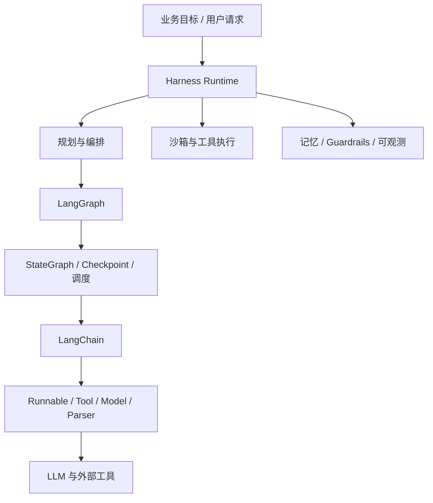

# Harness 架构与源码：运行时、联动与模式

这组原文其实可以收敛成一句话：

> Harness 不是另一个“会聊天的 Agent 框架”，而是把模型、工具、状态、恢复、验证和审计包起来的运行时控制层。

如果只看有效信息，这个系列讲清了四件事：

- Harness 解决的是“让模型把事稳定做完”
- LangChain 提供可调用组件与统一抽象
- LangGraph 提供图编排、状态流转和恢复能力
- Middleware 与设计模式决定了这套系统如何扩展、拦截和演进

## 原始来源

这页基于 `raw/weixin/Harness 架构与源码/` 目录下的四篇更新后 Markdown 原文重整：

- [[raw/weixin/Harness 架构与源码/54k+Star 爆火！AI  框架 新王者 Harness Agent 来了！尼恩 来一次Harness穿透式解读|Harness Agent 穿透式解读]]
- [[raw/weixin/Harness 架构与源码/Harness 架构 与 LangChain、LangGraph 三者联动 的底层逻辑|Harness 与 LangChain、LangGraph 三者联动]]
- [[raw/weixin/Harness 架构与源码/DeerFlow 架构：14层Middleware 架构深度解析 ，又一个 “洋葱责任链模式” 架构思维 的 经典案例 1|DeerFlow 14 层 Middleware]]
- [[raw/weixin/Harness 架构与源码/LangChain 超底层 四大设计模式 Design Patterns ，架构师 的 必备 内功，毒打面试官|LangChain 四大设计模式]]

## 一张图看整体关系



更直接的记忆方式是：

- `Model` 负责理解与生成
- `LangChain` 负责把能力做成统一可调用部件
- `LangGraph` 负责把这些部件编排成可恢复的执行图
- `Harness` 负责把整套执行过程变成可控、可追踪、可纠错的生产运行时

## 1. Harness 到底是什么

这个系列里最值得保留的定义是：

`Agent = Model + Harness`

这里的 Harness 不是单一库，而是模型外面那一整层工程化运行时。它更像控制塔、操作系统或者工业化工作台，而不是一个普通 SDK 名词。

### Harness 的六个核心模块

从第一篇穿透式解读里，可以提炼出一个比较稳定的六模块模型：

1. 规划与编排：任务拆解、状态流转、断点恢复
2. 沙箱执行环境：文件操作、命令执行、资源隔离
3. 技能与工具系统：工具注册、标准化调用、按需加载
4. 记忆与上下文工程：摘要压缩、长期记忆、跨会话状态
5. 系统提示词与行为约束：角色设定、权限边界、硬性 guardrails
6. 可观测性与反馈闭环：日志、追踪、错误回灌、自动修正

这些模块的本质作用，是把非确定性的模型包进一个尽量确定性的执行框架。

## 2. Harness、LangGraph、LangChain 的分层关系

这组文章里最有价值的第二个结论，是三者不是替代关系，而是分层关系。

### 推荐的理解方式

- LangChain 是组件层
  它提供 `Runnable`、模型接口、工具抽象、parser、middleware 等标准化积木。
- LangGraph 是编排引擎层
  它处理状态图、节点调度、checkpoint、循环与分支控制。
- Harness 是运行时控制层
  它在上层整合前两者，再补上沙箱、权限、记忆、审计、验证和恢复。

所以更准确的说法不是“谁替代谁”，而是：

> Harness 站在更靠近生产运行时的位置，LangGraph 负责工作流引擎，LangChain 负责基础可调用部件。

用 DeerFlow 这类实现来记，会更直观：

```text
业务配置
  -> Harness / DeerFlow 做装配与增强
    -> LangGraph 做状态图编排与恢复
      -> LangChain 提供模型、工具、middleware、Runnable
```

### 为什么这个切分有用

它直接回答了很多工程问题：

- 为什么只会 `prompt | llm | parser` 不足以做生产级 Agent
- 为什么只有图编排还不够，还需要沙箱、日志、恢复和权限控制
- 为什么很多团队最后真正要维护的不是模型调用代码，而是运行时约束和验证体系

更新后的第二篇原文还给了一个更具体的工程判断：

- `create_agent` 更像 LangChain 对 LangGraph 标准工作流的一层高层封装
- DeerFlow 这一类 Harness 不在“发明新底层”，而在“把组件层和编排层整合成可商用运行时”

## 3. DeerFlow / Claude Code 给出的工程启发

系列原文反复拿 DeerFlow 和 Claude Code 举例。去掉夸张包装后，核心启发很明确：

- 复杂 Agent 的竞争点不是“模型会不会答”，而是“任务能不能稳定执行”
- 子 Agent 隔离、checkpoint、结构化状态、工具标准化，这些能力比 prompt 花活更接近真实壁垒
- 高风险操作确认、失败后自动回灌错误日志、执行后统一验证，这些都应该由 runtime 兜底，不该依赖模型自觉

这也是为什么 `Harness Engineering` 那两篇笔记强调：

- 仓库与规范是事实来源
- 验证管道比 prompt 更重要
- 人类工程师的价值在于设计环境，而不只是手写实现

## 4. 为什么 Middleware 和“设计模式”很重要

系列后两篇其实是在解释 Harness 这层为什么能扩展。

### 4.1 命令模式：统一执行接口

LangChain 的核心抽象是 `Runnable`。它让 Prompt、LLM、Parser、Tool 这些不同部件，都能被当作统一的可执行对象来调度。

这解决的是统一入口问题：

- 调用方不用关心底层实现
- 组件可以互换
- 组件可以被链式组合或图式编排

没有这层统一执行契约，后面的链路组合、中间件增强和图编排都很难成立。

### 4.2 责任链模式：组织正向执行流

线性场景里，`RunnableSequence` 或 `|` 组合本质上就是责任链骨架：

```text
Prompt -> LLM -> Parser -> Tool Adapter
```

每一步只关心自己的输入输出，不需要知道整条链的全貌。

到了 LangGraph，这种线性责任链会进一步推广成：

- 可分支
- 可回环
- 可持久化恢复

所以可以把 LangGraph 看成是“把线性责任链升级成状态图运行时”。

### 4.3 装饰器模式：给执行链叠加横切能力

日志、重试、缓存、限流、安全检查、token 统计，本质上都不属于核心业务步骤，但它们又必须稳定存在。

这正是 middleware 的位置。

更实用的理解是：

- 洋葱模型描述的是整体执行结构
- 装饰器模式描述的是每一层如何包装 `Runnable`

所以中间件链路看起来像这样：

```text
外层监控
  -> 外层权限校验
    -> 内层重试
      -> 核心 Runnable / Graph 节点
```

请求向内穿透，结果和异常再向外回传。

更新后的 DeerFlow 文章把这件事讲得更彻底了一点：所谓 “14 层 Middleware” 真正想表达的不是层数，而是生产级 Agent 往往需要把日志、重试、权限、限流、缓存、审计、摘要等横切逻辑层层包装进执行骨架里。

### 4.4 管道模式：约束数据流兼容性

管道模式解决的不是“顺序”本身，而是“前一步输出必须能被下一步消费”。

这也是 LCEL 可读性很高的原因：它把组合写成管道，但背后依赖的是两个前提：

- 所有步骤遵守统一可执行抽象
- 步骤之间的输入输出类型保持兼容

所以管道模式偏数据流约束，责任链模式偏执行顺序组织，两者相关但不等价。

## 5. 对“14 层 Middleware”的取舍

原文里强调 DeerFlow 的“14 层 Middleware”。这个说法可以当作案例记忆点，但不值得当结论背。

真正该保留的是：

- 生产级 Agent 运行时通常会有很多层横切逻辑
- 这些逻辑适合用嵌套包装而不是散落在业务步骤里
- 深层 middleware 不是为了炫层数，而是为了把安全、审计、恢复、缓存、重试、日志这些通用能力模块化

换句话说，重点不是“14”，而是“运行时增强是分层包装出来的”。

## 6. 四篇放在一起时最该记住什么

如果把这四篇压成最小记忆集，我会保留下面这组对应关系：

1. `Agent = Model + Harness`
2. Harness 负责运行时控制，LangGraph 负责流程编排，LangChain 负责标准化组件
3. `Runnable` 是统一执行抽象，`RunnableSequence` 是线性责任链骨架
4. Middleware 用装饰器式嵌套，把横切能力包进执行流
5. 所谓“图能力”或“工程化能力”，本质上都来自状态、恢复、约束、可观测和工具执行体系，而不是单个 prompt

## 7. 实际落地时怎么用这个模型

如果你在设计自己的 Agent 系统，这组材料最有用的落地点有三个：

1. 不要把 Harness 理解成提示词模板集合，而要把它理解成运行时控制系统。
2. 不要混淆 LangChain、LangGraph 和上层 Agent 应用的边界；先分清组件层、编排层、运行时层。
3. 设计扩展点时，优先考虑统一执行抽象、图状态管理和 middleware 包装，而不是把所有逻辑塞进一个巨型 agent loop。

## 8. 我对原文的取舍

这组原文的优点是把一些常被混用的概念拉开了：

- Harness 不等于普通 framework
- LangGraph 不只是“另一个链式库”
- LangChain 的价值不只是 prompt 拼装
- Middleware 和设计模式决定了系统如何长期演进

需要打折看的部分也很明显：

- 原文夹杂大量面试导向和营销表述
- 某些说法更像解释模型，而不是官方架构定义
- DeerFlow 细节有不少系列化预告，正文里并没有完全展开源码证据

所以更合理的使用方式是：

> 把它当作一套工程理解框架，而不是源码或官方文档的逐字等价物。

## 相关笔记

- [[wiki/llm/Agent/Agent|Agent]]
- [[wiki/llm/Agent/Harness/Harness Engineering：AI Agent 工程实践指南|Harness Engineering：AI Agent 工程实践指南]]
- [[wiki/llm/Agent/Harness/Harness Engineering × SDD：AI Agent 工程体系完整解读|Harness Engineering × SDD：AI Agent 工程体系完整解读]]
- [[wiki/llm/Agent/Harness/OpenHarness：开源智能体基础设施深入解析|OpenHarness：开源智能体基础设施深入解析]]
- [[wiki/llm/Agent/Pi/Pi|Pi]]
