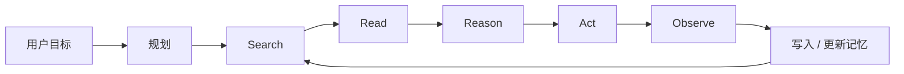
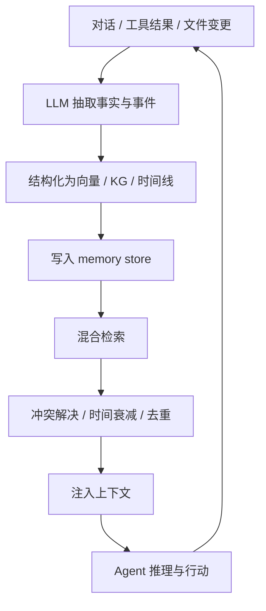
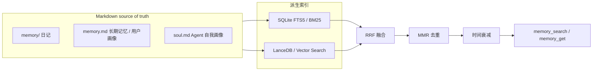

# Agent Memory

这篇来自 Jina AI / Elastic 的演讲稿给出的核心判断是：当 Agent 开始执行数小时级、跨会话的长任务时，搜索不再只是外部信息获取，而会变成 Agent 的长期记忆基础设施。

## 核心判断

Agent Memory 不是简单的“把聊天记录塞进向量库”。真正的问题包括：

- 如何把对话、文件、工具结果和用户偏好转成可维护的记忆表示。
- 如何在长期使用中更新、合并、删除和降权旧记忆。
- 如何让不同模型和不同 Agent 复用同一套记忆，而不是把记忆锁死在某个上下文窗口或模型权重里。
- 如何在召回前构造正确 query，在召回后处理冲突、时效和遗忘。

最关键的工程教训是：检索链路本身可能没错，但如果第一步 query 构造错了，后面的关键词检索、向量检索、文件检索都会失败。

## 为什么搜索会变成记忆

长时程 Agent 的执行循环可以简化为：



当任务从几分钟扩展到几小时，Agent 会不断搜索、阅读、推理、回溯和写入状态。上下文窗口不可能稳定承载全部历史，长期状态必须下沉为可检索、可编辑、可遗忘的 memory layer。

## 失败案例：911 查询

演讲中提到一个真实问题：用户让 Agent 找“之前做的 911 图表”，这里的 `911` 指保时捷车型。Agent 的检索管线包括 Grep、向量 Memory Search、Markdown 会话记录和文件系统扫描，看起来都合理，但 query 构造失败：

```text
911 chart graph visualization
September 11th chart visualization Twin Towers attack
```

第一次把中文需求机械翻译成英文，第二次把 `911` 误扩展成恐袭语义。换成车型代号 `992.2` 后立刻命中。这说明 Agent Memory 的瓶颈不只是存储和向量模型，query understanding 同样是核心能力。

## 搜索范式演进

| 阶段 | 主导范式 | 记忆视角 |
| --- | --- | --- |
| 2009 | Lucene、BM25、TF-IDF、信息抽取、主题模型 | 记忆是倒排索引和文本统计 |
| 2015 | 深度学习、向量检索、Faiss / Milvus / Elasticsearch | 记忆是向量空间里的语义相似性 |
| 2018 | Transformer / BERT | 记忆开始进入模型表征 |
| 2022 | ChatGPT / RAG | 生成和搜索结合，外部知识变成上下文 |
| 2025 | Deep Research | Search / Read / Reason 形成循环 |
| 2026 | Agent Memory | 搜索、状态、偏好、历史和遗忘合成长期记忆系统 |

## 记忆表示优先于数据库选型

做 Agent Memory 时，第一问题不是“用哪种数据库”，而是“记忆应该长什么样”。可选表示包括：

- 原始聊天日志。
- 用户事实和偏好的结构化 triples。
- 知识图谱。
- 向量片段。
- 时间线事件。
- 长上下文 KV cache。
- 模型权重或微调后的隐式记忆。

这些表示都需要 CRUD：创建、读取、更新、删除。缺少删除和降权机制时，记忆会不断污染后续检索。

## 三种 Source of Truth

| 路线 | 真相来源 | 优点 | 风险 | 例子 |
| --- | --- | --- | --- | --- |
| Database camp | 向量库、SQL、KV、图数据库 | 高效、可查询、可工程化 | schema 会锁死记忆形态，事实抽取错误会被继承 | 向量库 + KG + time-series |
| File camp | Markdown / 纯文本文件 | 透明、可编辑、可版本化，适合 Obsidian / Git | 文件膨胀，需要智能遗忘和索引维护 | 小龙虾、MemSearch |
| Model camp | 模型权重、上下文或 KV cache | 自适应，可能统一表示 | 黑盒、难调试，删除和权限控制困难 | Letta、ChatGPT、超长上下文模型 |

本地 Obsidian wiki 更接近 File camp：Markdown 是 source of truth，`qmd`/向量索引只是派生索引。这条路线的优势是可审计和可版本控制，但必须持续清理旧文件、坏链接、过时摘要和污染内容。

## 主流记忆工作流



这条链路里最容易被低估的是 `Resolve`：长期记忆不是召回越多越好，而是要判断哪些记忆仍然可信、相关、未过期、未被后续事实覆盖。

## 小龙虾式文件记忆架构

演讲中把小龙虾作为 File camp 的代表。它大致可以抽象成：



这种架构适合本地、可编辑、可版本控制的工作流。但它必须补上“睡眠”式整理：把短期事件沉淀为长期画像，把过时信息降权，把冲突信息合并或删除。

## 选择性遗忘

长期 Agent 的难点不是记住一切，而是选择性忘记。没有遗忘机制时，会出现：

- 旧目标污染新目标。
- 早期错误总结被反复召回。
- 用户已经放弃的想法继续影响后续建议。
- Agent 把过期记忆当作仍然有效的事实。

这对应到本地 wiki 维护就是：`raw/` 可以保留原始材料，但 `wiki/` 必须持续重写、合并、归档和删除，不应该把所有旧资料原样提升为知识页。

## 评估与基础设施

Agent Memory 评估重点不只是单次召回，而是跨会话、多轮、冲突和多人场景：

- 长会话后是否还能找回关键事实。
- 新旧事实冲突时是否采用最新、可信的版本。
- 多用户或群聊里是否能区分“谁的记忆”。
- 长上下文增大后是否反而引入更多干扰。

底层基础设施通常需要：

- 多语言向量检索。
- BM25 / sparse retrieval。
- dense + sparse 混合召回和 RRF 融合。
- reranker。
- reader / document understanding。
- 元数据隔离、多租户和权限边界。

## 与本地 wiki 的关系

这篇文章对当前 wiki 的直接启发：

- Markdown 应继续作为 source of truth，`qmd` embedding 只是可重建索引。
- 每篇整理页必须维护 `summary`，因为摘要本身是高价值记忆入口。
- `raw/` 只保存证据和原始材料；`wiki/` 只保存经过压缩、去重、可链接的知识。
- 合并重复页、删除空父页、清理旧内容，本质上就是本地知识库的 selective forgetting。

## 相关

- [[wiki/llm/Agent/Agent|Agent]]
- [[wiki/llm/Agent/Harness/OpenClaw vs Claude Code vs Mem0 技术对比|OpenClaw vs Claude Code vs Mem0 技术对比]]
- [[wiki/llm/RAG/RAG 架构总结|RAG 架构总结]]
- [[wiki/qmdw|qmdw]]
