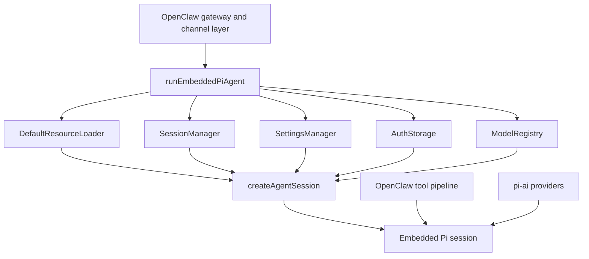
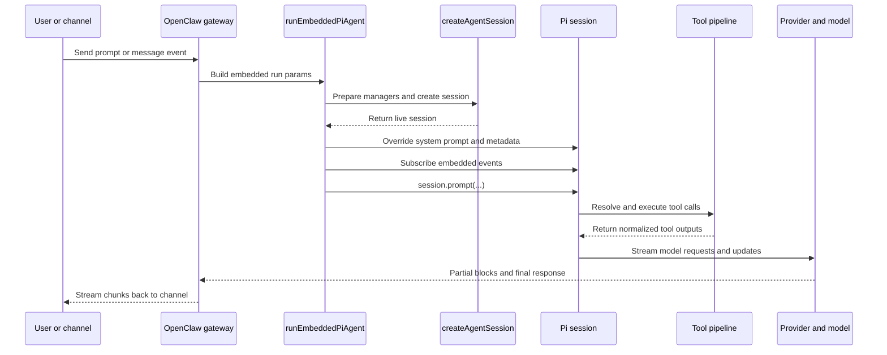
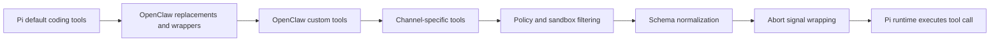

# Pi 与 OpenClaw 集成架构

这页关注的不是 Pi 的理念，而是 **OpenClaw 怎样把 Pi 作为嵌入式 agent runtime 接进自己的系统**。

## 总体结论

OpenClaw 并不是把 Pi 当成一个外部 CLI 进程去调用，而是直接在代码里引入 Pi SDK，通过 `createAgentSession()` 创建 session，把 Pi 嵌进自己的消息网关和工具体系里。

这种 embedded 方式带来几个直接收益：

- 更细粒度控制 session 生命周期
- 能自己注入工具、提示词和通道能力
- 能做 session 持久化、分支、压缩和 failover
- 模型 provider 与 auth profile 可以自己调度

## 关键依赖层

OpenClaw 主要依赖这几层包：

- `pi-ai`：模型、流式输出、provider 抽象
- `pi-agent-core`：agent loop、tool execution、消息类型
- `pi-coding-agent`：`createAgentSession`、`SessionManager`、`ModelRegistry`
- `pi-tui`：本地 TUI 模式下的终端 UI

这说明 Pi 的抽象分层是比较清楚的：底层是 AI/provider 与 runtime，中层是 coding session，高层才是 UI 或集成入口。

## Mermaid 图示

### 嵌入式代码架构

## OpenClaw 里的主运行链路

### 1. 启动 embedded run

入口是 `runEmbeddedPiAgent()`。它负责收集：

- session 标识
- workspace
- provider / model
- prompt
- 回调（例如消息分块输出）

### 2. 创建 session

在内部，OpenClaw 会准备：

- `DefaultResourceLoader`
- `SessionManager`
- `SettingsManager`
- `AuthStorage`
- `ModelRegistry`

然后通过 `createAgentSession()` 组装出真实运行中的 agent session。

### 3. 应用系统提示词覆盖

Session 建好后，OpenClaw 不完全使用默认提示词，而是会按当前 channel / sandbox / runtime 元数据拼装自己的 system prompt，然后覆盖到 session 上。

### 4. 订阅事件并执行 prompt

OpenClaw 再通过 `subscribeEmbeddedPiSession()` 监听：

- message streaming
- tool execution start/update/end
- turn start/end
- auto compaction
- agent start/end

最后执行 `session.prompt(...)`，让 Pi 自己跑完整 agent loop。

### 运行流程图

## 工具管线是怎么接进去的

文档里最值得注意的是 OpenClaw 的工具链不是简单“把默认工具打开”，而是重新组织了一层 pipeline：

1. Pi 默认 coding tools
2. OpenClaw 的替换与改写版本
3. OpenClaw 自己的工具
4. 各 channel 专属工具
5. 策略过滤
6. schema 归一化
7. abort signal 包装

这意味着 Pi 在这里更像一个 runtime substrate，而不是最终产品。OpenClaw 复用了会话与工具执行框架，但保留了对安全、sandbox、消息通道和策略控制的主导权。

### 工具管线图

## Tool adapter 的意义

文档还强调了一个实际工程问题：`pi-agent-core` 与 `pi-coding-agent` 的工具签名不完全一致，所以 OpenClaw 通过 adapter 做了一层桥接。

这个点很关键，因为它说明：

- Pi 的组件边界是真实存在的
- 上层集成方需要处理接口差异
- 真正的 embedding 集成，不只是“调用一个 SDK 函数”，而是要接住 runtime、tool schema、abort、policy 这些细节

## Session 管理能力

OpenClaw 复用并增强了 Pi 的 session 能力：

- session 文件是树状 JSONL
- `SessionManager` 负责持久化
- 有缓存机制，避免反复解析 session 文件
- 支持 history limiting
- 支持自动/手动 compaction

这套能力让它更适合放在长期运行的消息通道场景里，而不是一次性 CLI 调用。

## Auth 与模型调度

OpenClaw 并没有把 provider / model / auth 固定死，而是自己维护：

- 多 provider
- 多 auth profile
- 失败后的 cooldown 与轮换
- model registry 决策

这也是 embedded 模式的一个重要收益：Pi 负责 runtime，OpenClaw 负责业务层的调度策略。

## 设计启发

从这份架构文档看，Pi 最有价值的地方不是“提供了一个现成 agent”，而是：

- 它有足够小且清晰的 runtime 核心
- 允许上层系统重新接管 tool policy / sandbox / channel actions
- 允许 session、auth、provider、prompt 都被宿主系统重写和再编排

因此 OpenClaw 与 Pi 的关系更像：

- Pi 提供 agent substrate
- OpenClaw 提供 channel-aware orchestration

## 关联页面

- [[wiki/llm/Agent/Pi/Pi|Pi]]
- [[wiki/llm/Agent/Agent|Agent]]

## 参考来源

- [[raw/pi-agent/Pi Integration Architecture|raw/pi-agent/Pi Integration Architecture.md]]
- [raw/pi-agent/badlogicpi-mono AI agent toolkit coding agent CLI, unified LLM API, TUI & web UI libraries, Slack bot, vLLM pods.md](</Users/heleyang/Code/MyWiki/raw/pi-agent/badlogicpi-mono AI agent toolkit coding agent CLI, unified LLM API, TUI & web UI libraries, Slack bot, vLLM pods.md>)
