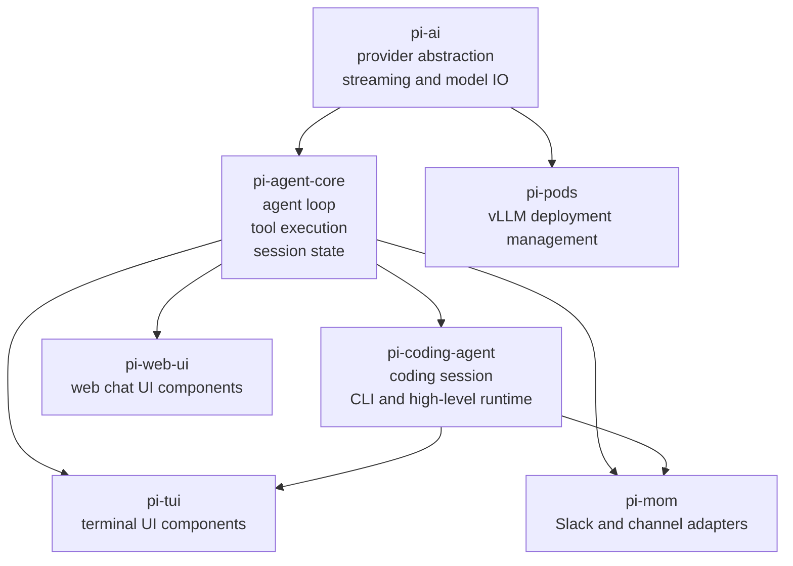
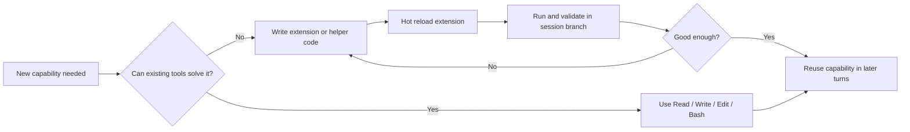
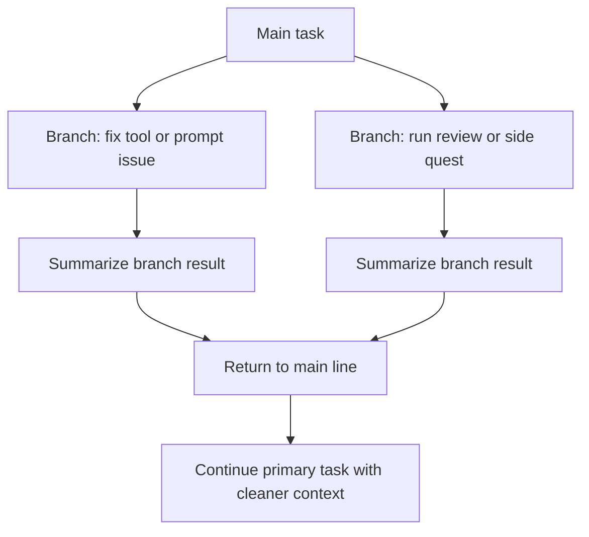

# Pi

Pi 是 OpenClaw 背后的极简 coding agent，也是一套更偏“代码优先、自我扩展优先”的 agent 设计思路。和很多不断堆工具、堆协议、堆插件市场的 agent 不同，Pi 的核心主张非常克制：先把最小内核做好，再让 agent 通过写代码扩展自己。

## 核心定位

- Pi 本身是一个 coding agent
- OpenClaw 并不是把 Pi 当成单独 CLI 拉起，而是把它嵌入到自己的消息/网关系统里
- Pi 同时也是一个组件化 toolkit，OpenClaw、Telegram bot、Slack bot 都可以直接基于它搭建

## 为什么 Pi 有辨识度

### 1. 极小内核

Pi 最出名的点是核心非常小：

- system prompt 很短
- 默认工具只有 4 个：`Read`、`Write`、`Edit`、`Bash`
- 不追求一开始就把所有能力塞进上下文

这套做法背后的判断是：LLM 已经很擅长“写代码 + 跑代码”，因此应该优先给它一个可靠、通用、可组合的最小执行面，而不是一开始就塞入庞大的外部工具生态。

### 2. 扩展系统比工具堆叠更重要

Pi 的扩展系统是它真正的能力放大器：

- 扩展可以持久化状态到 session
- 支持热重载，agent 可以自己写扩展、重载、测试、继续迭代
- 扩展不只是加命令，也能加 TUI 组件、状态管理和交互面

它的关键不是“有没有扩展市场”，而是“agent 能不能自己长出新能力”。

### 3. 软件质量优先

原文对 Pi 的评价很明确：它不是一个炫技 UI，而是一个很稳的小系统。

- 运行稳定
- 资源占用克制
- 组件边界清晰
- 更像“优秀的软件”，而不是“功能堆叠的 demo”

## Pi 刻意不做什么

Pi 最有代表性的取舍，是**默认不把 MCP 当成内核的一部分**。

这不是漏做，而是设计哲学：

- 如果 agent 缺一个能力，优先让 agent 自己写代码补上
- 如果一定要接外部协议，也更偏向通过 CLI / TypeScript 绑定桥接
- 比起下载陌生扩展，更鼓励“参考已有实现，然后按自己的需求改一版”

这套思路的底色是：

- code-first
- filesystem-first
- bash-first
- self-extension-first

## 为“代理构建代理”而设计

Pi 不只是一个单次执行器，它的很多底层设计都在为“agent 持续修改自己”服务。

### Session 是树结构

- 会话不是单链，而是树
- 可以从某个节点分支，处理 side quest
- 修工具、试扩展、做 review 可以在分支里完成
- 处理完后回到主线，并保留分支摘要

这对 agent 很关键，因为修工具本身往往会污染主任务上下文，而树状 session 能把这种污染隔离掉。

### 自定义消息与持久化状态

除了模型消息，Pi 还允许在 session 中保存系统或扩展自己的消息/state：

- 有些状态完全不发给模型
- 有些只把一部分发给模型
- 扩展可以依赖这些状态持续工作

这让扩展系统不只是“加几个命令”，而是能形成长期行为。

### 多 provider、低锁定

Pi 的 AI SDK 支持一个 session 中容纳不同 provider 的消息，并且避免强依赖单一模型厂商的专有能力。这种设计不是为了抽象而抽象，而是为了让 session 和 agent 行为尽量更可迁移。

## 工具不一定都要塞进上下文

Pi 的另一个重要判断是：并不是所有能力都应该变成 LLM 的工具调用。

原文里作者长期保留在上下文里的额外工具其实很少，更多增强是：

- skills
- TUI extensions
- slash commands
- CLI 封装

这意味着它更重视“为人和 agent 提供好的交互面”，而不是让上下文无限膨胀。

## 常见扩展示例

### `/answer`

- 从 agent 上一条回复里抽问题
- 重组成人更容易回答的输入面
- 用来替代僵硬的计划模式问卷

### `/todos`

- 本地待办列表
- 人和 agent 都能操作
- session 可以 claim 某个 task 并推进状态

### `/review`

- 先由 agent 审代码，再给人类
- 借助树状 session 在独立上下文里做 review
- 再把发现带回主线修复

### `/files`

- 聚合 session 里提到或修改过的文件
- 方便 quick look、diff 和快速引用

### `/control`

- 一个 agent 控另一个 agent 的轻量实验
- 更偏简单 delegation，而不是重型 orchestration

## Pi Mono 组件图

`pi-mono` 不是只有 coding agent 本体，而是一组相关包：

- `pi-ai`：多模型 provider 抽象
- `pi-agent-core`：agent runtime、tool calling、state 管理
- `pi-coding-agent`：CLI 层和高层会话能力
- `pi-mom`：把 Pi 接到 Slack 等通道
- `pi-tui`：终端 UI 组件库
- `pi-web-ui`：Web 聊天界面组件
- `pi-pods`：vLLM 部署管理

所以 Pi 更像是一套 agent runtime + UI + deployment 组件族，而不只是一个单点 CLI。

## Mermaid 图示

### 代码架构

### 自我扩展闭环

### Session 树工作流

## 对我们这个 wiki 的启发

Pi 值得记录，不只是因为 OpenClaw 用了它，而是它代表了一种和 MCP-first、tool-market-first 很不一样的 agent 观：

- 最小核心优先
- 自我扩展优先
- 长会话与分支工作流优先
- 对软件工程质量和可靠性要求更高
- 更接近“让 agent 写出自己的工具链”，而不是“替 agent 预装整个世界”

这和当前仓库里的一些约定是相通的，比如：

- 尽量沉淀稳定结构，而不是一次次临时拼装
- 优先让 agent 在本地知识库中演化规则
- 工具和 schema 作为长期资产维护

## 延伸阅读

- [[wiki/llm/Agent/Pi/Pi 与 OpenClaw 集成架构|Pi 与 OpenClaw 集成架构]]
- [[wiki/llm/Agent/Harness/OpenHarness：开源智能体基础设施深入解析|OpenHarness：开源智能体基础设施深入解析]]
- [[wiki/llm/Agent/Harness/OpenClaw vs Claude Code vs Mem0 技术对比|OpenClaw vs Claude Code vs Mem0 技术对比]]

## 参考来源

- [[raw/pi-agent/Pi The Minimal Agent Within OpenClaw|raw/pi-agent/Pi The Minimal Agent Within OpenClaw.md]]
- [[raw/pi-agent/Pi Integration Architecture|raw/pi-agent/Pi Integration Architecture.md]]
- [raw/pi-agent/badlogicpi-mono AI agent toolkit coding agent CLI, unified LLM API, TUI & web UI libraries, Slack bot, vLLM pods.md](</Users/heleyang/Code/MyWiki/raw/pi-agent/badlogicpi-mono AI agent toolkit coding agent CLI, unified LLM API, TUI & web UI libraries, Slack bot, vLLM pods.md>)
- [raw/pi-agent/Pi：OpenClaw 背后的极简 Agent 哲学.md](</Users/heleyang/Code/MyWiki/raw/pi-agent/Pi：OpenClaw 背后的极简 Agent 哲学.md>)
- [raw/pi-agent/Pi：OpenClaw 背后的极简编程代理（Agent）.md](</Users/heleyang/Code/MyWiki/raw/pi-agent/Pi：OpenClaw 背后的极简编程代理（Agent）.md>)
