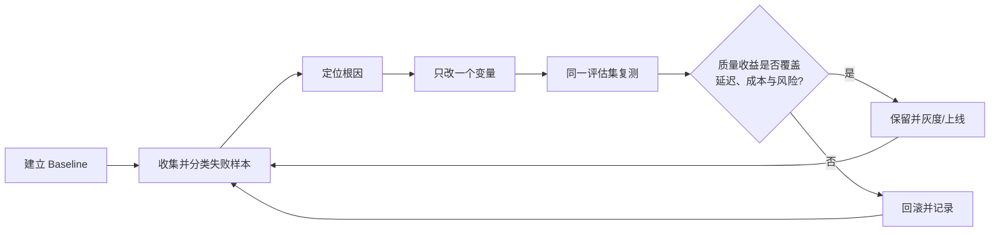

# RAG 项目优化与面试回答框架

> [!abstract] 核心结论
> “用了向量数据库、混合检索和 Rerank”只是方案清单，不是项目证据。可信的 RAG 项目叙述必须形成闭环：**业务缺口 → 完整链路 → 故障定位 → 方案取舍 → 指标验证 → 成本与边界**。

## 1. 用证据轴组织回答

回答单个问题时，使用固定顺序：

1. **结论**：先直接回答做了什么、解决了什么；
2. **项目事实**：说明数据、用户、规模、约束和自己负责的环节；
3. **方案取舍**：说明为什么选它、为什么没选替代方案；
4. **指标证据**：给出基线、改后结果和统计口径；
5. **适用边界**：交代延迟、成本、安全、数据缺失及责任边界。

![[raw/assets/weixin/rag-project-optimization/answer-evidence-axis.png|820]]

面试官通常会沿同一项目链继续下钻。应用开发者不必假装修改过索引算法或训练过 Embedding 模型，但必须守住链路、选型、排障和指标这些工程必答区。

![[raw/assets/weixin/rag-project-optimization/interview-drilldown.png|820]]

## 2. 先讲清为什么需要 RAG

“大模型有幻觉”不足以证明项目需要 RAG。更完整的判断是：

- 业务依赖模型参数之外的私有或持续更新知识；
- 回答需要来源可追溯，且要受权限、时效性约束；
- Prompt 只能改善任务表达，不能注入大量动态事实；
- 微调更适合改变行为、格式或风格，不适合频繁同步事实知识。

因此 RAG 解决的是**外部知识接入与证据约束**，而不是所有模型问题的通用补丁。

## 3. 端到端链路是诊断地图

### 离线建库

```text
文档接入 → 解析与清洗 → 结构化分块 → 元数据与权限补全
        → Embedding → 索引构建 → 增量更新与质量检查
```

### 在线问答

```text
Query 理解/改写 → 向量或混合召回 → 融合与 Rerank
              → 上下文选择与 Prompt 拼接 → 生成
              → 引用、拒答、权限校验、日志与反馈
```

回答“完整链路”时，先覆盖两条链，再展开自己真正负责的环节。每一项优化也应能回落到链路中的具体故障点。

## 4. 选型不能脱离数据与约束

| 决策 | 应说明的依据 | 常见代价 |
| --- | --- | --- |
| Chunk / Overlap | 文档结构、问题粒度、边界完整性、评估集表现 | 过小丢上下文；过大引入多主题和重复召回 |
| Embedding | 业务语言与领域、Recall@K / MRR、维度、部署与合规 | 存储、吞吐、延迟与模型迁移成本 |
| 向量数据库 | 数据量、并发、索引能力、过滤、增量更新、高可用 | 运维复杂度与资源成本 |
| 混合检索 | 语义改写与型号、错误码、法规编号等精确词是否并存 | 多一路召回与融合链路 |
| Rerank | 正确候选已召回但排序不佳 | 额外推理延迟和算力成本 |
| Top-K | Recall@K 曲线、Rerank 后质量、上下文预算 | K 过大增加噪声、Token 和生成干扰 |

> [!warning] 两个常见误区
> 混合检索用于**补召回**，Rerank 用于**提排序**；Rerank 只能重排候选池，救不回从未召回的正确证据。参数也不是行业常数，必须由业务评估集与系统约束共同决定。

## 5. 用 Top-K 证据定位故障

答案不准时，第一步不是换大模型或加 Rerank，而是查看 Top-K 候选中有没有支撑正确答案的 Chunk。

| Top-K 观察 | 故障位置 | 优先检查 |
| --- | --- | --- |
| 正确证据不存在 | 检索前或召回侧 | 文档解析、索引覆盖、Chunk、Embedding、Query、过滤条件、召回策略 |
| 正确证据存在但排名靠后 | 排序与上下文选择 | 融合权重、Rerank、Top-K、去重、噪声 |
| 正确证据靠前但答案仍错 | 生成侧 | Prompt 拼接、引用约束、上下文冲突、模型能力 |
| 知识库本身没有答案 | 知识与产品边界 | 正确拒答、转人工、补库与时效性监控 |

![[raw/assets/weixin/rag-project-optimization/top-k-diagnosis-loop.png|820]]

这一步把“答案错了”拆成可验证的故障类别，避免在错误环节反复调参。

## 6. 优化必须形成实验闭环



一次改五项虽然可能让结果变好，却无法归因。更可靠的做法是：

1. 固定数据版本、评估集、模型和统计口径；
2. 按“召回缺失、排序不佳、生成误用、知识缺失”等类型标记失败样本；
3. 每轮只改一个主要变量；
4. 同时记录质量、延迟、成本和风险；
5. 达到预设门槛才保留，否则回滚。

## 7. 用三层指标证明效果

### 检索侧：有没有找到、排得好不好

- **Recall@K**：相关证据是否进入候选；
- **Precision@K**：候选中相关内容的比例；
- **MRR**：第一个相关结果的位置；
- **NDCG@K**：多级相关性下的整体排序质量。

### 生成侧：有没有正确使用证据

- 忠实度（Faithfulness）；
- 答案相关性；
- 引用正确率；
- 无答案场景的正确拒答率。

### 线上业务侧：系统是否值得运行

- 任务成功率、用户反馈、追问率或转人工率；
- P95 / P99 延迟、超时率；
- 单次请求成本与每个成功任务成本；
- 越权检索、敏感信息泄露和过期知识命中率。

详细定义与评估工具见 [[wiki/llm/RAG/RAG 系统评估指标|RAG 系统评估指标]]。

## 8. 可复述的项目表达模板

> [!example] 一项优化怎么讲
> 优化前，评估集上的 `[指标]` 是 `[基线]`。我们通过检查 `[证据/日志]` 将问题定位为 `[根因]`，因此只调整了 `[变量]`。在相同评估集和统计口径下，该指标变为 `[结果]`；与此同时，`[P95 延迟/成本/风险]` 变化了 `[真实数据]`，所以最终选择 `[上线、灰度或放弃]`。

方括号只能替换成真实数据。若忘记精确数值，可以说明评估集、口径和大致区间，不能编造漂亮结果。

### 如果项目只有 Demo

如实说明“当前只完成离线 Demo，没有线上流量”，然后讲清：

- 如何构造测试问题与标准证据；
- 对比了哪些方案；
- 失败样本暴露了哪些问题；
- 上线前还缺哪些监控、安全、容量和回滚能力。

### 如果某个环节不在职责内

说明责任边界，再讲自己理解的接口与工程影响。例如：“索引集群由基础设施团队维护；我负责检索策略和评估，关注索引参数对召回、延迟与内存的影响，但没有修改底层实现。”

## 9. 回答前检查清单

- [ ] 说明了业务缺口，而不是只说“模型有幻觉”；
- [ ] 能从离线建库讲到在线生成与质量控制；
- [ ] 每个技术选择都有问题、替代方案和代价；
- [ ] 先用 Top-K 证据区分检索侧与生成侧；
- [ ] 有固定 Baseline、失败样本分类和单变量实验；
- [ ] 同时报告检索、生成、线上业务指标；
- [ ] 不把参数包装成行业标准，不编指标；
- [ ] 主动说明 Demo/生产状态和个人责任边界。

## 相关页面

- [[wiki/llm/RAG/RAG|RAG]]
- [[wiki/llm/RAG/RAG 架构总结|RAG 架构总结]]
- [[wiki/llm/RAG/RAG 系统评估指标|RAG 系统评估指标]]
