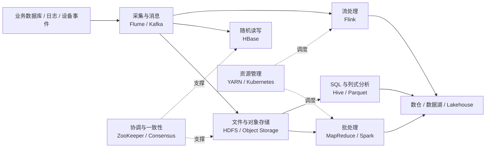
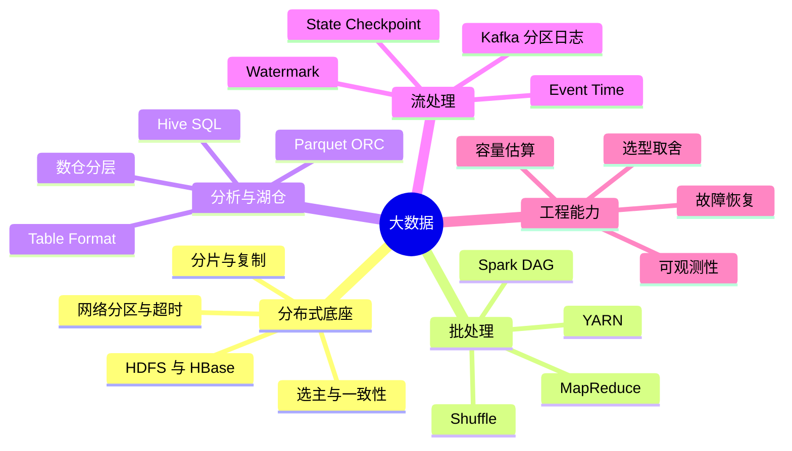

# 大数据

> [!abstract] 一句话理解
> 大数据不是“数据量很大的单机程序”，而是一套假设机器、磁盘和网络都会失败的工程方法：用分片与并行获得容量和吞吐，用复制、日志与重算获得容错，再按业务的延迟、正确性、成本和治理要求选择计算与存储形态。

## 从 4V 推导工程约束

| 特征 | 直接问题 | 系统设计倾向 |
| --- | --- | --- |
| Volume（规模） | 单机存不下、算不完 | 分片、并行、水平扩展、数据本地性 |
| Variety（多样） | 结构化、半结构化、非结构化共存 | 多格式接入、统一元数据、读时或写时建模 |
| Velocity（速度） | 数据持续产生，结果要更快可见 | 分区日志、增量计算、事件时间处理 |
| Value（价值） | 原始数据价值密度低 | ETL/ELT、聚合、特征提取、交互分析 |

组件名称会变化，但面试和工程选型始终要回答六个约束：**容量、吞吐、延迟、正确性、成本、治理**。

## 技术栈全景

## 主题导航

| 主题 | 先回答的问题 | 学完后的能力 |
| --- | --- | --- |
| [[wiki/大数据/01-分布式协调与存储|分布式协调与存储]] | 节点、磁盘、网络会失败，数据如何仍然可用？ | 能解释 ZooKeeper、HDFS、HBase 的数据路径与故障边界 |
| [[wiki/大数据/02-批处理与资源调度|批处理与资源调度]] | 海量数据如何拆任务、搬数据、分资源并重试？ | 能画 MapReduce/Spark 作业并定位 Shuffle、倾斜和资源瓶颈 |
| [[wiki/大数据/03-SQL 分析与湖仓|SQL 分析与湖仓]] | 文件如何变成可查询、可演进、可治理的表？ | 能比较 Hive、Parquet、数仓、数据湖和 Iceberg |
| [[wiki/大数据/04-消息队列与流处理|消息队列与流处理]] | 持续事件如何有序、可重放、按事件时间正确计算？ | 能解释 Kafka/Flink 的状态、恢复和端到端语义 |
| [[wiki/大数据/05-大数据面试与系统设计|大数据面试与系统设计]] | 如何从需求约束推导选型，并接住故障与扩容追问？ | 能按统一维度作答并设计实时指标平台 |

## 学习思维导图

## 推荐学习路线

1. **先学失败模型**：网络分区、超时、重试、幂等、复制和多数派；否则组件机制会变成孤立名词。
2. **再学离线数据流**：沿 `HDFS → MapReduce → YARN → Spark` 理解数据本地性、Shuffle、DAG 和资源调度。
3. **补齐表与文件**：沿 `Hive → Parquet → 数仓 → 数据湖 → Iceberg` 理解 Schema、元数据、快照和治理。
4. **进入持续数据流**：沿 `Kafka → Flink` 理解分区、事件时间、状态、Checkpoint 和外部提交。
5. **用系统设计闭环**：完成 [[wiki/大数据/05-大数据面试与系统设计#实时指标平台|实时指标平台]]，为每一层说明需求、机制、故障和替代方案。

> [!tip] 面试复习方式
> 每个结论都用“**场景 → 机制 → 取舍 → 故障/优化**”复述。组件对比统一使用数据模型、读写路径、延迟、吞吐、状态与一致性、扩展方式和运维成本，不要只罗列功能。

## 原始资料入口

- [[raw/Big-Data-Theory-and-Practice/README|课程总目录与经典论文索引]]
- [[raw/Big-Data-Theory-and-Practice/courses/复习/大数据理论与实践Ⅰ-章节复习提纲|课程知识点导航]]
- [[raw/Big-Data-Theory-and-Practice/paper/README|经典论文目录]]
- [[raw/Big-Data-Theory-and-Practice/courses/chapter11/hands-on-streaming/README|流处理实践项目]]

## 相关页面

- [[wiki/foundations/计算机网络|计算机网络]]
- [[wiki/backend/消息队列|消息队列]]
- [[wiki/backend/Redis|Redis]]
- [[wiki/llm/RAG/RAG|RAG]]
