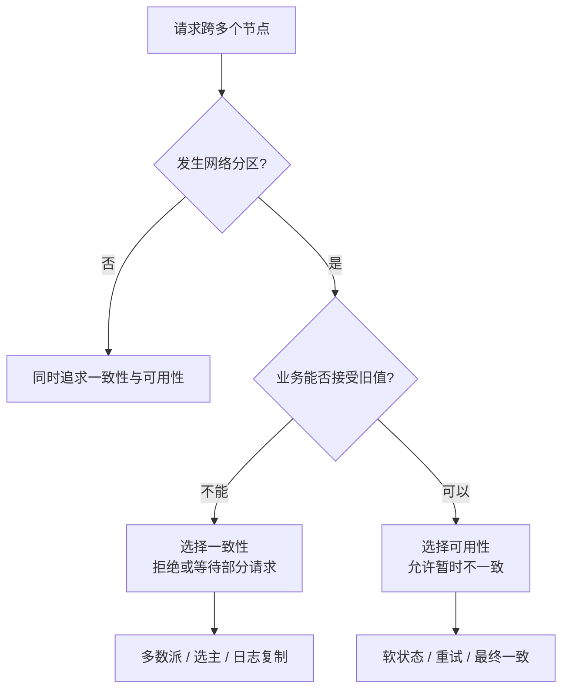
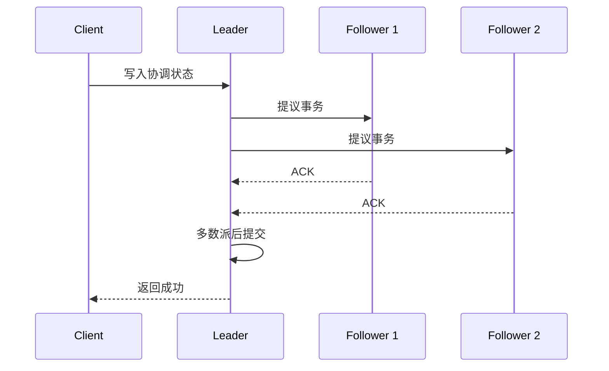
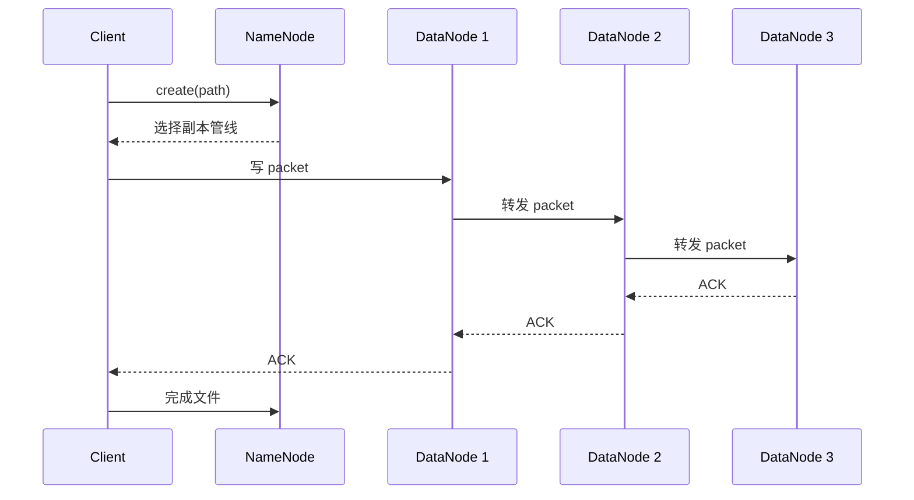
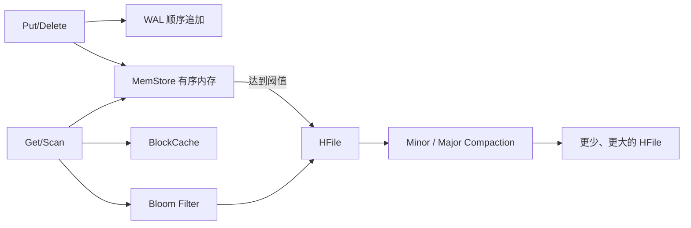

# 分布式协调与存储

> [!abstract] 主线
> 分布式存储首先要承认三件事：通信可能超时、网络可能分区、节点可能独立失败。协调服务只保存少量关键状态，文件系统优化大文件顺序吞吐，在线 NoSQL 再在文件存储之上补随机访问。

## 从失败模型到 CAP/BASE

CAP 讨论的是**发生分区时**的一致性与可用性取舍，不是给数据库贴永久标签。BASE 把“所有时刻完全一致”放宽为基本可用、软状态和最终一致，但仍需要明确收敛条件和冲突处理方式。

## ZooKeeper：关键状态的协调平面

ZooKeeper 适合选主、成员列表、配置、命名和分布式锁，不适合保存大对象或高频业务数据。

| 抽象 | 作用 | 常见陷阱 |
| --- | --- | --- |
| Session | 以心跳和超时表达客户端存活期 | 暂时网络抖动可能造成会话过期，业务必须处理重连 |
| ZNode | 持久、临时、顺序节点表达配置和成员关系 | 把协调目录当文件仓库会拖垮集群 |
| Watch | 状态变化的一次性通知 | 收到通知后要重新读取并续订，不能假设事件不丢 |
| Quorum | 多数派写入和选主避免双主 | 偶数节点不增加可容忍故障数 |

面试中不要把 ZooKeeper 的“最终一致”与业务缓存混在一起：写路径依赖多数派顺序广播，客户端读到什么还与连接的服务端、同步点和会话状态有关。

## HDFS：控制流与数据流分离

NameNode 管理命名空间与 Block 位置，DataNode 保存实际数据。客户端向 NameNode 查询位置后直接与 DataNode 传输，因此元数据服务不承载大文件流量。

- **Block 与副本**：大块减少元数据量，副本与机架感知降低节点或机架故障风险。
- **数据本地性**：批任务尽量靠近输入运行，网络留给不可避免的 Shuffle。
- **小文件问题**：每个文件和 Block 都占用 NameNode 内存；小文件还会增加寻址和任务调度开销。
- **HA 与 Federation**：HA 解决 NameNode 可用性，Federation 用多个命名空间扩展元数据容量，两者不是同一机制。
- **访问边界**：优化大文件、顺序 I/O 和吞吐，不适合低延迟随机更新。

## HBase：在 HDFS 上补随机读写

HBase 借鉴 Bigtable 和 LSM-Tree，把随机写转换成日志追加与内存写，再批量生成不可变文件。

![[raw/Big-Data-Theory-and-Practice/courses/chapter09/bigtable.jpg|760]]

HBase 的关键边界：

1. **RowKey 决定排序与 Region 分布**：单调递增 key 容易把新写集中到一个 Region；常用散列前缀、加盐或业务分桶打散热点。
2. **HMaster 不在正常数据路径上**：RegionServer 直接服务读写；HMaster 负责分配、均衡和 DDL。
3. **读放大与写放大互换**：更多 HFile 降低写入等待，却增加读取和 Compaction 成本。
4. **Major Compaction 风险**：能清理删除和过期数据，但会占用大量磁盘与 I/O，必须错峰并限速。

## HDFS 与 HBase 如何选择

| 维度 | HDFS | HBase |
| --- | --- | --- |
| 数据抽象 | 文件 / Block | 表 / RowKey / 列族 / Cell |
| 典型访问 | 大范围顺序扫描 | 按 RowKey 随机读写与范围扫描 |
| 写入方式 | 追加、一次写多次读 | WAL + MemStore + HFile |
| 主要瓶颈 | 小文件、NameNode 元数据、网络复制 | 热点、读放大、Compaction、列族设计 |
| 典型用途 | 归档、离线输入、数据湖底层 | 稀疏宽表、时间序列、在线明细查询 |

## 故障定位清单

- 协调异常：会话过期、Watch 未续订、选主频繁、延迟与未完成请求数。
- HDFS：NameNode 堆、缺失或损坏块、DataNode 磁盘、复制队列、小文件数和跨机架流量。
- HBase：Region 热点、MemStore flush、BlockCache 命中率、Compaction 队列、WAL 延迟和 GC。

## 面试问题链

- HDFS 为什么适合大文件、不适合小文件？从 Block、NameNode 内存元数据和任务调度回答。
- HDFS 写入中为什么 ACK 反向返回？管线中任一副本失败时如何恢复？
- ZooKeeper 的临时顺序节点怎样实现锁？羊群效应怎样缓解？
- HBase 为什么写入快？代价是什么？从 WAL、MemStore、HFile、读放大和 Compaction 回答。
- HBase RowKey 如何避免热点？先给业务访问模式，再决定散列、反转或时间分桶。

返回 [[wiki/大数据/00-大数据|大数据总览]]，或继续 [[wiki/大数据/02-批处理与资源调度|批处理与资源调度]]。
