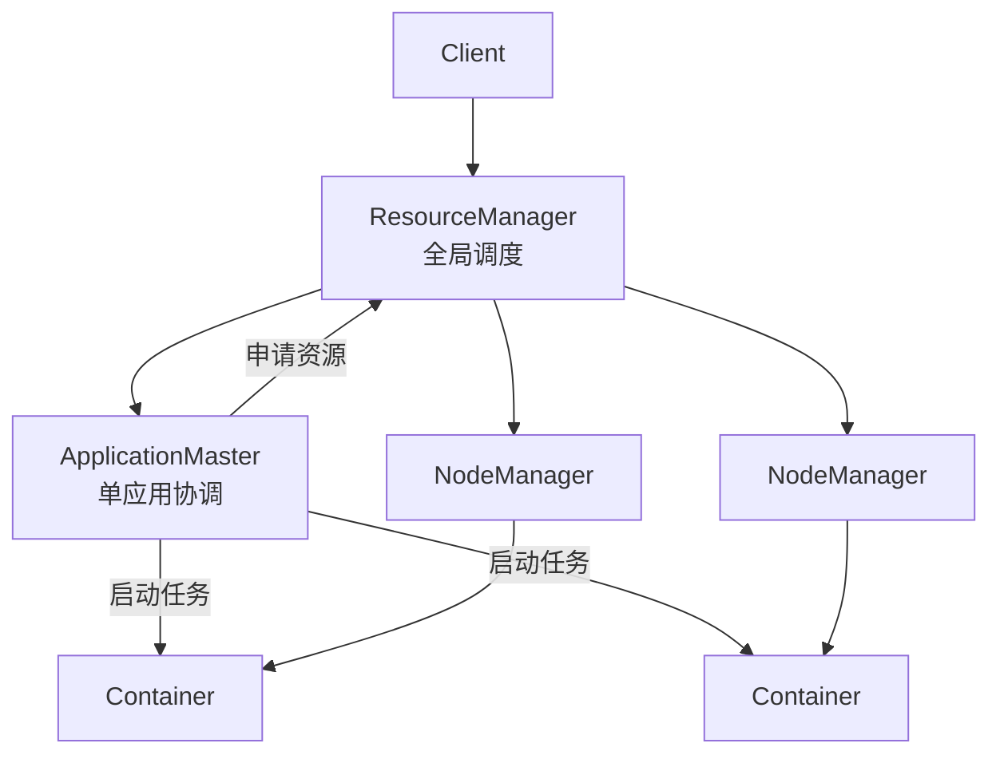
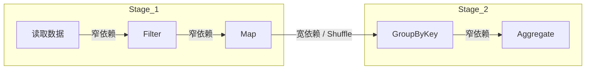
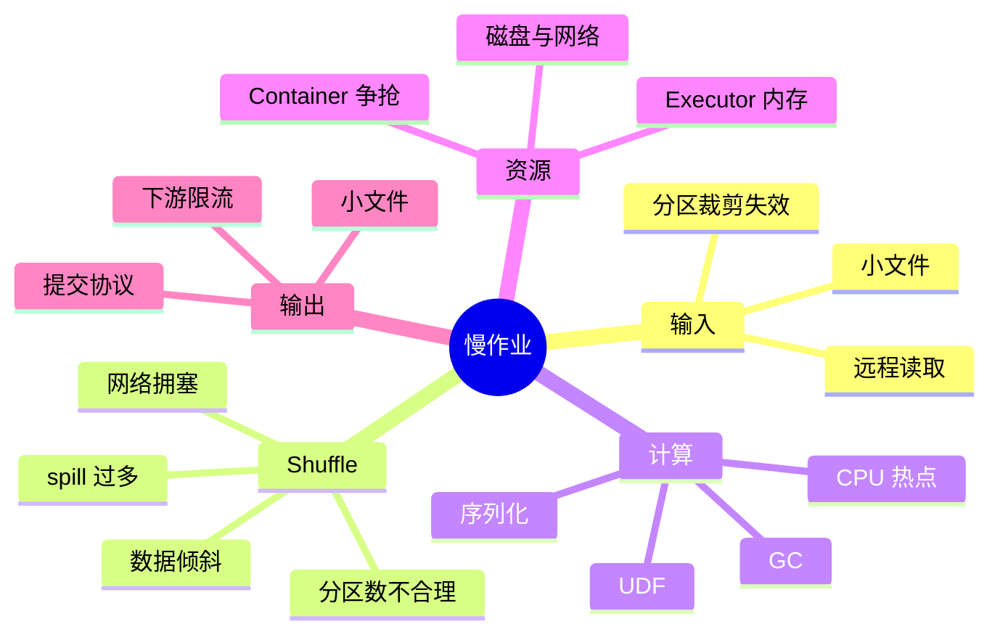

# 批处理与资源调度

> [!abstract] 主线
> 批处理的核心不是 Map 和 Reduce 两个函数，而是如何把输入分片、让计算靠近数据、按 key 重分布、限制资源并在失败后重跑。YARN 把资源管理从框架中拆出，Spark 再用 DAG、流水线与缓存减少不必要的阶段落盘。

## MapReduce 数据流

![[raw/Big-Data-Theory-and-Practice/courses/chapter05/mapreduce-flow.png|820]]

### Split、Block 与 Task

- HDFS Block 是存储切片；InputSplit 是逻辑计算切片，只保存起始位置、长度和位置等元数据。
- 一个 Split 通常对应一个 MapTask。Split 太小会增加调度开销，太大则降低并行度和失败重试粒度。
- 计算靠近数据可以减少输入网络传输，但 Shuffle 仍需要跨节点搬运相同分区的数据。

### Shuffle 为什么是核心瓶颈

Map 端要分区、排序、缓冲、溢写和归并；Reduce 端要跨节点拷贝、归并、分组。它同时消耗磁盘、网络、内存与 CPU。

| 症状 | 常见原因 | 首要动作 |
| --- | --- | --- |
| 少数 Reduce 长时间不结束 | key 倾斜、热点分区 | 采样 key 分布、加盐、两阶段聚合 |
| Map 频繁 spill | 缓冲区小、单条记录大、排序压力 | 查看 spill 次数与文件数，再调缓冲或压缩 |
| Reduce 拉取慢 | 网络拥塞、Map 输出过大 | 开启压缩、提前过滤、使用合法 Combiner |
| 海量小 Task | Split 太细、小文件多 | 合并小文件或使用组合输入格式 |

Combiner 只能用于满足结合律和交换律的本地预聚合，且执行次数不确定；它不是“小型 Reducer”，不能依赖它修正业务语义。

## YARN：把资源管理从计算框架拆出

- **ResourceManager**：全局资源仲裁，不管理每个 Task 的业务逻辑。
- **ApplicationMaster**：每个应用的控制平面，负责资源申请、任务调度和重试。
- **NodeManager**：管理单机资源与 Container 生命周期。
- **Container**：CPU、内存和执行环境的资源份额，不是虚拟机，也不是存储单元。

YARN 的隔离最终依赖操作系统 cgroups、进程与文件系统权限等机制。调度器分配了“额度”不代表节点不会受磁盘、网络或 page cache 争用影响。

## Spark：DAG、Stage 与重算

- RDD 是不可变、分区化、惰性求值的数据集；丢失分区可以沿 lineage 重算。
- 窄依赖允许父分区只被少量子分区使用，可在同一 Stage 流水执行；宽依赖触发 Shuffle 并形成 Stage 边界。
- Cache/Persist 适合会被重复使用且重算昂贵的中间结果，不是“内存越多越快”的开关。
- DataFrame/Dataset 的 Schema 让 Catalyst 能做谓词下推、列裁剪和物理计划选择。

“Spark 比 MapReduce 快”更准确的说法是：Spark 能表达多阶段 DAG、流水执行窄依赖、缓存复用中间结果，并避免每个逻辑阶段都强制写 HDFS；Shuffle、Checkpoint 和内存不足时仍会落盘。

## 框架选型

| 维度 | MapReduce | Spark |
| --- | --- | --- |
| 执行模型 | 固定 Map → Shuffle → Reduce | 通用 DAG，以 Stage 划分 |
| 中间结果 | 强调落盘与简单重试 | 可缓存、可重算，也会 spill |
| 适合 | 稳定离线 ETL、超大顺序作业 | 迭代计算、交互分析、复杂 ETL、SQL |
| 主要风险 | 多阶段作业 I/O 大、表达力弱 | 内存压力、长 lineage、数据倾斜、参数复杂 |
| 容错 | Task 重试、阶段落盘 | lineage 重算、Shuffle 文件、Checkpoint |

## 性能排查思维导图

先看 Stage/Task 分布与数据量，再调参数。只增加 Executor 内存可能掩盖倾斜，甚至拉长 GC 暂停。

## 面试问题链

- MapReduce 的 Shuffle 包含哪些步骤？为什么同 key 会到同一个 Reducer？
- InputSplit 与 HDFS Block 有什么区别？如何影响并行度和数据本地性？
- YARN 的 RM、AM、NM、Container 各自负责什么？AM 挂了怎样恢复？
- 宽依赖为什么形成 Stage 边界？丢失分区何时重算，何时从 Shuffle 文件读取？
- 一个 Spark Stage 只有一个 Task 很慢，如何区分倾斜、GC、远程 I/O 和下游限流？

返回 [[wiki/大数据/00-大数据|大数据总览]]，或继续 [[wiki/大数据/03-SQL 分析与湖仓|SQL 分析与湖仓]]。
