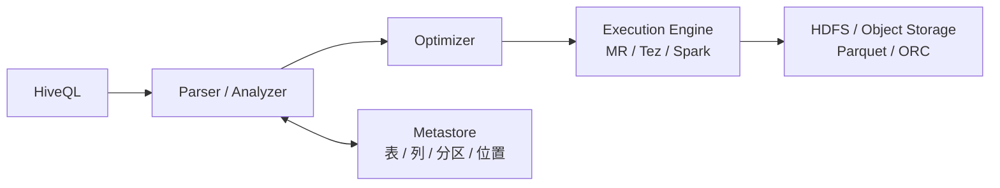
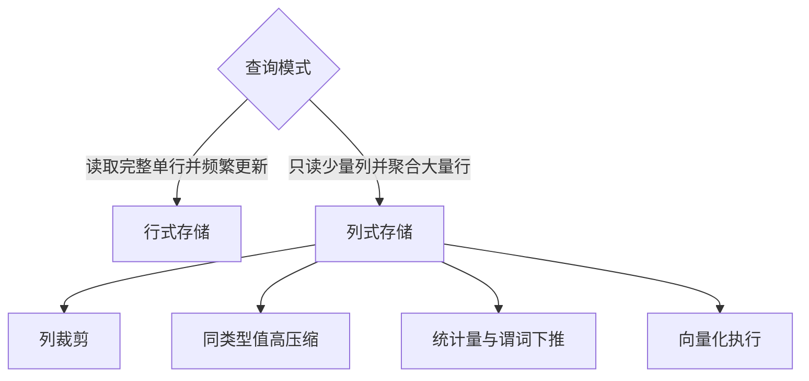
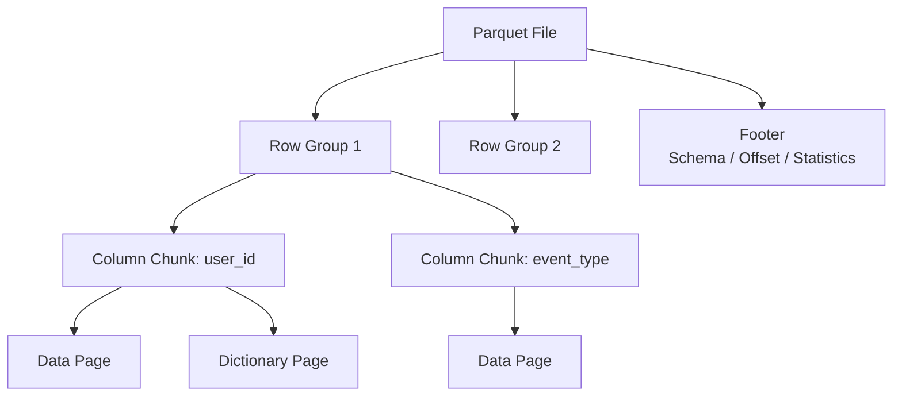
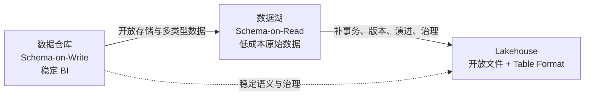
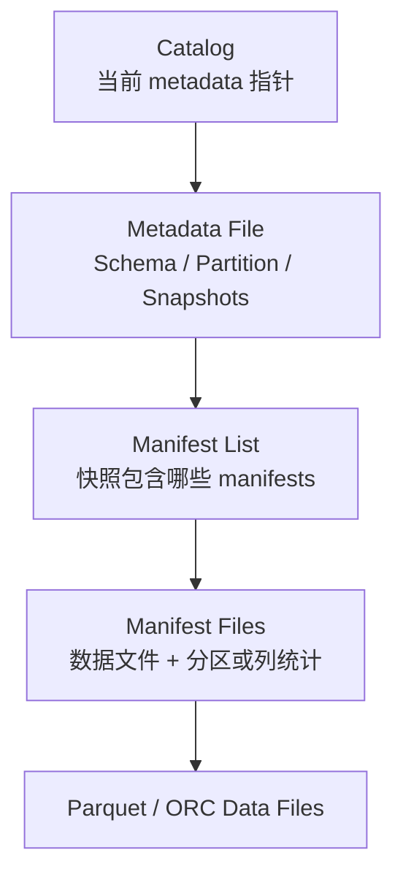

# SQL 分析与湖仓

> [!abstract] 主线
> 分析系统要把“文件”提升为“表”：Hive 提供 SQL 和元数据，Parquet 通过列式布局降低扫描，数仓用写时建模保证稳定语义，数据湖保留开放原始数据，Table Format 再用快照与事务让开放文件具备可演进的表语义。

## Hive：SQL、元数据与底层文件解耦

| 机制 | 物理含义 | 主要收益 | 风险 |
| --- | --- | --- | --- |
| 分区 | 按字段拆目录或逻辑分区 | 分区裁剪，减少扫描 | 高基数导致目录或元数据爆炸 |
| 分桶 | 按 key 哈希拆固定数量文件 | Join、抽样、数据分布优化 | 桶数和数据量不匹配会产生小文件 |
| 外部表 | 表元数据与文件生命周期解耦 | 多引擎共享，删表不删数据 | 权限与清理责任需要额外治理 |
| 统计信息 | 行数、NDV、min/max 等 | Join 顺序和物理计划优化 | 统计过期会误导优化器 |

分区字段通常是低到中等基数、高频过滤维度；分桶字段常是高基数 Join 或抽样键。目录更多不等于查询更快。

## 为什么分析场景偏好列式存储

Parquet 把数据组织成 Row Group，再按列拆成 Column Chunk，Column Chunk 内继续分 Page。读取器可利用 Footer 中的 Schema、偏移和统计信息跳过不需要的列、Row Group 或 Page。

![[raw/assets/big-data/dremel.png|860]]

Dremel 的 repetition level 与 definition level 让嵌套记录无需完全扁平化即可按列存储。面试时重点讲思想：Definition Level 表达可选字段出现到哪一层，Repetition Level 表达重复路径从哪一层开始新值；不要只背术语。

> [!warning] 指标数字要看工作负载
> 课件给出的压缩比和查询倍数用于说明方向，不是所有数据集的保证。实际收益取决于列选择率、基数、排序、编码、压缩算法、Row Group 大小和谓词可下推程度。

## 数仓、数据湖与 Lakehouse

| 架构 | 优势 | 主要风险 |
| --- | --- | --- |
| 数据仓库 | 指标稳定、SQL 体验和权限治理成熟 | 接入慢、存算耦合或厂商锁定、非结构化受限 |
| 数据湖 | 低成本保存多类型原始数据，开放格式，多引擎可读 | 缺少元数据、质量与权限时会成为“数据沼泽” |
| Lakehouse | 开放文件上提供事务表、版本、演进与多工作负载 | 并发提交、小文件、Catalog 与生命周期仍需工程治理 |

传统离线数仓常用 `ODS → DWD → DWS → ADS`：ODS 贴近来源，DWD 统一明细，DWS 沉淀公共汇总，ADS 面向具体应用。分层是为了稳定语义和复用，不是机械复制四份数据。

Lakehouse 论文强调三点：开放且可直接访问的数据格式、对 ML/数据科学的一等支持，以及接近现代数仓的性能。它不是简单把“湖”和“仓”放在同一个目录。

## Iceberg：用元数据树管理不可变文件

一次写入先生成新的数据文件和清单，再生成新 Metadata File，最后通过 Catalog 原子切换当前指针。读任务固定在旧快照时仍能继续读旧文件，这构成快照隔离的基础。

- **隐藏分区**：用户按业务列过滤，Table Format 把谓词转换到分区规则，避免手写重复分区列。
- **Schema/Partition Evolution**：通过字段 ID 和元数据演进减少重写全表。
- **Data Skipping**：先用 Manifest 中的分区和列统计剪枝，再打开少量数据文件。
- **生命周期**：Expire Snapshots、Remove Orphan Files 和小文件重写必须配合保留策略，不能只写不清。

## 文件、表与 Catalog 的边界

1. Parquet/ORC 解决**单个文件怎样高效编码与读取**。
2. Iceberg/Delta/Hudi 解决**一组文件怎样构成可事务提交、可版本化的表**。
3. Catalog 解决**表名如何定位当前元数据、权限和跨引擎发现**。
4. SQL 引擎解决**查询如何优化并执行**。

把这四层混为一谈，是湖仓面试最常见的问题。

## 面试问题链

- Hive 分区与分桶有什么区别？为什么过度分区会变慢？
- Parquet 为什么适合 OLAP？从列裁剪、编码、压缩、统计量和向量化回答。
- Row Group 过大或过小分别有什么影响？要结合并行度、内存、Footer 与跳过粒度。
- 数据仓库、数据湖和 Lakehouse 怎样统一比较？先比较 Schema 时机、开放性、事务、治理、成本和工作负载。
- Iceberg 如何在对象存储上提交事务？从不可变文件、快照和 Catalog 原子指针切换回答。
- 小文件从哪里产生？如何通过写入并行度、Compaction、聚簇和生命周期治理解决？

返回 [[wiki/大数据/00-大数据|大数据总览]]，或继续 [[wiki/大数据/04-消息队列与流处理|消息队列与流处理]]。
