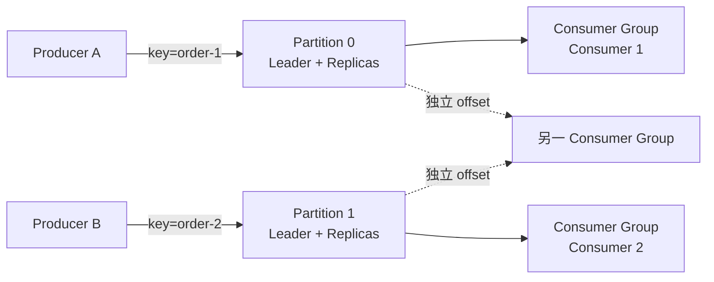
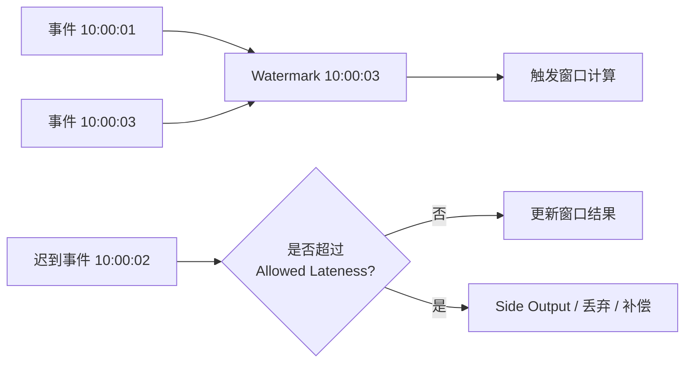
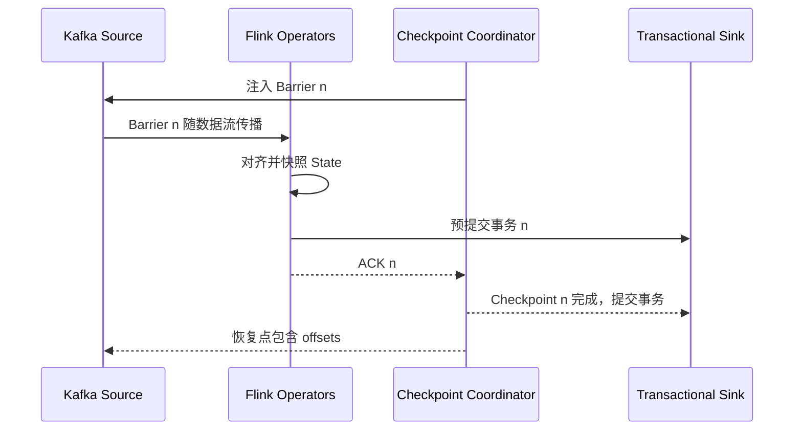
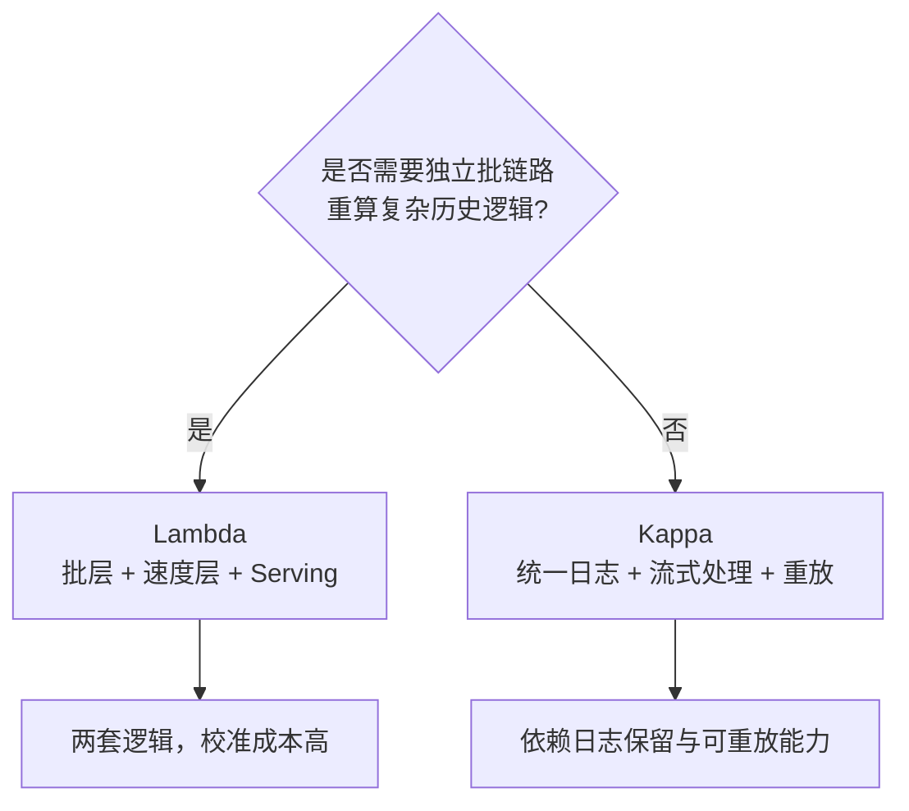

# 消息队列与流处理

> [!abstract] 主线
> Kafka 负责把持续事件变成可分区、可复制、可重放的日志；Flink 负责在事件时间上进行有状态计算，并通过 Checkpoint 恢复。所谓端到端 Exactly-once，必须同时审视 source、状态、offset、sink 和外部副作用。

## 从 ETL 到持续数据流

![[raw/Big-Data-Theory-and-Practice/courses/chapter11/etl-process-explained-diagram.png|760]]

批量 ETL 适合稳定的 T+1 加工，但难以支撑风控、监控、推荐和实时指标。流处理不是取消 ETL，而是把“周期性读一批”改为“事件持续到达、状态持续更新”，同时引入乱序、迟到、背压和恢复一致性问题。

## Kafka：可重放的分区日志

- **顺序边界是 Partition**：需要同一订单有序时，用稳定业务 key 路由到同一 Partition；跨 Partition 没有全局顺序。
- **并行度边界是 Partition 数**：同一 Consumer Group 内，一个 Partition 同时只由一个 Consumer 消费；Consumer 多于 Partition 不会增加有效并行度。
- **高吞吐是组合结果**：顺序追加、批处理、压缩、页缓存和减少拷贝共同降低开销。
- **可重放来自日志保留与 offset**：提交 offset 只是记录消费位置，不等于业务结果已经可靠落地。

| 语义 | 典型实现 | 业务影响 |
| --- | --- | --- |
| At-most-once | 先提交 offset，再处理 | 可能丢，不重复 |
| At-least-once | 先处理，再提交 offset | 不轻易丢，但可能重复 |
| Kafka 范围 EOS | 幂等 Producer + 事务 + offset 纳入事务 | Kafka 内 read-process-write 可原子化 |
| 端到端 Exactly-once | Source/State/Sink 协同提交或幂等 | 外部数据库、HTTP、邮件等副作用仍需单独设计 |

raw 中的事务 Producer 和故障恢复示例还提示一个重要边界：单 Broker 环境无法验证多副本 ISR、Leader 切换和完整事务容错，演示成功不能直接外推到生产高可用。

## Flink：事件时间、状态与恢复

- **Event Time** 以业务事件发生时间计算，避免机器处理速度改变业务窗口。
- **Watermark** 是对事件时间进度的估计，不是“所有更早事件都已经到达”的事实。
- **Window** 定义如何分组事件；Allowed Lateness 与 Side Output 决定迟到数据的修正和补偿策略。
- **State** 保存跨事件的业务上下文；状态 TTL 是业务语义与资源成本的共同决策。
- **Backpressure** 把下游处理不过来的信号传回上游；应同时查看吞吐、busy/backpressured time、buffer、sink 延迟和 Kafka lag。

## Checkpoint 与端到端提交链

Checkpoint 将算子状态与输入位置绑定；失败后从同一快照恢复，避免状态和 offset 各退各的。端到端语义还取决于 Sink：

- 事务型 Sink 可使用两阶段提交，将外部提交与 Checkpoint 完成对齐。
- 不支持事务的 Sink 需要幂等 key、去重表、Upsert 或业务补偿。
- 发送邮件、调用第三方 API 等不可逆副作用不能因为 Flink 开启 Checkpoint 就自动 Exactly-once。

## Lambda 与 Kappa

![[raw/Big-Data-Theory-and-Practice/courses/chapter11/辅助材料/lambda vs kappa.jpg|760]]

Lambda 以两条链路换取批量准确性和实时性，代价是代码与结果校准；Kappa 用同一流处理逻辑重放历史，简化架构，但要求日志保留、状态迁移和大规模重放能力可靠。

## 实践路线

raw 的 `hands-on-streaming` 包含实时词频、乱序用户行为、金融风控、IoT 监控和实时 ETL。学习顺序建议：

1. WordCount 验证 DataStream、窗口和状态。
2. 用户行为案例观察 Watermark、Allowed Lateness 与 Side Output。
3. Kafka 分区或 Consumer Group 示例观察 key、并行度与 Rebalance。
4. 事务和故障恢复案例验证重复、offset、幂等与多 Broker 限制。
5. 实时 ETL 补齐数据质量、多目标输出、监控和回放。

## 面试问题链

- Kafka 为什么吞吐高？不要只答“顺序写”，要覆盖批处理、压缩、页缓存和分区并行。
- Kafka 怎样保证同一订单有序？扩分区后 key 映射变化有什么影响？
- Consumer Rebalance 为什么可能引入停顿和重复？怎样降低影响？
- Watermark 为什么不是全局时钟？空闲分区会怎样阻塞事件时间进度？
- Flink Checkpoint 变慢怎样排查？先看 Barrier 对齐、背压、状态大小、存储延迟和并发。
- Exactly-once 的边界在哪里？必须画清输入位置、状态快照、Sink 提交和外部副作用。

返回 [[wiki/大数据/00-大数据|大数据总览]]，或进入 [[wiki/大数据/05-大数据面试与系统设计|大数据面试与系统设计]]。
