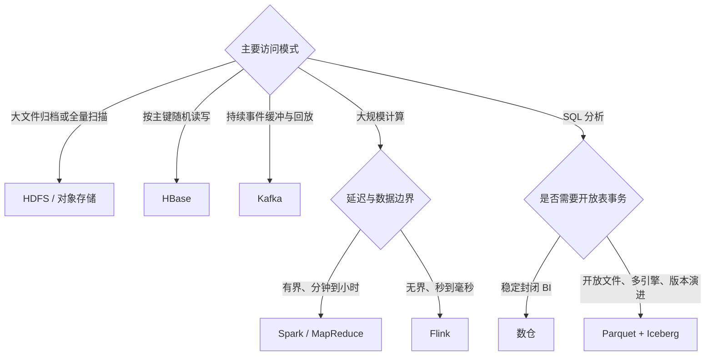
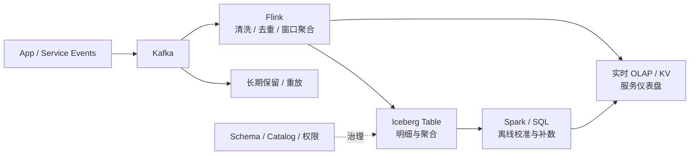
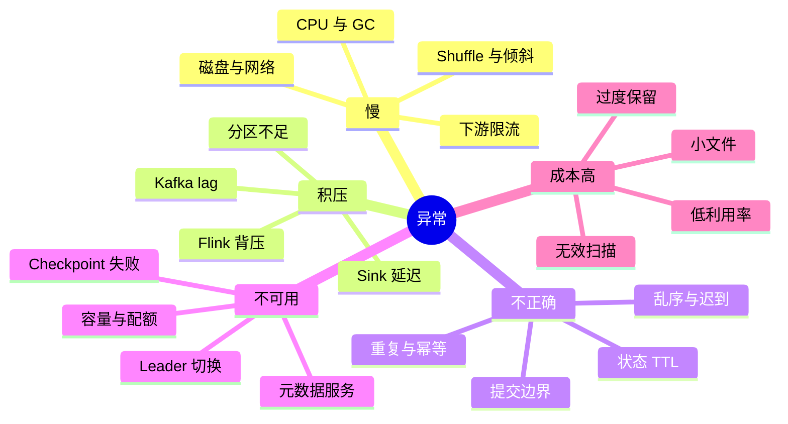

# 大数据面试与系统设计

> [!abstract] 目标
> 面试不是背组件定义，而是展示从业务约束推导数据流、状态边界、故障恢复和成本的能力。一个可靠答案要能说明为什么选、什么时候不选、失败时怎样恢复，以及用什么指标证明系统正常。

## 四步回答框架

回答定义题也按这四步展开。例如“HBase 为什么写得快”：

1. 场景：海量稀疏宽表、按 RowKey 随机写和读。
2. 机制：WAL + MemStore 把随机写转为顺序追加，后台刷成 HFile。
3. 取舍：写延迟低，但读放大、Compaction、热点和运维复杂度上升。
4. 故障或优化：监控 WAL、flush、Compaction、Region 分布，按访问模式设计 RowKey。

## 统一比较维度

| 组件 | 数据模型 | 典型延迟或访问 | 状态与容错 | 首要风险 |
| --- | --- | --- | --- | --- |
| HDFS | 文件 / Block | 大范围顺序吞吐 | 副本、重复制、NameNode HA | 小文件、元数据、磁盘或网络 |
| HBase | RowKey / 列族 | 随机读写、范围扫描 | WAL、Region、HDFS 副本 | 热点、Compaction、读放大 |
| MapReduce | Map/Reduce 批任务 | 高吞吐离线 | Task 重试、阶段落盘 | Shuffle 与多阶段 I/O |
| Spark | DAG / DataFrame | 批、交互、迭代 | lineage、Shuffle、Checkpoint | 倾斜、内存、GC、小文件 |
| Hive + Parquet | 表 + 列式文件 | SQL 扫描与聚合 | 底层引擎和文件系统负责 | 分区失控、统计过期、小文件 |
| Kafka | 分区追加日志 | 高吞吐事件缓冲 | 副本、ISR、offset、事务 | 分区 key、重复、Rebalance |
| Flink | 有状态事件流 | 低延迟持续计算 | State + Checkpoint | 乱序、背压、状态膨胀、Sink 语义 |
| Iceberg | 快照表 + 文件清单 | 多引擎分析与增量 | 快照、原子元数据提交 | 小文件、Catalog、清理与并发 |

## 选型决策树

任何分支都要再追问：数据规模、峰值吞吐、延迟目标、正确性、保留周期、查询模式、成本上限和团队运维能力。

## 高频问题链

| 问题 | 回答入口 | 追问方向 |
| --- | --- | --- |
| HDFS 为什么适合大文件？ | [[wiki/大数据/01-分布式协调与存储#HDFS：控制流与数据流分离|HDFS 数据路径]] | 小文件、HA/Federation、写管线失败 |
| HBase 为什么写入快？ | [[wiki/大数据/01-分布式协调与存储#HBase：在 HDFS 上补随机读写|HBase LSM 路径]] | RowKey 热点、读放大、Major Compaction |
| MapReduce 与 Spark 如何选？ | [[wiki/大数据/02-批处理与资源调度#框架选型|批处理框架选型]] | Shuffle、Stage、缓存、OOM、倾斜 |
| Parquet 为什么快？ | [[wiki/大数据/03-SQL 分析与湖仓#为什么分析场景偏好列式存储|列式存储]] | Row Group、编码、谓词下推、嵌套结构 |
| Kafka 如何保证顺序与可靠？ | [[wiki/大数据/04-消息队列与流处理#Kafka：可重放的分区日志|Kafka 分区日志]] | 扩分区、ISR、ACK、重复、Rebalance |
| Flink 如何处理乱序和恢复？ | [[wiki/大数据/04-消息队列与流处理#Flink：事件时间、状态与恢复|Flink 事件时间]] | Watermark、迟到、背压、Checkpoint |
| 湖仓一体是什么？ | [[wiki/大数据/03-SQL 分析与湖仓#Iceberg：用元数据树管理不可变文件|Iceberg 元数据]] | Catalog、快照、并发提交、小文件与 GC |

## 实时指标平台

### 1. 澄清约束

- 峰值事件数每秒、平均或峰值事件大小、日增长量。
- 端到端 P95/P99 延迟、数据新鲜度和可接受误差。
- 查询维度、保留周期、回放窗口、租户与权限。
- 重复、乱序、迟到和源端补发的业务语义。

### 2. 定义分区与状态

- Kafka key 与 Partition 数决定顺序和并行度；预留增长但避免过多小 Partition。
- Flink 的 keyBy、窗口、Watermark、Allowed Lateness 和状态 TTL 必须与业务口径一致。
- 热 key 需要预聚合、拆 key 或两阶段聚合；不能只增加并行度。

### 3. 定义正确性边界

- 明确 At-most-once、At-least-once 或 Exactly-once。
- 把 Kafka offset、Flink State、Checkpoint、Sink 提交和外部副作用画在同一条链上。
- 设计实时结果与离线明细的对账、补数和回放路径。

### 4. 粗略容量估算

设峰值事件率为 $q$，平均事件大小为 $s$，副本因子为 $r$，保留秒数为 $t$：

$$
\text{ingress bandwidth} \approx q \times s
$$

$$
\text{raw storage} \approx q_{avg} \times s \times t \times r
$$

再乘压缩、索引、临时文件、快照和安全余量。估算的价值是暴露数量级与瓶颈，不是给出虚假精度。

## 故障定位思维导图

## 可观测性

| 层次 | 关键指标 |
| --- | --- |
| Kafka | produce/fetch latency、under-replicated partitions、ISR 变化、consumer lag、Rebalance |
| Flink | records in/out、busy/backpressured、checkpoint duration/failure/alignment、state size、watermark |
| Spark | Stage/Task 时长分布、Shuffle read/write、spill、GC、skew、executor lost |
| HDFS/HBase | NameNode heap、缺失块、磁盘、Region 热点、flush、Compaction、BlockCache |
| 湖仓/SQL | 扫描字节、分区裁剪、文件数或大小、Catalog 延迟、commit 冲突、快照与孤儿文件 |
| 业务 | 数据新鲜度、对账差异、重复率、迟到率、空值或异常值、SLA 达成率 |

## 四阶段学习路线

1. **分布式基础**：学习 [[wiki/foundations/计算机网络|计算机网络]]、磁盘 I/O、复制、选主、超时、重试和幂等。
2. **批处理闭环**：画出 HDFS → MapReduce/YARN → Spark 的数据流，能解释一个慢 Stage。
3. **流处理闭环**：运行 raw 中的 Kafka/Flink 实践，构造乱序、重复、积压和恢复场景。
4. **湖仓与系统设计**：为实时指标平台补 Parquet/Iceberg、权限、对账、回放、容量与成本。

返回 [[wiki/大数据/00-大数据|大数据总览]]。
